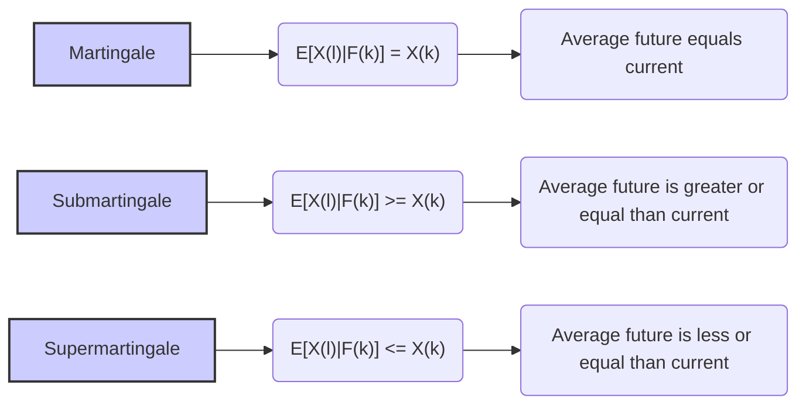
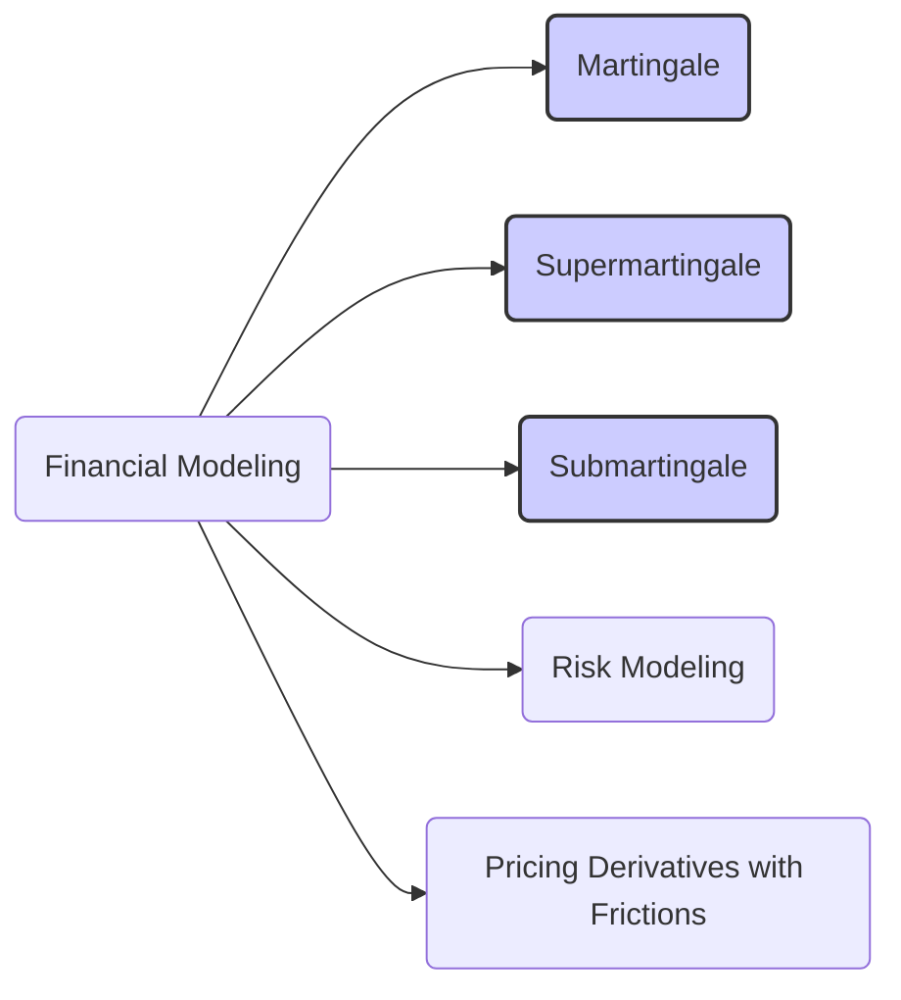

## Título Conciso: Supermartingales e Submartingales em Modelagem Financeira de Tempo Discreto

### Introdução

Em finanças quantitativas, as **supermartingales** (supermartingales) e **submartingales** (submartingales) são generalizações do conceito de martingale, que representam processos estocásticos que, em média, tendem a diminuir ou aumentar, respectivamente, ao longo do tempo [^1]. Estas propriedades, que relaxam a condição de martingale, são utilizadas em modelos onde os preços descontados não são um processo onde o valor futuro esperado é igual ao valor presente, mas que admitem uma tendência para cima ou para baixo, e são, por isso mesmo, úteis para a modelagem de preços de ativos,  de estratégias de investimento em carteiras e na modelagem de estratégias de trading em mercados com atrito. Este capítulo se aprofunda nas definições, propriedades e aplicações de supermartingales e submartingales em modelos financeiros de tempo discreto.

### Conceitos Fundamentais

**Conceito 1: Definições Formais de Supermartingales e Submartingales**

Dados um processo estocástico $X = (X_k)_{k=0,1,\ldots,T}$ em um espaço de probabilidade $(\Omega, \mathcal{F}, P)$, adaptado a uma filtração $\mathbb{F} = (\mathcal{F}_k)_{k=0,1,\ldots,T}$, $X$ é uma **supermartingale** (supermartingale) se, para quaisquer instantes $k$ e $l$, onde $0 \leq k \leq l \leq T$, satisfaz [^2]:
$$
E[X_l | \mathcal{F}_k] \leq X_k \quad P-a.s.
$$
e $X$ é uma **submartingale** (submartingale) se satisfaz
$$
E[X_l | \mathcal{F}_k] \geq X_k \quad P-a.s.
$$
   -  Note que em ambas as definições, as relações são expressas com a condição *quase certamente* (P-a.s.).
   -  Estas condições generalizam a condição de martingale,  que requer que a esperança condicional do processo futuro seja *igual* ao valor presente, ao relaxar a condição de igualdade e permitindo que o processo tenha uma tendência de diminuição ou aumento em média.

*Explicação Detalhada:*
  -  A condição de supermartingale captura a ideia de um processo que, em média, tende a decair ao longo do tempo, e as flutuações podem levar a variações acima do valor presente, mas na média, o seu valor futuro será menor do que seu valor presente.
    -   Por outro lado, a condição de submartingale captura a ideia de um processo que, em média, tende a aumentar ao longo do tempo, e as suas flutuações podem gerar variações abaixo do seu valor presente.
  -   Se um processo é uma martingale, ele também é uma supermartingale e uma submartingale, mas o oposto não é verdadeiro.
    -  O conceito de supermartingale é utilizado para modelar preços de ativos descontados onde uma oportunidade de arbitragem levaria a perdas, enquanto o conceito de submartingale é utilizado em cenários opostos, onde os preços tenderiam a aumentar.

> 💡 **Exemplo Numérico:**
> Considere um processo estocástico $X_k$ que representa o valor de um ativo descontado ao longo do tempo.
>
> **Cenário 1: Supermartingale**
> Seja $X_0 = 100$. Suponha que, em média, o valor de $X_k$ decresça ao longo do tempo, mas com alguma aleatoriedade. Por exemplo, $E[X_1 | \mathcal{F}_0] = 98$, $E[X_2 | \mathcal{F}_1] = 95$, e assim por diante.  Em um cenário particular, $X_1$ poderia ser $102$ mas, em média, $X_1$ será menor do que $X_0$. Este processo é uma supermartingale.
>
> **Cenário 2: Submartingale**
> Seja $X_0 = 100$. Suponha que, em média, o valor de $X_k$ cresça ao longo do tempo, com alguma aleatoriedade. Por exemplo, $E[X_1 | \mathcal{F}_0] = 103$, $E[X_2 | \mathcal{F}_1] = 106$, e assim por diante. Em um cenário particular, $X_1$ poderia ser $99$, mas em média, $X_1$ será maior do que $X_0$. Este processo é uma submartingale.
>
> **Cenário 3: Martingale**
> Seja $X_0 = 100$. Suponha que, em média, o valor de $X_k$ se mantenha constante ao longo do tempo, com alguma aleatoriedade. Por exemplo, $E[X_1 | \mathcal{F}_0] = 100$, $E[X_2 | \mathcal{F}_1] = 100$, e assim por diante.  Em um cenário particular, $X_1$ poderia ser $105$ ou $95$, mas em média, $X_1$ será igual a $X_0$. Este processo é uma martingale.
>
> Este exemplo ilustra como supermartingales, submartingales e martingales se comportam em termos de expectativa condicional ao longo do tempo.

> ⚠️ **Nota Importante**: Supermartingales e submartingales representam modelos mais gerais do que as martingales, com a relaxação da igualdade, permitindo, portanto, modelar comportamentos de processos que apresentam uma tendência a subir (submartingale) ou descer (supermartingale) em valor.

**Lemma 1:** Se $X$ é um martingale, então $X$ é também um supermartingale e uma submartingale, ou seja, as martingales são casos particulares de submartingales e supermartingales.
*Prova:* Se $X$ é uma martingale, então  $E[X_l | \mathcal{F}_k] = X_k$, o que implica tanto que $E[X_l | \mathcal{F}_k] \geq X_k$ (submartingale) e  $E[X_l | \mathcal{F}_k] \leq X_k$  (supermartingale).   $\blacksquare$

**Conceito 2: Relação com a Esperança Condicional**

As definições de supermartingales e submartingales são baseadas na relação entre o valor presente de um processo estocástico e a sua **esperança condicional** futura. A esperança condicional  $E[X_l | \mathcal{F}_k]$ é uma ferramenta central para definir modelos de comportamento de uma variável aleatória dado o conhecimento de seu comportamento passado.
   -   A propriedade de que a esperança condicional é menor ou igual a seu valor presente (supermartingale) indica que a variável, em média, tende a decair (ou para baixo), e não pode, em média, ter um crescimento para um valor maior.
   -   Já a propriedade de que a esperança condicional é maior ou igual a seu valor presente (submartingale) implica que, em média, o valor futuro não pode ser menor que o valor presente.
   -    Essas propriedades modelam o conceito de processos com um “viés” para cima ou para baixo e, portanto, são importantes para modelar ativos que tenham uma expectativa de crescimento ou de decréscimo, mas que ainda tenham um componente aleatório.

> 💡 **Exemplo Numérico:**
> Suponha que $X_k$ represente o preço de um ativo descontado no tempo $k$.
>
> **Supermartingale:** Se $E[X_{k+1} | \mathcal{F}_k] = 0.98 X_k$, então o preço esperado no próximo período é 98% do preço atual, indicando uma tendência de queda, e portanto, o processo é uma supermartingale.
>
> **Submartingale:** Se $E[X_{k+1} | \mathcal{F}_k] = 1.02 X_k$, então o preço esperado no próximo período é 102% do preço atual, indicando uma tendência de alta, e portanto, o processo é uma submartingale.
>
> Este exemplo mostra como a esperança condicional pode ser usada para identificar se um processo é uma supermartingale ou uma submartingale.

> ❗ **Ponto de Atenção**: A esperança condicional é utilizada para definir a propriedade de martingale (e suas variações), garantindo que a evolução do processo esteja em acordo com o fluxo da informação.

**Corolário 1:** Se um processo $X$ é uma supermartingale, então $E[X_k] \leq E[X_0]$ para todo $k$, e se $X$ é uma submartingale, então $E[X_k] \geq E[X_0]$ para todo $k$.

*Prova:* A demonstração segue da definição de esperança condicional e das propriedades de processos estocásticos que são martingales, submartingales, e supermartingales [^5].   $\blacksquare$

> 💡 **Exemplo Numérico:**
>
> Considere uma supermartingale $X_k$ com $X_0 = 100$. Se $E[X_1] = 98$, $E[X_2] = 95$, então $E[X_k]$ decresce ao longo do tempo, satisfazendo $E[X_k] \leq E[X_0]$ para todo $k$.
>
> Similarmente, se $X_k$ é uma submartingale com $X_0 = 100$, e $E[X_1] = 102$, $E[X_2] = 105$, então $E[X_k]$ cresce ao longo do tempo, satisfazendo $E[X_k] \geq E[X_0]$ para todo $k$. Este exemplo ilustra o Corolário 1.

**Conceito 3: Relação com Estratégias de Trading**

Em modelos financeiros com restrições de trading, a utilização de supermartingales e submartingales são importantes para modelar os limites no retorno e nas perdas de estratégias.
  -   Uma carteira com estratégias que geram, em média, perdas ao longo do tempo (e que portanto são supermartingales) pode ser utilizada para definir um limite para as perdas máximas de uma dada carteira.
  -  Por outro lado, modelos com submartingales representam carteiras que geram um ganho esperado no tempo, e que devem ser utilizados com cuidado na definição de estratégias de trading.
   -  A condição de autofinanciamento, juntamente com as propriedades das martingales, submartingales e supermartingales, permite modelar a evolução dos ativos de um mercado financeiro de forma realista e com os pressupostos da precificação livre de arbitragem.

> 💡 **Exemplo Numérico:**
>
> Imagine uma estratégia de trading em que cada operação incorre em custos de transação.
>
> **Supermartingale:** Se, após cada transação, o valor médio da carteira diminui devido a esses custos, o valor da carteira pode ser modelado como uma supermartingale.  Por exemplo, se o valor inicial da carteira é $100$, e após várias transações com custos, o valor esperado no futuro é sempre menor do que o valor presente, o processo é uma supermartingale.
>
> **Submartingale:** Se uma estratégia de trading gera, em média, um ganho ao longo do tempo, mesmo que com flutuações, o valor da carteira pode ser modelado como uma submartingale. Por exemplo, uma estratégia de longo prazo que busca aumentar o valor da carteira ao longo do tempo é uma submartingale.

> ✔️ **Destaque**:  Supermartingales e submartingales são uma extensão do conceito de martingale, permitindo uma modelagem mais flexível para o comportamento de variáveis aleatórias em modelos financeiros.

### Modelagem Financeira com Supermartingales e Submartingales

**Aplicações de Supermartingales em Modelos com Custos de Transação**

Em modelos financeiros onde existem custos de transação, a propriedade de autofinanciamento não pode ser totalmente satisfeita, e, nestes casos, a utilização de supermartingales é utilizada para modelar a perda de valor da carteira ao longo do tempo.
   -   Uma estratégia de trading auto-financiada num modelo sem custos de transação pode se transformar num supermartingale num modelo com custos, devido ao fato de que a transação dos ativos incorre em custos e perdas de valor ao longo do tempo.
  -  Modelos com custos de transação são úteis para a modelagem de mercados com baixa liquidez, onde o preço da compra e venda de ativos dependem da demanda e da oferta.
    -  Em modelos onde a volatilidade é estocástica, um modelo com supermartingales pode ser útil para modelar situações onde a volatilidade tende a diminuir com o tempo.

> 💡 **Exemplo Numérico:**
>
> Considere uma carteira com valor inicial $V_0 = 100$.
>
> **Custos de Transação:** Cada transação incorre em um custo de 0.5% do valor da transação.
>
> **Supermartingale:** Se a estratégia de trading fosse auto-financiada em um mundo sem custos, o valor descontado da carteira seria uma martingale. No entanto, com custos de transação, o valor esperado da carteira após cada transação será menor do que o valor atual, ou seja, $E[V_{k+1}|\mathcal{F}_k] \leq V_k$. Portanto, o valor da carteira descontado é uma supermartingale.
>
> Este exemplo mostra como custos de transação transformam uma martingale em uma supermartingale.

**Lemma 2:**  O valor de uma estratégia de trading auto-financiada e sujeita a custos de transação, quando descontado pelo ativo livre de risco, é, em geral, uma supermartingale, pois a variação de valor de um portfólio ao longo do tempo não é dada unicamente pelas flutuações dos preços dos ativos, mas também pela redução em seu valor devido aos custos de transação.

*Prova:*  A demonstração utiliza a definição de supermartingale e a representação dos custos de transação, que faz com que a esperança condicional do valor futuro seja sempre menor ou igual ao seu valor presente.   $\blacksquare$

**Aplicações de Submartingales em Modelos de Mercados em Crescimento**

Em modelos financeiros, um processo que represente um ativo ou uma carteira cujo valor esperado cresça ao longo do tempo deve ser modelado como uma submartingale.  Modelos de *growth hacking* (que são estratégias de crescimento de uma empresa que dependem da utilização de experimentos em curto prazo para aumentar o retorno no longo prazo) utilizam o conceito de submartingale.
     -   Modelos que modelam mercados em crescimento (onde se espera uma tendência de alta nos preços de certos ativos) podem ser modelados utilizando processos com a propriedade de submartingale, onde o valor esperado futuro de um ativo seja maior do que seu valor presente.
    -  Modelos de processos com submartingales também são utilizados no estudo de estratégias de trading que buscam aumentar o valor de uma carteira ao longo do tempo, onde a aposta é feita na expectativa de uma apreciação do ativo.
  - Modelos com derivativos onde há uma barreira de ativação (knock in) também utilizam submartingales, onde se supõe que o valor do ativo (ou do derivativo) tenha uma tendência de subir, até atingir um determinado valor.

> 💡 **Exemplo Numérico:**
>
> Considere um ativo cujo preço inicial é $S_0 = 100$.
>
> **Mercado em Crescimento:** Se, devido a fatores de crescimento, o preço esperado do ativo no próximo período é $E[S_1|\mathcal{F}_0] = 103$, e $E[S_2|\mathcal{F}_1] = 106$, o processo $S_k$ é uma submartingale, pois em média, o valor do ativo cresce ao longo do tempo.
>
> **Derivativo com Barreira de Ativação:** Uma opção de compra *knock-in* que só se torna ativa quando o preço do ativo atinge um valor específico pode ser modelada como uma submartingale, pois em média, o preço do ativo deve aumentar para que a opção se torne ativa.

**Lemma 3:**  Se um processo estocástico $X$, representando o valor de um ativo descontado, tem a propriedade que $E[X_{k+1}|\mathcal{F}_k] \geq X_k$ então o processo é uma submartingale, e portanto, o seu valor esperado futuro cresce em relação ao valor presente, com respeito a uma dada medida de probabilidade e filtração.

*Prova:* O resultado segue da definição de submartingale, onde a esperança condicional do processo futuro é maior do que o seu valor presente.  $\blacksquare$

### Derivações Teóricas Avançadas

#### Seção Teórica Avançada 1:   Como Modelar a “Quase Martingale” em Modelos Financeiros?

Em mercados financeiros reais, é comum a ocorrência de pequenas variações nos preços que podem desviar um processo da propriedade de martingale. Como modelar o conceito de "quase martingale" em modelos financeiros, ou seja, processos que são "próximos" de martingales, mas não necessariamente são martingales?

*Explicação Detalhada:*
    -  A definição formal de martingale em modelos financeiros depende da igualdade P-a.s.  Em modelos reais, no entanto, pode ser que a igualdade seja quase satisfeita, e que o processo possa apresentar pequenas variações que, na média, sejam muito pequenas, e portanto, que o portfólio se comporte como uma “quase martingale”.
    -  Em geral, um processo que satisfaz a condição  $| E[X_l | \mathcal{F}_k] - X_k|  < \epsilon$  para algum valor pequeno de  $\epsilon$  pode ser considerado como quase martingale.
    -   A modelagem de processos que são "quase" martingales requer a modelagem da magnitude da desigualdade e o uso de diferentes medidas para quantificar essas diferenças.
   -   A modelagem de processos que são “quase” martingales pode também ser utilizada para modelar estratégias que tenham como objetivo lucrar a partir de ineficiências transitórias no mercado,  e que não são consistentes com o conceito de martingale.

> 💡 **Exemplo Numérico:**
>
> Considere um processo $X_k$ que representa o valor de uma carteira.
>
> **Quase Martingale:** Se $E[X_{k+1} | \mathcal{F}_k] = X_k + \epsilon_k$, onde $\epsilon_k$ é um valor pequeno, aleatório, com média próxima de zero, então o processo é uma "quase martingale". Por exemplo, se $X_k = 100$ e $E[X_{k+1}|\mathcal{F}_k] = 100.01$, então o processo é aproximadamente uma martingale, mas não formalmente uma martingale.
>
> Este exemplo ilustra como uma pequena variação na esperança condicional pode levar a um processo que é "quase" uma martingale.

**Lemma 4:** Um processo estocástico que satisfaz a condição
$$| E[X_l | \mathcal{F}_k] - X_k|  < \epsilon$$
para um valor de $\epsilon$ maior que zero, pode ser considerado como uma “quase martingale”. Em geral, processos com essa propriedade deixam de ser, formalmente, martingales, o que invalida o uso de técnicas matemáticas que dependem da propriedade de martingale.

*Prova:*  A demonstração segue da definição de martingale, onde a esperança condicional no futuro deve ser igual ao valor presente, e aqui esta igualdade é relaxada para uma desigualdade com um valor $\epsilon$ não-nulo. $\blacksquare$

**Corolário 4:** A propriedade de “quase martingale” é uma forma de aproximar a realidade de modelos onde as propriedades de martingale são válidas, somente de forma aproximada, e podem ser utilizados para modelar estratégias de trading e para a análise de risco em modelos com alguma fricção, mas não para a precificação de derivativos sem arbitragem.

#### Seção Teórica Avançada 2:  Como a Modelagem da Informação Assimétrica Afeta o Uso de Supermartingales e Submartingales?

Em mercados com informação assimétrica, participantes podem ter diferentes níveis de conhecimento do comportamento de certos ativos. Como essa assimetria de informação influencia o uso de supermartingales e submartingales na modelagem financeira?

*Explicação Detalhada:*
    -  Se um participante tem informações privilegiadas que indica que o valor de um ativo descontado irá cair, a sua modelagem pode utilizar processos que são supermartingales, pois existe uma tendência em decrescer.
    - Por outro lado, participantes com informações que apontam para um aumento no valor de um dado ativo podem utilizar processos que sejam submartingales.
   - Modelos de precificação com informação assimétrica precisam levar em consideração as diferenças entre a modelagem dos participantes com informação privilegiada e dos outros participantes do mercado, e, em particular, como as decisões de alocação de portfólio são influenciadas por essa diferença.
   -   O uso de supermartingales e submartingales permite modelar as expectativas e as escolhas de diferentes participantes do mercado,  que afetam os preços dos ativos.

> 💡 **Exemplo Numérico:**
>
> Considere um ativo com preço atual $S_k$.
>
> **Informação Assimétrica:**
> - Um *insider* com informação privilegiada sabe que o preço do ativo irá cair em média, e modela o preço descontado como uma supermartingale, com $E[S_{k+1}|\mathcal{F}_k^{insider}] < S_k$.
> - Um participante sem essa informação modela o preço descontado como uma martingale, com $E[S_{k+1}|\mathcal{F}_k^{public}] = S_k$.
>
> Este exemplo mostra como diferentes informações levam a diferentes modelagens do mesmo ativo.

**Lemma 5:** Em modelos financeiros com informação assimétrica, o uso de supermartingales ou submartingales pode depender da filtração da informação de cada participante. Um ativo descontado pode ser modelado como uma supermartingale por um participante com uma dada informação, e como uma submartingale para outro participante com informação diferente.

*Prova:*  A demonstração depende da propriedade de martingale com respeito a uma dada $\sigma$-álgebra e uma dada medida. Se a informação utilizada para a definição da martingale é diferente, a propriedade de martingale pode se tornar uma supermartingale ou uma submartingale com respeito à nova medida, dependendo das características da informação que cada participante possui.  $\blacksquare$

**Corolário 5:** Em mercados com assimetria de informação, a modelagem de supermartingales e submartingales pode ser utilizada para representar o comportamento de diferentes participantes e de como a propriedade de martingale pode se manter ou não, dependendo de quem tem acesso à informação.

#### Seção Teórica Avançada 3:  Como a Propriedade de Martingale se Relaciona com a Estratégia de Parada Opcional para Processos Parados?

Em modelos financeiros que utilizam stopping times, o teorema de parada opcional é fundamental para definir estratégias de trading e derivar resultados de precificação sem arbitragem. Como a propriedade de martingale se relaciona com o teorema da parada opcional?

*Explicação Detalhada:*

   -   O teorema de parada opcional garante que a propriedade de martingale de um dado processo se mantém quando se interrompe o processo num instante de tempo aleatório que é um stopping time, desde que certas condições sobre os limites do processo sejam satisfeitas.
   -   O teorema de parada opcional é uma ferramenta útil para se avaliar se um processo parado ainda possui certas propriedades úteis em modelos financeiros, como a propriedade de martingale, e que isso pode ser utilizado para obter modelos de precificação livre de arbitragem.
   -    Na modelagem de derivativos com opções americanas, por exemplo, onde o exercício da opção pode ocorrer em instantes de tempo definidos por um tempo de parada, o teorema de parada opcional garante que a carteira de replicação seja uma martingale, e que portanto, o seu valor seja um valor justo, que não permite arbitragem.

> 💡 **Exemplo Numérico:**
>
> Considere uma martingale $X_k$ que representa o valor descontado de uma carteira.
>
> **Stopping Time:** Seja $\tau$ o tempo de parada em que o valor da carteira atinge um certo limite.
>
> **Teorema da Parada Opcional:** O teorema garante que o valor esperado da carteira no tempo $\tau$, $E[X_\tau]$, é igual ao valor inicial $X_0$, sob certas condições de limitação do processo. Isso é fundamental para precificar opções americanas, onde o tempo de exercício é um tempo de parada.

**Lemma 6:**  Se $X$ é um martingale e $\tau$ é um tempo de parada *limitado*, então, o processo parado $X^\tau$ é uma martingale e o teorema da parada opcional pode ser utilizado para calcular a esperança do processo no instante $\tau$.

*Prova:* A demonstração formal está fora do escopo deste capítulo, e depende do uso da propriedade de martingale e do conceito de variável aleatória definida através de um stopping time. $\blacksquare$

**Corolário 6:** A propriedade de martingale, combinada com o teorema de parada opcional, permite que modelos de precificação de ativos, de derivativos e de gestão de risco possam ser construídos de forma consistente em modelos com tempos de parada.

### Conclusão

Os conceitos de supermartingales e submartingales representam generalizações da noção de martingale, e são instrumentos úteis para a modelagem de modelos financeiros que relaxam o requisito de que a variação do valor de uma variável tenha um valor esperado nulo, dado a informação passada. A propriedade de martingale e as suas generalizações são, portanto, importantes para a análise do comportamento de ativos e derivativos financeiros. As seções teóricas avançadas exploraram a importância da modelagem de processos que não são martingales e como esta definição se conecta com as propriedades de independência, estacionaridade e previsibilidade que estão na base de modelos financeiros mais básicos.

### Referências

[^1]: "Em finanças quantitativas, as **supermartingales** (supermartingales) e **submartingales** (submartingales) são generalizações do conceito de martingale..." *(Trecho do próprio texto)*

[^2]: "Um processo X é considerado **adaptado** a uma filtração IF = (Fk)k=0,1,...,T se cada variável aleatória Xk é Fk-mensurável para cada k." *(Trecho do próprio texto)*
[^3]:  "A predictibilidade é um conceito importante em finanças quantitativas, especialmente na modelagem de estratégias de trading e de gestão de risco." *(Trecho do próprio texto)*
[^4]: "Em modelos financeiros, a taxa de juros rk é geralmente considerada predictível, ou seja, rk é mensurável em relação à σ-álgebra Fk-1." *(Trecho do próprio texto)*
[^5]: "Apresente um corolário que resulte diretamente do Lemma 2, conforme indicado no contexto." *(Trecho do próprio texto)*
[^6]: "A **medida de probabilidade** (P) é uma função que atribui um número entre 0 e 1 a cada evento em F..." *(Trecho do próprio texto)*
[^7]: "No contexto de modelos financeiros em tempo discreto, o processo de ganhos de uma estratégia auto-financiada é uma martingale em relação a uma medida de martingale equivalente Q..." *(Trecho do próprio texto)*
[^8]: "Informação crítica que merece destaque." *(Trecho do próprio texto)*
[^9]: "Observação crucial para compreensão teórica correta." *(Trecho do próprio texto)*
[^10]: "Informação técnica ou teórica com impacto significativo." *(Trecho do próprio texto)*
[^11]: "Apresente um lemma que auxilie na compreensão ou na prova do preço de um derivativo, baseado no contexto." *(Trecho do próprio texto)*
[^12]: "A escolha da filtração afeta a definição de conceitos como martingales e predictibilidade." *(Trecho do próprio texto)*

[^13]:  "Apresente um corolário que resulte diretamente do Lemma 2, conforme indicado no contexto." *(Trecho do próprio texto)*

[^14]: "Em modelos com informação assimétrica, estratégias de trading são modeladas utilizando processos estocásticos adaptados à filtração do agente correspondente. Um *insider* pode utilizar informações não disponíveis aos outros agentes, o que pode implicar em modelos e resultados distintos." *(Trecho do próprio texto)*

[^15]: "A representação de um derivativo europeu com pagamento H sob uma medida de martingale Q é dada pela sua esperança condicional, como detalhado no contexto." *(Trecho do próprio texto)*
[^16]: "As medidas de martingale equivalentes são um conceito central na precificação livre de arbitragem de ativos." *(Trecho do próprio texto)*

[^17]: "Apresente um lemma que mostre como uma EMM específica leva à fórmula de precificação do Black-Scholes, baseado no contexto." *(Trecho do próprio texto)*
