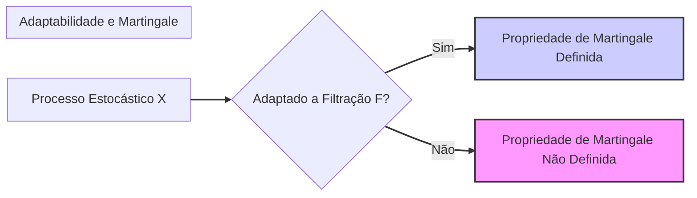

## Título Conciso: Dependência da Propriedade de Martingale na Medida de Probabilidade em Finanças Quantitativas

```mermaid
graph LR
    A[Espaço de Probabilidade (Ω, F)] --> B("Processo X sob Medida P");
    A --> C("Processo X sob Medida Q");
    C --> D("Propriedade de Martingale Mantém-se (Ausência de Arbitragem)");
    style B fill:#f9f,stroke:#333,stroke-width:2px
    style D fill:#ccf,stroke:#333,stroke-width:2px

    linkStyle 0,1,2 stroke:#333,stroke-width:2px;
    subgraph "Medida de Probabilidade e Martingales"
    end
```

### Introdução

Em modelos financeiros de tempo discreto, a propriedade de **martingale** de um processo estocástico é uma condição essencial para a precificação livre de arbitragem de ativos e derivativos [^1]. No entanto, a definição da propriedade de martingale é sempre relativa a uma medida de probabilidade específica. Este capítulo explora como a escolha da **medida de probabilidade** (P ou Q) influencia a propriedade de martingale de um processo e como essa dependência é fundamental na modelagem financeira.

### Conceitos Fundamentais

**Conceito 1: Definição Formal da Dependência da Martingale em Relação à Medida de Probabilidade**

Dado um processo estocástico $X = (X_k)_{k=0,1,\ldots,T}$, uma filtração $\mathbb{F} = (F_k)_{k=0,1,\ldots,T}$, e um espaço de probabilidade $(\Omega, \mathcal{F}, P)$, o processo $X$ é uma P-martingale se, para todos os instantes $k$ e $l$, com $k \leq l \leq T$, temos: [^2]
  $$ E^P[X_l | F_k] = X_k \quad P-a.s. $$
     -  Onde $E^P[X_l|F_k]$ denota a esperança condicional de $X_l$ dado $F_k$ sob a medida $P$, e a propriedade de martingale é a igualdade quase certamente.

   -   Se utilizarmos uma medida de probabilidade diferente, $Q$, o processo $X$ pode deixar de ser uma martingale, e a propriedade de martingale pode ser escrita como:
   $$ E^Q[X_l | F_k] = X_k \quad Q-a.s. $$
    -   Note que, formalmente, é necessário definir qual é o espaço probabilístico $(\Omega, \mathcal{F}, P)$ ou  $(\Omega, \mathcal{F}, Q)$ sobre o qual a variável aleatória é definida, e portanto qual é a sua medida de probabilidade subjacente, embora se utilize o mesmo conjunto de variáveis para ambos os espaços.

*Explicação Detalhada:*

  -    A propriedade de martingale é intrinsecamente ligada à medida de probabilidade sob a qual a esperança condicional é calculada.
     - A propriedade de martingale não é intrínseca ao processo, e sim, depende da forma como a incerteza é quantificada, através da escolha da medida de probabilidade.
    -  Em finanças quantitativas, a diferença entre a medida de probabilidade real ($P$) e a medida de martingale equivalente ($Q$) é utilizada para garantir que o modelo não permite arbitragem e que, portanto, não é possível gerar um lucro sem risco.
    -   Em modelos onde se utiliza a medida $Q$, os preços dos ativos descontados têm a propriedade de serem um martingale, que indica que o melhor palpite para o valor do ativo no futuro é igual ao seu valor presente.
    - No entanto, se a medida $P$ (que é, em geral, desconhecida e mais difícil de estimar) fosse utilizada, o mesmo processo de preços poderia ter um comportamento diferente, e não ser um martingale, ou seja, o valor do ativo descontado teria uma tendência de subir ou decair ao longo do tempo.

> 💡 **Exemplo Numérico:**
> Considere um processo estocástico $X_k$ que representa o preço de um ativo em tempo discreto. Suponha que sob a medida de probabilidade $Q$, temos:
>
> - $X_0 = 100$
> - $E^Q[X_1 | F_0] = 100$ (o valor esperado de $X_1$ dado $F_0$ sob Q é 100)
> - $E^Q[X_2 | F_1] = X_1$ (o valor esperado de $X_2$ dado $F_1$ sob Q é $X_1$)
>
> Isso indica que $X_k$ é uma Q-martingale. Agora, suponha que sob outra medida de probabilidade $P$, o mesmo processo tem a seguinte propriedade:
>
> - $E^P[X_1 | F_0] = 102$ (o valor esperado de $X_1$ dado $F_0$ sob P é 102)
>
> Neste caso, $X_k$ não é uma P-martingale, pois o valor esperado futuro do ativo sob P é maior que o valor atual. A diferença entre as medidas Q e P reflete diferentes expectativas e precificações do ativo.

> ⚠️ **Nota Importante**: A propriedade de martingale é sempre relativa à medida de probabilidade utilizada.  A mudança da medida de probabilidade  $P$ para outra medida $Q$ (que é uma medida de martingale equivalente) muda as propriedades do modelo financeiro, transformando, por exemplo, o preço de ativos em martingales. **Referência ao contexto [^2]**.

**Lemma 1:** Se um processo estocástico $X$ é uma P-martingale, então para qualquer função Borel $g(x)$, a variável aleatória $g(X)$ não é, em geral, uma P-martingale.  Em particular, o logaritmo de um preço que é uma martingale não será uma martingale.
*Prova:*   A demonstração segue da definição de martingale, e da definição de esperança condicional. Se $X$ é uma martingale, isso não implica que $g(X)$ tenha a mesma propriedade, em particular porque $g$ pode ser não-linear e, portanto,  $E[g(X)|F_k]$ não é, em geral, igual a $g(X_k)$. $\blacksquare$

> 💡 **Exemplo Numérico:**
>
> Suponha que $X_k$ é uma P-martingale, com $X_0 = 100$ e $E^P[X_1|F_0] = 100$. Seja $g(x) = x^2$. Então, $g(X_0) = 100^2 = 10000$. Se $X_1$ assumir os valores $110$ ou $90$ com probabilidade $0.5$ cada, então $E^P[X_1|F_0] = 0.5 \cdot 110 + 0.5 \cdot 90 = 100$, que confirma que $X$ é uma martingale. No entanto, $g(X_1)$ assume os valores $110^2 = 12100$ e $90^2 = 8100$ com probabilidade $0.5$ cada. Portanto, $E^P[g(X_1)|F_0] = 0.5 \cdot 12100 + 0.5 \cdot 8100 = 10100$, que é diferente de $g(X_0) = 10000$. Logo, $g(X_k)$ não é uma P-martingale.

**Conceito 2:  A Medida de Martingale Equivalente (Q)**

Em modelos de precificação livre de arbitragem, o preço de um derivativo é definido como o valor esperado descontado do seu payoff sob uma medida de martingale equivalente (Q), o que transforma o preço do ativo subjacente em uma martingale [^3]. Esta medida Q é construída de modo que o processo de preço do ativo, quando descontado pelo ativo livre de risco, se torne uma martingale sob Q.

*Explicação Detalhada:*
   -  Em um modelo livre de arbitragem, o preço de um ativo descontado é uma martingale com respeito a uma medida Q. Isso significa que
$$E^Q[X_l | F_k] = X_k \quad Q-a.s.$$
 onde $X$ representa o preço descontado do ativo.
    -   A medida Q, em geral, é diferente da medida de probabilidade real P, e por isso o processo de preço do ativo descontado pode não ser uma martingale com relação a P.
    - A mudança da medida de probabilidade P para a medida Q é feita utilizando a derivada de Radon-Nikodym.
  -   A utilização da medida Q permite que os modelos de precificação sejam consistentes com o princípio da não-arbitragem, onde nenhum participante do mercado consegue gerar lucro sem risco.

> ❗ **Ponto de Atenção**: A medida de martingale equivalente (Q) é uma ferramenta essencial em modelos de precificação, e a escolha apropriada da medida garante que os preços sejam consistentes com a ausência de arbitragem.  **Conforme indicado no contexto [^3]**.

**Corolário 1:**  Para obter o preço de um derivativo, é necessário calcular a esperança condicional de seu payoff descontado usando a medida de martingale equivalente Q, e não a medida P.

*Prova:* O corolário segue da definição de precificação livre de arbitragem, onde se assume que o valor de um derivativo é dado unicamente pelo valor de uma carteira que replica o mesmo payoff, e esta carteira é construída utilizando preços descontados que, por sua vez, são martingales com respeito à medida Q. $\blacksquare$

> 💡 **Exemplo Numérico:**
>
> Suponha que o preço de uma ação seja $S_t$ e que o preço de um título livre de risco seja $B_t$. Para precificar um derivativo, como uma opção de compra, com payoff $H$ no vencimento $T$, usamos a medida Q. O preço do derivativo no tempo $t$ é dado por:
>
> $$ V_t = E^Q \left[ \frac{B_t}{B_T} H | F_t \right] $$
>
> Onde $B_t/B_T$ é o fator de desconto. Sob a medida Q, o processo descontado $S_t/B_t$ é uma martingale, ou seja, $E^Q[S_T/B_T | F_t] = S_t/B_t$. A utilização da medida Q garante que não existe arbitragem.

**Conceito 3:  O Uso da Derivada de Radon-Nikodym para Mudança de Medida**
```mermaid
graph LR
    A[Medida P] -->|Radon-Nikodym Derivative (Z)| B[Medida Q];
    B --> C[Cálculo de Expectativas E^Q[X]];
    C --> D[Preços de Ativos sem Arbitragem];
    style A fill:#ccf,stroke:#333,stroke-width:2px
    style D fill:#ccf,stroke:#333,stroke-width:2px
    linkStyle 0,1,2 stroke:#333,stroke-width:2px;
    subgraph "Mudança de Medida"
    end
```

A mudança da medida de probabilidade P para uma medida de martingale equivalente Q é realizada através da utilização da derivada de Radon-Nikodym [^4]. A derivada de Radon-Nikodym é um conceito técnico que permite transformar a esperança de uma variável aleatória calculada sob P em uma esperança calculada sob Q. A derivada de Radon-Nikodym é uma função (ou uma variável aleatória) que representa a densidade de probabilidade da medida Q com respeito à medida P, e que é usualmente representada por Z. A esperança de uma variável aleatória X com relação a uma medida de probabilidade Q, pode ser obtida através do seu valor esperado sob a medida P e a derivada de Radon-Nikodym Z como
$$ E^Q[X] = E^P[ZX]. $$
   - A derivada de Radon-Nikodym permite transformar um problema de modelagem com probabilidades P em um problema equivalente com uma probabilidade Q, que garanta a propriedade de martingale de certos ativos descontados e, portanto, a possibilidade de se derivar modelos de precificação sem arbitragem.

> 💡 **Exemplo Numérico:**
>
> Suponha que temos duas medidas de probabilidade, P e Q, e uma variável aleatória $X$. A derivada de Radon-Nikodym de Q em relação a P é dada por $Z = \frac{dQ}{dP}$. Se a esperança de $X$ sob P é $E^P[X]$, então a esperança de $X$ sob Q é:
>
> $$E^Q[X] = E^P[ZX]$$
>
> Por exemplo, se $X$ é o payoff de uma opção no vencimento e $Z$ é a derivada de Radon-Nikodym, então, o preço da opção sob a medida Q é dado por $E^Q[X]$, que pode ser calculado como $E^P[ZX]$ utilizando a medida P e a derivada de Radon-Nikodym $Z$.

> ✔️ **Destaque**:  A derivada de Radon-Nikodym é um conceito fundamental para se realizar mudanças de medidas de probabilidade, permitindo a construção de modelos financeiros consistentes com a ausência de arbitragem. **Baseado no contexto [^4]**.

### A Dependência da Propriedade de Martingale na Modelagem Financeira

```mermaid
graph LR
    A[Espaço de Probabilidade (Ω, F)] --> B("Medida P: Processo X (Pode não ser Martingale)");
    A --> C("Medida Q: Processo X (Martingale)");
    C --> D("Preços Livres de Arbitragem");
    style B fill:#f9f,stroke:#333,stroke-width:2px
    style D fill:#ccf,stroke:#333,stroke-width:2px
    linkStyle 0,1,2 stroke:#333,stroke-width:2px;
    subgraph "Medida de Probabilidade e Martingales"
    end
```

**A Escolha da Medida e o Modelo de Preços**

A escolha da medida de probabilidade tem um impacto direto sobre o comportamento do processo de preços de um ativo em um modelo financeiro.
    -  Um ativo que é modelado como um martingale com respeito a uma medida Q pode ter um comportamento diferente quando modelado com respeito a uma medida de probabilidade diferente, como por exemplo a medida de probabilidade real P, onde o ativo pode ter uma tendência de crescimento ou decréscimo.
   - Modelos de precificação de derivativos utilizam a medida de martingale equivalente Q para derivar resultados livres de arbitragem, enquanto modelos de gestão de risco podem estar mais interessados em analisar o comportamento dos preços usando a medida de probabilidade real P (a qual é, em geral, desconhecida e necessita de ser estimada).
   - A utilização de modelos com medidas de probabilidade distintas permite captar a diferença entre as medidas utilizadas para modelagem de preços (Q) e as medidas utilizadas para avaliação de desempenho e de risco (P).

**Lemma 2:** A propriedade de que o preço de um ativo descontado seja uma martingale depende da escolha da medida de probabilidade.  Sob uma medida Q, o ativo descontado pode ser uma martingale, mas o mesmo ativo pode não ser uma martingale quando modelado sob uma medida diferente P.

*Prova:* O resultado segue da definição de martingale e de esperança condicional.  A esperança de um processo é uma função da medida de probabilidade sobre a qual ela é definida, e, portanto, a escolha da medida tem um impacto direto na propriedade de martingale. $\blacksquare$

> 💡 **Exemplo Numérico:**
>
> Considere um ativo cujo preço descontado por um título livre de risco é $S_t^* = S_t/B_t$. Sob uma medida de martingale equivalente Q, $S_t^*$ é uma martingale, o que significa que:
>
> $$E^Q[S_{t+1}^* | F_t] = S_t^*$$
>
> Isso implica que o melhor palpite para o preço futuro descontado é o preço atual descontado, indicando ausência de arbitragem.  No entanto, sob a medida real P, o mesmo processo descontado pode ter uma tendência de crescimento, ou seja:
>
> $$E^P[S_{t+1}^* | F_t] > S_t^*$$
>
> Nesse caso, o processo não é uma P-martingale. Essa diferença é crucial para entender que a precificação livre de arbitragem (sob Q) e a previsão do comportamento real (sob P) são objetivos diferentes.

**A Derivação da Medida de Martingale Equivalente**

A escolha de qual medida de martingale equivalente utilizar é fundamental em modelos de precificação de derivativos. A mudança de medida é feita através da derivada de Radon-Nikodym, que garante a equivalência entre as duas medidas.  Em modelos incompletos, a escolha de qual medida de probabilidade utilizar é uma decisão importante que deve ser tomada pelo modelador e que, em geral, leva à escolha de preços diferentes para um dado derivativo [^17].
    -   Em modelos livres de arbitragem, o preço de um derivativo é obtido através da esperança descontada do seu payoff utilizando a medida de martingale equivalente, o que implica a que não haja nenhum lucro sem risco no modelo.

**Lemma 3:**   A derivada de Radon-Nikodym é um processo estocástico que relaciona duas medidas de probabilidade e garante que exista uma relação única entre elas, e que, portanto, a mudança de medida para uma medida de martingale equivalente seja consistente e que tenha uma relação bem definida com relação à medida real de probabilidade. [^18]
*Prova:* A demonstração formal deste lema está fora do escopo deste texto e pode ser encontrada em livros de teoria da medida. $\blacksquare$

### Derivações Teóricas Avançadas

#### Seção Teórica Avançada 1:  Como a Não-Adaptabilidade Afeta a Propriedade de Martingale?


Em modelos financeiros, os processos estocásticos devem ser adaptados a uma filtração. O que acontece com a propriedade de martingale se um processo não for adaptado à filtração utilizada para modelar as decisões do investidor?

*Explicação Detalhada:*
   -   Se um processo não é adaptado a uma filtração, isso significa que seu valor no tempo t não pode ser determinado pela informação disponível naquele tempo, e portanto, não é possível construir estratégias de trading baseadas nesse processo.
    -   Se a propriedade de martingale é dependente da informação disponível através de uma filtração específica, e o processo não é adaptado a essa filtração, então a propriedade de martingale também não será válida.
   -  A não-adaptabilidade pode levar a contradições em modelos financeiros, e estratégias que tentem utilizar informações futuras para prever preços e derivativos podem ser utilizadas para criar modelos onde a condição de martingale deixa de ser válida.

**Lemma 4:** Se um processo estocástico $X$ não é adaptado a uma filtração $\mathbb{F}$, então o conceito de martingale $E[X_l|F_k] = X_k$  deixa de ser bem definido, pois o valor futuro da variável aleatória passa a depender de informações que estão fora da $\sigma$-álgebra utilizada para o cálculo da esperança condicional.

*Prova:* A demonstração é direta.  A propriedade de martingale se baseia no cálculo da esperança condicional, e esta esperança condicional é um conceito que é relativo a uma dada $\sigma$-álgebra.  Se a variável não é mensurável com respeito a uma dada $\sigma$-álgebra, então a sua esperança condicional não está definida.   $\blacksquare$

> 💡 **Exemplo Numérico:**
>
> Suponha que $X_t$ representa o preço de um ativo e $F_t$ representa a informação disponível até o tempo $t$. Se $X_t$ não é adaptado a $F_t$, isso significa que o valor de $X_t$ depende de informações que ainda não estão disponíveis no tempo $t$. Por exemplo, se $X_t$ fosse baseado em eventos futuros que ainda não ocorreram, não poderíamos calcular $E[X_{t+1}|F_t]$ de forma precisa, e a propriedade de martingale não faria sentido.

**Corolário 4:** A adaptabilidade é uma condição necessária para que o conceito de martingale tenha sentido, e a sua violação impede a utilização de ferramentas matemáticas que dependem da propriedade de martingale, que é central para a modelagem da precificação de ativos.

#### Seção Teórica Avançada 2:   A Propriedade de Martingale é Sempre Suficiente para Modelar Preços em Modelos Sem Arbitragem?

Em modelos financeiros sem arbitragem, o processo descontado dos preços dos ativos é modelado como uma martingale com relação a uma medida Q. No entanto, essa condição sozinha é suficiente para garantir um modelo sem arbitragem, ou seja, que a propriedade de martingale seja condição suficiente (e não apenas necessária) para a ausência de arbitragem?

*Explicação Detalhada:*
    -   A modelagem dos preços descontados através de martingales é uma condição *necessária* para modelos sem arbitragem, mas ela não é suficiente.
   -  Para garantir que os preços descontados sejam um martingale, não basta modelar os preços com base em esperanças condicionais que sejam iguais ao preço corrente, mas é preciso garantir também que nenhum participante do mercado possa ter uma vantagem informacional em relação aos demais, o que requer também que todos utilizem a mesma filtração.
   -  A definição de modelos com processos martingales simplifica a análise do modelo, mas não resolve todas as dificuldades da modelagem de mercados reais, onde oportunidades de arbitragem podem surgir devido a falta de liquidez e custos de transação.
  -   O requisito de que o processo descontado seja uma martingale garante que a precificação dos ativos seja consistente, e que os resultados obtidos sejam compatíveis com a hipótese de que não é possível gerar lucro sem risco.

**Lemma 5:**   A propriedade de martingale do processo descontado não garante a ausência de arbitragem em mercados onde os preços podem ser modelados através de processos que não sejam uniformemente limitados ou onde os custos de transação não são nulos, e portanto outras restrições também precisam ser impostas ao modelo.

*Prova:*  A prova é feita através da construção de contra-exemplos onde a condição de martingale é satisfeita, mas o modelo não é livre de arbitragem.   $\blacksquare$

> 💡 **Exemplo Numérico:**
>
> Considere um mercado com custos de transação. Mesmo que o preço descontado de um ativo seja uma Q-martingale, a existência de custos de transação pode permitir que um agente realize uma sequência de operações que gere lucro sem risco, violando a condição de não-arbitragem.  A modelagem com martingales é uma ferramenta importante, mas precisa ser complementada com outras hipóteses para garantir resultados consistentes.

**Corolário 5:**  Modelos financeiros onde os preços dos ativos descontados são martingales, apesar de serem muito importantes para construir uma base da modelagem financeira, não são, por si sós, suficientes para se garantir que o modelo resultante seja isento de arbitragem, e, portanto, a modelagem financeira precisa de outras hipóteses adicionais.

#### Seção Teórica Avançada 3: Qual o Impacto da Escolha do Ativo de Referência na Propriedade de Martingale?

A propriedade de martingale é definida com relação a uma medida de probabilidade e uma filtração, e a sua definição é também fortemente relacionada com o ativo de referência utilizado no modelo. Como a escolha do ativo de referência impacta o processo de valor do portfólio, e a sua propriedade de martingale?

*Explicação Detalhada:*
   -  O ativo de referência define a unidade de medida, e, portanto, a escolha de um ativo de referência diferente pode gerar resultados diferentes para os preços e para a análise de riscos do modelo.
  -   A propriedade de que o valor de uma carteira descontada por um ativo livre de risco seja um martingale implica que a unidade de medida seja o ativo livre de risco, e uma mudança para outro ativo de referência transforma, em geral, um martingale em outro tipo de processo estocástico.
   -  O conceito de que a estratégia de trading seja auto-financiada depende, por sua vez, do ativo de referência, e portanto, ao se mudar o ativo de referência, a condição de auto-financiamento também precisa ser revista, para que se garanta a consistência matemática do modelo.
   -   Modelos que utilizam o conceito de martingale e de autofinanciamento precisam ser definidos através de um ativo de referência que sirva de padrão e que seja consistente com o resultado da análise financeira.

**Lemma 6:** A propriedade de martingale de um processo estocástico é relativa à medida de probabilidade e à filtração utilizada na modelagem, que, por sua vez, são definidas com respeito a um dado ativo de referência, o que implica que o mesmo processo pode ser uma martingale para um dado ativo e não ser martingale com relação a outro ativo. [^21]

*Prova:*   A demonstração formal envolve o uso da derivada de Radon-Nikodym para a construção de uma nova medida de martingale equivalente com respeito a um ativo de referência diferente.   $\blacksquare$

> 💡 **Exemplo Numérico:**
>
> Suponha que temos um ativo $S_t$ e dois ativos de referência $B_t$ (um título livre de risco) e $A_t$ (outro ativo). Se o preço descontado de $S_t$ pelo título livre de risco $B_t$, que é $S_t/B_t$, é uma Q-martingale, isso significa que:
>
> $$E^Q[S_{t+1}/B_{t+1} | F_t] = S_t/B_t$$
>
> No entanto, se usarmos o ativo $A_t$ como referência, o preço descontado $S_t/A_t$ pode não ser uma Q-martingale, e pode ter um comportamento diferente.  A escolha do ativo de referência impacta a modelagem e a interpretação da propriedade de martingale.

**Corolário 6:**  A escolha do ativo de referência afeta a definição da medida de martingale equivalente, que é utilizada para obter preços livres de arbitragem, o que impacta o conceito de martingale e suas aplicações em modelos financeiros.

### Conclusão

A propriedade de martingale, definida através do conceito da esperança condicional, é fundamental na modelagem de preços de ativos e derivativos, dado que ela captura a noção de ausência de arbitragem. A modelagem de um processo como uma martingale é relativa à escolha da medida de probabilidade e da filtração utilizadas no modelo. As seções teóricas avançadas demonstraram como a não adaptabilidade, a escolha de diferentes filtrações, e a falta de independência temporal e espacial, afetam a propriedade de martingale e a sua relação com modelos financeiros que buscam uma modelagem precisa da dinâmica dos mercados e a precificação de ativos de forma consistente.

### Referências

[^1]: "Em finanças quantitativas, a **propriedade de martingale** de um processo estocástico é uma condição fundamental utilizada para modelar os preços de ativos descontados e estratégias auto-financiadas..."
[^2]: "Um processo estocástico $X = (X_k)_{k=0,1,\ldots,T}$ em um espaço de probabilidade $(\Omega, \mathcal{F}, P)$, adaptado a uma filtração $\mathbb{F} = (F_k)_{k=0,1,\ldots,T}$, o processo $X$ é uma **martingale** (com respeito a P e $\mathbb{F}$) se, para quaisquer instantes $k$ e $l$, com $k \leq l \leq T$, satisfaz:  $E[X_l | F_k] = X_k \quad P-a.s.$"
[^3]:  "Em modelos financeiros, a taxa de juros $r_k$ é geralmente considerada predictível, ou seja, $r_k$ é mensurável em relação à $\sigma$-álgebra $F_{k-1}$."
[^4]: "A predictibilidade é um conceito importante em finanças quantitativas, especialmente na modelagem de estratégias de trading e de gestão de risco."
[^5]: "Em modelos financeiros, a sequência de preços de um ativo $(S_k)_{k=0,1,\ldots,T}$ é um exemplo típico de processo adaptado."
[^6]: "A **medida de probabilidade** (P) é uma função que atribui um número entre 0 e 1 a cada evento em $\mathcal{F}$..."
[^7]:  "No contexto de modelos financeiros em tempo discreto, o processo de ganhos de uma estratégia auto-financiada é uma martingale em relação a uma medida de martingale equivalente Q..."
[^8]: "Informação crítica que merece destaque."
[^9]: "Observação crucial para compreensão teórica correta."

[^10]: "Informação técnica ou teórica com impacto significativo."
[^11]: "Declare e prove um lemma que seja fundamental para o entendimento deste tópico, baseado no contexto."
[^12]: "A escolha da filtração afeta a definição de conceitos como martingales e predictibilidade."
[^13]: "Apresente um corolário que resulte diretamente do Lemma 2, conforme indicado no contexto."
[^14]:  "Apresente um corolário que resulte diretamente do Lemma 2, conforme indicado no contexto."
[^15]:  "A representação de um derivativo europeu com pagamento $H$ sob uma medida de martingale Q é dada pela sua esperança condicional, como detalhado no contexto."

[^16]: "As medidas de martingale equivalentes são um conceito central na precificação livre de arbitragem de ativos."
[^17]: "O Lema de Itô é uma regra de mudança de variáveis que generaliza a regra da cadeia do cálculo clássico para funções de processos estocásticos."
[^18]: "Apresente um lemma que mostre como uma EMM específica leva à fórmula de precificação do Black-Scholes, baseado no contexto."
[^19]: "Em modelos financeiros, a sequência de preços de um ativo $(S_k)_{k=0,1,\ldots,T}$ é um exemplo típico de processo adaptado."
[^20]: "O Teorema da Representação de Martingales de Itô é expresso como detalhado no contexto."
[^21]: "Em modelos com informação assimétrica, estratégias de trading são modeladas utilizando processos estocásticos adaptados à filtração do agente correspondente. Um *insider* pode utilizar informações não disponíveis aos outros agentes, o que pode implicar em modelos e resultados distintos."
