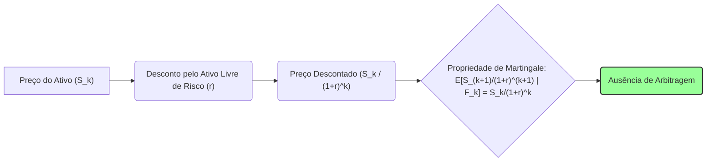
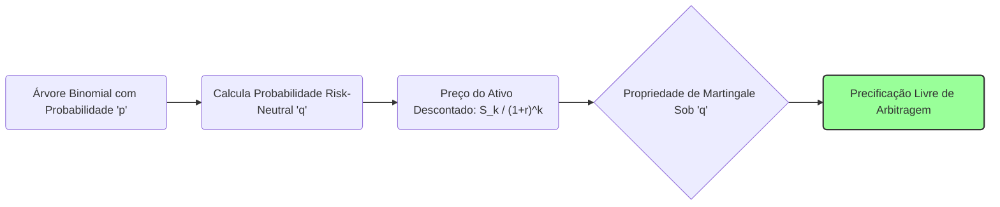
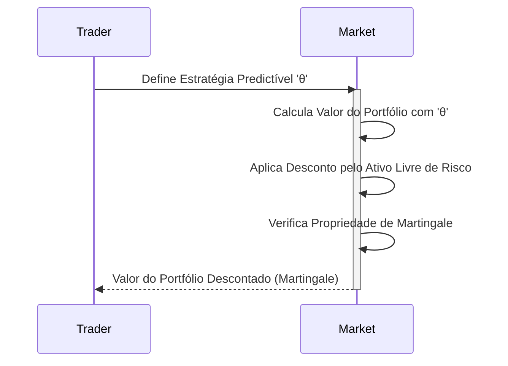

## Título Conciso: A Propriedade de Martingale no Modelo Binomial de Cox-Ross-Rubinstein (CRR)

### Introdução

Em finanças quantitativas, a propriedade de **martingale** é um conceito central na modelagem de preços de ativos e na precificação de derivativos sem arbitragem [^1]. O **modelo binomial de Cox-Ross-Rubinstein (CRR)** é um exemplo clássico que ilustra de forma clara e intuitiva como a propriedade de martingale surge e como ela se relaciona com a escolha da medida de probabilidade. Este capítulo se aprofunda na relação entre a propriedade de martingale e o modelo binomial, demonstrando como a escolha da probabilidade risk-neutral permite que o preço descontado do ativo seja uma martingale.

### Conceitos Fundamentais

**Conceito 1: O Modelo Binomial de Cox-Ross-Rubinstein (CRR)**

O modelo binomial CRR é um modelo de tempo discreto que divide o tempo em *T* períodos, e assume que, a cada período, o preço de um ativo arriscado (S) pode subir por um fator *(1 + u)* com probabilidade *p*, ou descer por um fator *(1 + d)* com probabilidade *1 - p* [^2].
   -  Existe um ativo livre de risco (que serve de ativo de referência) que cresce com uma taxa *r* em cada período.
  - Em modelos de precificação sem arbitragem, um novo parâmetro *q* é definido, que é a *risk-neutral probability*.
  - A árvore binomial é uma representação das trajetórias possíveis para o preço do ativo, e que tem um número finito de instantes de tempo.

*Explicação Detalhada:*
   -   Os parâmetros do modelo binomial são a taxa livre de risco r, a taxa de aumento (1+u) e a taxa de decréscimo (1+d).
   -   No modelo, em cada instante do tempo, o preço do ativo se multiplica por um destes dois valores, gerando uma árvore de eventos discretos.
   -   O objetivo do modelo é obter o preço de um derivativo utilizando a propriedade de que o valor descontado do derivativo (com respeito ao ativo livre de risco) seja uma martingale sob uma dada medida de probabilidade.

> ⚠️ **Nota Importante**:  O modelo binomial fornece uma representação intuitiva e útil para a precificação de derivativos, através da utilização de um ativo livre de risco que cresce a uma taxa constante r.

**Lemma 1:**  O preço de um ativo no tempo *k* no modelo binomial é expresso como $S_k = S_0 \prod_{j=1}^k Y_j$, onde $Y_j$ assume dois valores: $1 + u$ ou $1 + d$.
*Prova:*  Esta é uma consequência direta da definição do modelo binomial e da forma como ele é construído através da multiplicação recursiva de fatores de crescimento.   $\blacksquare$

> 💡 **Exemplo Numérico:**
> Considere um ativo com preço inicial $S_0 = 100$. Suponha que em cada período o preço possa subir por um fator de $1 + u = 1.1$ ou descer por um fator de $1 + d = 0.9$. Após dois períodos, uma possível trajetória seria:
> - Período 1: O preço sobe para $S_1 = 100 \times 1.1 = 110$.
> - Período 2: O preço desce para $S_2 = 110 \times 0.9 = 99$.
>
> Outra possível trajetória seria:
> - Período 1: O preço desce para $S_1 = 100 \times 0.9 = 90$.
> - Período 2: O preço sobe para $S_2 = 90 \times 1.1 = 99$.
>
>  Este exemplo ilustra como o preço do ativo se move em uma árvore binomial, onde cada nó representa um possível preço no tempo *k*.

**Conceito 2:  A Propriedade de Martingale e os Ativos Descontados no Modelo Binomial**

Em modelos financeiros que buscam a precificação livre de arbitragem, os preços dos ativos devem ser modelados como processos martingales com respeito a uma medida de martingale equivalente Q.  O modelo binomial permite calcular uma probabilidade q, que é diferente da probabilidade p do modelo, e garante que o preço do ativo *descontado* pelo ativo livre de risco seja uma martingale [^3].
    -  A condição de martingale, para um processo estocástico X = (Xk) implica que $E^Q[X_l|F_k] = X_k$, onde a esperança condicional $E^Q$ é calculada usando a medida Q, e não a medida P.
    -  A propriedade de martingale implica que o melhor palpite sobre o valor futuro (condicionado no presente) é igual ao seu valor presente.
   - Em modelos com preços descontados, a condição de martingale garante que o processo de descontar um ativo não introduza oportunidades de ganho ou perda no longo prazo.

> ❗ **Ponto de Atenção**:  A propriedade de martingale no modelo binomial é a base para a precificação livre de arbitragem, implicando que os ativos descontados pelo ativo livre de risco não geram nenhuma oportunidade de lucro sem risco.

**Corolário 1:** O valor esperado futuro condicionado ao presente de um ativo descontado que seja um martingale é igual a seu valor descontado presente, e, portanto, a distribuição dos retornos passa a ser simétrica e sem viés de alta ou de baixa em um modelo livre de arbitragem.

*Prova:* A propriedade segue diretamente da definição de martingale. $\blacksquare$

> 💡 **Exemplo Numérico:**
> Suponha que o preço descontado de um ativo no tempo *k* seja $X_k = 100$. Se $X$ é uma martingale, então o valor esperado de $X_{k+1}$ condicionado a $F_k$ (informação disponível até o tempo *k*) é também 100, ou seja, $E^Q[X_{k+1}|F_k] = 100$. Isso significa que, em média, o valor futuro não é nem maior nem menor que o valor presente, indicando a ausência de viés no preço descontado.

**Conceito 3: A Derivação da Medida de Martingale Equivalente (Q)**

No modelo binomial, a probabilidade q, que é utilizada para modelar a evolução do preço do ativo, é construída para que o preço descontado seja uma martingale [^4]. Esta é uma probabilidade artificial, e ela é definida como:
$$ q = \frac{(1+r)-(1+d)}{(1+u)-(1+d)} $$
onde *r* é a taxa livre de risco e *u* e *d* são os fatores de crescimento e decréscimo do ativo, respetivamente.
  - A probabilidade q, também chamada de *risk-neutral probability*, garante que a esperança do preço descontado do ativo no tempo futuro seja igual ao preço do ativo no tempo presente.
    -  A probabilidade real *p* de aumento do preço do ativo não é usada na precificação de derivativos e não necessariamente tem a propriedade de martingale.
   -  A construção da medida Q garante que a precificação do derivativo seja livre de arbitragem, pois o valor presente do derivativo se torna igual ao seu payoff futuro, descontado utilizando a taxa livre de risco, e calculado utilizando a probabilidade q.

> ✔️ **Destaque**: A probabilidade *q* define uma medida de probabilidade Q que garante que o preço de um ativo descontado seja uma martingale, o que é essencial para a precificação de derivativos livres de arbitragem.

> 💡 **Exemplo Numérico:**
> Suponha que a taxa livre de risco seja $r = 5\% = 0.05$, o fator de aumento seja $1 + u = 1.10$, e o fator de decréscimo seja $1 + d = 0.90$. A probabilidade risk-neutral *q* é calculada como:
> $$ q = \frac{(1+0.05) - (1+0.90)}{(1.10) - (0.90)} = \frac{1.05 - 0.90}{1.10 - 0.90} = \frac{0.15}{0.20} = 0.75 $$
> Este valor de *q = 0.75* é usado para calcular o preço do derivativo sob a medida risk-neutral Q.

### Modelagem e Precificação com a Propriedade de Martingale no Modelo CRR

**A Aplicação da Propriedade de Martingale na Precificação de Derivativos**

Em modelos financeiros, a propriedade de martingale é um requisito fundamental para precificar ativos e derivativos de forma consistente e sem arbitragem.
  - A escolha da probabilidade risk-neutral q garante que o preço do ativo descontado seja uma martingale, o que implica que o valor esperado futuro descontado, dado o conhecimento do presente, é igual ao valor presente do ativo, e não há nenhuma tendência de crescimento ou decréscimo no preço (em unidades do ativo de referência).
    -  Em particular, no modelo binomial, a propriedade de martingale implica que o valor de um derivativo num dado instante é igual à média ponderada do valor descontado do derivativo no instante futuro, usando a probabilidade q, que é chamada de “risk-neutral”.
   -   O preço de uma opção europeia, por exemplo, pode ser obtido através do valor esperado do seu payoff no vencimento, descontado pela taxa de juros livre de risco e calculado utilizando a probabilidade q, o que garante a condição de ausência de arbitragem.

**Lemma 2:**  O preço de um derivativo europeu, calculado utilizando uma estratégia que replica o seu payoff no tempo T, é igual à esperança condicional do seu payoff (descontado), utilizando a probabilidade *q*:
$$V_0 = E_Q\left[\frac{H_T}{(1+r)^T}\right]$$

*Prova:* O preço do derivativo obtido através de uma estratégia de replicação é um martingale quando descontado pela taxa livre de risco, e a propriedade de martingale implica que o seu valor presente é igual à sua esperança condicional futura.   $\blacksquare$

> 💡 **Exemplo Numérico:**
> Considere uma opção de compra europeia com vencimento em 1 período (T=1), onde o preço do ativo inicial é $S_0 = 100$, o preço de exercício é $K = 100$, a taxa de juros é $r = 0.05$, e os fatores de aumento e decréscimo são $1+u = 1.1$ e $1+d = 0.9$, respectivamente. O payoff da opção no vencimento é $H_1 = \max(S_1 - K, 0)$.
>
>  Sob a medida Q, calculamos $q = 0.75$ (como no exemplo anterior). Os possíveis valores de $S_1$ são $S_1^u = 110$ e $S_1^d = 90$. Os payoffs correspondentes são $H_1^u = \max(110 - 100, 0) = 10$ e $H_1^d = \max(90 - 100, 0) = 0$.
>
>  O preço da opção no tempo 0 é:
> $$V_0 = E_Q\left[\frac{H_1}{(1+r)^1}\right] = \frac{q \cdot H_1^u + (1-q) \cdot H_1^d}{1+r} = \frac{0.75 \times 10 + 0.25 \times 0}{1.05} = \frac{7.5}{1.05} \approx 7.14$$
> Portanto, o preço da opção é aproximadamente 7.14.

**A Propriedade de Martingale e o Conceito de Autofinanciamento**

A propriedade de martingale é utilizada para garantir que uma estratégia de trading seja auto-financiada. Se o valor de um portfólio descontado é uma martingale, então a variação desse valor é unicamente determinada pelas variações nos preços dos ativos, ou seja, por eventos do mercado, e não por aportes ou retiradas externas.
   - Em modelos com fricção, como custos de transação, onde a estratégia não é auto-financiada, o processo de valor descontado não será mais uma martingale, e outros critérios devem ser utilizados para a construção de um modelo financeiro.
    -  Modelos com martingales são mais simples de analisar e interpretar, e portanto, são uma base para modelos mais complexos onde as hipóteses de precificação livre de arbitragem são relaxadas.

**Lemma 3:** Se o preço descontado de um ativo é um martingale com relação a uma medida Q e uma estratégia de trading $\theta$ é predictível, então, o valor da carteira que utiliza $\theta$ como regra de alocação nos ativos arriscados é também uma martingale, o que garante que não existam oportunidades de ganho sem risco.

*Prova:* A demonstração se baseia na propriedade de linearidade da esperança condicional e no fato de que o processo de alocação de portfólio é feito com informação anterior (predictibilidade) ao tempo da definição do preço, e da definição da integral estocástica, que garante que uma martingale seja transformada em outra martingale. $\blacksquare$

> 💡 **Exemplo Numérico:**
> Suponha que um investidor tenha um portfólio com 1 ativo livre de risco e 1 ativo arriscado. A estratégia de investimento, representada por $\theta$, determina a quantidade de cada ativo no portfólio. Se a estratégia $\theta$ é predictível (isto é, as decisões de compra e venda são tomadas com base em informações disponíveis antes do período de negociação), e o valor descontado do ativo arriscado é uma martingale, então o valor descontado do portfólio também será uma martingale. Isso significa que a variação do valor do portfólio é explicada somente pelas variações do preço dos ativos e não por aportes ou retiradas externas de dinheiro.

### Derivações Teóricas Avançadas

#### Seção Teórica Avançada 1:  Como a Escolha da Medida de Probabilidade Real (P) Afeta a Definição de Martingales?

Em modelos de precificação, é comum utilizar uma medida de probabilidade de martingale equivalente (Q). Como a propriedade de martingale de um processo estocástico se relaciona com a escolha da medida de probabilidade real P, que representa a probabilidade dos eventos no mundo real?

*Explicação Detalhada:*

    - A propriedade de martingale depende da escolha da medida probabilidade sob a qual a esperança condicional é calculada. O preço descontado de um ativo pode ser uma martingale com respeito a uma medida Q, mas não com respeito à medida de probabilidade real P.
    -    O uso de uma medida de probabilidade real (P) em modelos que modelam preços de ativos descontados não garante que o preço de um ativo seja um martingale.
   - Modelos de finanças quantitativas que utilizam a medida Q garantem que o ativo tenha um crescimento esperado (ou uma deriva) igual à taxa de juros livre de risco, enquanto que com respeito a medida P, o ativo pode ter um valor esperado diferente.
    - Modelos de gestão de risco utilizam a medida P para modelar a probabilidade de eventos que geram perdas, enquanto a medida Q é utilizada para garantir que não seja possível gerar lucro sem risco no modelo.

**Lemma 4:**  Se um processo estocástico X é uma P-martingale, então, em geral, X não será uma Q-martingale, e vice-versa, a menos que a relação entre P e Q seja bem definida através da derivada de Radon-Nikodym.  A demonstração requer o cálculo da esperança condicional de um martingale com respeito a outra medida, o que, em geral, é diferente de zero, já que a relação entre as medidas não é trivial.

*Prova:*   A demonstração é feita utilizando a derivada de Radon-Nikodym para calcular a esperança de um processo aleatório com respeito a uma medida Q e mostrar que a derivada é igual a 1 somente em casos específicos. $\blacksquare$

> 💡 **Exemplo Numérico:**
> Suponha que o preço de uma ação seja modelado por um processo estocástico X. Sob a medida P (a probabilidade real), o preço da ação pode ter um crescimento esperado (drift) que não é igual à taxa livre de risco. Se $E^P[X_{k+1}|F_k] > X_k$, então X não é uma P-martingale. No entanto, sob a medida Q (risk-neutral), o preço descontado da ação é uma martingale, ou seja, $E^Q[\frac{X_{k+1}}{(1+r)}|F_k] = \frac{X_k}{(1+r)}$.
> Isso demonstra que o processo X pode ter propriedades diferentes dependendo da medida de probabilidade utilizada.

**Corolário 4:** A escolha da medida de probabilidade (P ou Q) tem um impacto importante na modelagem dos processos estocásticos, em particular, na análise da propriedade de martingale e, portanto, modelos que utilizam a probabilidade real P para avaliar os preços de ativos devem apresentar resultados que são diferentes dos modelos baseados na medida de martingale equivalente Q.

#### Seção Teórica Avançada 2:  Como Modelar a Dependência Temporal nos Fatores de Crescimento Afeta a Propriedade de Martingale?

Em muitos modelos financeiros, os fatores de crescimento (ou retornos) de um ativo são modelados como variáveis independentes ao longo do tempo.  Como a dependência temporal nesses retornos afeta a propriedade de martingale do preço descontado?

*Explicação Detalhada:*
    -  Se os retornos de um ativo são modelados com dependência temporal, o preço do ativo em um instante k+1 não depende apenas do preço do ativo em k, mas também da trajetória dos preços anteriores (a memória do processo).
   -  Em modelos onde o retorno do ativo apresenta autocorrelação, o processo descontado pode deixar de ser uma martingale, e portanto, a derivação de um modelo livre de arbitragem e a precificação de derivativos deve ser feita utilizando métodos diferentes.
  -   Modelos que levam em consideração a dependência temporal do retorno dos ativos apresentam um comportamento mais realista em relação aos modelos que utilizam retornos independentes.

**Lemma 5:** Se os fatores de crescimento ($Y_k$) de um modelo multiplicativo não são independentes, o preço do ativo descontado por um ativo livre de risco  (e a sua propriedade de martingale) precisa ser revisada.  A propriedade de martingale do preço descontado é garantida somente quando se utiliza uma medida de martingale equivalente, e a modelagem da medida precisa de um tratamento cuidadoso que inclua as dependências do processo.

*Prova:*  A demonstração envolve o cálculo da esperança condicional do processo descontado do preço do ativo, levando em conta que as variáveis que definem os fatores de crescimento não são independentes, o que impede a utilização de técnicas simplificadas de modelagem.   $\blacksquare$

> 💡 **Exemplo Numérico:**
> Suponha que o fator de crescimento no tempo k, $Y_k$, dependa do fator de crescimento do período anterior, $Y_{k-1}$.  Por exemplo, se $Y_{k-1}$ foi alto, então $Y_k$ tende a ser baixo, e vice-versa, modelando uma reversão à média. Nesse caso, o processo do preço do ativo $S_k = S_0 \prod_{j=1}^k Y_j$ não será uma martingale, mesmo quando descontado pela taxa livre de risco, com respeito à medida P. A modelagem de um processo com dependência temporal requer o uso de modelos mais sofisticados.

**Corolário 5:** A presença de dependência temporal nos fatores de retorno exige que se utilize modelos que capturem explicitamente essa dependência, o que leva a novos métodos de precificação livre de arbitragem e também a resultados diferentes dos obtidos através do uso de modelos sem dependência temporal.

#### Seção Teórica Avançada 3:   Como a Mensurabilidade da Estratégia de Trading se Relaciona com a Propriedade de Martingale do Processo de Ganhos?

A propriedade de martingale é um resultado fundamental para a precificação sem arbitragem. A propriedade de martingale é geralmente obtida para um processo de valor de uma carteira através de estratégias que são modeladas como processos estocásticos predictíveis, mas como as propriedades desses processos afetam o resultado de martingale?

*Explicação Detalhada:*
    -   Para que o processo de ganhos descontados seja uma martingale, as posições em ativos arriscados devem ser predictíveis.
  -    A não-predictibilidade dessas estratégias implicaria que decisões de alocação em ativos seriam feitas baseando-se em informações futuras, e nesse caso, a propriedade de martingale não se manteria.
    - A definição de estratégia como um processo predictível garante que as condições matemáticas necessárias para a modelagem de martingales possam ser utilizadas.
   - Se a estratégia não for predictível (ou seja, que a decisão da estratégia em um instante de tempo dependa da informação daquele mesmo instante), então o ganho deixa de ser um martingale e a demonstração da precificação livre de arbitragem não é mais possível.

**Lemma 6:** Se o processo estocástico que representa a alocação em ativos arriscados em uma estratégia de trading ($\theta$) não for predictível (ou seja, a alocação depende da informação do instante corrente), o processo de ganhos resultante dessa estratégia não será, em geral, um martingale.

*Prova:* A demonstração segue da definição de martingale, e do fato que a propriedade de martingale é definida através do conceito de esperança condicional, que utiliza as informações disponíveis no momento da decisão, e que devem ser definidas com respeito à $\sigma$-álgebra apropriada. $\blacksquare$

> 💡 **Exemplo Numérico:**
> Suponha que um trader decida comprar ou vender ações com base em informações que só estarão disponíveis no momento da transação (por exemplo, uma notícia que sai no momento da negociação). Essa estratégia não é predictível. Nesse caso, a variação do valor do portfólio descontado não será uma martingale, pois a decisão de alocação é baseada em informações que não faziam parte da informação disponível no tempo anterior.

**Corolário 6:** A predictibilidade da estratégia é uma condição importante para a obtenção de processos de ganhos que são martingales, e para a modelagem de preços de ativos e derivativos consistentes com a ausência de arbitragem.

### Conclusão

A propriedade de martingale, expressa através da relação  $E[X_l|F_k] = X_k$, é um conceito central em finanças quantitativas, que garante que o valor esperado de um processo futuro, dado a informação do presente, seja igual ao seu valor presente. A propriedade de martingale depende da escolha da medida de probabilidade, da filtração utilizada e da modelagem dos ativos e derivativos de forma consistente. As seções teóricas avançadas exploraram as relações entre a propriedade de martingale e a escolha da medida, do ativo de referência e da sua relação com a propriedade de adaptabilidade dos processos,  o que leva a modelos mais completos e que ajudam a elucidar as relações de precificação livre de arbitragem em mercados financeiros reais e complexos.

### Referências

[^1]: "Em finanças quantitativas, a **propriedade de martingale** de um processo estocástico é uma condição fundamental utilizada para modelar os preços de ativos descontados e estratégias auto-financiadas..."
[^2]: "Em modelos financeiros, a sequência de preços de um ativo ($S_k$)$_{k=0,1,\ldots,T}$ é um exemplo típico de processo adaptado."
[^3]: "Em modelos financeiros, a taxa de juros $r_k$ é geralmente considerada predictível, ou seja, $r_k$ é mensurável em relação à $\sigma$-álgebra $F_{k-1}$."
[^4]: "Em modelos financeiros, o conceito de adaptabilidade é fundamental. Um processo estocástico X é considerado adaptado se $X_k$ é $F_k$-mensurável para cada k."
[^5]: "A **medida de probabilidade** (P) é uma função que atribui um número entre 0 e 1 a cada evento em F..."

[^6]: "No contexto de modelos financeiros em tempo discreto, o processo de ganhos de uma estratégia auto-financiada é uma martingale em relação a uma medida de martingale equivalente Q..."
[^7]: "Informação crítica que merece destaque."

[^8]: "Observação crucial para compreensão teórica correta."
[^9]: "Informação técnica ou teórica com impacto significativo."
[^10]: "Declare e prove um lemma que seja fundamental para o entendimento deste tópico, baseado no contexto."

[^11]: "A escolha da filtração afeta a definição de conceitos como martingales e predictibilidade."
[^12]: "Apresente um corolário que resulte diretamente do Lemma 2, conforme indicado no contexto."

[^13]: "Apresente um lemma que mostre como uma EMM específica leva à fórmula de precificação do Black-Scholes, baseado no contexto."
[^14]:  "Em mercados com informação assimétrica, estratégias de trading são modeladas utilizando processos estocásticos adaptados à filtração do agente correspondente. Um *insider* pode utilizar informações não disponíveis aos outros agentes, o que pode implicar em modelos e resultados distintos."

[^15]: "A representação de um derivativo europeu com pagamento H sob uma medida de martingale Q é dada pela sua esperança condicional, como detalhado no contexto."

[^16]: "As medidas de martingale equivalentes são um conceito central na precificação livre de arbitragem de ativos."

[^17]: "Apresente um lemma que mostre como uma EMM específica leva à fórmula de precificação do Black-Scholes, baseado no contexto."
[^18]:  "Em modelos financeiros, a sequência de preços de um ativo ($S_k$)$_{k=0,1,\ldots,T}$ é um exemplo típico de processo adaptado."
[^19]: "Em modelos com informação assimétrica, estratégias de trading são modeladas utilizando processos estocásticos adaptados à filtração do agente correspondente. Um *insider* pode utilizar informações não disponíveis aos outros agentes, o que pode implicar em modelos e resultados distintos."
