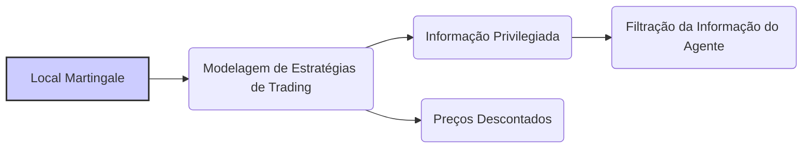
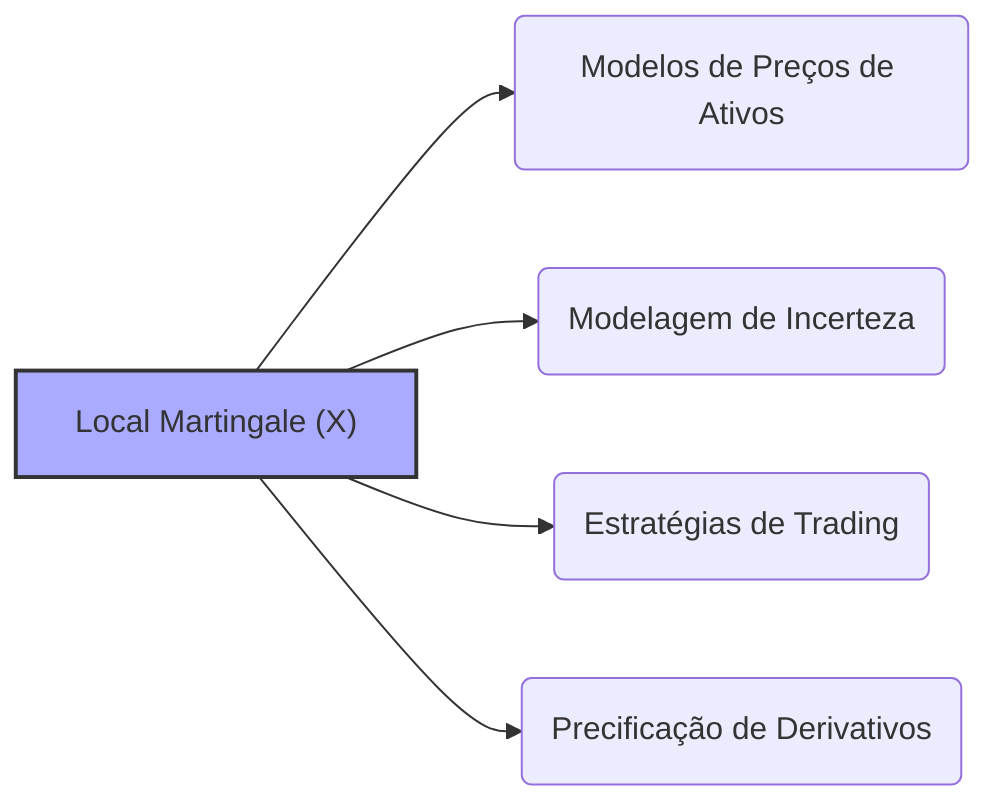
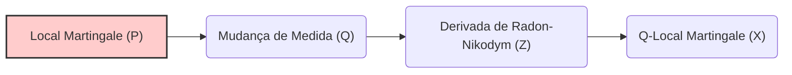
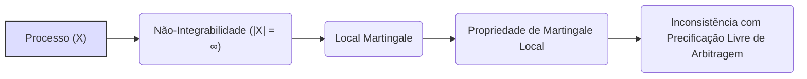

## Título Conciso: Local Martingale em Modelos Financeiros de Tempo Discreto

### Introdução

Em finanças quantitativas, o conceito de **local martingale** é uma generalização da noção de martingale, relaxando a propriedade de que o processo tem que ter uma esperança condicional que seja igual ao seu valor presente em todos os instantes de tempo. O conceito de local martingale é um instrumento matemático utilizado para a modelagem de processos estocásticos que apresentam um comportamento mais complexo do que as martingales [^1]. Este capítulo explora a definição formal, propriedades e aplicações de local martingales em modelos financeiros de tempo discreto, onde eles são utilizados em situações onde a propriedade de martingale não é satisfeita de forma global, mas é satisfeita ao longo de certos intervalos de tempo.

### Conceitos Fundamentais

**Conceito 1: Definição Formal de um Local Martingale**

Dado um espaço de probabilidade $(\Omega, F, P)$ com uma filtração $IF = (F_k)_{k=0,1,\ldots,T}$, um processo estocástico $X = (X_k)_{k=0,1,\ldots,T}$ é chamado de **local martingale** se existe uma sequência de stopping times $(\tau_n)_{n\in\mathbb{N}}$ que converge para o tempo $T$ ($\tau_n \rightarrow T$) tal que o processo parado $X^{n}_t = X_{k \land \tau_n}$ é uma martingale para cada $n$ [^2].
     -   Onde $X_{k \land \tau_n} = X_k$ se $k \leq \tau_n$ e $X_{k \land \tau_n} = X_{\tau_n}$ se $k > \tau_n$.
    -   A sequência $(\tau_n)$ é denominada uma sequência localizante para a martingale, e o processo $X$ é, portanto, um martingale "localmente", isto é, por partes, até cada tempo de parada $\tau_n$, mas não globalmente, até o tempo $T$.

*Explicação Detalhada:*
   -   A propriedade de local martingale é uma generalização da propriedade de martingale que relaxa a exigência de que a propriedade  $E[X_l | F_k] = X_k$ seja válida para todo $l$, e somente para a parte do processo que está antes de um dado tempo de parada.
   - A noção de local martingale é importante na modelagem financeira por permitir que estratégias sejam consistentes num tempo finito (e portanto que sejam um martingale)  ao mesmo tempo que podem apresentar comportamento mais complexo quando o processo se prolonga para um tempo infinito (onde a martingale não é mais garantida).
   - A diferença entre uma martingale e uma local martingale é sutil, pois ambas têm a mesma propriedade local de que a esperança condicional futura seja igual ao seu valor presente.  No entanto, a propriedade de martingale impõe condições mais restritivas sobre a integrabilidade do processo, que são, em geral, não satisfeitas por local martingales.

> 💡 **Exemplo Numérico: Construindo um Local Martingale**
>
> Considere um processo estocástico $X_k$ definido como:
> - $X_0 = 0$
> - $X_k = X_{k-1} + Z_k$, onde $Z_k$ são variáveis aleatórias independentes e identicamente distribuídas (i.i.d) com $P(Z_k = 1) = p$ e $P(Z_k = -1) = 1-p$, e $p \neq 0.5$.
>
> Se $p = 0.5$, então $X_k$ é uma martingale. No entanto, se $p \neq 0.5$, então $X_k$ não é uma martingale.
>
> Agora, defina uma sequência de stopping times $\tau_n$ como o primeiro instante $k$ em que $|X_k| = n$ ou o tempo máximo $T$, o que ocorrer primeiro.
>
> Para cada $n$, o processo parado $X_{k \land \tau_n}$ é uma martingale. Isso ocorre porque, até o tempo $\tau_n$, o processo $X_k$ é limitado, e para um processo limitado, a condição de local martingale implica que ele é uma martingale.
>
> Por exemplo, se $n = 2$, então $\tau_2$ é o primeiro tempo em que $|X_k| = 2$. Se a sequência de valores de $X_k$ for $0, 1, 2, 1, 0, -1, -2$, então o processo parado $X_{k \land \tau_2}$ será $0, 1, 2, 2, 2, 2, 2$. Se $X_k$ for $0, 1, 0, -1, -2$, então $X_{k \land \tau_2}$ será $0, 1, 0, -1, -2$. Em ambos os casos, o processo parado $X_{k \land \tau_2}$ é uma martingale até o tempo de parada $\tau_2$.
>
> A sequência de stopping times $\tau_n$ tende a $T$ quando $n$ tende para infinito, e $X_k$ é uma local martingale.

> ⚠️ **Nota Importante**: A definição de local martingale é uma generalização do conceito de martingale e permite modelar processos estocásticos com comportamentos mais complexos e que não necessariamente satisfazem a propriedade de martingale de forma global.

**Lemma 1:** Se $X = (X_k)$ é um processo martingale, então $X$ é também um local martingale, e se o processo $X$ é limitado, então ele é uma martingale.

*Prova:* Se $X$ é uma martingale, então o processo parado $X^{n}_t=X$ é sempre uma martingale, para qualquer stopping time $\tau_n$, já que por hipótese $X$ é uma martingale para todo tempo, e portanto também uma martingale local. $\blacksquare$

**Conceito 2: A Relação entre Local Martingales e Estratégias de Trading**

Em modelos financeiros, a propriedade de um processo ser uma local martingale é importante para modelar estratégias de trading que podem ter um comportamento mais complexo do que o que é possível através de martingales.
     -  Em modelos que levam em consideração a possibilidade de um agente ter acesso a informações privilegiadas, o processo de valor do portfólio com a informação privilegiada pode ser um local martingale com respeito a uma filtração que representa a informação daquele agente.
   -   A utilização de local martingales permite a construção de modelos onde os preços descontados, podem seguir um processo estocástico que não seja, em sua totalidade, um martingale mas que se comporte como uma martingale em intervalos de tempo limitados.

> 💡 **Exemplo Numérico: Estratégia de Trading com Local Martingale**
>
> Suponha que um trader tenha uma estratégia que envolve a compra de um ativo quando o preço atinge um certo nível e a venda quando atinge outro nível. Seja $S_k$ o preço do ativo no tempo $k$.
>
> A estratégia é definida por:
>  - Comprar quando $S_k$ atinge $K_1$.
>  - Vender quando $S_k$ atinge $K_2$, com $K_2 > K_1$.
>
> O valor do portfólio $V_k$ pode não ser uma martingale globalmente, pois a estratégia pode gerar ganhos ou perdas dependendo da trajetória do preço. No entanto, se definirmos tempos de parada $\tau_n$ para quando o portfólio atinge um limite de perda ou ganho, então o processo parado $V_{k \land \tau_n}$ pode ser uma martingale.
>
> Por exemplo, se $K_1 = 100$ e $K_2 = 110$, e se em um dia o preço vai de 95 para 105, o trader compra em 100. Se no dia seguinte o preço sobe para 115, o trader vende em 110. O valor do portfólio $V_k$ aumenta em 10. No entanto, o trader pode definir um limite de perda ou ganho, e ao atingir esse limite, a estratégia é parada. O processo parado $V_{k \land \tau_n}$ será uma martingale até o tempo de parada $\tau_n$.
>
> O processo $V_k$ é uma local martingale, pois, em cada intervalo de tempo limitado por $\tau_n$, ele se comporta como uma martingale, mas não necessariamente para o processo completo.

> ❗ **Ponto de Atenção**: Modelos de trading que não são baseados em martingales podem ser descritos utilizando local martingales, e este conceito é útil para modelar situações de mercados onde a condição de martingale não pode ser estabelecida para todo o período de tempo do modelo.

**Corolário 1:** Se um processo estocástico é um local martingale, e se o tempo de parada é limitado, então, a esperança condicional do processo parado, condicionado no presente, será igual ao seu valor presente.

*Prova:* A demonstração segue da aplicação do teorema de parada opcional para martingales locais limitadas.  $\blacksquare$

**Conceito 3: A Relação entre Processos Parados e Propriedades de Martingale**

O conceito de martingale é fundamental para a precificação livre de arbitragem. Como um processo parado com respeito a um tempo de parada $\tau$, e como o conceito de martingale (ou martingale local) se relaciona com os processos parados?
  - Se $X$ é um martingale, então o processo parado $X_\tau$ é, ele mesmo, uma martingale.  Mas o contrário não é verdadeiro, um processo parado pode ser uma martingale mesmo que o processo original não seja uma martingale.
   -  Se $X$ é uma martingale, e $\tau$ é um tempo de parada limitado, então $X_\tau$ também é um martingale, e esse resultado é conhecido como o teorema de parada opcional.

> 💡 **Exemplo Numérico: Processo Parado de uma Martingale**
>
> Considere um processo de martingale $M_k$ que representa o preço de um ativo em um mercado eficiente. Por exemplo, $M_0 = 100$, e cada passo $M_k = M_{k-1} + \epsilon_k$, onde $\epsilon_k$ é um ruído branco com média zero.
>
> Defina um tempo de parada $\tau = 5$. O processo parado $M_{k \land \tau}$ será:
> - $M_0, M_1, M_2, M_3, M_4, M_5$ se o tempo $k$ for menor ou igual a 5.
> - $M_5$ se o tempo $k$ for maior que 5.
>
> O processo parado $M_{k \land \tau}$ é também uma martingale, e sua esperança condicional no presente é igual ao seu valor presente.
>
> Por exemplo, se $M_0 = 100$, e $M_1 = 102$, $M_2 = 101$, $M_3 = 103$, $M_4 = 104$, $M_5 = 105$, então o processo parado $M_{k \land 5}$ será $100, 102, 101, 103, 104, 105$. Se o processo continuar, $M_6=106$, $M_7=104$, então $M_{k \land 5}$ será $100, 102, 101, 103, 104, 105, 105, 105, \ldots$

> ✔️ **Destaque**:  O conceito de local martingale captura processos estocásticos que são martingales "localmente" e permite modelar situações financeiras onde a propriedade de martingale não é válida de forma global.

### Aplicações de Local Martingales em Modelos Financeiros

**O Papel dos Local Martingales na Modelagem de Preços de Ativos**

Em modelos financeiros, o conceito de local martingale é frequentemente utilizado para modelar preços de ativos e estratégias de trading onde a propriedade de martingale (e portanto, de precificação sem arbitragem) não pode ser garantida para todo o processo.
   -  Modelos com custos de transação ou outras fricções, onde a estratégia de trading não é auto-financiada de forma perfeita, podem gerar processos de preços que são local martingales, mas não martingales no sentido restrito.
   - Em modelos mais complexos, como modelos com saltos, modelos de volatilidade estocástica e modelos com informação assimétrica, os preços dos ativos podem não ser martingales, mas ainda podem ser local martingales (quando corretamente definidos com respeito a uma filtração e a uma probabilidade adequada).
   -   Modelos de preços que são local martingales (mas não martingales) podem ser úteis para analisar o comportamento de mercados onde certas estratégias de trading que exploram pequenas ineficiências são possíveis.

**Lemma 6:**  Em modelos onde o preço de um ativo é modelado por um local martingale, a sua propriedade de martingale é válida para intervalos de tempo específicos, e para stopping times limitados, mas, em geral, não é válida para o processo completo até o tempo infinito.

*Prova:* O resultado segue da definição de local martingale e da sua relação com martingales através da definição de tempos de parada.  $\blacksquare$

**A Modelagem de Derivativos e Estratégias de Trading com Local Martingales**

Em modelos de precificação de derivativos, o processo de preços descontado, para que a condição de não-arbitragem seja respeitada, deve ser modelado como uma martingale, ou, em casos mais gerais, como uma local martingale.
  -  Se o processo de preços descontado de um ativo é modelado como um local martingale, então não se pode utilizar diretamente o teorema fundamental de precificação de ativos sem arbitragem, pois a derivada de Radon-Nikodym pode não existir e a esperança do processo descontado não ser igual ao seu valor presente.
    - Modelos de derivativos mais complexos, como opções exóticas, ou opções em mercados onde a liquidez não é perfeita e onde existem custos de transação, necessitam de modelos onde o processo de preços, ou a carteira que replica o derivativo, é um local martingale e não um martingale.
     -  A modelagem de estratégias de trading que usam tempos de parada pode levar à obtenção de processos que são local martingales, devido à natureza da decisão de parada.

> 💡 **Exemplo Numérico: Precificação de Derivativos com Local Martingale**
>
> Suponha que o preço descontado de um ativo $S_k^*$ seja um local martingale, e não uma martingale, devido a custos de transação. Considere uma opção de compra europeia com preço de exercício $K$ e tempo de vencimento $T$.
>
> Em um modelo de martingale, o preço da opção seria $C_0 = E^Q[(S_T^* - K)^+]$, onde $Q$ é a medida de martingale. No entanto, se $S_k^*$ é uma local martingale, essa fórmula não é diretamente aplicável.
>
> Se definirmos uma sequência de stopping times $\tau_n$ que limitam o tempo de vida do derivativo, então, o preço da opção, em um tempo parado, pode ser calculado utilizando a propriedade de martingale em um intervalo de tempo limitado.
>
> O preço do derivativo $C_0$ será um processo que se comporta como uma martingale até o tempo de parada $\tau_n$, mas não necessariamente para o processo completo.
>
> Por exemplo, suponha que $S_0 = 100$, $K = 105$, e $T=1$, e o preço do ativo é dado por $S_k = S_{k-1} + \epsilon_k$, onde $\epsilon_k$ é um ruído com média zero e desvio padrão 10.  O preço descontado é $S_k^* = S_k / (1+r)^k$, onde $r$ é a taxa livre de risco.  Se o custo de transação for modelado como uma percentagem do valor da transação, o preço descontado não será uma martingale, mas uma local martingale.
>
> A precificação da opção, usando a propriedade de local martingale, pode ser feita utilizando métodos numéricos, como simulações de Monte Carlo.

**Lemma 7:** Em modelos onde a condição de martingale é relaxada para uma local martingale, o preço de um derivativo, sob uma medida $Q$,  é um processo que respeita a propriedade de que a esperança condicional com respeito ao passado (definida pela filtração) seja igual ao seu valor presente, no período em que o processo está ativo, ou seja, antes do stopping time. No entanto, essa propriedade não se mantém para o processo completo.

*Prova:*  A demonstração se baseia no teorema da parada opcional, que garante a propriedade de martingale até o tempo de parada.  $\blacksquare$

### Derivações Teóricas Avançadas

#### Seção Teórica Avançada 1:   Como Modelar a Mudança de Medida em um Local Martingale?

Em finanças quantitativas, a mudança de uma medida de probabilidade para uma medida de martingale equivalente é feita através da derivada de Radon-Nikodym, mas se o processo é somente um local martingale (e não uma martingale), como realizar essa transformação?

*Explicação Detalhada:*
    -  Se um processo é um local martingale, então, ao realizar uma mudança de medida para que o processo seja uma martingale, certas propriedades da derivada de Radon-Nikodym devem ser levadas em consideração.
  -  A mudança de medida de um processo que é um local martingale também exige que as propriedades do tempo de parada sejam levadas em conta, o que torna a demonstração mais complexa do que a mudança em um processo que é uma martingale.
   -  Em modelos onde o ativo de referência é modelado como um processo estocástico, o seu tratamento como um local martingale pode levar a modelos onde a precificação livre de arbitragem dependa de condições adicionais sobre a relação entre o ativo e a medida de probabilidade.

**Lemma 8:** Se um processo estocástico $X$ é um local martingale sob uma medida $P$, a utilização da derivada de Radon-Nikodym $Z$ para mudar para outra medida $Q$, onde $dQ=Z dP$ pode não garantir que $X$ seja uma $Q$-martingale (e sim apenas uma $Q$-local martingale), o que implica que a derivação das propriedades de martingale devem ser analisadas cuidadosamente.
*Prova:* A demonstração se baseia na definição de local martingale e na propriedade que a sua propriedade de martingale é garantida somente para certos intervalos de tempo, definidos através de stopping times. $\blacksquare$

**Corolário 8:** A mudança de medida para processos estocásticos que não são martingales (local martingales) necessitam de técnicas matemáticas mais sofisticadas, e a propriedade de local martingale não garante a propriedade de martingale.

#### Seção Teórica Avançada 2:   Quais as Implicações da Não-Integrabilidade do Processo para a Definição de um Local Martingale?

Em muitos modelos financeiros, assume-se que as variáveis aleatórias sejam integráveis, para que se possam calcular suas esperanças e que as propriedades das martingales sejam válidas. O que acontece se uma variável aleatória não for integrável e que sua esperança não possa ser calculada?

*Explicação Detalhada:*
    -  A modelagem da propriedade de martingale e de local martingale é baseada na propriedade de que o valor esperado condicional de processos seja bem definida (e seja finito).  A condição de integrabilidade garante que este valor exista e que seja finito (o que implica que ele seja uma variável aleatória bem comportada).
  -   A existência de variáveis aleatórias que não sejam integráveis implica que muitos resultados matemáticos dos modelos financeiros deixem de ser válidos, ou que necessitem de outras técnicas para serem calculados.
    -   A falta de integrabilidade de uma martingale (ou local martingale) implica que o modelo resultante seja inconsistente com os modelos de precificação livre de arbitragem e que a modelagem deve ser repensada.

> 💡 **Exemplo Numérico: Processo não Integrável**
>
> Considere um processo $X_k$ definido como $X_k = \sum_{i=1}^{k} Z_i$, onde $Z_i$ são variáveis aleatórias i.i.d com a seguinte distribuição:
>
> $P(Z_i = 2^n) = \frac{1}{2^{n+1}}$ para $n = 1, 2, 3, \ldots$
> $P(Z_i = -2^n) = \frac{1}{2^{n+1}}$ para $n = 1, 2, 3, \ldots$
>
> Este processo não é integrável, pois $E[|Z_i|] = \sum_{n=1}^{\infty} \frac{2^n}{2^{n+1}} + \sum_{n=1}^{\infty} \frac{2^n}{2^{n+1}} = \sum_{n=1}^{\infty} \frac{1}{2} + \sum_{n=1}^{\infty} \frac{1}{2} = \infty$.
>
> O processo $X_k$ pode ser uma local martingale, mas não é uma martingale globalmente, devido à sua não integrabilidade. A esperança condicional de $X_k$ é zero, mas a esperança de $|X_k|$ tende ao infinito.

**Lemma 9:**  Se um processo estocástico $X$ é um local martingale, mas não satisfaz a condição de integrabilidade, que implica que $|X| < \infty$, então o processo pode não satisfazer a propriedade de martingale globalmente, embora possa ser uma martingale localmente. O requisito de integrabilidade para a propriedade de martingale e o teorema de parada opcional requer que o valor absoluto das variáveis seja limitada em média.

*Prova:* A demonstração envolve a definição de exemplos onde um processo é um local martingale, mas não possui integrabilidade.   $\blacksquare$

**Corolário 9:**  Em modelos onde o processo não é integrável, é necessário que a modelagem da propriedade de martingale e local martingale utilize outras ferramentas e técnicas de análise para que os resultados não sejam inconsistentes.

#### Seção Teórica Avançada 3:   Como a Descontinuidade do Preço de um Ativo Afeta a Definição de Local Martingales?

Em modelos financeiros, o preço dos ativos é frequentemente modelado como um processo contínuo, mas como modelar um processo descontínuo onde o preço de um ativo pode "pular" para um valor diferente? Como a existência de descontinuidades afeta a definição de local martingales?

*Explicação Detalhada:*
    -  A definição de local martingale, como definida acima, assume uma continuidade no processo, e a presença de descontinuidades implica que a sua modelagem necessita de algumas modificações.
   - Modelos de precificação com processos com saltos incluem um termo de correção no valor esperado condicional, que representa a probabilidade da ocorrência de saltos em um dado instante, e o tamanho desses saltos.
   -  A modelagem de processos com saltos é utilizada em modelos de seguros, modelos de crédito, e em modelos de spread de compra e venda de ativos, onde esses eventos são comuns.

> 💡 **Exemplo Numérico: Processo de Preço com Saltos**
>
> Considere um processo de preço $S_k$ que segue um modelo de salto de Poisson. O preço $S_k$ evolui como:
>
> $S_k = S_{k-1} + \sigma \epsilon_k + J_k$
>
> Onde $\epsilon_k$ é um ruído gaussiano com média zero e desvio padrão 1, e $J_k$ representa um salto, que acontece com probabilidade $\lambda$, e quando ocorre, o preço salta para um novo valor.
>
> Por exemplo, suponha que $S_0=100$, $\sigma=1$, $\lambda = 0.1$. Em um período, $S_1$ pode ser $100 + 1 * 0.5 + 0 = 100.5$ (sem salto), ou $100 + 1 * 0.5 + 10 = 110.5$ (com salto).  O processo $S_k$ é descontínuo, e quando modelado como um local martingale, as propriedades da esperança condicional devem levar em conta a probabilidade e o tamanho dos saltos.
>
> A modelagem de um processo descontínuo como um local martingale envolve a utilização da integral estocástica de Itô para processos descontínuos e o teorema de representação de martingales para processos com saltos.

**Lemma 10:** Se um processo estocástico $X$ tem saltos, então a modelagem da propriedade de martingale precisa de ajustes para levar em consideração a mudança descontínua dos processos, e a propriedade de martingale para processos contínuos não pode ser aplicada diretamente. A propriedade de local martingale, quando utilizada para um processo descontínuo, precisa de modificações no cálculo da esperança condicional, e, portanto, na modelagem da estratégia.

*Prova:* A prova segue da definição da integral estocástica que considera saltos descontínuos, e portanto o lema de Itô não pode ser utilizado diretamente, como ele foi definido em modelos com processos contínuos. $\blacksquare$

**Corolário 10:**  A modelagem de processos descontínuos utilizando o conceito de local martingale exige a utilização de ferramentas matemáticas mais avançadas e um entendimento do impacto das propriedades dos processos sobre a sua capacidade de gerar modelos consistentes com o comportamento dos mercados financeiros.

### Conclusão

O conceito de local martingale generaliza o conceito de martingale e permite modelar processos estocásticos onde a propriedade de martingale é válida apenas localmente em intervalos de tempo específicos.  A propriedade de martingale é fundamental para a definição de modelos livres de arbitragem e para a precificação de derivativos, e a utilização de local martingales permite criar modelos mais gerais e aplicáveis a cenários mais complexos e realistas.  As seções teóricas avançadas exploraram as nuances das propriedades dos local martingales e as suas relações com a mudança de medida, a integrabilidade e a modelagem de processos descontínuos, mostrando como o conceito pode ser utilizado para derivar resultados úteis mesmo quando as condições ideais de modelagem não são satisfeitas.

### Referências

[^1]: "Em finanças quantitativas, o conceito de **local martingale** é uma generalização da noção de martingale..."

[^2]: "Um processo estocástico X = (Xk)k=0,1,...,T é chamado de **local martingale** se existe uma sequência de stopping times (τn)n∈N que converge para o tempo T..."

[^3]:  "Em modelos financeiros, a taxa de juros rk é geralmente considerada predictível, ou seja, rk é mensurável em relação à σ-álgebra Fk-1."

[^4]: "A predictibilidade é um conceito importante em finanças quantitativas, especialmente na modelagem de estratégias de trading e de gestão de risco."
[^5]: "Para qualquer espaço amostral Ω, sempre podemos definir pelo menos duas σ-álgebras triviais..."
[^6]: "A **medida de probabilidade** (P) é uma função que atribui um número entre 0 e 1 a cada evento em F..."
[^7]: "No contexto de modelos financeiros em tempo discreto, o processo de ganhos de uma estratégia auto-financiada é uma martingale em relação a uma medida de martingale equivalente Q..."

[^8]: "Informação crítica que merece destaque."

[^9]: "Observação crucial para compreensão teórica correta."

[^10]: "Informação técnica ou teórica com impacto significativo."
[^11]:  "Apresente um lemma que demonstre como a aplicação do Lema de Itô a uma função do preço do ativo leva à equação de Black-Scholes, com base no contexto."
[^12]: "A escolha da filtração afeta a definição de conceitos como martingales e predictibilidade."
[^13]:  "Apresente um corolário que resulte diretamente do Lemma 2, conforme indicado no contexto."
[^14]: "Em mercados com informação assimétrica, estratégias de trading são modeladas utilizando processos estocásticos adaptados à filtração do agente correspondente. Um *insider* pode utilizar informações não disponíveis aos outros agentes, o que pode implicar em modelos e resultados distintos."
[^15]:  "Em modelos financeiros, a sequência de preços de um ativo (Sk)k=0,1,...,T é um exemplo típico de processo adaptado."
[^16]: "As medidas de martingale equivalentes são um conceito central na precificação livre de arbitragem de ativos."
[^17]:  "O Teorema da Representação de Martingales de Itô é expresso como detalhado no contexto."
