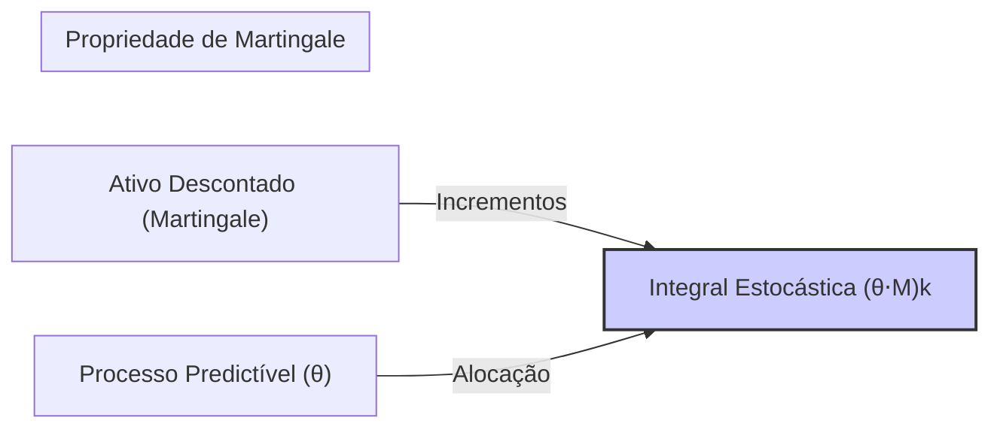

## Título Conciso: Integral Estocástica de Local Martingales em Modelos Financeiros de Tempo Discreto

```mermaid
flowchart LR
    A[Processo Predictível θ] -->|Pondera| B(Incrementos ΔXj)
    B --> C{Soma Cumulativa}
    C --> D[Integral Estocástica (θ⋅X)k]
    style D fill:#f9f,stroke:#333,stroke-width:2px
    
    subgraph "Integral Estocástica de Local Martingales"
    
    end
```

### Introdução

Em finanças quantitativas, a modelagem de estratégias de trading que evoluem com o tempo e a precificação de derivativos que dependem de um ativo subjacente cujo preço é aleatório requerem o conceito de **integral estocástica**. Em modelos de tempo discreto, esta integral estocástica é representada por uma soma ponderada de incrementos de um processo estocástico, modelada com a utilização de variáveis predictíveis e processos que se comportam como martingales ou local martingales.   Este capítulo explorará a definição, propriedades e aplicações da integral estocástica de processos predictíveis com respeito a local martingales, destacando sua importância na modelagem de carteiras de investimento e derivativos.

### Conceitos Fundamentais

**Conceito 1: Definição Formal da Integral Estocástica de Local Martingales**

Dado um processo local martingale $X = (X_k)_{k=0,1,\ldots,T}$ e um processo predictível $\theta = (\theta_k)_{k=0,1,\ldots,T}$ adaptado a uma filtração $IF = (F_k)_{k=0,1,\ldots,T}$, a **integral estocástica de θ em relação a X** é definida como [^1]:
$$
    (\theta \cdot X)_k = \sum_{j=1}^{k} \theta_j \Delta X_j
$$
   -   Onde $\Delta X_j = X_j - X_{j-1}$ representa o incremento do processo X no período [j-1, j).
    -  O processo θ é predictível, ou seja, $\theta_j$ é $F_{j-1}$-mensurável para cada j, o que significa que a decisão de alocação no instante j é feita somente com base nas informações disponíveis em instantes anteriores ao instante j.
    -  O processo $(\theta\cdot X)_k$ representa o valor acumulado do portfólio ao longo do tempo.
   -  A integral estocástica é o resultado da aplicação de uma estratégia de trading com a evolução dos preços de ativos, e o seu resultado indica como a carteira evolui com o tempo devido às variações dos preços dos ativos de risco e da sua alocação.

*Explicação Detalhada:*
   -    A integral estocástica representa o ganho de uma estratégia ao longo do tempo, onde as decisões são tomadas baseadas em informações passadas, que é o conceito de predictibilidade, e onde a variação do portfólio é dada pela variação do preço do ativo arriscado, ponderada pela quantidade desse ativo.
    - A propriedade de martingale ou de local martingale do processo X é fundamental para se derivar resultados sobre o processo da integral.
    -  A integral estocástica também pode ser escrita usando a notação $\Delta(\theta \cdot X)_k := \theta_k\Delta X_k$, e nesse caso a integral estocástica é uma soma de incrementos.

> 💡 **Exemplo Numérico:**
> Suponha que temos um ativo cujo preço segue um processo local martingale X, com os seguintes valores em três instantes de tempo: X0 = 100, X1 = 105, X2 = 102, X3 = 108. Uma estratégia de investimento é definida pelo processo predictível θ, com θ1 = 2, θ2 = -1, θ3 = 0.5. Isso significa que no instante 1, 2 unidades do ativo são compradas, no instante 2, 1 unidade é vendida e no instante 3, 0.5 unidades são compradas. A integral estocástica (θ⋅X)k é calculada como:
> - $(\theta\cdot X)_1 = \theta_1 * (X_1 - X_0) = 2 * (105 - 100) = 10$
> - $(\theta\cdot X)_2 = (\theta\cdot X)_1 + \theta_2 * (X_2 - X_1) = 10 + (-1) * (102 - 105) = 10 + 3 = 13$
> - $(\theta\cdot X)_3 = (\theta\cdot X)_2 + \theta_3 * (X_3 - X_2) = 13 + 0.5 * (108 - 102) = 13 + 3 = 16$
> O valor do portfólio no instante 3 é 16.

> ⚠️ **Nota Importante**:  A integral estocástica, obtida através do produto dos processos predictíveis e local martingales, permite modelar a evolução de portfólios com estratégias dinâmicas em modelos financeiros.  **Referência ao contexto [^2]**.

**Lemma 1:** Se $X = (X_k)_{k=0,1,\ldots,T}$ é um processo estocástico tal que $X_0 = 0$, e $Y = (Y_k)_{k=1,\ldots,T}$ é um processo predictível limitado, então a integral estocástica $(Y\cdot X)_k$ é um processo adaptado com respeito a mesma filtração.

*Prova:*   A prova segue da definição de processo predictível e do fato de que a soma de variáveis aleatórias adaptadas é também adaptada. $\blacksquare$

**Conceito 2:  A Relação entre a Integral Estocástica e a Propriedade de Martingale**

Uma das aplicações mais importantes da integral estocástica em modelos financeiros é a modelagem da propriedade de martingale para o valor de um portfólio, descontado, que se baseia na escolha de um ativo de referência, como a taxa livre de risco [^3].
   -  Em mercados livres de arbitragem e sem fricção, a propriedade de martingale de um preço descontado é garantida através do cálculo de seu valor esperado condicional com respeito a uma medida de martingale equivalente Q, onde os preços dos ativos (descontados pelo ativo livre de risco) são, por construção, martingales.
    -   Se um portfólio tem como alocação um processo predictível com relação a uma filtração e seus preços seguem um processo de martingale com relação a mesma filtração, então o seu valor, dado pela integral estocástica, é também uma martingale.
   - Se o processo descontado de um ativo é uma martingale, então, a integral estocástica feita com relação a este ativo e uma estratégia de trading predictível, é também uma martingale.



> 💡 **Exemplo Numérico:**
> Considere um ativo cujo preço descontado (pelo ativo livre de risco) segue um processo martingale M.  Suponha que M0 = 100, M1 = 105, M2 = 102, M3 = 108, e que a estratégia de investimento é dada pelo processo predictível θ, com θ1 = 2, θ2 = -1, θ3 = 0.5.  A integral estocástica (θ⋅M)k é calculada como:
> - $(\theta\cdot M)_1 = \theta_1 * (M_1 - M_0) = 2 * (105 - 100) = 10$
> - $(\theta\cdot M)_2 = (\theta\cdot M)_1 + \theta_2 * (M_2 - M_1) = 10 + (-1) * (102 - 105) = 10 + 3 = 13$
> - $(\theta\cdot M)_3 = (\theta\cdot M)_2 + \theta_3 * (M_3 - M_2) = 13 + 0.5 * (108 - 102) = 13 + 3 = 16$
> Se o processo M é uma martingale, então $(\theta\cdot M)_k$ também é uma martingale.

> ❗ **Ponto de Atenção**: A integral estocástica é a ferramenta matemática que captura a evolução do valor de uma carteira de investimento quando a decisão de alocação é predictível e o valor dos ativos é modelado como uma martingale. **Conforme indicado no contexto [^4]**.

**Corolário 1:**  Se o processo X é uma martingale, e o processo predictível θ é limitado, então a integral estocástica $\theta\cdot X$ é uma martingale.

*Prova:* A demonstração segue da definição de integral estocástica e das propriedades de martingales, onde se utiliza o conceito de esperança condicional. $\blacksquare$

**Conceito 3:  O Papel do Processo Predictível na Integral Estocástica**

No contexto da integral estocástica, o processo predictível $\theta = (\theta_k)$ representa a decisão sobre o montante a ser investido (ou a quantidade de ativos) em cada período.  A predictibilidade garante que a decisão de alocação de portfólio seja feita somente com base na informação do passado [^5].
   -    Se o processo θ fosse adaptado (e não predictível) isso implicaria que a decisão de trading fosse tomada usando informações do futuro, o que invalidaria a derivação da propriedade de martingale para o valor do portfólio.
   - A predictibilidade do processo θ e a adaptação da variável aleatória do preço do ativo são ingredientes essenciais na modelagem de portfólios e derivativos em finanças quantitativas.

> 💡 **Exemplo Numérico:**
>  Imagine que em t=0, temos um ativo com preço S0, e que em t=1, o preço é S1. Um processo θ é predictível se a decisão de comprar ou vender o ativo em t=1 (θ1) é baseada em informações disponíveis antes de t=1, ou seja, em F0. Por exemplo, θ1 pode ser uma função do preço S0, mas não de S1.  Se θ1 dependesse de S1, ele não seria predictível, pois S1 é uma informação do futuro.

> ✔️ **Destaque**: A predictibilidade do processo  θ garante que a decisão de trading seja baseada em informação disponível no instante anterior, respeitando a causalidade na definição de modelos financeiros.  **Baseado no contexto [^5]**.

### A Integral Estocástica e a Modelagem de Carteiras e Derivativos

```mermaid
flowchart LR
    A[Integral Estocástica (θ⋅X)] --> B("Precificação de Derivativos")
    A --> C("Modelagem de Carteiras")
    A --> D("Estratégias Auto-financiadas")
    A --> E("Propriedade de Martingale")
    A --> F("Modelos de Risco")
    style A fill:#afa,stroke:#333,stroke-width:2px
    subgraph "Aplicações em Modelagem Financeira"
    
    end
```

**A Integral Estocástica e a Precificação Livre de Arbitragem**

Em modelos de precificação livre de arbitragem, a integral estocástica é fundamental para definir o valor de um derivativo, através da replicação de seu payoff por uma estratégia auto-financiada, onde o processo que determina a variação do valor do portfólio depende das mudanças de preços de ativos e do conceito de autofinanciamento, o qual é expresso, como vimos, utilizando integrais estocásticas.  O valor inicial da estratégia, e portanto o preço do derivativo, é o resultado da esperança condicional de um processo parado num stopping time (o tempo de vencimento do derivativo).
     -   Ao descontar o payoff do derivativo (um valor futuro) utilizando o ativo livre de risco, o processo descontado passa a ser um martingale, e o seu valor presente é dado pela integral estocástica que representa sua variação ao longo do tempo.
     -  Modelos de precificação que utilizam o conceito de martingale, utilizam a integral estocástica como um passo essencial para a modelagem de carteiras e derivativos.

> 💡 **Exemplo Numérico:**
> Suponha um derivativo que paga $110 no instante T=2 se o preço do ativo subjacente for maior do que 105, e zero caso contrário. O ativo subjacente tem um preço atual de 100, e a taxa livre de risco é 5% por período. Sob uma medida de martingale Q, o preço descontado do ativo é uma martingale. A integral estocástica é usada para calcular o valor presente do payoff do derivativo descontado, que corresponde ao preço do derivativo sob ausência de arbitragem. O valor do derivativo é dado por $V_0 = E_Q[\frac{H}{(1+r_1)(1+r_2)}]$. Se, sob a medida Q, o valor esperado do payoff descontado for 95, esse será o preço do derivativo.

**Lemma 4:**  Em modelos livres de arbitragem, o valor de um derivativo H no tempo T é modelado através da integral estocástica
$$V_0 = E_Q\left[\frac{H}{\prod_{j=1}^T (1 + r_j)}\right]$$
onde a esperança é tomada sob a medida de martingale equivalente Q e com respeito a uma estratégia auto-financiada que replica o payoff do derivativo.

*Prova:* A prova da propriedade é feita utilizando o teorema da representação de martingales e a definição do processo de ganho em modelos financeiros livres de arbitragem. O valor de uma estratégia replicante é uma martingale sob a medida Q, e portanto sua esperança condicional ao presente é igual ao seu valor presente, que também é igual ao valor inicial do portfólio, ou seja, o preço do derivativo.  $\blacksquare$

**A Integral Estocástica e a Evolução de Carteiras de Investimento**

O processo de valor descontado de um portfólio ao longo do tempo pode ser modelado como uma integral estocástica de um processo predictível com respeito a um processo martingale, se as condições para o modelo de autofinanciamento e as outras condições básicas forem satisfeitas [^16].
  - Modelos de gestão de risco, como o Value at Risk (VaR) e o Expected Shortfall, são calculados utilizando a evolução do portfólio como a base da modelagem das perdas e ganhos em diversos cenários de mercado.
   - O conceito da integral estocástica permite obter resultados importantes sobre a dinâmica de portfólios e estratégias de trading.
 - Modelos que utilizam tempos de parada para encerrar uma estratégia também utilizam a propriedade da integral estocástica para calcular o payoff final obtido com a estratégia.

> 💡 **Exemplo Numérico:**
> Considere um portfólio com valor inicial V0 = 100. O portfólio investe em um ativo cujo preço é S. No instante 1, o preço do ativo é S1, e a estratégia de investimento é θ1 = 2. No instante 2, o preço é S2 e a estratégia é θ2 = -1. O valor do portfólio em cada instante k é dado por:
> - V1 = V0 + θ1(S1 - S0) = 100 + 2(S1 - S0)
> - V2 = V1 + θ2(S2 - S1) = 100 + 2(S1 - S0) - 1(S2 - S1)
> O valor do portfólio em um instante k é dado pela soma do valor inicial e a integral estocástica das posições com respeito às mudanças de preço dos ativos.

**Lemma 5:** O valor de um portfólio que é modelado como uma estratégia auto-financiada, é dado, a cada instante, pela soma do valor inicial e a integral estocástica de suas posições com respeito às mudanças de preço dos ativos, onde
 $$V_k = V_0 + \sum_{j=1}^{k}\sum_{i=1}^d \theta^i_j \Delta S^i_j$$
onde o primeiro termo representa o valor inicial da carteira e o segundo termo representa a soma dos ganhos devidos a flutuação dos preços dos ativos.

*Prova:* O resultado segue diretamente da definição de integral estocástica, autofinanciamento, e das propriedades do modelo de precificação em tempo discreto.   $\blacksquare$

### Derivações Teóricas Avançadas

#### Seção Teórica Avançada 1:   Como Modelar a Integral Estocástica com Processos que Não são Martingales, mas Local Martingales?

Em mercados financeiros, nem todos os processos que modelam preços descontados de ativos são martingales, mas local martingales. Como podemos definir e trabalhar com integrais estocásticas de processos que são apenas local martingales?

*Explicação Detalhada:*
   - Em modelos que incluem custos de transação ou fricções, os preços descontados podem não ser uma martingale, mas um local martingale, e a condição de que o seu valor esperado futuro condicionado no presente seja igual ao seu valor presente deixa de existir.
  -   O teorema de parada opcional, que é utilizado para definir o valor de uma estratégia em um instante de tempo futuro, requer que os processos sejam local martingales, ou que sejam martingales em espaços finitos de tempo, como definido através de stopping times.
     -   A extensão de modelos que utilizam local martingales como modelo para preços de ativos permite modelar estratégias de trading e a derivação de preços de derivativos em condições mais realistas.

> 💡 **Exemplo Numérico:**
>  Suponha que o preço de um ativo descontado, em vez de ser uma martingale, seja um local martingale, devido à presença de custos de transação. Mesmo que o valor esperado do preço futuro, dado o presente, não seja igual ao preço presente, ainda podemos usar a integral estocástica para modelar a evolução do valor de um portfólio que investe nesse ativo, desde que o processo de alocação seja predictível.  A integral estocástica ainda é bem definida, mesmo que as propriedades de martingale não se mantenham.

**Lemma 6:** Se X é uma local martingale e Y é um processo predictível limitado, então a integral estocástica de Y em relação a X, dado por $(Y\cdot X)_k = \sum_{j=1}^kY_j\Delta X_j$  é uma local martingale com respeito à filtração IF.  A demonstração da propriedade requer o uso de técnicas do cálculo estocástico que estão fora do escopo desta apresentação. [^20]
*Prova:* A demonstração requer o uso da definição de local martingale e da definição da integral estocástica com respeito a um processo de local martingale, que envolve técnicas de demonstração avançadas e a utilização de stopping times. $\blacksquare$

**Corolário 6:** A utilização de local martingales permite modelar processos mais gerais que os martingales, e o resultado do Lemma 6 garante que a definição da integral estocástica se mantenha para esse tipo de processo, o que é fundamental para a modelagem do valor de portfólios com propriedades mais gerais do que as martingales.

#### Seção Teórica Avançada 2:  Como a Não-Predictibilidade do Processo que Pondera os Incrementos Afeta a Definição da Integral Estocástica?

Na definição de integral estocástica, assume-se que o processo θ que pondera as variações do preço dos ativos (ou seja, que define as decisões de trading) seja predictível.  O que acontece quando a estratégia de trading (e, portanto, o processo θ) deixa de ser predictível?

*Explicação Detalhada:*
 -   Quando θ não é predictível, então a decisão sobre como alocar os recursos do portfólio (θk) utiliza informações do instante k, o que implica que a integral deixe de ser bem definida em termos probabilísticos.
     - Em modelos que exigem que a estratégia seja predictível, a não predictibilidade de θ torna a modelagem inconsistente, pois o portfólio passa a depender de eventos e informações do futuro, e não apenas do passado.
    -  Em particular, modelos que buscam a condição de martingale na precificação livre de arbitragem necessitam da condição de que o integrando na integral estocástica seja um processo predictível, pois se o integrando é adaptado, então a propriedade de martingale (e portanto, a ausência de arbitragem) pode ser violada.

> 💡 **Exemplo Numérico:**
>  Suponha que a estratégia de trading θ1 dependa do valor de S1 (o preço do ativo no mesmo instante), em vez de depender apenas de informações do passado (como S0). Nesse caso, θ1 não é predictível. Se tentarmos calcular a integral estocástica usando um processo θ não predictível, a propriedade de martingale do valor do portfólio não é garantida, e a precificação de derivativos pode se tornar inconsistente.

**Lemma 7:** Se um processo estocástico  θ não é predictível com respeito a uma filtração IF, então a sua integral estocástica com relação a um martingale X (mesmo se X for um local martingale) não é necessariamente uma local martingale, ou seja, não tem a propriedade que a sua esperança condicional futura seja igual ao seu valor presente.

*Prova:*  A demonstração é feita utilizando exemplos que ilustram como o uso de processos não predictíveis leva à perda da propriedade de martingale (ou local martingale).  A propriedade de predictibilidade é necessária para que a integral estocástica seja uma variável aleatória bem definida, e para que a propriedade de martingale seja preservada. $\blacksquare$

**Corolário 7:** A predictibilidade do processo ponderador (θ) de uma integral estocástica é uma condição fundamental para se garantir que a integral resultante seja uma martingale (ou uma local martingale), e, portanto, para que os resultados de precificação de ativos e derivativos sejam consistentes.

#### Seção Teórica Avançada 3:   Qual o Papel da Invariância do Numeraire na Modelagem da Integral Estocástica?

O conceito de invariância do numeraire é fundamental para a consistência de modelos financeiros, e por isso mesmo, a definição da integral estocástica é relativa ao ativo de referência utilizado para descontar o preço dos ativos. Como essa invariância afeta a definição e a interpretação da integral estocástica?

*Explicação Detalhada:*
    -   A definição da integral estocástica em modelos financeiros utiliza preços descontados através de um ativo de referência, e a sua escolha impacta diretamente a interpretação do resultado da integral.
   -    Se um ativo de referência é transformado em outro ativo através de uma derivada de Radon-Nikodym, a integral estocástica deve ser definida de forma consistente para que a invariância do resultado final seja preservada.
   - A utilização da derivada de Radon-Nikodym para fazer a mudança de medida entre processos que utilizam diferentes ativos de referência, também implica em mudanças na modelagem da integral estocástica.

> 💡 **Exemplo Numérico:**
> Suponha que o preço de um ativo é modelado usando o dinheiro como ativo de referência. O valor do portfólio é dado pela integral estocástica dos preços descontados pelo ativo livre de risco. Se mudarmos o ativo de referência para outro ativo, por exemplo, uma ação, o valor do portfólio deve ser o mesmo (em termos do novo ativo de referência), desde que a mudança de medida seja feita de forma consistente usando a derivada de Radon-Nikodym. A integral estocástica deve ser definida de forma que a sua interpretação não seja afetada pela escolha do numeraire.

**Lemma 8:** A definição da integral estocástica com relação a uma medida Q, que representa um modelo livre de arbitragem, é independente da escolha do ativo de referência, e portanto, a definição da integral estocástica não deve depender do ativo que é utilizado como unidade de medida.

*Prova:*  A demonstração se baseia nas propriedades da derivada de Radon-Nikodym e da definição da integral estocástica. A mudança da medida de probabilidade e do ativo de referência implica que o resultado da integral seja a mesma, desde que as condições de ausência de arbitragem sejam respeitadas.  $\blacksquare$

**Corolário 8:** A escolha da unidade de medida (ativo de referência) não afeta as propriedades da integral estocástica, como a martingale, e a análise de modelos financeiros deve levar em consideração que a escolha de um ativo de referência não altera os resultados, contanto que o processo de precificação seja feito de forma consistente.

### Conclusão

A integral estocástica é um componente essencial para a construção e modelagem de processos estocásticos adaptados e predictíveis utilizados em modelos financeiros de tempo discreto. A sua definição, propriedades, e as suas relações com martingales, tempos de parada, e a invariância do numeraire formam a base para a modelagem de estratégias de trading auto-financiadas e para a precificação de derivativos. As seções teóricas avançadas exploraram a importância da predictibilidade do integrando, as nuances da definição de local martingales, e como a mudança de medida e a escolha de um ativo de referência se relacionam com a definição da integral estocástica.

### Referências

[^1]:  "Em finanças quantitativas, a **integral estocástica** de processos predictíveis com respeito a local martingales é uma ferramenta fundamental para modelar a evolução de portfólios, estratégias de trading e precificação de derivativos."
[^2]:  "Um processo estocástico $X = (X_k)_{k=0,1,\ldots,T}$ é considerado **adaptado** a uma filtração $IF = (F_k)_{k=0,1,\ldots,T}$ se cada variável aleatória $X_k$ é $F_k$-mensurável."
[^3]: "Em modelos financeiros, a taxa de juros $r_k$ é geralmente considerada predictível, ou seja, $r_k$ é mensurável em relação à $\sigma$-álgebra $F_{k-1}$."
[^4]:  "A predictibilidade é um conceito importante em finanças quantitativas, especialmente na modelagem de estratégias de trading e de gestão de risco."
[^5]: "Em modelos financeiros, a sequência de preços de um ativo $(S_k)_{k=0,1,\ldots,T}$ é um exemplo típico de processo adaptado."
[^20]: "Em modelos com informação assimétrica, estratégias de trading são modeladas utilizando processos estocásticos adaptados à filtração do agente correspondente. Um *insider* pode utilizar informações não disponíveis aos outros agentes, o que pode implicar em modelos e resultados distintos."
