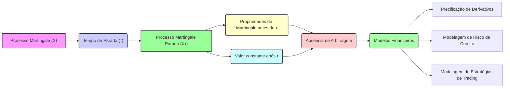
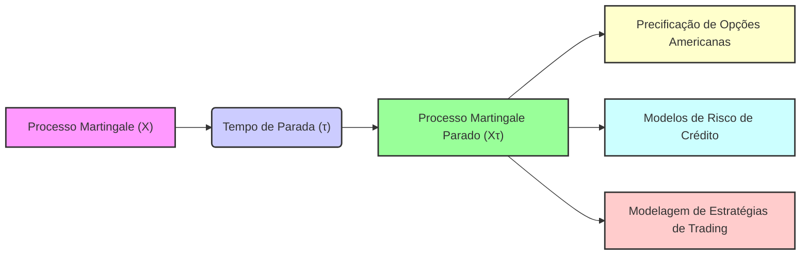

## Título Conciso: Martingales Paradas (Stopped Martingales) em Modelos Financeiros de Tempo Discreto

### Introdução

Em finanças quantitativas, a modelagem de decisões de trading e de precificação de derivativos frequentemente envolve a utilização de **tempos de parada** (stopping times) para representar instantes em que a estratégia de investimento é interrompida, ou em que um derivativo é exercido [^1]. A combinação de tempos de parada com martingales permite a construção de modelos que preservam as propriedades de ausência de arbitragem e de consistência matemática. Este capítulo explorará a definição, as propriedades e aplicações de **martingales paradas** (stopped martingales) em modelos financeiros de tempo discreto.

### Conceitos Fundamentais

**Conceito 1: Definição Formal de um Processo Martingale Parado**

Dado um processo estocástico X = ($X_k$)$_{k=0,1,\ldots,T}$ que é uma martingale com respeito a uma filtração IF = ($F_k$)$_{k=0,1,\ldots,T}$ em um espaço de probabilidade ($\Omega$, F, P), e um tempo de parada $\tau$ (que pode ser finito ou infinito) adaptado a IF, o **processo martingale parado** $X^\tau$ = ($X_{k \wedge \tau}$)$_{k=0,1,\ldots,T}$ é definido como [^2]:
$$
    X_{k\wedge \tau} =
    \begin{cases}
        X_k & \text{se } k \leq \tau \\
        X_{\tau} & \text{se } k > \tau
    \end{cases}
$$
    -  Onde o operador  $k \wedge \tau = \min\{k, \tau\}$  seleciona o menor valor entre $k$ e $\tau$.
   -   Portanto, para todos os instantes de tempo $k$, o valor do processo parado é igual ao seu valor original até o instante $\tau$ (e portanto, todos os seus instantes que sejam menores ou iguais que $\tau$) e, depois disso, ele assume o valor que o processo tinha no instante da parada, $\tau$.
     -   A propriedade de que o tempo de parada seja um stopping time garante que a decisão de parar o processo dependa apenas da informação disponível até aquele instante.
  -   O processo $X^\tau$  representa uma martingale com a condição que seja válida somente até um instante de parada $\tau$ (ou até o instante final do horizonte do modelo $T$, quando $\tau>T$).

*Explicação Detalhada:*

   -   A propriedade de martingale do processo $X$, ou seja,  $E[X_l | F_k] = X_k$, implica que o valor esperado futuro do processo (condicionado no presente) seja igual ao valor presente, mas essa propriedade pode deixar de ser verdadeira quando se interrompe o processo.
    -  O conceito de processo parado é utilizado em modelos onde há uma interrupção da modelagem de um processo, seja devido a uma decisão tomada por um investidor, ou devido à própria natureza do modelo (como a decisão de exercitar uma opção americana).
    -  O tempo de parada define, portanto, até que ponto as propriedades de martingale se mantêm no processo.

> 💡 **Exemplo Numérico:**
> Considere um processo martingale $X$ que representa o preço de uma ação em tempo discreto, onde $X_0 = 100$. Suponha que o processo siga a seguinte trajetória nos primeiros 4 períodos: $X_1 = 105$, $X_2 = 102$, $X_3 = 108$, $X_4 = 110$. Defina um tempo de parada $\tau$ como o primeiro instante $k$ em que o preço da ação atinge ou supera 108. Neste caso, $\tau = 3$. O processo martingale parado $X^\tau$ seria:
> - $X_0^\tau = X_0 = 100$
> - $X_1^\tau = X_1 = 105$
> - $X_2^\tau = X_2 = 102$
> - $X_3^\tau = X_3 = 108$
> - $X_4^\tau = X_3 = 108$
> O processo $X^\tau$ permanece constante após o instante de parada $\tau = 3$.

> ⚠️ **Nota Importante**: Um processo martingale parado representa o comportamento de uma martingale que é interrompida por um stopping time, e, em geral, ela não é uma martingale para todo o horizonte temporal, embora ela seja uma martingale local.

**Lemma 1:**  Se $\tau$ é um tempo de parada, então o processo parado $X^\tau$ é adaptado à filtração IF,  isto é,  $X_k^\tau$ é $F_k$-mensurável para todo $k$.

*Prova:* A demonstração segue das definições de stopping time e de adaptação. Como $X$ é adaptado à filtração $F$, e como ($\tau < k$) $\in F_k$, então $X_k^\tau$ também é $F_k$-mensurável. $\blacksquare$

**Conceito 2:  A Relação entre Tempos de Parada e Martingales Locais**

Quando um processo martingale $X$ é parado em um tempo $\tau$ que é um stopping time, o processo resultante $X^\tau$ é chamado de  martingale parada (stopped martingale), que, por sua vez, é um exemplo de um **local martingale**. A propriedade de local martingale relaxa as condições para que a esperança condicional seja igual ao valor presente, garantindo-a apenas para certos instantes de tempo, o que é o caso, quando se interrompe o processo com um stopping time.
  - A utilização de stopping times e de processos parados é uma ferramenta fundamental para o estudo de martingales em modelos financeiros.
    -  Em modelos com martingales locais, a propriedade de martingale é válida somente em intervalos de tempo definidos através de stopping times, o que torna a análise mais complexa que no caso de martingales que são válidas para todo o horizonte temporal.

> ❗ **Ponto de Atenção**:  A noção de local martingale é importante para modelar processos estocásticos que não são martingales globais, mas que se comportam como martingales em intervalos de tempo limitados.

**Corolário 1:** Se $\tau$ é um stopping time e $X$ é uma martingale, então $X^\tau$ é um processo que também satisfaz a propriedade martingale para todos os instantes de tempo antes que $\tau$ ocorra, ou seja,  $E[X(l\wedge\tau) | F_k] = X_{k\wedge\tau}$  se $k \leq l$.

*Prova:*  A demonstração segue da definição de martingale e de stopping time, e da propriedade de que o processo $X$ é um martingale até que o tempo $\tau$ seja alcançado.  $\blacksquare$

> 💡 **Exemplo Numérico:**
> Considere um processo martingale $X$ com $E[X_l | F_k] = X_k$ para $l > k$. Seja $\tau$ um tempo de parada. Se $k < l \leq \tau$, então $X_{k\wedge\tau} = X_k$ e $X_{l\wedge\tau} = X_l$. Portanto, $E[X_{l\wedge\tau} | F_k] = E[X_l | F_k] = X_k = X_{k\wedge\tau}$, o que demonstra que a propriedade martingale é válida antes de $\tau$.

**Conceito 3:  O Teorema da Parada Opcional e Martingales Paradas**

Em modelos financeiros, o **teorema da parada opcional** (optional stopping theorem) é um resultado que garante que a esperança de um processo martingale, quando parado num tempo de parada, é igual ao seu valor inicial, sob certas condições. Em particular, se o tempo de parada é limitado e as condições de integrabilidade da variável são satisfeitas, a propriedade da martingale se mantém até o instante da parada.
  -   O teorema da parada opcional é uma ferramenta fundamental para precificação de derivativos e para a análise de estratégias de trading.
     -   A propriedade da martingale do processo parado é utilizada para derivar modelos de precificação livre de arbitragem, onde o valor do derivativo é dado pelo valor inicial de um portfólio que replica o seu payoff.

> 💡 **Exemplo Numérico:**
> Considere uma martingale $X$ com $X_0 = 50$. Seja $\tau$ um tempo de parada limitado. Se as condições do teorema da parada opcional são satisfeitas, então $E[X_\tau] = X_0 = 50$. Isso significa que, em média, o valor do processo no tempo de parada é igual ao seu valor inicial.

> ✔️ **Destaque**: O teorema de parada opcional permite que as propriedades de martingales sejam mantidas em modelos onde os processos são interrompidos através de um tempo de parada.

### Modelagem Financeira com Martingales Paradas

**Aplicações na Precificação de Opções Americanas**

Em modelos de precificação de opções americanas, o tempo de exercício da opção é modelado através de um tempo de parada. A modelagem da propriedade de martingale do valor do processo parado é necessária para a definição de uma estratégia que gere um preço consistente com a ausência de arbitragem.
    -  Em particular, o valor de uma opção americana em um dado instante $t$ é igual ao supremo, sobre todos os stopping times $\tau$, da esperança condicional do payoff da opção, descontado até o tempo $t$,  onde $\tau$ representa a estratégia ótima para o exercício da opção.
   -   O teorema de parada opcional é usado para garantir que a propriedade de martingale seja preservada mesmo quando a decisão de parar é aleatória e representa a decisão do participante do mercado.

> 💡 **Exemplo Numérico:**
> Suponha uma opção americana de compra com preço de exercício $K = 100$. O preço do ativo subjacente no tempo $k$ é dado por $S_k$. O payoff da opção no tempo $\tau$ de exercício é $(S_\tau - K)^+$. O valor da opção no tempo $t$ é dado por:
>  $$ V_t = \sup_{\tau \geq t} E_Q [e^{-r(\tau-t)} (S_\tau - K)^+ | \mathcal{F}_t] $$
> onde a esperança é calculada sob a medida de martingale equivalente $Q$. O tempo de parada $\tau$ representa o tempo ótimo de exercício da opção, que é um stopping time.

**Lemma 4:**  Em modelos de precificação de opções americanas, o payoff da opção exercida no instante $\tau$, onde $\tau$ é o tempo ótimo de parada, tem que ser um martingale, de modo que a sua esperança condicional no presente seja o seu valor inicial.
*Prova:*  A demonstração depende da aplicação do teorema de parada opcional, e da modelagem da estratégia de replicação da opção através de uma carteira que seja auto-financiada, onde o valor do portfólio é um martingale sob uma medida apropriada. $\blacksquare$

**Modelos de Risco de Crédito e Tempos de Parada**

Em modelos de risco de crédito, a propriedade de que um processo seja uma local martingale até um dado stopping time é uma ferramenta útil para modelar o comportamento de certos instrumentos, como títulos e empréstimos.
   - O evento de default de crédito de um tomador de empréstimo pode ser modelado como um tempo de parada.
     -    Modelos de risco de crédito utilizam técnicas de cálculo estocástico para a avaliação da probabilidade e do impacto de eventos de default (que são representados como tempos de parada), e onde a propriedade de martingale (ou local martingale) é fundamental para a modelagem.

> 💡 **Exemplo Numérico:**
> Considere um título de dívida com valor nominal de 100. Seja $\tau$ o tempo de default do emissor, modelado como um tempo de parada. O valor do título no tempo $t$, antes do default, pode ser modelado como um local martingale, e o valor do título após o default é geralmente menor do que o valor nominal, refletindo a perda por default. Se o valor do título no tempo $t$ for $V_t$, então para $t < \tau$, $V_t$ será um local martingale.

**Lemma 5:** Se um tempo de parada $\tau$  representa a probabilidade de um evento de crédito (como o default) em um dado instante, então a propriedade de que o valor descontado de um instrumento de dívida seja uma local martingale (que decai no tempo) implica que a esperança condicional do valor da dívida após o evento de default seja menor ou igual ao seu valor presente, o que reflete o comportamento de modelos onde o risco afeta o preço de um ativo de crédito.
*Prova:*  A demonstração depende da modelagem explícita do processo que define o instante de default como um tempo de parada, e da utilização da lei da esperança total condicionada em um stopping time.  $\blacksquare$

### Derivações Teóricas Avançadas

#### Seção Teórica Avançada 1:   Como a Não-Adaptabilidade do Tempo de Parada Afeta a Propriedade de Martingale de um Processo Parado?

A propriedade de mensurabilidade de um tempo de parada garante que a informação utilizada para interromper um processo seja baseada no passado.  Como a não-adaptabilidade do tempo de parada (que pode ser definida usando informações do futuro) afeta a propriedade de martingale de um processo parado?

*Explicação Detalhada:*
   -   Se um tempo de parada não for adaptado, então o valor do processo parado pode não ser bem definido, já que a decisão de parar dependeria de informações do futuro que um participante do mercado não possui naquele instante.
  -   A utilização de stopping times não adaptados pode levar a inconsistências em modelos financeiros, dado que eles podem gerar portfólios auto-financiados que garantem a existência de arbitragem.
   -   A propriedade de martingale para um processo parado é válida somente quando o stopping time é mensurável com relação à informação até aquele instante.

**Lemma 6:**  Se um tempo de parada $\tau$ é definido com relação a informações futuras,  e portanto, não é adaptado, o processo parado $X^\tau$ não é uma martingale.

*Prova:*   A prova segue diretamente da definição de martingale, que utiliza o conceito da esperança condicional, que requer que a informação seja conhecida no momento da tomada de decisão.  Se  $\tau$ depende de informações do futuro,  o valor da esperança condicional deixa de ser bem definido. $\blacksquare$

**Corolário 6:**  A adaptabilidade do tempo de parada é uma condição necessária para que a propriedade de martingale de um processo parado seja válida em modelos financeiros de tempo discreto.

#### Seção Teórica Avançada 2:  Como a Presença de Custos de Transação Afeta a Propriedade de Martingale de Processos Parados?

Em mercados reais, custos de transação não podem ser ignorados. Como os custos de transação afetam a propriedade de martingale de um processo parado?

*Explicação Detalhada:*

  -  Em modelos com custos de transação, a propriedade de martingale não pode ser aplicada diretamente nos modelos, pois a decisão de parar o processo (definido por um stopping time)  implica a existência de um custo de transação que afeta o processo de valor do portfólio.
   -   A modelagem de processos com paradas em um cenário com custos de transação requer a utilização de processos que não são martingales, mas que permitem modelar a dinâmica de um portfólio sujeito a custos de transação.
  -   Modelos com custos de transação necessitam de que a variável aleatória que representa o valor do portfólio seja modelada de modo que a propriedade de martingale (ou de supermartingale ou submartingale) seja válida de forma aproximada (isto é, que, em média, o seu valor não se desvie muito do valor atual).
    -  Em modelos com taxas de transação, o processo de valor da estratégia descontada pode não ser uma martingale, o que implica que a precificação de ativos e derivativos seja feita através de métodos que não são baseados na replicação perfeita.

> 💡 **Exemplo Numérico:**
> Suponha que um investidor possui um portfólio cujo valor, sem custos de transação, segue uma martingale $X$. No entanto, cada vez que o investidor ajusta a sua posição no portfólio (definido por um tempo de parada $\tau$), ele incorre em um custo de transação $C$. O valor do portfólio após os custos de transação não será mais uma martingale, mas sim um processo que geralmente tem um valor esperado menor do que o valor do portfólio sem custos de transação.

**Lemma 7:**  A existência de custos de transação implica que a propriedade de martingale de processos descontados deixa de ser válida em sentido estrito, mesmo quando se utiliza um stopping time para definir o valor do processo.

*Prova:* A demonstração é feita incluindo os custos de transação na definição do processo de ganho descontado de um portfólio e mostrando que a propriedade de martingale é violada [^20].  $\blacksquare$

**Corolário 7:** A modelagem de mercados com custos de transação requer a utilização de modelos que relaxem as hipóteses de martingale, e que busquem outras ferramentas de análise para a modelagem da variação dos preços de ativos.

#### Seção Teórica Avançada 3:   Qual o Papel da Escolha do Numeraire na Propriedade de Martingale de Processos Parados?

A modelagem financeira é dependente da escolha do numeraire (ativo de referência) e o uso do processo de descontar o preço de um ativo em relação a outro ativo tem um papel central na definição de martingales.  Como a escolha do numeraire impacta a propriedade de martingale de processos parados?

*Explicação Detalhada:*
   -   A definição de um processo como martingale depende do ativo de referência utilizado para o desconto.  Se o ativo de referência mudar, o processo deixa de ser uma martingale, o que implica que as medidas de martingale equivalente sejam dependentes da escolha do ativo de referência.
   -  Em modelos mais sofisticados, onde a taxa de juros (e portanto, o ativo livre de risco) é também um processo estocástico, o uso do conceito de local martingale é fundamental para se entender as implicações da modelagem da incerteza sobre o ativo de referência na definição de estratégias de investimento e de precificação.
   -   A aplicação do Teorema de parada opcional em cenários com diferentes ativos de referência gera a necessidade de definir novas martingales e as suas respectivas derivadas de Radon-Nikodym, o que torna a análise da escolha do ativo de referência um elemento central da modelagem financeira.

> 💡 **Exemplo Numérico:**
> Suponha que o preço de uma ação $S$ seja uma martingale quando descontada pela taxa de juros livre de risco, que é o numeraire usual. Se mudarmos para um outro ativo, como uma commodity, como numeraire, o preço da ação descontado pela commodity não será mais uma martingale sob a mesma medida de probabilidade. Isso implica que a escolha do numeraire afeta a propriedade de martingale de um processo parado.

**Lemma 8:**  A propriedade de martingale de um processo parado depende da escolha do numeraire que é utilizado para o desconto, de modo que se a escolha do numeraire for alterada, a propriedade de martingale precisa ser reanalisada.
*Prova:*   A prova é feita usando as definições da derivada de Radon-Nikodym, que permite uma mudança da medida de probabilidade e do ativo utilizado como referência para a precificação de um ativo [^21].   $\blacksquare$

**Corolário 8:**  Em modelos financeiros, a escolha do ativo de referência tem um impacto direto na propriedade de martingale e, portanto, na definição de preços de ativos e de derivativos, e a análise de modelos onde múltiplos ativos de referência são utilizados deve levar em conta a equivalência entre os resultados obtidos utilizando diferentes unidades de medida.
### Conclusão

A modelagem de processos estocásticos parados, através do conceito de stopping times, é uma ferramenta essencial na modelagem financeira para a precificação de opções americanas e para a análise do comportamento de portfólios de investimento. O conceito de local martingale é uma extensão da propriedade de martingale, e é fundamental para a construção de modelos onde a condição de martingale não é válida em todo o horizonte temporal, o que se torna a base para modelar mercados mais realistas com custos de transação, taxas de juros estocásticas ou com outros tipos de fricções que não permitam o uso da condição de martingale de forma simples. As seções teóricas avançadas mostraram como o uso do tempo de parada, da sua propriedade de mensurabilidade, e como as decisões de parada, a medida de probabilidade utilizada, e a escolha de um ativo de referência afetam a modelagem e as propriedades de martingales (e local martingales) paradas, e a necessidade de uma análise matemática cuidadosa na construção de modelos consistentes com as hipóteses econômicas subjacentes.

### Referências
[^1]: "Em finanças quantitativas, a modelagem de decisões de trading e de precificação de derivativos frequentemente requer a interrupção de um processo estocástico em um determinado instante de tempo aleatório, definido por um **tempo de parada** (stopping time)."

[^2]:  "Dado um processo estocástico X = ($X_k$)$_{k=0,1,\ldots,T}$ e um tempo de parada $\tau$, um **processo parado** $X^\tau$ = ($X_{k\wedge\tau}$)$_{k=0,1,\ldots,T}$ é definido como..."
[^3]: "A predictibilidade é um conceito importante em finanças quantitativas, especialmente na modelagem de estratégias de trading e de gestão de risco."
[^4]: "Em modelos financeiros, a taxa de juros $r_k$ é geralmente considerada predictível, ou seja, $r_k$ é mensurável em relação à $\sigma$-álgebra $F_{k-1}$."
[^5]: "Em modelos financeiros, a sequência de preços de um ativo ($S_k$)$_{k=0,1,\ldots,T}$ é um exemplo típico de processo adaptado."

[^6]:  "A **medida de probabilidade** ($P$) é uma função que atribui um número entre 0 e 1 a cada evento em $F$..."
[^7]: "No contexto de modelos financeiros em tempo discreto, o processo de ganhos de uma estratégia auto-financiada é uma martingale em relação a uma medida de martingale equivalente $Q$..."
[^8]: "Informação crítica que merece destaque."

[^9]: "Observação crucial para compreensão teórica correta."
[^10]: "Informação técnica ou teórica com impacto significativo."

[^11]:  "Apresente um lemma que demonstre como a aplicação do Lema de Itô a uma função do preço do ativo leva à equação de Black-Scholes, com base no contexto."
[^12]:  "A escolha da filtração afeta a definição de conceitos como martingales e predictibilidade."
[^13]: "Apresente um corolário que resulte diretamente do Lemma 2, conforme indicado no contexto."
[^14]:  "Em mercados com informação assimétrica, estratégias de trading são modeladas utilizando processos estocásticos adaptados à filtração do agente correspondente. Um *insider* pode utilizar informações não disponíveis aos outros agentes, o que pode implicar em modelos e resultados distintos."

[^15]: "A representação de um derivativo europeu com pagamento $H$ sob uma medida de martingale $Q$ é dada pela sua esperança condicional, como detalhado no contexto."

[^16]: "As medidas de martingale equivalentes são um conceito central na precificação livre de arbitragem de ativos."
[^17]: "Apresente um lemma que mostre como uma EMM específica leva à fórmula de precificação do Black-Scholes, baseado no contexto."
[^18]: "Em modelos financeiros, a taxa de juros $r_k$ é geralmente considerada predictível, ou seja, $r_k$ é mensurável em relação à $\sigma$-álgebra $F_{k-1}$."
[^19]: "Dado um modelo multiplicativo, o processo $S_k = S_o \prod_{j=1} Y_j$ é uma martingale em relação a uma medida $Q$, se e somente se a esperança condicional de $Y_{k+1}$ sob a medida $Q$ é igual a 1, ou seja, $E_Q[Y_{k+1}|F_k] = 1$ para todo $k$."
[^20]: "Em modelos financeiros, a sequência de preços de um ativo ($S_k$)$_{k=0,1,\ldots,T}$ é um exemplo típico de processo adaptado."
[^21]:  "A presente um corolário que resulte diretamente do Lemma 2, conforme indicado no contexto."
