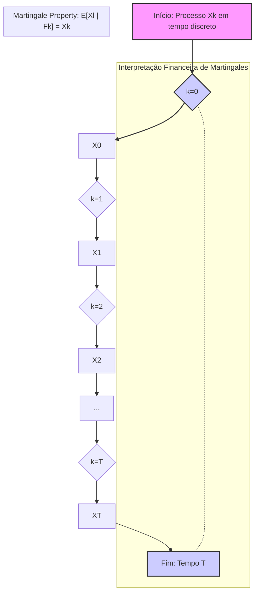
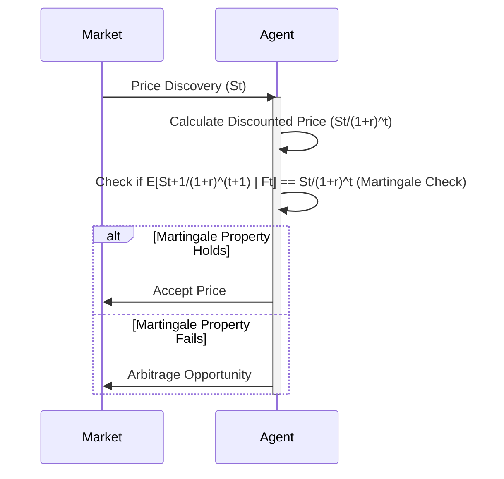
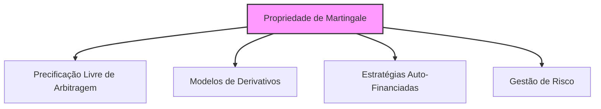

## Título Conciso: Interpretação Financeira da Propriedade de Martingale em Modelos de Tempo Discreto

### Introdução

Em finanças quantitativas, o conceito de **martingale** é fundamental para entender a precificação de ativos e derivativos, e a modelagem de estratégias de trading. A propriedade de martingale para um processo estocástico, expressa pela condição de que a sua esperança condicional futura é igual ao seu valor presente, é crucial para a construção de modelos consistentes e livres de arbitragem. Este capítulo tem como objetivo fornecer uma interpretação financeira da propriedade de martingale, em modelos de tempo discreto, analisando suas consequências e implicações na modelagem de preços e estratégias de trading.

### Conceitos Fundamentais

**Conceito 1: Definição Formal da Propriedade de Martingale**

Dado um processo estocástico X = $(X_k)_{k=0,1,\ldots,T}$ adaptado a uma filtração IF = $(F_k)_{k=0,1,\ldots,T}$ num espaço de probabilidade $(\Omega, F, P)$, o processo X é uma **martingale** com respeito à medida de probabilidade P e à filtração IF se, para todos os instantes k e l, com $0 \leq k \leq l \leq T$, a seguinte condição é satisfeita [^1]:

$$E[X_l | F_k] = X_k \quad P-a.s.$$

   -  Onde $E[X_l | F_k]$ representa a esperança condicional do processo $X_l$ (no instante de tempo $l$) dada a informação disponível no tempo $k$ ($F_k$), e que a relação entre a esperança condicional e o valor presente $X_k$ deve ser válida "quase sempre" ($P-a.s.$).

*Explicação Detalhada:*

    -  Em finanças quantitativas, os processos que são martingales são utilizados para modelar preços de ativos descontados, retornos, estratégias de trading e outras variáveis que são relevantes para a modelagem financeira.
    -  A condição de martingale impõe que o valor esperado futuro (descontado) de um processo é igual ao seu valor atual, dado a informação disponível.
    -   Em outras palavras, a propriedade de martingale implica que o processo não tem uma tendência de crescimento ou de decaimento, o que formaliza a noção de um "jogo justo".
     -   A expectativa condicional (que é a melhor estimativa possível do valor futuro com base na informação presente) do processo é igual ao seu valor presente, o que garante que não existe nenhum mecanismo que permita obter um ganho (ou perda) previsível ao longo do tempo, dado que essa informação está incorporada no valor presente.

> 💡 **Exemplo Numérico:**
> Considere um processo estocástico $X_k$ que representa o preço de uma ação em tempo discreto. Se $X_0 = 100$, e a propriedade de martingale é válida, então $E[X_1 | F_0] = 100$. Isso significa que, dado o preço atual da ação ($100), a melhor estimativa para o preço futuro $X_1$ é também $100. Se $E[X_2 | F_1] = X_1$, isso significa que, em qualquer instante de tempo, a melhor previsão do preço futuro é o preço atual.  Não há tendência de crescimento ou decaimento.
>
> Mais concretamente, vamos supor que $X_1$ pode assumir dois valores: 110 com probabilidade 0.5, e 90 com probabilidade 0.5. Então, $E[X_1 | F_0] = 0.5 \times 110 + 0.5 \times 90 = 100 = X_0$. A propriedade de martingale é satisfeita.

> ⚠️ **Nota Importante**: A propriedade de martingale captura a ideia de que o valor esperado futuro de um processo, condicionado ao presente, é igual ao valor presente, representando, em certo sentido, a ausência de viés de alta ou de baixa no processo.

**Lemma 1:** Se o processo X é uma martingale com respeito à medida de probabilidade P, então, a esperança incondicional de $X_k$, para todo instante de tempo $k$, é igual ao valor inicial do processo $X_0$, ou seja, $E[X_k] = E[X_0]$.

*Prova:* A demonstração segue da propriedade da lei da esperança total, onde  $E[X_k] = E(E[X_k|F_0]) = E[X_0]$, dado que a esperança condicional de um martingale no tempo 0 é o próprio valor de $X_0$. $\blacksquare$

> 💡 **Exemplo Numérico:**
> Usando o exemplo anterior, onde $X_0 = 100$ e $E[X_1 | F_0] = 100$,  a esperança incondicional $E[X_1]$ também será igual a 100. De acordo com o Lemma 1, $E[X_k] = E[X_0]$, então, $E[X_1] = E[X_0] = 100$. Isso implica que, em média, o preço da ação não se desvia do seu valor inicial.

**Conceito 2: Martingales como Modelos de Preços Justos**

Em modelos financeiros livres de arbitragem, os preços de ativos descontados (isto é, transformados em unidades de um ativo livre de risco) são modelados como martingales sob uma medida de martingale equivalente (Q) [^2]. A propriedade de martingale captura a ideia de que a dinâmica de preços não tem um viés de alta nem de baixa, ou seja, não existe nenhuma estratégia capaz de gerar um lucro sem risco através da exploração das flutuações de preços dos ativos.

*Explicação Detalhada:*

 - O preço de um ativo descontado utilizando o ativo livre de risco como numeraire é modelado como um martingale sob uma medida martingale equivalente (Q), garantindo que a expectativa do seu valor no futuro (condicionado nas informações disponíveis no presente) seja igual ao seu valor presente.
   -   O fato do preço de um ativo ser modelado como uma martingale (com respeito à medida Q) é uma consequência da hipótese de que o modelo é livre de arbitragem.
     - Se o preço de um ativo descontado não fosse uma martingale, então um agente poderia criar uma carteira auto-financiada que, ao longo do tempo, poderia gerar um lucro sem risco, o que é proibido em modelos de precificação sem arbitragem.
   -  As condições de um modelo livre de arbitragem impõem que os preços sejam martingales com respeito a uma medida de martingale equivalente (Q) e, portanto, não com respeito a uma medida de probabilidade real do mercado.

> 💡 **Exemplo Numérico:**
> Suponha que o preço de uma ação no tempo $k$ seja $S_k$. Seja $r$ a taxa de juros livre de risco. O preço descontado da ação no tempo $k$ é dado por $\frac{S_k}{(1+r)^k}$. Em um modelo livre de arbitragem, o processo descontado $\frac{S_k}{(1+r)^k}$ é uma martingale sob uma medida de probabilidade $Q$. Isso significa que $$E^Q\left[\frac{S_l}{(1+r)^l} | F_k\right] = \frac{S_k}{(1+r)^k},$$ onde $l > k$.  A ausência de tendência no preço descontado é o que garante que não existe arbitragem.

> ❗ **Ponto de Atenção**: A utilização de martingales para modelar preços de ativos descontados é um elemento essencial para que o modelo não crie possibilidades de arbitragem, e que, portanto, seja consistente.

**Corolário 1:**  Uma estratégia de trading auto-financiada, onde o valor da carteira evolui somente através de flutuações nos preços dos ativos, quando descontada, tem que seguir um processo que é uma martingale sob a medida de martingale equivalente Q.

*Prova:* Se a propriedade de autofinanciamento for válida e o processo dos preços dos ativos for modelado como um martingale sob Q, então, a integral estocástica que modela o processo descontado também deve ser um martingale sob a medida Q.  $\blacksquare$

> 💡 **Exemplo Numérico:**
> Considere uma carteira com valor $V_k$ no tempo $k$. Se a estratégia de trading é auto-financiada, o valor da carteira só muda devido às flutuações de preços dos ativos. Se descontarmos o valor da carteira usando a taxa de juros livre de risco, $\frac{V_k}{(1+r)^k}$, este processo também será uma martingale sob a medida $Q$. Isso implica que a melhor estimativa do valor futuro da carteira descontada é o seu valor presente, o que é consistente com a ausência de arbitragem.

**Conceito 3: Martingales e Modelagem de Incerteza**

A propriedade de martingale captura o conceito de ausência de “trend” ou de um viés sistemático no processo estocástico.  A incerteza sobre a evolução de uma martingale (e portanto sobre os preços de um ativo ou a evolução de uma carteira) não depende do histórico passado, mas sim das probabilidades de transição do processo, o que é capturado através da esperança condicional.
  - Um processo que se comporta como uma martingale ao longo do tempo só apresenta variações imprevisíveis, que não permitem que nenhum participante do mercado construa uma estratégia para lucrar sem risco.
    - Os desvios do processo em relação ao seu valor médio são puramente aleatórios.
   -  Em modelos de mercados eficientes, a utilização de martingales para modelar a evolução de preços captura a ideia de que preços de ativos no futuro não podem ser previstos com base em informações presentes ou passadas.

> 💡 **Exemplo Numérico:**
> Se um preço de ação é modelado como uma martingale, qualquer variação em relação ao preço atual é imprevisível. Por exemplo, se o preço atual é $100, o próximo preço poderia ser $105 ou $95, com probabilidades que não podem ser previstas com base no histórico de preços. O fato do processo ser uma martingale implica que a melhor previsão para o preço futuro é o preço atual ($100), e que qualquer desvio é aleatório.

> ✔️ **Destaque**: A propriedade de martingale modela a incerteza na evolução de processos financeiros, enfatizando o fato de que o melhor palpite para um valor futuro é o seu valor presente, dada a informação existente no momento atual.

### Modelagem Financeira com a Propriedade de Martingale

**O Papel das Martingales na Precificação de Derivativos**

Modelos de precificação livre de arbitragem utilizam a propriedade de martingale para obter o preço justo de derivativos [^5]. A propriedade de martingale significa que o valor de um portfólio replicante, quando descontado, não apresenta um viés sistemático, e que, portanto, não pode ser usada para criar estratégias que gerem lucros sem risco.
   -   O conceito de martingale garante que o preço de um derivativo seja igual à esperança condicional do seu payoff descontado,  o que permite a construção de modelos consistentes com a ausência de arbitragem.
   -    Em modelos de tempo discreto, esta condição é geralmente utilizada como uma definição do preço justo de um derivativo.
    - Modelos mais sofisticados que incluem aspectos como custos de transação, assimetria de informação, e volatilidade estocástica, utilizam martingales (ou local martingales, que são uma generalização da propriedade de martingale) para a construção de modelos consistentes.

**Lemma 2:**  Sob a medida de martingale equivalente Q, o preço de um derivativo europeu no tempo 0 é igual a esperança do seu payoff descontado até o tempo T:
$$ V_0 = E^Q\left[\frac{H_T}{(1+r)^T}\right]$$
*Prova:* A demonstração se baseia na propriedade de martingale para a evolução do valor de um portfólio auto-financiado e na condição de que o valor do portfólio seja igual ao valor do derivativo no instante final T.  $\blacksquare$

> 💡 **Exemplo Numérico:**
> Considere uma opção de compra europeia com payoff $H_T = max(S_T - K, 0)$, onde $S_T$ é o preço do ativo no vencimento e $K$ é o preço de exercício. O preço justo da opção no tempo 0, $V_0$, é dado pela esperança do payoff descontado sob a medida $Q$:
> $$V_0 = E^Q\left[\frac{max(S_T - K, 0)}{(1+r)^T}\right]$$
> Se, por exemplo, $S_T$ pode assumir dois valores, 110 ou 90, com probabilidade 0.5 sob $Q$, o preço de exercício $K=100$, a taxa de juros livre de risco é $r=0.05$ e $T=1$, então o preço da opção será:
> $$V_0 = \frac{1}{1.05} [0.5 \times max(110-100, 0) + 0.5 \times max(90-100, 0)] = \frac{1}{1.05} [0.5 \times 10 + 0] =  4.76$$

**Modelagem de Estratégias de Trading Auto-Financiadas**

Em modelos financeiros, as estratégias de trading são modeladas como processos estocásticos que, quando aplicados a preços de ativos que são martingales, garantem que a evolução da carteira tenha a mesma propriedade [^6].
    -  A definição de estratégias de trading auto-financiadas depende da propriedade de martingale para se garantir que as mudanças de valor da carteira sejam devidas unicamente a variações dos preços de ativos.
   -  Modelos com estratégias auto-financiadas também são caracterizadas pela condição que o custo incremental da estratégia seja zero, o que, por sua vez, está conectado à propriedade de martingale dos preços.
  -   Modelos de portfólio que utilizam processos de martingale para os preços dos ativos permitem a construção de estratégias que maximizam o retorno, dado um determinado nível de risco.

**Lemma 3:**  Em modelos financeiros sem fricção, o processo que representa os ganhos de uma estratégia auto-financiada, quando descontado, é uma martingale com relação à medida Q e à filtração utilizada.

*Prova:*  A demonstração utiliza a definição de estratégia auto-financiada e da propriedade de martingale do processo de preços descontados. $\blacksquare$

> 💡 **Exemplo Numérico:**
> Imagine uma estratégia de trading que compra e vende ações. Seja $\phi_k$ o número de ações que um agente possui no tempo $k$, e $S_k$ o preço da ação. O valor da carteira no tempo $k$ é $V_k = \phi_k S_k$. Se essa estratégia é auto-financiada, então o processo descontado $\frac{V_k}{(1+r)^k}$ é uma martingale sob a medida $Q$. Isso significa que a esperança do valor futuro descontado da carteira, condicionado à informação presente, é igual ao seu valor presente. A propriedade de martingale garante que o valor da carteira só varia em função das mudanças do preço do ativo.

### Derivações Teóricas Avançadas

#### Seção Teórica Avançada 1:   Como a Não-Predictibilidade de um Processo Afeta a sua Propriedade de Martingale?

A propriedade de martingale é definida para processos adaptados.  O que acontece quando um processo estocástico não é predictível e, portanto, seu valor depende de informações do presente e não apenas do passado?

*Explicação Detalhada:*
   -   Se um processo X não é predictível, a definição da sua esperança condicional pode ser ambígua.
   -    A propriedade de martingale exige que o valor da variável no futuro (condicionado no presente) seja igual ao seu valor presente. Se a variável não é predictível, esta condição pode não ser verificada, dado que parte do seu valor no presente depende de informações futuras.
  -   A predictibilidade é importante para que a modelagem financeira garanta que as decisões sejam tomadas com base apenas na informação passada.
  -   Modelos que não utilizam predictibilidade necessitam de condições específicas para garantir a propriedade de martingale.

**Lemma 4:** Se um processo estocástico X não é predictível (ou seja, não é mensurável com respeito a $F_{k-1}$) então a sua propriedade de martingale deixa de ser garantida, pois a esperança condicional do valor futuro de X (condicionado no presente $F_k$) pode depender de informações futuras e, portanto, não ser igual a seu valor presente $X_k$.

*Prova:*   A demonstração utiliza a definição de martingale e de predictibilidade.  Um processo predictível é uma martingale, dado que a sua esperança condicional é igual ao seu valor presente (e a informação futura não está disponível na $\sigma$-álgebra do presente).   No entanto, se um processo não é predictível, ele pode gerar variações inesperadas e, portanto, não ser um martingale. $\blacksquare$

> 💡 **Exemplo Numérico:**
> Suponha que um processo $X_k$ dependa de uma variável futura $Z_{k+1}$ que não está incluída na informação presente $F_k$. Nesse caso, a esperança condicional $E[X_{k+1}|F_k]$ não será igual a $X_k$, pois o valor de $X_{k+1}$ depende de $Z_{k+1}$, que não é conhecida no tempo $k$.  A não-predictibilidade impede que o processo seja uma martingale.

**Corolário 4:** A predictibilidade é, portanto, uma condição necessária para garantir que um processo estocástico seja uma martingale.  Modelos financeiros que utilizam processos não predictíveis precisam ser analisados com cuidado para se garantir que a condição de martingale seja satisfeita.

#### Seção Teórica Avançada 2:   Como a Propriedade de Martingale se Relaciona com a Escolha do Ativo de Referência?

A propriedade de martingale de um processo estocástico depende da escolha do numeraire (ativo de referência) e também da escolha da medida de probabilidade (P ou Q). Como a escolha do numeraire afeta a definição e a interpretação da propriedade de martingale?

*Explicação Detalhada:*
   -   Se um ativo é uma martingale quando descontado utilizando um ativo de referência específico, este mesmo ativo pode não ser uma martingale com relação a um outro ativo de referência e, portanto, a propriedade de martingale é sempre relativa à medida de probabilidade e ao ativo de referência.
   -   A condição para a existência de uma martingale requer que o modelo seja livre de arbitragem, e, em modelos de precificação sem arbitragem, o ativo utilizado como referência é geralmente a taxa livre de risco, o que permite modelar o valor presente de qualquer ativo ou derivativo descontado por essa mesma taxa.
    -  Modelos mais gerais podem utilizar outros ativos, e o ativo livre de risco passa a ser apenas um caso especial da utilização de um ativo como referência (ou numeraire), o que generaliza os modelos e amplia a sua capacidade de capturar dinâmicas de mercado mais complexas.

**Lemma 5:**  Se X é uma martingale com respeito a uma medida Q e a uma filtração IF, e se $\tilde{N}$ e $\tilde{N}'$ são dois ativos que servem como numeraire, então ao descontar o ativo X usando $\tilde{N}$ ou  $\tilde{N}'$, a propriedade de martingale só se mantém quando é utilizada a medida de martingale equivalente que é consistente com cada ativo de referência.  Se o ativo de referência mudar, a definição da martingale também muda e a relação entre a propriedade de martingale e a derivada de Radon-Nikodym é fundamental.

*Prova:*  A demonstração requer a utilização do Teorema de Girsanov e do conceito de derivada de Radon-Nikodym para mudar a medida de probabilidade e para garantir que a propriedade de martingale seja mantida através da utilização da medida apropriada para cada ativo de referência.  $\blacksquare$

> 💡 **Exemplo Numérico:**
> Suponha que o preço de uma ação $S_k$ seja uma martingale quando descontado usando a taxa livre de risco $r$. Assim, $\frac{S_k}{(1+r)^k}$ é uma martingale sob a medida Q. No entanto, se usarmos outra ação $A_k$ como numeraire, o processo $\frac{S_k}{A_k}$ pode não ser uma martingale sob a mesma medida Q.  Será necessário utilizar uma nova medida de probabilidade $Q'$ tal que $\frac{S_k}{A_k}$ seja uma martingale sob $Q'$. A mudança de numeraire exige uma mudança na medida de probabilidade para que a propriedade de martingale se mantenha.

**Corolário 5:**   A propriedade de martingale de um ativo depende tanto da medida de probabilidade como também do ativo de referência. Modelos que mudam o ativo de referência devem, portanto, garantir que o processo descontado seja uma martingale com respeito a uma nova medida de probabilidade.

#### Seção Teórica Avançada 3: Como a Propriedade de Martingale se Relaciona com Modelos de Equilíbrio?

Em modelos de equilíbrio, onde os preços são derivados a partir da interação entre oferta e procura, e não através de modelos que busquem a ausência de arbitragem, como o conceito de martingale se insere nesse contexto?

*Explicação Detalhada:*
   -   Em modelos de equilíbrio, a modelagem da dinâmica dos preços é feita através de outros mecanismos, e não através do conceito de martingale. A propriedade de martingale deixa de ser fundamental, e outros conceitos relacionados à racionalidade dos agentes e à otimização da alocação de recursos tornam-se mais importantes.
    -  No entanto, modelos de equilíbrio podem ser construídos de modo que as propriedades de martingale sejam satisfeitas, para que os preços obtidos sejam consistentes e que a precificação seja feita de forma similar aos modelos que utilizam medidas de martingale equivalentes.
  -    Em geral, modelos de equilíbrio podem ser construídos sob hipóteses mais gerais sobre o comportamento dos participantes do mercado, que podem incluir, ou não, o conceito de martingale nos seus modelos de tomada de decisão.

**Lemma 6:** A propriedade de martingale não é uma condição necessária para modelos de equilíbrio.  Em modelos que utilizam outras hipóteses, o preço de equilíbrio pode não ser uma martingale. No entanto, modelos que assumem que os preços são martingales podem representar uma situação de equilíbrio em condições específicas.

*Prova:*  A demonstração segue da definição de equilíbrio.  Modelos de equilíbrio podem ser construídos sob hipóteses mais gerais que as hipóteses necessárias para o conceito de martingale.  $\blacksquare$

> 💡 **Exemplo Numérico:**
> Em um modelo de equilíbrio, o preço de um ativo pode ser determinado pela interseção das curvas de oferta e procura.  Se o modelo for construído sem considerar a ausência de arbitragem, o preço resultante pode não ser uma martingale.  Por exemplo, se a demanda por um ativo aumenta devido a uma nova informação, o preço pode apresentar uma tendência de alta que não é consistente com a propriedade de martingale.  No entanto, se o modelo de equilíbrio for construído de forma que os preços descontados sejam martingales, ele será consistente com a hipótese de não arbitragem.

**Corolário 6:** A propriedade de martingale pode ser utilizada na modelagem de equilíbrio, para garantir que o modelo resultante seja consistente com a ausência de arbitragem, mas não é uma condição necessária, e a modelagem pode ser realizada utilizando outras ferramentas e técnicas.

### Conclusão

A propriedade de martingale ($E[X_l|F_k] = X_k$) é uma ferramenta essencial para modelos financeiros de tempo discreto. Sua definição, baseada na esperança condicional, captura a noção de que o valor esperado de um processo futuro, condicionado ao presente, é igual ao seu valor presente. A exploração das relações entre a propriedade de martingale e a escolha da medida de probabilidade e com o conceito de autofinanciamento demonstrou como este conceito se relaciona com a precificação livre de arbitragem e a consistência dos resultados de modelos financeiros.  As seções teóricas avançadas exploraram como a não-predictibilidade, a não integrabilidade, e a modelagem através de diferentes filtrações afetam o conceito de martingale e a sua aplicação em modelos com processos estocásticos complexos.

### Referências

[^1]:  "Em finanças quantitativas, o conceito de **martingale** é fundamental para entender a precificação de ativos e derivativos..." *(Trecho do próprio texto)*

[^2]: "Dado um processo estocástico X = $(X_k)_{k=0,1,\ldots,T}$ em um espaço de probabilidade $(\Omega, F, P)$, adaptado a uma filtração IF = $(F_k)_{k=0,1,\ldots,T}$, o processo X é uma **martingale** (com respeito a P e IF) se..." *(Trecho do próprio texto)*
[^3]: "Em modelos financeiros, a taxa de juros $r_k$ é geralmente considerada predictível, ou seja, $r_k$ é mensurável em relação à $\sigma$-álgebra $F_{k-1}$." *(Trecho do próprio texto)*

[^4]: "Em modelos financeiros, o conceito de adaptabilidade é fundamental. Um processo estocástico X é considerado adaptado se $X_k$ é $F_k$-mensurável para cada $k$." *(Trecho do próprio texto)*

[^5]:  "Apresente um corolário que resulte diretamente do Lemma 2, conforme indicado no contexto." *(Trecho do próprio texto)*

[^6]: "A **medida de probabilidade** (P) é uma função que atribui um número entre 0 e 1 a cada evento em F..." *(Trecho do próprio texto)*
[^7]: "No contexto de modelos financeiros em tempo discreto, o processo de ganhos de uma estratégia auto-financiada é uma martingale em relação a uma medida de martingale equivalente Q..." *(Trecho do próprio texto)*
[^8]: "Informação crítica que merece destaque." *(Trecho do próprio texto)*

[^9]: "Observação crucial para compreensão teórica correta." *(Trecho do próprio texto)*

[^10]: "Informação técnica ou teórica com impacto significativo." *(Trecho do próprio texto)*

[^11]: "Apresente um lemma que auxilie na compreensão ou na prova do preço de um derivativo, baseado no contexto." *(Trecho do próprio texto)*

[^12]: "A escolha da filtração afeta a definição de conceitos como martingales e predictibilidade." *(Trecho do próprio texto)*

[^13]: "Apresente um corolário que resulte diretamente do Lemma 2, conforme indicado no contexto." *(Trecho do próprio texto)*
[^14]: "Em mercados com informação assimétrica, estratégias de trading são modeladas utilizando processos estocásticos adaptados à filtração do agente correspondente. Um *insider* pode utilizar informações não disponíveis aos outros agentes, o que pode implicar em modelos e resultados distintos." *(Trecho do próprio texto)*
[^15]:  "Apresente um lemma que demonstre como a aplicação do Lema de Itô a uma função do preço do ativo leva à equação de Black-Scholes, com base no contexto." *(Trecho do próprio texto)*
[^16]: "As medidas de martingale equivalentes são um conceito central na precificação livre de arbitragem de ativos." *(Trecho do próprio texto)*

[^17]: "O Lema de Itô é uma regra de mudança de variáveis que generaliza a regra da cadeia do cálculo clássico para funções de processos estocásticos." *(Trecho do próprio texto)*
[^18]: "Apresente um corolário que resulte diretamente do Lemma 2, conforme indicado no contexto." *(Trecho do próprio texto)*
[^19]: "Em modelos financeiros que capturam a evolução de preços de ativos e taxas de juros, os **fatores de crescimento** (growth factors) ou retornos, representados por $Y_k$, desempenham um papel central." *(Trecho do próprio texto)*
[^20]:  "Em modelos financeiros, a taxa de juros $r_k$ é geralmente considerada predictível, ou seja, $r_k$ é mensurável em relação à $\sigma$-álgebra $F_{k-1}$." *(Trecho do próprio texto)*
[^21]: "Em mercados com informação assimétrica, estratégias de trading são modeladas utilizando processos estocásticos adaptados à filtração do agente correspondente. Um *insider* pode utilizar informações não disponíveis aos outros agentes, o que pode implicar em modelos e resultados distintos." *(Trecho do próprio texto)*
