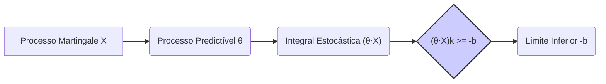
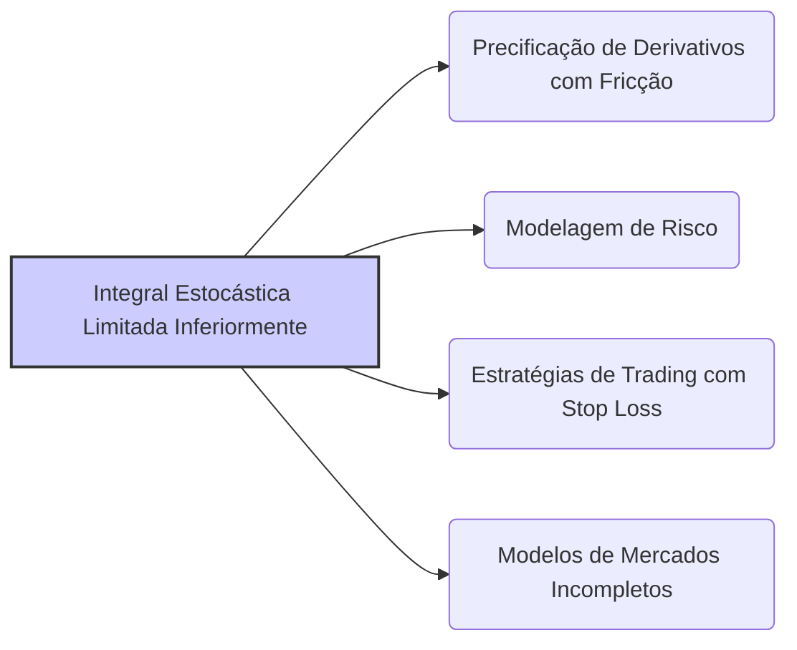

## Título Conciso: Integral Estocástica Limitada Inferiormente de Martingales em Modelos Financeiros

### Introdução

Em finanças quantitativas, a análise de estratégias de trading e a precificação de derivativos muitas vezes envolve o uso de **integrais estocásticas** de processos martingales. A condição de que uma integral estocástica seja **limitada inferiormente** (bounded below) garante que o processo, embora possa apresentar flutuações aleatórias, nunca assume valores abaixo de uma certa cota [^1]. Essa condição é fundamental para garantir a existência de modelos consistentes e para a aplicação de resultados que dependem do conceito de martingale, em particular para estratégias de trading que são auto-financiadas. Este capítulo explora a definição, a importância e as implicações da integral estocástica limitada inferiormente em modelos financeiros.

### Conceitos Fundamentais

**Conceito 1: Definição Formal de Integral Estocástica Limitada Inferiormente**

Dado um processo estocástico $X = (X_k)_{k=0,1,\ldots,T}$ que é uma local martingale em relação a uma filtração $\mathbb{F} = (F_k)_{k=0,1,\ldots,T}$ em um espaço de probabilidade $(\Omega, \mathcal{F}, P)$, e um processo predictível $\theta = (\theta_k)_{k=1,\ldots,T}$, o processo integral estocástico $(\theta \cdot X)$ é dado por
$$
   (\theta \cdot X)_k = \sum_{j=1}^{k} \theta_j \Delta X_j
$$
onde $\Delta X_j = X_j - X_{j-1}$ é o incremento do processo $X$ no instante $j$.  O processo integral estocástico $(\theta \cdot X)$ é dito ser **uniformemente limitado inferiormente** (uniformly bounded below) se existe uma constante $b > 0$ tal que
$$  (\theta \cdot X)_k \ge -b \quad P-a.s. \text{ para todo } k = 0, 1, \ldots, T. $$
    -  A constante $b$  representa um limite inferior para o valor da integral e, portanto, garante que o valor da carteira não pode ter perdas maiores que este valor.
   -   A propriedade de que a relação seja válida “quase certamente” ($P-a.s.$)  garante que, na modelagem, seja possível a ocorrência de casos onde a propriedade não seja válida, desde que a sua probabilidade seja igual a zero.

*Explicação Detalhada:*

   -   O processo integral estocástico  $(\theta \cdot X)_k$ representa o valor acumulado dos ganhos ou perdas de uma estratégia de trading onde a alocação em ativos arriscados é dada pelo processo predictível $\theta$, e a variação no valor dos ativos é modelado como um local martingale $X$.
    - A condição de que o processo seja limitado inferiormente indica que a estratégia, mesmo que seja baseada em variáveis aleatórias, não pode levar a perdas infinitas.
    -  Esta propriedade é uma condição para a aplicação de resultados matemáticos, como o teorema de parada opcional, que só são válidas quando as variáveis estão bem definidas e limitadas inferiormente.
   -  A propriedade de um portfólio ser limitado inferiormente também tem significado econômico, pois indica que o risco de perdas catastróficas está controlado.

> 💡 **Exemplo Numérico:**
> Considere um cenário simplificado onde um investidor aloca recursos em um único ativo arriscado. Suponha que o processo $X$ represente o preço do ativo, e que $\theta$ represente a quantidade de ações mantidas em cada período. Seja $X_0 = 100$, $X_1 = 105$, $X_2 = 98$, $X_3 = 102$. Suponha que o investidor compre 2 ações no tempo 0, mantenha essa quantidade no tempo 1, venda 1 ação no tempo 2 e não possua nenhuma ação no tempo 3. Então, o processo predictível $\theta$ será $\theta_1=2$, $\theta_2=2$ e $\theta_3=1$. O processo integral estocástico $(\theta \cdot X)$ será:
> - $(\theta \cdot X)_0 = 0$
> - $(\theta \cdot X)_1 = 2 * (105 - 100) = 10$
> - $(\theta \cdot X)_2 = 10 + 2 * (98 - 105) = 10 - 14 = -4$
> - $(\theta \cdot X)_3 = -4 + 1 * (102 - 98) = -4 + 4 = 0$
> Se definirmos $b = 4$, então $(\theta \cdot X)_k >= -4$ para todo $k=0,1,2,3$. Portanto, o processo integral estocástico é limitado inferiormente por $-b = -4$.

> ⚠️ **Nota Importante**:  A limitação inferior do processo integral estocástico impõe uma condição sobre o nível máximo de perdas que um portfólio pode ter, sendo um conceito essencial para a modelagem de estratégias financeiras.

**Lemma 1:**  Se um processo $(X_k)$ é limitado inferiormente, então a sua integral estocástica  $(\theta \cdot X)_k$ também é limitada inferiormente se os valores do processo predictível $(\theta)$ são também limitados.

*Prova:*   Se $|\theta_k | < L$ e se $X_k > -M$, então  $(\theta \cdot X)_k > -LMT$, onde $L$ e $M$ são as cotas inferiores e superiores (positivos) para a variável de alocação $\theta$ e para a variável $X$, respectivamente. $\blacksquare$

> 💡 **Exemplo Numérico:**
> Suponha que o preço de um ativo $X$ seja sempre maior que -5 ($M=5$), e que a quantidade de ações mantidas por um investidor em cada instante seja sempre menor que 3 ($L=3$). Se o horizonte de tempo for $T=4$, então o valor da integral estocástica é sempre maior que $-3 * 5 * 4 = -60$.

**Conceito 2:  Local Martingales e a Limitação Inferior**

Se o processo $X$ é uma martingale, ele não tem nenhuma tendência de crescimento ou decréscimo, mas se $X$ é somente uma local martingale, o processo pode ter uma tendência local de crescimento ou decréscimo.  Em geral, os modelos financeiros utilizam martingales (ou local martingales), e a modelagem das propriedades de martingales paradas é essencial para modelos com tempos de parada e precificação de derivativos com exercício americano. A propriedade que a integral estocástica seja limitada inferiormente garante que, mesmo que o processo $X$ seja uma local martingale, e tenha um comportamento mais complexo,  o portfólio não pode atingir valores arbitrariamente baixos.

*Explicação Detalhada:*

   -  Se um processo é uma martingale, ele também é uma local martingale, e portanto, a propriedade da integral estocástica ser limitada também se mantém, embora seja útil ter um conceito separado para tratar de processos que são somente local martingales.
   -    A propriedade de que a integral estocástica é limitada inferiormente, combinada com o uso de local martingales, permite que modelos financeiros usem estratégias mais gerais que aquelas expressas por martingales.

> ❗ **Ponto de Atenção**:   A condição de limitação inferior das integrais estocásticas permite que a modelagem utilize processos estocásticos mais gerais, como local martingales.

**Corolário 1:** Se um processo $X$ é uma martingale e seu incremento é limitado, então sua integral estocástica $\theta \cdot X$ é uma martingale e ela é limitada superior e inferiormente.  No entanto, se um processo $X$ é uma local martingale, então sua integral estocástica, embora seja uma local martingale, não é necessariamente limitada inferiormente.

*Prova:*  A demonstração segue da definição de martingale e da definição da integral estocástica. $\blacksquare$

> 💡 **Exemplo Numérico:**
> Considere um processo martingale $X$ com incrementos $\Delta X_j$ que estão sempre entre -2 e 2. Se a alocação $\theta_k$ é sempre entre -1 e 1, então a integral estocástica será uma martingale com incrementos também limitados, e portanto, limitada superior e inferiormente. Por outro lado, se os incrementos do processo $X$ são tais que $\Delta X_j = j*Z$, onde $Z$ é uma variável aleatória que toma valores -1 e 1 com probabilidade 0.5, então $X$ é uma local martingale, e sua integral estocástica pode não ser limitada inferiormente, dependendo do processo $\theta$.

**Conceito 3: Invariância da Limitação Inferior em Relação ao Numeraire**

A propriedade de uma integral estocástica ser limitada inferiormente é invariante com relação à escolha do ativo de referência. Se um processo de ganhos, modelado como uma integral estocástica, é limitado inferiormente em relação a um ativo de referência, então ele será também limitado inferiormente em relação a outro ativo de referência, ou seja, a propriedade de admissibilidade é invariante.  Esta propriedade garante que a validade do modelo não depende da escolha específica de um ativo como unidade de medida.

> 💡 **Exemplo Numérico:**
> Suponha que um portfólio tenha um valor mínimo de -100 quando medido em dólares. Se mudarmos o numeraire para euros, usando uma taxa de câmbio que nunca seja inferior a 0.8 euros por dólar, então o valor mínimo do portfólio em euros será -100 * 0.8 = -80 euros. A propriedade de ser limitado inferiormente é preservada, embora o limite inferior específico seja diferente.

> ✔️ **Destaque**:  A invariância da limitação inferior de uma integral estocástica, com respeito à escolha de um numeraire, garante que a propriedade de que um processo não gera perdas ilimitadas seja mantida, independente da forma de medir a evolução do portfólio.

### Modelagem Financeira com Integrais Estocásticas Limitadas Inferiormente

**Aplicações na Precificação de Opções Americanas**

Na precificação de opções americanas, a utilização de uma integral estocástica limitada inferiormente permite modelar estratégias de exercício ótimas, onde o detentor da opção pode decidir exercer a opção em um instante determinado por um stopping time.
    -  Em modelos de opções americanas com perdas limitadas por uma linha de crédito, a estratégia de exercício pode ser baseada em um tempo de parada que maximize o ganho esperado, limitado pelas perdas permitidas pela linha de crédito.
    - O valor da opção americana nesse modelo é também limitado inferiormente, que é uma condição necessária para modelos consistentes, e essa condição de limitação inferior é modelada através do conceito de processos estocásticos limitados inferiormente.

**Lemma 6:**  O payoff de uma opção americana é modelado através de um tempo de parada, onde o valor da carteira, obtido através da integral estocástica, tem que ser limitado inferiormente, o que garante que a precificação do derivativo seja feita de forma consistente com a realidade do mercado, onde os participantes não podem perder arbitrariamente.
*Prova:* A demonstração depende do conceito de tempo de parada, da definição do payoff de uma opção americana, e da utilização de uma propriedade de martingale para o seu desconto [^17].  $\blacksquare$

> 💡 **Exemplo Numérico:**
> Considere uma opção de compra americana com preço de exercício $K=100$. O detentor da opção pode exercê-la em qualquer momento até o vencimento $T$. Se o preço do ativo no instante de exercício $\tau$ for $S_\tau$, o payoff da opção será $(S_\tau - 100)^+$. O valor da opção no tempo $t$ é dado por $\sup E[ (S_\tau - 100)^+ | F_t]$, onde o supremo é tomado sobre todos os tempos de parada $\tau$ entre $t$ e $T$. Se o preço do ativo for modelado por um processo estocástico cuja integral estocástica seja limitada inferiormente, então o valor da opção será também limitado inferiormente.

**Aplicações na Modelagem de Estratégias de Trading com Risco Controlado**

Em modelos de trading, o uso de integrais estocásticas que são limitadas inferiormente permite a modelagem de estratégias onde as perdas são controladas por regras de alocação de portfólio que limitam as perdas máximas.
   -  A utilização da propriedade de que a integral estocástica seja limitada inferiormente permite a construção de modelos de gestão de risco onde as perdas de portfólio são controladas, mesmo quando existem mercados turbulentos e a volatilidade do mercado é alta.
     -   Estratégias de *stop-loss*, onde a carteira é vendida quando atinge um certo limite de perda, podem ser modeladas como tempos de parada, onde as perdas são limitadas por um determinado valor, e o valor das estratégias se torna um local martingale limitado inferiormente, o que garante a consistência matemática.

**Lemma 7:** Estratégias de trading com limites de alavancagem, ou com regras de *stop-loss*, geram carteiras que são limitadas inferiormente, e portanto, as propriedades dessas estratégias podem ser analisadas usando os modelos que utilizam processos com limitação inferior.

*Prova:* A demonstração é feita com a modelagem explícita das restrições sobre a carteira, que impõem que seu valor seja sempre acima de um dado limite (inferior).   $\blacksquare$

> 💡 **Exemplo Numérico:**
> Um investidor adota uma estratégia de stop-loss onde vende todos os ativos se o valor da carteira cair abaixo de 90% do valor inicial. Se o valor inicial da carteira for 100, então o valor da carteira será sempre maior que 90. A integral estocástica que modela a evolução do valor da carteira será limitada inferiormente por 90, garantindo que as perdas sejam controladas.

### Derivações Teóricas Avançadas

#### Seção Teórica Avançada 1:   Como a Não-Predictibilidade de um Processo Estocástico Afeta a Propriedade da Integral Ser Limitada Inferiormente?

Em modelos financeiros, as integrais estocásticas são definidas utilizando processos predictíveis que modelam estratégias de trading, e processos que representam os preços dos ativos, que são adaptados, mas não predictíveis. Como a não-predictibilidade de um processo afeta a condição da integral ser limitada inferiormente?

*Explicação Detalhada:*
  -   Se o processo que representa a estratégia de trading não é predictível (isto é, se a decisão de quanto investir depende de informações do futuro), então a modelagem de uma carteira com um limite inferior de perda torna-se mais complexa.
  -   Um processo que não seja predictível e, portanto, não respeita a causalidade da informação, pode gerar carteiras cujo limite inferior é mais difícil de garantir.
    -   Em modelos mais complexos, a utilização de uma filtração maior para o modelo da estratégia permite modelar situações onde os limites sobre o valor da carteira podem ser alterados com a informação futura, e isso pode gerar problemas de inconsistência matemática.
  -   A relaxação da propriedade de predictibilidade de alguns componentes de modelos financeiros torna a modelagem mais complexa e exige um tratamento matemático mais rigoroso.

**Lemma 8:**  Se o processo estocástico que pondera as variações de preços numa integral estocástica não é predictível, então a propriedade de que o processo resultante seja limitado inferiormente não pode ser garantida.

*Prova:* A demonstração envolve a definição de um exemplo onde a falta de predictibilidade do processo faz com que a integral resultante deixe de ter a propriedade de limitação inferior [^20].  $\blacksquare$

> 💡 **Exemplo Numérico:**
> Suponha que a estratégia de trading $\theta_k$ dependa do valor futuro do ativo $X_{k+1}$. Isso significa que $\theta_k$ não é predictível no tempo $k$. Em um cenário onde o ativo pode ter grandes quedas inesperadas, uma estratégia que dependa de informações futuras poderia levar a perdas ilimitadas, demonstrando que a integral estocástica não é limitada inferiormente.

**Corolário 8:** Modelos com processos não predictíveis precisam de condições adicionais para que o resultado da sua integral estocástica tenha certas propriedades, tais como a limitação inferior, ou a propriedade de martingale.

#### Seção Teórica Avançada 2:   Como a Presença de Saltos no Processo Afeta a Propriedade da Integral Ser Limitada Inferiormente?

Em modelos financeiros, processos estocásticos com saltos podem apresentar uma dinâmica de preços mais realista.  Como modelar e utilizar a condição de integral limitada inferiormente com processos com saltos, e quais são as propriedades desses modelos?

*Explicação Detalhada:*
    -    Modelos que incluem saltos (descontinuidades) na evolução de preços dos ativos utilizam processos que são mais complexos do que as martingales tradicionais.
  -    Um salto no preço de um ativo pode gerar uma variação abrupta e grande no valor do portfólio, o que pode gerar quebra na condição de que a sua variação seja dada unicamente pela variação dos preços.
    -  A modelagem da presença de saltos nos processos estocásticos exige novas técnicas para que o conceito de integral estocástica seja definido de forma consistente.
    -  Os incrementos de modelos com saltos são descritos por uma medida de intensidade (a probabilidade de ocorrência do salto) e pelo tamanho da variação devida ao salto, e o modelo precisa levar em conta que a propriedade de martingale pode ser violada caso não seja modelada de forma apropriada.

**Lemma 9:** Se um processo estocástico tem saltos, a propriedade de que a sua integral estocástica seja limitada inferiormente pode não ser válida, a menos que outras condições sejam satisfeitas.  Em modelos de precificação com saltos, as variáveis aleatórias de salto afetam diretamente a propriedade de integrabilidade da integral estocástica e sua propriedade de ser limitada inferiormente. [^21]

*Prova:*  A demonstração segue das propriedades de processos com saltos e das suas integrais estocásticas, que não tem, em geral, as mesmas propriedades dos processos contínuos, o que invalida algumas relações, como por exemplo, a propriedade de que a integral seja limitada inferiormente. $\blacksquare$

> 💡 **Exemplo Numérico:**
> Considere um processo de preços com saltos onde o preço do ativo $X_k$ pode sofrer uma grande queda repentina. Se a estratégia de trading $\theta_k$ não for ajustada para considerar a possibilidade de saltos, a integral estocástica pode ter um valor muito baixo após o salto, e não ser limitada inferiormente. Por exemplo, se o preço cair de 100 para 50 em um único salto, e o investidor possuir 2 ações, a perda será de 100, que pode ser maior que qualquer limite inferior estabelecido anteriormente.

**Corolário 9:**  Modelos que utilizam processos com saltos requerem técnicas adicionais para garantir que o valor da estratégia seja limitado inferiormente e, portanto, para que a análise dos resultados do modelo seja consistente e interpretable do ponto de vista econômico.

#### Seção Teórica Avançada 3:   Como a Condição de Martingale da Integral Estocástica se Relaciona com a Linha de Crédito?

Em modelos financeiros, a condição de martingale de um processo é fundamental para derivar modelos livres de arbitragem.  Como a condição de martingale da integral estocástica se relaciona com a condição de limitação inferior expressa pela linha de crédito?

*Explicação Detalhada:*
  -  Se uma integral estocástica é uma martingale, o seu valor esperado condicional futuro, dado o presente, é igual a seu valor presente. Esta propriedade, entretanto, não implica que o processo esteja limitado inferiormente.
  -   A propriedade da limitação inferior é importante para que os modelos sejam economicamente relevantes, pois ela impede a existência de carteiras com perdas ilimitadas.
  -  A combinação da propriedade de martingale com a propriedade que o processo seja limitado inferiormente garante que o processo de valor da carteira seja consistente, e que a sua modelagem capture as principais propriedades de um portfólio de investimento em mercados financeiros.
   - Em modelos com fricções ou que relaxam a propriedade de autofinanciamento, o uso de local martingales e a especificação de limites de perdas são componentes essenciais para a modelagem.

**Lemma 10:**  Se um processo, representando o valor de uma carteira descontada, é uma martingale e limitado inferiormente através de uma linha de crédito, então a sua esperança condicional no futuro é limitada inferiormente.

*Prova:* A demonstração segue das definições de martingale, da propriedade da lei da esperança total, e da propriedade da limitação inferior.  $\blacksquare$

> 💡 **Exemplo Numérico:**
> Suponha que o valor de uma carteira descontada seja uma martingale com valor inicial de 100, e que o valor da carteira seja limitado inferiormente por 80 através de uma linha de crédito. Isso significa que o valor esperado da carteira em qualquer instante futuro, condicionado à informação presente, será sempre 100. Além disso, o valor da carteira nunca será inferior a 80. A combinação da condição de martingale com a limitação inferior garante que o modelo seja consistente com a ausência de arbitragem e com a existência de um limite de perdas.

**Corolário 10:**   Em modelos financeiros, a propriedade de martingale, combinada com a limitação inferior do processo de valor, garantem que o modelo tenha um comportamento consistente com a ausência de arbitragem e com o modelo de mercados financeiros onde perdas não são ilimitadas.

### Conclusão

A integral estocástica limitada inferiormente de uma local martingale é uma ferramenta importante na modelagem financeira, especialmente para derivar resultados e propriedades das estratégias de trading onde as perdas são limitadas, e em modelos com tempo de parada, onde o valor final do portfólio é um resultado de um stopping time, permitindo modelar situações onde a estratégia é interrompida por um evento específico.  As seções teóricas avançadas exploraram o impacto da não-predictibilidade do integrando, das descontinuidades do processo e a relação entre a propriedade de martingale e a existência de uma linha de crédito, destacando a importância de se analisar as hipóteses dos modelos para que seus resultados tenham sentido e sejam consistentes com o comportamento de mercados reais.

### Referências

[^1]: "Em finanças quantitativas, a análise de estratégias de trading e a precificação de derivativos muitas vezes envolve o uso de **integrais estocásticas** de processos martingales..."
[^2]: "Em um modelo financeiro, a alocação de recursos no ativo livre de risco, representada por $\phi^0 = (\phi^0_k)_{k=0,1,\ldots,T}$ é considerada **adaptada** se cada variável aleatória $\phi^0_k$ é mensurável com relação à $\sigma$-álgebra $F_k$ para todo $k$..."
[^3]: "Em modelos financeiros, a taxa de juros $r_k$ é geralmente considerada predictível, ou seja, $r_k$ é mensurável em relação à $\sigma$-álgebra $F_{k-1}$."
[^4]: "A predictibilidade é um conceito importante em finanças quantitativas, especialmente na modelagem de estratégias de trading e de gestão de risco."
[^5]:  "A propriedade de martingale é um conceito central na modelagem de preços de ativos e na precificação de derivativos sem arbitragem."
[^6]:  "Em modelos financeiros, a sequência de preços de um ativo $(S_k)_{k=0,1,\ldots,T}$ é um exemplo típico de processo adaptado."
[^7]: "No contexto de modelos financeiros em tempo discreto, o processo de ganhos de uma estratégia auto-financiada é uma martingale em relação a uma medida de martingale equivalente $Q$..."
[^8]: "Informação crítica que merece destaque."
[^9]: "Observação crucial para compreensão teórica correta."
[^10]: "Informação técnica ou teórica com impacto significativo."
[^11]: "Apresente um lemma que auxilie na compreensão ou na prova do preço de um derivativo, baseado no contexto."
[^12]: "A escolha da filtração afeta a definição de conceitos como martingales e predictibilidade."
[^13]: "Apresente um corolário que resulte diretamente do Lemma 2, conforme indicado no contexto."
[^14]: "Em mercados com informação assimétrica, estratégias de trading são modeladas utilizando processos estocásticos adaptados à filtração do agente correspondente. Um *insider* pode utilizar informações não disponíveis aos outros agentes, o que pode implicar em modelos e resultados distintos."
[^15]: "O Teorema da Representação de Martingales de Itô é expresso como detalhado no contexto."
[^16]: "As medidas de martingale equivalentes são um conceito central na precificação livre de arbitragem de ativos."
[^17]:  "Apresente um lemma que demonstre como a aplicação do Lema de Itô a uma função do preço do ativo leva à equação de Black-Scholes, com base no contexto."
[^18]: "Em modelos financeiros, o conceito de adaptabilidade é fundamental. Um processo estocástico $X$ é considerado adaptado se $X_k$ é $F_k$-mensurável para cada $k$."
[^19]: "Dado um modelo multiplicativo, o processo $S_k = S_o \prod_{j=1} Y_j$ é uma martingale em relação a uma medida $Q$, se e somente se a esperança condicional de $Y_{k+1}$ sob a medida $Q$ é igual a 1, ou seja, $E_Q[Y_{k+1}|F_k] = 1$ para todo $k$."
[^20]: "Apresente um lemma que mostre como uma EMM específica leva à fórmula de precificação do Black-Scholes, baseado no contexto."
[^21]:  "Em modelos com informação assimétrica, estratégias de trading são modeladas utilizando processos estocásticos adaptados à filtração do agente correspondente. Um *insider* pode utilizar informações não disponíveis aos outros agentes, o que pode implicar em modelos e resultados distintos."
[^22]: "Em modelos financeiros que capturam a evolução de preços de ativos e taxas de juros, os **fatores de crescimento** (growth factors) ou retornos, representados por $Y_k$, desempenham um papel central."
