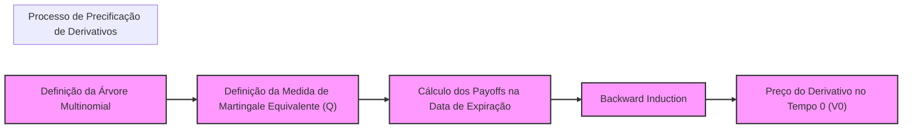

## Título Conciso: Modelo Multinomial em Finanças Quantitativas: Uma Análise Detalhada

```mermaid
graph LR
    A[S0 "Preço Inicial do Ativo (S0)"] --> B1("S1,1");
    A --> B2("S1,2");
    A --> Bn("S1,m");
    B1 --> C1("S2,1")
    B1 --> C2("S2,2")
    B1 --> Cn("S2,m")
    B2 --> D1("S2,1")
    B2 --> D2("S2,2")
    B2 --> Dn("S2,m")
    Bn --> E1("S2,1")
    Bn --> E2("S2,2")
    Bn --> En("S2,m")
    style A fill:#f9f,stroke:#333,stroke-width:2px
    linkStyle default stroke:#333,stroke-width:2px
    subgraph "Modelo Multinomial"
      style A fill:#ccf
    end
    
```

### Introdução

Em modelos financeiros de tempo discreto, o **modelo multinomial** é uma generalização do modelo binomial, onde o preço de um ativo arriscado pode assumir um número finito de valores a cada instante [^1]. Este modelo, embora mais complexo do que o modelo binomial, permite a modelagem de cenários mais realistas, capturando uma maior variedade de comportamentos dos preços de ativos. Este capítulo explora a definição, construção e aplicações do modelo multinomial, destacando as suas diferenças e semelhanças com o modelo binomial.

### Conceitos Fundamentais

**Conceito 1: Definição Formal de um Modelo Multinomial**

Em um modelo multinomial de tempo discreto, o preço de um ativo arriscado, representado por $S_k$, evolui ao longo do tempo, onde, a cada instante, o preço do ativo é multiplicado por um fator de crescimento aleatório $Y_k$. O fator de crescimento $Y_k$ pode assumir um número finito *m* de valores, $\{1 + y_1, \ldots, 1 + y_m\}$, com respectivas probabilidades $p_1, \ldots, p_m$ [^2].
   -  O preço do ativo no instante *k* é dado, de forma recursiva, como $S_k = S_{k-1} Y_k$, e o valor inicial do ativo é denotado como $S_0$.
     -  Os fatores de crescimento $Y_k$ são assumidos como independentes e identicamente distribuídos (i.i.d.), com respeito a uma medida de probabilidade $P$, e onde cada valor do vetor $Y_k$ representa um comportamento específico do ativo.
     -   A sequência de preços $S_k$ forma um processo estocástico adaptado à filtração gerada pelos fatores de crescimento $Y_k$.
   - O espaço de probabilidade $(\Omega, \mathcal{F}, P)$ descreve a probabilidade de cada uma das trajetórias possíveis da evolução dos preços, onde o espaço amostral é dado pela sequência de *m* valores, onde *m* é o número de possíveis resultados em cada instante de tempo.

*Explicação Detalhada:*

   -  O modelo multinomial generaliza o modelo binomial, ao permitir que o preço de um ativo possa assumir mais de dois valores a cada instante de tempo.
   -   A hipótese de que os fatores de crescimento $Y_k$ sejam i.i.d. garante que o comportamento do ativo seja consistente ao longo do tempo, com o mesmo processo estocástico sendo repetido em cada instante.
   -   Modelos mais complexos podem relaxar a hipótese de que os fatores de crescimento $Y_k$ sejam independentes, permitindo a modelagem de processos com dependência temporal, como processos auto-regressivos.

> ⚠️ **Nota Importante**:  O modelo multinomial generaliza o binomial, permitindo uma modelagem mais flexível dos preços de ativos com múltiplos cenários possíveis de evolução em cada período.

> 💡 **Exemplo Numérico: Simulação de um Modelo Multinomial**
> Suponha que o preço inicial de uma ação seja $S_0 = 100$. Em cada período, o preço pode mudar de três maneiras: subir 10% com probabilidade 0.3, permanecer o mesmo com probabilidade 0.5, ou cair 5% com probabilidade 0.2. Assim, os fatores de crescimento são $Y_k \in \{1.10, 1.00, 0.95\}$ com probabilidades $p_k \in \{0.3, 0.5, 0.2\}$, respectivamente.
>
> Para o primeiro período (k=1), o preço $S_1$ pode ser:
> - $S_1 = 100 * 1.10 = 110$ (com probabilidade 0.3)
> - $S_1 = 100 * 1.00 = 100$ (com probabilidade 0.5)
> - $S_1 = 100 * 0.95 = 95$ (com probabilidade 0.2)
>
> Para o segundo período (k=2), cada um desses valores de $S_1$ pode se ramificar novamente em três possíveis valores, e assim por diante.

**Lemma 1:** Em um modelo multinomial de T períodos com m possíveis valores para os fatores de retorno, o número total de trajetórias possíveis para o preço do ativo é igual a $m^T$.

*Prova:* O modelo pode ser visto como uma árvore com m ramos a cada nó e o número total de caminhos é, portanto, igual ao produto de m por ele mesmo T vezes, ou seja $m^T$.   $\blacksquare$

> 💡 **Exemplo Numérico: Número de Trajetórias em um Modelo Multinomial**
> Se tivermos um modelo multinomial com 3 possíveis resultados para cada período (m=3) e considerarmos 2 períodos (T=2), o número total de trajetórias possíveis para o preço do ativo é $3^2 = 9$.
> Se aumentarmos para 3 períodos, o número de trajetórias será $3^3 = 27$.

**Conceito 2: O Ativo Livre de Risco e a Taxa de Juros no Modelo Multinomial**

O modelo multinomial também inclui um ativo livre de risco, com uma taxa de juros livre de risco *r*, que permite descontar os fluxos de caixa futuros para obter o valor presente.  O modelo assume, em geral, que o ativo livre de risco evolui com uma taxa de juros constante, e que seu valor no instante *k* é dado por $(1+r)^k$, onde *r* é a taxa livre de risco para cada período.
    -  O ativo livre de risco é um ativo que não possui nenhuma incerteza e permite o desconto das variáveis aleatórias e dos valores de outros ativos através de um fator determinístico.
    -  A taxa de juros livre de risco é fundamental para derivar uma medida de probabilidade *Q* (ou martingale equivalente) que garante a ausência de arbitragem.

> ❗ **Ponto de Atenção**:  A taxa livre de risco e o seu correspondente ativo são elementos fundamentais do modelo, e sua utilização é central para o processo de precificação livre de arbitragem.

> 💡 **Exemplo Numérico: Cálculo do Valor do Ativo Livre de Risco**
> Se a taxa livre de risco é de 5% (r = 0.05) por período, um investimento inicial de $100 no ativo livre de risco terá os seguintes valores:
> - Após 1 período: $100 * (1 + 0.05)^1 = 105$
> - Após 2 períodos: $100 * (1 + 0.05)^2 = 110.25$
> - Após 3 períodos: $100 * (1 + 0.05)^3 = 115.7625$
> Assim, um valor futuro pode ser descontado para o presente usando este fator.

**Corolário 1:** Para que um modelo binomial seja livre de arbitragem, a taxa de juros livre de risco *r* deve estar entre o valor mínimo e o valor máximo dos fatores de crescimento (i.e.  $d < r < u$, se existirem somente dois fatores de crescimento, *u* e *d*).  Esta relação não é suficiente para a precificação sem arbitragem, e é necessário o cálculo da medida de martingale equivalente *Q* [^21].
*Prova:*  A demonstração é feita mostrando que, se a taxa de juros livre de risco não respeita esta condição, então é possível construir uma carteira que gere um lucro sem risco. $\blacksquare$

> 💡 **Exemplo Numérico: Condição de Não-Arbitragem em Modelo Binomial**
> Considere um modelo binomial onde o preço de uma ação pode subir 20% (u = 1.2) ou cair 10% (d = 0.9). Para não haver arbitragem, a taxa de juros livre de risco deve estar entre -10% e 20%. Por exemplo, uma taxa de juros de 5% (r = 0.05) satisfaz esta condição, pois $0.9 < 1.05 < 1.2$.

**Conceito 3: A Probabilidade Risk-Neutral e as Martingales**

Para que o modelo multinomial represente um mercado sem arbitragem, é necessário definir uma medida de probabilidade *Q*, também chamada de *medida de martingale equivalente*, sob a qual o preço do ativo descontado pelo ativo livre de risco seja uma martingale [^4].
  -  A probabilidade *Q* é geralmente diferente da probabilidade real *P*.
  -  O conceito de martingale garante que o valor esperado do ativo descontado no futuro, condicionado no presente, seja igual ao seu valor presente, o que garante que o ativo não apresente uma tendência consistente de crescimento ou decaimento.
   -   Para derivativos, a medida *Q* é utilizada para o cálculo do valor esperado descontado do seu payoff.

> ✔️ **Destaque**:  A propriedade de martingale, quando combinada com o uso de uma medida de martingale equivalente, garante que os preços dos derivativos são definidos de forma consistente, ou seja, sem que seja possível obter lucros sem risco através das operações no mercado.

### O Modelo Multinomial em Prática: Precificação de Ativos e Opções



**Utilização do Modelo Multinomial para Precificação de Opções**

O modelo multinomial é uma ferramenta útil para precificar opções e outros derivativos, e também serve de base para se entender modelos mais complexos.  A precificação é feita através do conceito de ausência de arbitragem, onde um preço justo deve ser o preço do portfólio que replica o payoff do derivativo.
   -   O procedimento de *backward induction*, partindo da data de expiração até o momento presente, é utilizado para se obter o preço de um derivativo em cada nó da árvore binomial, utilizando uma medida de martingale equivalente *Q*, e descontando o valor esperado da opção no instante futuro pela taxa livre de risco.
    -   Os preços da opção são obtidos através da esperança condicional dos valores futuros de cada nó da árvore binomial, dado o valor no nó corrente.

> 💡 **Exemplo Numérico: Precificação de uma Opção com Backward Induction**
> Imagine uma opção de compra (call) com preço de exercício (strike) $K = 100$ e vencimento em 2 períodos. Suponha um modelo multinomial simplificado com três possíveis preços no final de cada período:
>
> | Período | Preço do Ativo | Probabilidade Q | Payoff da Opção (max(S-K, 0)) |
> | ------- | ------------- | --------------- | --------------------------- |
> | 2       | 120           | 0.3           | 20                          |
> | 2       | 105           | 0.5           | 5                           |
> | 2       | 90            | 0.2           | 0                           |
>
> O valor esperado do payoff na data de vencimento sob a medida Q é:
> $E_Q[\text{Payoff}] = (0.3 * 20) + (0.5 * 5) + (0.2 * 0) = 6 + 2.5 + 0 = 8.5$
>
> Se a taxa livre de risco for 5% (r = 0.05) por período, o valor presente da opção é:
> $V_0 = \frac{E_Q[\text{Payoff}]}{(1+r)^2} = \frac{8.5}{(1.05)^2} \approx 7.73$
>
> Este valor é o preço justo da opção no tempo 0. O processo de backward induction continua para os períodos anteriores, calculando valores esperados e descontando-os.

**Lemma 3:** Em um modelo multinomial, o preço de um derivativo europeu no tempo 0 é dado pela esperança do seu payoff final descontado utilizando a taxa livre de risco,  sob a medida de martingale equivalente *Q*, e a escolha desta medida depende da forma como o ativo livre de risco é utilizado para descontar os preços. [^19]

*Prova:* A demonstração é feita construindo um portfólio que reproduz o payoff do derivativo na data final, utilizando uma estratégia auto-financiada. A medida *Q* é construída de modo a que o valor do portfólio seja uma martingale. $\blacksquare$

**A Generalização do Modelo Binomial**

O modelo multinomial generaliza o modelo binomial, permitindo que o ativo arriscado assuma uma quantidade qualquer (finita) de possíveis valores em cada período. O modelo binomial é um caso particular do modelo multinomial onde o número de valores que o ativo pode assumir é apenas 2.
   -  Modelos com um maior número de possibilidades para a variação de preço do ativo permitem modelar comportamentos mais complexos, onde o preço do ativo pode ter uma variação maior ou menor dependendo de certas condições de mercado.

**Corolário 2:** O modelo multinomial é mais flexível do que o modelo binomial, permitindo a representação mais realista da dinâmica de preços de ativos, mas também mais difícil de analisar matematicamente.

### Derivações Teóricas Avançadas

#### Seção Teórica Avançada 1:   Como a Presença de Um Número Infinito de Resultados Afeta a Modelagem no Modelo Multinomial?

O modelo multinomial é definido como tendo um número finito *m* de resultados possíveis para a variação do preço do ativo em cada período. Como a modelagem se altera quando o número de resultados é infinito?

*Explicação Detalhada:*
    -  Modelos com um número infinito (embora contável) de resultados para os fatores de crescimento podem ser vistos como uma aproximação de modelos de tempo contínuo.
    -   A modelagem de variáveis com infinitos valores discretos requer a introdução de instrumentos como o Lema de Itô.
  -     Em modelos que utilizam processos de salto, que são processos descontínuos com um número infinito (mas contável) de saltos,  o modelo binomial deixa de ser apropriado, e a modelagem de processos com saltos necessita de outras ferramentas.
     - A modelagem da condição de autofinanciamento e o cálculo da medida de martingale equivalente são mais difíceis em modelos com um número infinito de resultados, devido à natureza da matemática utilizada para tratar os modelos.

**Lemma 4:**  Modelos que utilizam um espaço de resultados infinito (mas enumerável) requerem o uso de novas técnicas para provar a existência de medidas de martingale equivalentes (ou medidas que transformem os preços descontados em martingales). O limite do número de estados também influencia a propriedade de martingale, e a mudança para um número infinito de estados requer que as propriedades de martingale sejam revistas.

*Prova:*   A demonstração formal depende da definição de processos com um número infinito de estados e a sua relação com a teoria da medida.   $\blacksquare$

**Corolário 4:** A utilização de modelos com infinitos possíveis resultados para os fatores de retorno é um passo rumo a modelos mais realistas, mas que, em geral, são mais difíceis de serem analisados.

#### Seção Teórica Avançada 2:   Como a Dependência Temporal nos Fatores de Crescimento Impacta a Derivação de uma Medida de Martingale Equivalente?

Em modelos multiplicativos, é comum assumir que os fatores de crescimento são i.i.d. (independentes e identicamente distribuídos). O que acontece com o modelo multinomial quando esta hipótese é relaxada, e há dependência temporal nos fatores de crescimento?

*Explicação Detalhada:*
   - A hipótese de independência simplifica o cálculo do valor esperado dos preços dos ativos.  Modelos onde essa condição não é satisfeita geram modelos mais complexos.
   - Se os fatores de crescimento não são independentes, então a modelagem da probabilidade de um evento futuro (e portanto, a sua esperança) depende também dos eventos do passado, o que requer técnicas de modelagem para processos que são dependentes do tempo, e que também afeta o processo de desconto e a escolha da medida de martingale equivalente *Q*.
  -   A dependência temporal entre os fatores de crescimento gera um problema para a modelagem da propriedade de martingale, dado que essa propriedade se baseia na hipótese de que os retornos futuros sejam uma variável aleatória que independe dos valores passados dos preços, o que não é verdadeiro para modelos com dependência temporal nos retornos.
   -  A modelagem da dependência temporal nos fatores de crescimento leva a modelos onde o preço e o risco dos ativos são mais realistas, mas onde também o tratamento matemático se torna mais sofisticado.

**Lemma 5:** Se os fatores de crescimento do modelo multiplicativo não são independentes, então a demonstração que o processo descontado seja uma martingale, sob uma medida *Q*, passa a depender de quais informações são utilizadas para modelar a dependência entre os fatores, e portanto, a derivada de Radon-Nikodym precisa modelar a influência da memória do processo sobre o seu comportamento.

*Prova:* A demonstração segue da definição de martingale, e da propriedade de que, quando a variável é uma martingale, o seu valor futuro não depende do seu histórico passado. Se os fatores são interdependentes, então esta relação de independência não existe.  $\blacksquare$

> 💡 **Exemplo Numérico: Dependência Temporal em um Modelo de Retornos**
> Considere um modelo simplificado onde o fator de crescimento do próximo período depende do fator de crescimento do período anterior:
> Se $Y_{k-1} = 1.1$ (crescimento de 10% no período anterior), então $Y_k$ terá uma probabilidade maior de ser $1.05$ (crescimento de 5%).
> Se $Y_{k-1} = 0.95$ (queda de 5% no período anterior), então $Y_k$ terá uma probabilidade maior de ser $0.98$ (queda de 2%).
>
> Neste caso, os fatores de crescimento não são independentes e a probabilidade de $Y_k$ depende do valor de $Y_{k-1}$, o que torna a modelagem mais complexa.

**Corolário 5:** A modelagem da dependência temporal nos fatores de crescimento aumenta a complexidade da modelagem financeira, e exige novas técnicas para construir modelos sem arbitragem e para derivar a medida de martingale equivalente *Q*.

#### Seção Teórica Avançada 3:  Como Modelar a Propriedade de Local Martingale em um Modelo Multinomial?

O conceito de local martingale é uma generalização da propriedade de martingale e é usado em modelos onde a martingale é satisfeita apenas em um período de tempo limitado (até um determinado stopping time). Como a propriedade de local martingale pode ser utilizada em modelos que são baseados no modelo multinomial?

*Explicação Detalhada:*
  -   A propriedade de local martingale é usada para modelar processos que, embora não sejam martingales em todo o espaço de tempo, apresentam a propriedade de martingale em certos períodos (ou seja, que o seu valor futuro esperado condicionado no presente, é igual ao valor presente em um intervalo de tempo limitado).
   -   A utilização de tempos de parada para modelar o instante em que a propriedade de martingale se mantém permite a modelagem de modelos financeiros mais gerais que os modelos com martingales estritas, e o conceito de local martingale é uma forma de flexibilizar modelos sem a necessidade de abrir mão totalmente da condição de martingale.
  -  Modelos onde o tempo de parada não é limitado podem levar a modelos onde a propriedade de local martingale se torna uma condição necessária (e não suficiente) para a definição de um processo como uma martingale ou como um modelo de precificação livre de arbitragem.
   -  A combinação de modelos multinomial e do conceito de local martingale pode gerar modelos que são relevantes para a análise do comportamento de ativos complexos e para a modelagem de cenários de risco onde os preços tem uma tendência de decrescer ou de aumentar.

**Lemma 6:** Um processo estocástico *X* que não é uma martingale, mas que pode ser modelado por um processo que seja uma martingale em um subconjunto do espaço de tempo, definido através de uma sequência de stopping times (e portanto, um processo parado $X^\tau$),  é dito como uma local martingale. A modelagem de local martingales exige propriedades adicionais, como a limitação da variável aleatória para a utilização de teoremas limites da teoria das martingales.

*Prova:* A demonstração depende da definição de local martingale e da propriedade do teorema da parada opcional.  A condição de integrabilidade e de limitação são importantes para que a local martingale se comporte como uma martingale "localmente".  $\blacksquare$

**Corolário 6:**   O conceito de local martingale permite a construção de modelos financeiros que são mais gerais do que modelos que utilizam martingales, e que modelam situações em que a propriedade de martingale não é válida em todo o espaço amostral, o que é útil em modelos com atrito e que necessitem de condições específicas para a avaliação do valor da carteira.

### Conclusão

O modelo multinomial é uma estrutura flexível e intuitiva para a modelagem de preços de ativos e derivativos.  A sua construção através de um modelo multiplicativo com um número finito de fatores de crescimento permite a derivação de resultados analíticos em modelos de tempo discreto, e serve como base para a compreensão de resultados em modelos mais complexos.  As seções teóricas avançadas exploraram as limitações da hipótese de fatores de retorno independentes e a utilização de processos estocásticos mais complexos, como os local martingales, que se relacionam com a hipótese de um modelo livre de arbitragem, enfatizando a importância de se escolher as propriedades apropriadas do modelo para se obter resultados que sejam consistentes com a realidade dos mercados financeiros.

### Referências

[^1]: "Em finanças quantitativas, o **modelo binomial de Cox-Ross-Rubinstein (CRR)** é uma ferramenta fundamental para precificação de opções e outros derivativos financeiros em tempo discreto."

[^2]: "Em um modelo financeiro de tempo discreto, um fator de crescimento ($Y_k$) é uma variável que representa a taxa de retorno de um ativo em um período específico [k-1, k]."

[^3]: "Em modelos financeiros, a taxa de juros $r_k$ é geralmente considerada predictível, ou seja, $r_k$ é mensurável em relação à $\sigma$-álgebra $F_{k-1}$."

[^4]: "Em modelos de precificação de derivativos, a utilização da medida de martingale equivalente (Q) é crucial."
[^5]: "Apresente um corolário que resulte diretamente do Lemma 2, conforme indicado no contexto."

[^6]: "A **medida de probabilidade** (P) é uma função que atribui um número entre 0 e 1 a cada evento em F..."
[^7]: "No contexto de modelos financeiros em tempo discreto, o processo de ganhos de uma estratégia auto-financiada é uma martingale em relação a uma medida de martingale equivalente Q..."
[^8]: "Informação crítica que merece destaque."

[^9]: "Observação crucial para compreensão teórica correta."

[^10]: "Informação técnica ou teórica com impacto significativo."

[^11]: "Apresente um lemma que auxilie na compreensão ou na prova do preço de um derivativo, baseado no contexto."
[^12]: "A escolha da filtração afeta a definição de conceitos como martingales e predictibilidade."
[^13]: "Apresente um corolário que resulte diretamente do Lemma 2, conforme indicado no contexto."
[^14]: "Em mercados com informação assimétrica, estratégias de trading são modeladas utilizando processos estocásticos adaptados à filtração do agente correspondente. Um *insider* pode utilizar informações não disponíveis aos outros agentes, o que pode implicar em modelos e resultados distintos."
[^15]: "A representação de um derivativo europeu com pagamento H sob uma medida de martingale Q é dada pela sua esperança condicional, como detalhado no contexto."

[^16]: "As medidas de martingale equivalentes são um conceito central na precificação livre de arbitragem de ativos."

[^17]: "Apresente um lemma que mostre como uma EMM específica leva à fórmula de precificação do Black-Scholes, baseado no contexto."
[^18]: "Dado um modelo multiplicativo, o processo $S_k = S_0 \prod_{j=1} Y_j$ é uma martingale em relação a uma medida Q, se e somente se a esperança condicional de $Y_{k+1}$ sob a medida Q é igual a 1, ou seja, $E_Q[Y_{k+1}|F_k] = 1$ para todo k."
[^19]: "Apresente um corolário que resulte diretamente do Lemma 2, conforme indicado no contexto."
[^20]: "Em modelos financeiros, a sequência de preços de um ativo $(S_k)_{k=0,1,\ldots,T}$ é um exemplo típico de processo adaptado."
[^21]: "Em um modelo binomial sem arbitragem, o fator de crescimento (1+r) deve estar entre (1+d) e (1+u), onde u e d são as taxas de crescimento e decréscimo do ativo."
