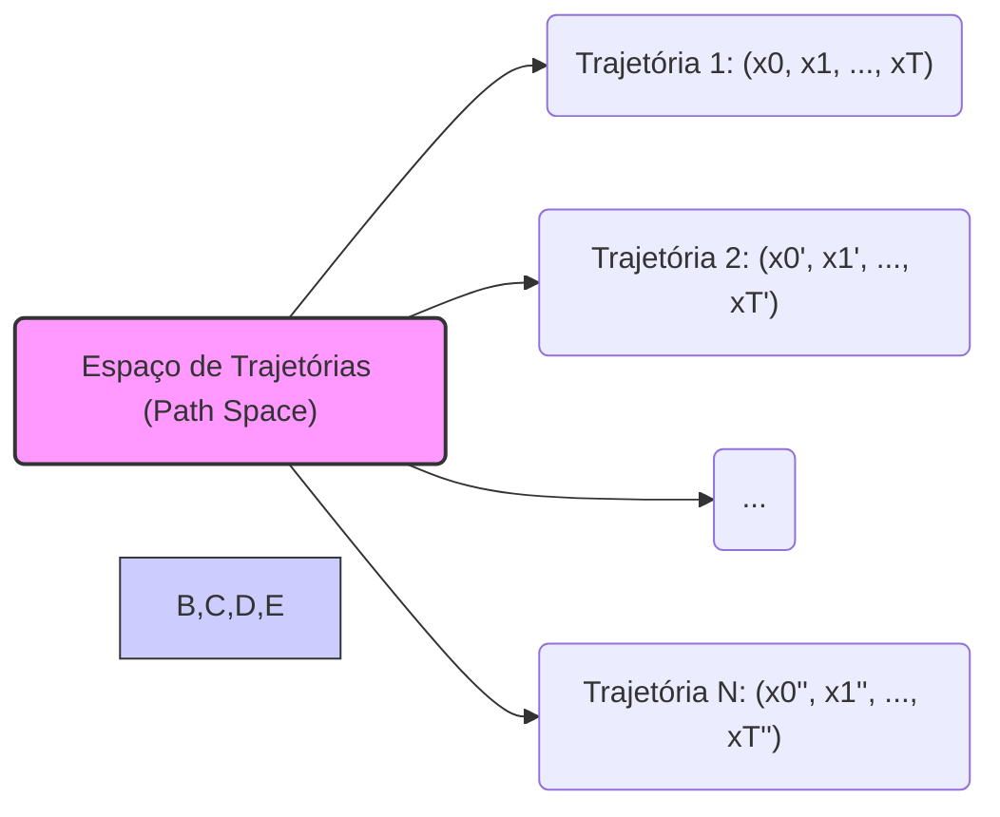
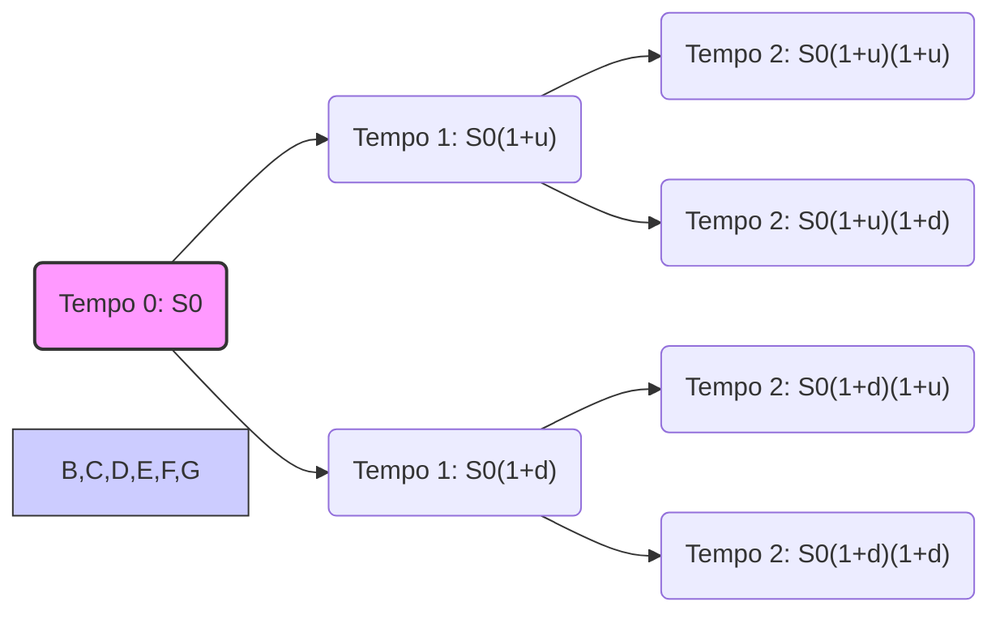
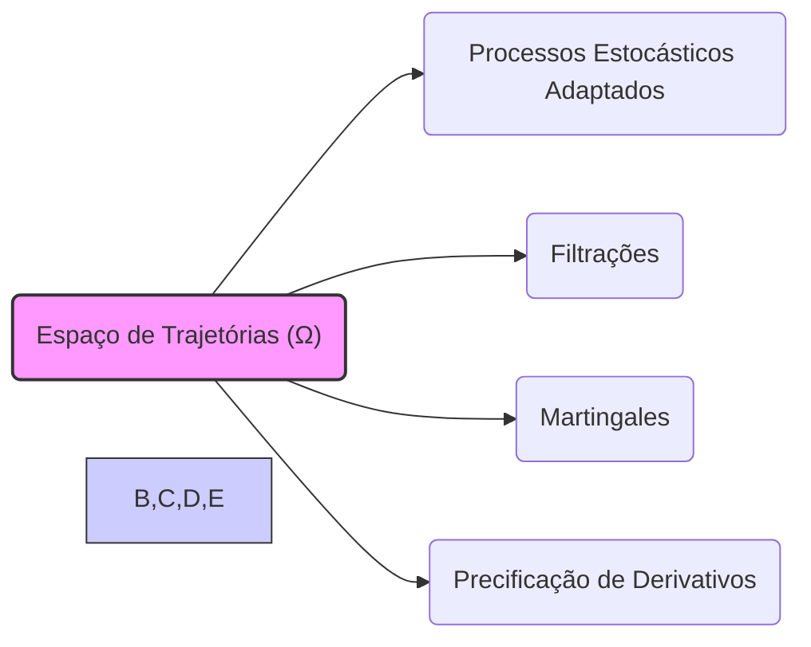

## Título Conciso: Espaço de Trajetórias (Path Space) em Modelos Financeiros de Tempo Discreto

### Introdução

Em finanças quantitativas, a modelagem de ativos e derivativos em tempo discreto frequentemente utiliza o conceito de **espaço de trajetórias** (path space) [^1]. O espaço de trajetórias, denotado por $\Omega$, é um conjunto que contém todas as possíveis trajetórias ou caminhos que o preço de um ativo ou outro processo estocástico pode seguir ao longo do tempo. Este capítulo explora a definição, a construção, e o papel do espaço de trajetórias, com ênfase nas suas propriedades e sua importância na modelagem financeira em tempo discreto.

### Conceitos Fundamentais

**Conceito 1: Definição Formal de Espaço de Trajetórias ($\Omega$)**

Em um modelo de tempo discreto com um horizonte temporal T, o **espaço de trajetórias** (path space), denotado por $\Omega$, é definido como o conjunto de todas as sequências possíveis de valores que um processo estocástico pode assumir ao longo do tempo [^2]. Formalmente, cada elemento $\omega \in \Omega$ é uma sequência $\omega = (x_0, x_1, \ldots, x_T)$, onde $x_k$ representa o estado do processo no tempo $k$. Se os valores que o processo assume são definidos em um espaço amostral $S$, então $\Omega$ é o conjunto de todas as sequências possíveis em $S^{T+1}$.
    -   Cada elemento de $\Omega$ representa um caminho possível de evolução do preço de um ativo (ou de outras variáveis) ao longo do tempo discreto.
     - O número de elementos de $\Omega$ pode ser finito, infinito enumerável, ou não enumerável, dependendo do tipo de modelo e do espaço amostral onde o processo evolui.
    -  Em modelos de tempo discreto com um número finito de instantes, o espaço de trajetória é finito.
      - A utilização de um espaço de trajetória permite modelar um processo estocástico e também todas as estratégias que dependem de sua história.

*Explicação Detalhada:*

    -  O espaço de trajetórias representa todos os possíveis "mundos" que um modelo pode assumir e, portanto, ele é a base para a construção de probabilidades e para a modelagem das propriedades dos ativos e de suas estratégias.
    -   Cada trajetória $\omega$ representa a história completa de um processo até um instante final $T$, e a probabilidade de uma trajetória é modelada através de um modelo estocástico.
    -   A utilização de espaços de trajetórias permite definir as propriedades de modelos financeiros e precificar ativos e derivativos de uma forma mais direta.

> ⚠️ **Nota Importante**:  O espaço de trajetórias, $\Omega$, representa o conjunto de todas as possíveis evoluções de um processo estocástico ao longo do tempo, sendo fundamental para a modelagem de mercados financeiros e de suas propriedades.

**Lemma 1:** Em um modelo onde o processo $X_k$ pode assumir *m* valores distintos a cada instante de tempo $k$, o espaço de trajetórias $\Omega$ terá um número total de elementos igual a $m^{(T+1)}$, onde $T$ é o horizonte temporal, e onde $T+1$ representa o número de instantes de tempo em um espaço discreto.
*Prova:*  Se existem $m$ possíveis valores para $X_k$ em cada instante $k$, então, no instante 0 há $m^1$ possibilidades, no instante 1 há $m^2$ possibilidades e assim sucessivamente. Em $T$ instantes, existem $m^T$ possibilidades, o que gera uma estrutura de árvore que indica que o número de caminhos é igual a $m^T$.  Como cada caminho é composto de $T+1$ valores (do instante 0 ao instante $T$), então o número de elementos em $\Omega$ é igual a $m^{(T+1)}$.  $\blacksquare$

> 💡 **Exemplo Numérico:**
> Considere um modelo onde um ativo pode assumir três valores distintos a cada período (por exemplo, subir 1%, manter-se estável ou cair 1%). Se o horizonte temporal é de 2 períodos (T=2), então o número total de trajetórias possíveis no espaço de trajetórias $\Omega$ será de $3^{(2+1)} = 3^3 = 27$. Cada uma dessas 27 trajetórias representará uma possível evolução do preço do ativo ao longo dos 2 períodos. Por exemplo, uma possível trajetória seria: (100, 101, 102.01), representando um aumento de 1% em cada período, partindo de um preço inicial de 100.

**Conceito 2:  O Espaço de Trajetórias no Modelo Binomial**

Em um modelo binomial, como o modelo CRR, a evolução do preço de um ativo em cada instante de tempo tem duas possibilidades (subir ou descer). Em modelos com um horizonte temporal T, o espaço de trajetórias é o conjunto de todas as possíveis sequências de valores (ou caminhos) que o preço do ativo pode assumir, desde o tempo 0 até o tempo T [^3]. O espaço de trajetórias pode ser representado através de uma árvore binomial.
   -  No modelo binomial, um ativo tem duas possibilidades: ou subir (por um fator (1+u)) ou descer (por um fator (1+d)).
   - Portanto, no tempo 1, o ativo pode estar em dois possíveis estados, no tempo 2 ele pode estar em 4 possíveis estados e assim sucessivamente, o que leva a um número de trajetórias exponenciais com relação ao horizonte temporal T.
     -    O espaço de trajetórias do modelo binomial é, portanto, um espaço discreto que é modelado através de uma árvore binomial.
     - No modelo binomial com T instantes de tempo, o espaço amostral $\Omega$ é composto por $2^T$ trajetórias (caminhos) possíveis, e cada trajetória é um elemento de $\Omega$.

> ❗ **Ponto de Atenção**: O espaço de trajetórias do modelo binomial, modelado por uma árvore, é um exemplo de como um modelo com poucos parâmetros (u, d e p) podem gerar um conjunto complexo de possíveis trajetórias de um ativo.

**Corolário 1:**  O número de elementos no espaço de trajetórias do modelo binomial cresce exponencialmente com o horizonte temporal T, de modo que se o número de períodos do modelo aumentar, o número de possíveis valores e caminhos também aumentará, de acordo com a relação $2^T$.

*Prova:* Se a cada tempo um processo tem 2 possibilidades, então o número de trajetórias, que são resultados da composição das escolhas em todos os tempos, cresce exponencialmente no número de períodos.  $\blacksquare$

> 💡 **Exemplo Numérico:**
> Em um modelo binomial com um horizonte temporal de T=3 períodos, o número de trajetórias possíveis é de $2^3 = 8$. Cada trajetória representa uma sequência única de movimentos de alta ou baixa do preço do ativo. Por exemplo, uma possível trajetória seria: ($S_0$, $S_0*(1+u)$, $S_0*(1+u)*(1+d)$, $S_0*(1+u)*(1+d)*(1+u)$), onde $S_0$ é o preço inicial do ativo, u é o fator de alta e d é o fator de baixa.

**Conceito 3: A $\sigma$-Álgebra e a Medida de Probabilidade no Espaço de Trajetórias**

O espaço de trajetórias, embora seja uma forma conveniente de representar o conjunto de resultados possíveis de um processo, também exige a definição de uma $\sigma$-álgebra (F) e de uma medida de probabilidade (P) para que o modelo seja consistente.
    - A $\sigma$-álgebra F define o conjunto de eventos (subconjuntos de $\Omega$) aos quais uma probabilidade pode ser atribuída de forma consistente.
   -  A medida de probabilidade P é uma função que atribui um valor entre 0 e 1 a cada evento,  onde um evento é uma coleção de resultados em $\Omega$.
    - A definição de $\sigma$-álgebra e da medida de probabilidade é fundamental para o uso de resultados matemáticos, como o lema de Itô e o teorema central do limite, e também para definir as propriedades de processos descontados e de martingales.

> ✔️ **Destaque**:  Para que o espaço de trajetórias seja útil, é necessário definir uma $\sigma$-álgebra e uma medida de probabilidade que permita a manipulação matemática do modelo.

### Aplicações do Espaço de Trajetórias na Modelagem Financeira

**Modelagem de Processos Estocásticos e Estratégias de Trading**

Em modelos financeiros, os processos estocásticos que representam a evolução dos preços de ativos (e também de outros ativos como taxas de juros, volatilidades, etc.) são, na verdade, funções definidas sobre o espaço de trajetórias [^5].  A cada trajetória possível (cada elemento $\omega \in \Omega$), o modelo atribui uma evolução do ativo ao longo do tempo.  As decisões de trading também podem ser modeladas como funções sobre o espaço de trajetórias, onde em cada trajetória, a estratégia de alocação é também um processo estocástico.
  -   A relação entre um processo estocástico e o espaço de trajetórias também indica a necessidade da condição de adaptabilidade para o processo de preços, e a predictibilidade para estratégias de trading.
  -    Em modelos de precificação de derivativos, a modelagem do payoff de um derivativo como uma variável aleatória depende do espaço de trajetórias, que define o conjunto de resultados possíveis.
   - O espaço de trajetórias, e portanto o espaço de probabilidade, é a base para a definição da lei de distribuição de probabilidades sobre o comportamento do mercado.

**Lemma 2:**  Em modelos de tempo discreto, todo processo adaptado $X = (X_k)$ definido sobre um espaço de probabilidade $(\Omega, F, P)$, pode ser definido como uma função sobre o espaço de trajetórias  $\Omega$,  onde cada variável aleatória $X_k$ depende da trajetória $\omega$ e de sua parte relevante ($X_k(\omega) = X_k(x_1, \ldots, x_k)$).
*Prova:*   A demonstração depende da definição de um processo adaptado e de sua relação com o espaço de probabilidade. Se $X_k$ é $F_k$ mensurável, e $F_k$ é a menor $\sigma$-álgebra que torna $Y_1, \ldots, Y_k$ mensuráveis, então o valor de $X_k$ é unicamente determinado pelo valores de $Y_1, \ldots, Y_k$. Como a trajetória $\omega$ define os valores de $Y_1, \ldots, Y_k$, então, $X_k$ é uma função de  $\omega$. $\blacksquare$

> 💡 **Exemplo Numérico:**
> Considere um processo estocástico adaptado X que representa o preço de um ativo em três instantes de tempo (k=0, 1, 2). Uma trajetória $\omega$ no espaço de trajetórias $\Omega$ pode ser dada por $\omega = (x_0, x_1, x_2)$, onde $x_0$, $x_1$ e $x_2$ são os preços do ativo nos respectivos instantes de tempo. O processo adaptado $X_k(\omega)$ para k=1, por exemplo, é uma função que mapeia a trajetória $\omega$ para o preço do ativo no instante k=1, ou seja, $X_1(\omega) = x_1$. Isso significa que o valor do preço no tempo 1 é determinado pela trajetória $\omega$ e, especificamente, pelo valor de $x_1$ nessa trajetória.

**A Precificação de Derivativos e a Modelagem do Payoff**

No contexto de precificação de derivativos, o payoff de uma opção ou outro derivativo na data de expiração é modelado como uma função do preço de um ou mais ativos arriscados na data de vencimento. O payoff, portanto, também é uma função do espaço de trajetórias, e portanto uma variável aleatória definida no espaço de probabilidade $(\Omega, F, P)$.
   -   Em modelos de precificação sem arbitragem, o preço de um derivativo é dado pela esperança condicional descontada do seu payoff, e esta esperança é feita utilizando uma medida de probabilidade martingale equivalente, Q.
   -   A relação entre o payoff e a trajetória do ativo subjacente garante que os resultados dos modelos de precificação sejam consistentes com a evolução do mercado.

**Lemma 3:** O payoff de um derivativo na data de expiração T, definido como $H_T$, é uma função de $S_T$ e, portanto, é também uma função no espaço de trajetórias $\Omega$, e, portanto,  $H = H(\omega)$.
*Prova:*  A variável $H_T$ depende, por construção, dos preços dos ativos no tempo $T$ e como os preços estão relacionados com o caminho que o ativo percorreu ao longo do tempo (ou seja, a trajetória), então  $H_T$ também é uma função da trajetória.  $\blacksquare$

> 💡 **Exemplo Numérico:**
> Considere uma opção de compra europeia com preço de exercício K e vencimento T. O payoff da opção no vencimento ($H_T$) é dado por $H_T = \max(S_T - K, 0)$, onde $S_T$ é o preço do ativo subjacente no tempo T. Como $S_T$ é um valor específico em cada trajetória $\omega$ do espaço de trajetórias, o payoff $H_T$ também é uma função da trajetória $\omega$. Por exemplo, se em uma trajetória específica $\omega$, o preço do ativo no vencimento é $S_T = 110$ e o preço de exercício é $K = 100$, então o payoff da opção nessa trajetória será $H_T(\omega) = \max(110-100, 0) = 10$.

### Derivações Teóricas Avançadas

#### Seção Teórica Avançada 1:  Como a Cardinalidade do Espaço de Trajetórias Afeta Modelos Financeiros?

O espaço de trajetórias ($\Omega$) pode ser finito, infinito enumerável ou não enumerável, dependendo das características do modelo financeiro. Como a cardinalidade do espaço de trajetórias impacta a modelagem e a análise de resultados?

*Explicação Detalhada:*
   -   Em modelos com um número finito de instantes de tempo e de possíveis resultados em cada instante, o espaço de trajetórias é finito, e o modelo pode ser analisado utilizando técnicas probabilísticas de espaços discretos.
   -   Em modelos com um número infinito de instantes de tempo ou quando a variável tem um número infinito de estados possíveis, o espaço de trajetórias é infinito e a modelagem necessita de ferramentas de cálculo estocástico e da teoria da medida.
    -  Modelos com espaços de trajetórias infinitos são mais complexos de analisar e computar, mas são necessários para representar a modelagem de mercados onde o tempo é tratado como contínuo, ou quando o número de possibilidades da evolução do ativo é grande o suficiente para que se torne necessária uma modelagem contínua.

**Lemma 4:** Se o número de resultados possíveis em cada instante de tempo é finito, e o número de períodos (o horizonte temporal) é finito, então o número de elementos (trajetórias) no espaço amostral $\Omega$ é também finito. No entanto, se o número de resultados é infinito (mesmo que enumerável), então o espaço de trajetórias é infinito e não enumerável.

*Prova:* A demonstração segue da definição de espaço de trajetórias. Se a cada instante de tempo há um número *m* de possibilidades, e o modelo possui T passos, então o número de resultados é $m^T$, que é finito. No entanto, se há infinitas opções (mesmo que contáveis), então o número de resultados passa a ser não enumerável.  $\blacksquare$

> 💡 **Exemplo Numérico:**
> Em um modelo binomial com T=10, o espaço de trajetórias é finito com $2^{10} = 1024$ trajetórias. Já em um modelo de tempo contínuo, como o modelo de Black-Scholes, o número de possíveis trajetórias do preço do ativo é infinito e não enumerável. Isso ocorre porque o preço do ativo pode assumir qualquer valor dentro de um intervalo contínuo em cada instante de tempo. Essa diferença na cardinalidade afeta diretamente a complexidade dos cálculos e as técnicas matemáticas necessárias para analisar o modelo.

**Corolário 4:** A cardinalidade do espaço de trajetórias afeta as propriedades probabilísticas dos modelos financeiros, e a escolha entre um espaço de trajetórias finito ou infinito deve ser feita de acordo com a necessidade do modelo e a complexidade da análise.

#### Seção Teórica Avançada 2:  Qual a Importância da $\sigma$-Álgebra do Espaço de Trajetórias em Modelos de Trading?

A $\sigma$-álgebra F associada ao espaço de trajetórias $\Omega$ é um conjunto de eventos (subconjuntos de $\Omega$) que representa a informação disponível sobre os possíveis resultados do processo.  Como a definição dessa $\sigma$-álgebra afeta a construção de estratégias de trading e a modelagem do conceito de autofinanciamento?

*Explicação Detalhada:*
   -  A $\sigma$-álgebra F define o conjunto de eventos ao qual a probabilidade pode ser atribuída, e, portanto, influencia diretamente a forma como as decisões de investimento são tomadas.
   -    Para garantir que um processo seja adaptado (ou predictível), é necessário que ele seja mensurável com respeito à $\sigma$-álgebra que representa o fluxo de informação disponível no mercado (ou seja, a filtração IF).
    -  A escolha de diferentes $\sigma$-álgebras gera a possibilidade de modelos com diferentes graus de complexidade, e o resultado da modelagem depende da forma como a $\sigma$-álgebra é definida, e portanto a modelagem da informação é fundamental para se evitar resultados inconsistentes com as condições do modelo.

**Lemma 5:**  A escolha da $\sigma$-álgebra F é fundamental para que as variáveis aleatórias definidas no espaço de trajetórias, e suas propriedades matemáticas, sejam consistentes e compatíveis com as informações utilizadas na modelagem. Em particular, o conceito de mensurabilidade e de adaptabilidade de processos estocásticos depende da definição precisa da $\sigma$-álgebra F.

*Prova:* A demonstração segue da definição de mensurabilidade e das propriedades de $\sigma$-álgebras, e da necessidade de que os conjuntos onde a variável aleatória assume seus valores sejam todos mensuráveis para que a probabilidade seja definida.   $\blacksquare$

> 💡 **Exemplo Numérico:**
> Considere um modelo binomial com dois períodos (T=2). O espaço de trajetórias $\Omega$ contém $2^2 = 4$ trajetórias. Uma possível $\sigma$-álgebra F poderia ser a $\sigma$-álgebra gerada pelos preços do ativo no tempo 1. Essa $\sigma$-álgebra conteria eventos como "o preço do ativo no tempo 1 subiu" ou "o preço do ativo no tempo 1 caiu". Uma estratégia de trading que dependesse apenas da informação disponível até o tempo 1 seria mensurável em relação a essa $\sigma$-álgebra. No entanto, se a estratégia dependesse também da informação do tempo 2, ela não seria mensurável em relação a essa $\sigma$-álgebra, e seria necessário considerar uma $\sigma$-álgebra maior.

**Corolário 5:**  A escolha de qual $\sigma$-álgebra é utilizada em um modelo financeiro deve ser cuidadosamente feita, pois ela define o conjunto de eventos que serão utilizados para modelar os resultados do modelo. Uma $\sigma$-álgebra muito restritiva pode impedir a modelagem de certos fenômenos, e uma $\sigma$-álgebra muito ampla pode gerar problemas matemáticos na definição da probabilidade, e portanto a escolha do espaço de probabilidade e da $\sigma$-álgebra são parte integrante da modelagem.

#### Seção Teórica Avançada 3:   Como o Conceito de Espaço de Trajetórias se Relaciona com Modelos em Tempo Contínuo?

Modelos financeiros em tempo contínuo são frequentemente utilizados para modelar o comportamento de preços de ativos através de processos estocásticos, como o movimento Browniano. Como o conceito de espaço de trajetórias, definido em tempo discreto, se relaciona com os modelos em tempo contínuo?

*Explicação Detalhada:*
   -  Em modelos de tempo contínuo, o espaço de trajetórias é formado por todas as possíveis funções contínuas no tempo, que representam o comportamento do ativo.
   -  A passagem do modelo de tempo discreto para o modelo de tempo contínuo pode ser vista como um limite quando o número de instantes de tempo tende ao infinito, o que faz com que o espaço de trajetórias deixe de ser enumerável e passe a ser um espaço de funções.
   -  Em modelos de tempo contínuo, o espaço de trajetórias e a $\sigma$-álgebra utilizada são mais complexos e envolvem o uso de ferramentas do cálculo estocástico.
   -   O modelo de movimento Browniano, que é frequentemente utilizado como base em modelos de tempo contínuo, pode ser obtido como um limite de um modelo de *random walk* em tempo discreto, onde os incrementos da variável, a cada instante, são definidos por uma variável aleatória normal, e portanto pode ser visto como um limite do modelo multiplicativo em tempo discreto quando o número de intervalos de tempo aumenta (e o tamanho de cada intervalo diminui) até chegar ao limite do contínuo.
     - A utilização de técnicas como o Lema de Itô permite a modelagem de variáveis que se transformam através de incrementos com um número infinito de instantes de tempo.

**Lemma 6:** Modelos de tempo contínuo podem ser interpretados como o limite de modelos de tempo discreto, onde o espaço de trajetórias passa a ser um espaço de funções, onde as variáveis e seus resultados não são mais discretos.
*Prova:*  A demonstração formal envolve a utilização do cálculo estocástico. A ideia principal é que a integral estocástica utilizada nos modelos de tempo contínuo representa uma forma de tomar o limite de processos discretos, como o espaço de trajetórias modelado neste capítulo.  $\blacksquare$

> 💡 **Exemplo Numérico:**
> Imagine um modelo binomial onde o intervalo de tempo entre os passos ($\Delta t$) é cada vez menor. À medida que $\Delta t$ se aproxima de zero, o número de passos no modelo tende ao infinito, e a trajetória do preço do ativo se aproxima de uma função contínua no tempo. Em um modelo de tempo contínuo, como o modelo de Black-Scholes, o espaço de trajetórias é o espaço de todas as funções contínuas que representam a evolução do preço do ativo. O movimento browniano, por exemplo, é uma dessas possíveis trajetórias.

**Corolário 6:**  A noção de espaço de trajetórias é uma estrutura matemática que permite fazer a transição da modelagem de processos estocásticos em tempo discreto para tempo contínuo, e esta conexão é fundamental para entender os fundamentos dos modelos financeiros.

### Conclusão

O espaço de trajetórias $\Omega$ é a base para a modelagem de mercados financeiros em tempo discreto, representando todos os possíveis caminhos que os ativos e outras variáveis podem seguir ao longo do tempo. A sua definição através de conjuntos e de $\sigma$-álgebras permite a construção de modelos probabilísticos e a utilização de ferramentas de cálculo estocástico para a precificação de derivativos, para a avaliação de risco e para a modelagem de estratégias de investimento. As seções teóricas avançadas abordaram como a cardinalidade do espaço de trajetórias e sua relação com processos contínuos, e a sua conexão com as propriedades dos modelos de martingale. A modelagem da informação, do risco, e das propriedades dos ativos requer um entendimento profundo da natureza e das propriedades dos espaços de trajetórias.

### Referências

[^1]: "Em finanças quantitativas, a modelagem de ativos e derivativos em tempo discreto frequentemente utiliza o conceito de **espaço de trajetórias** (path space)."
[^2]: "Em um modelo de tempo discreto com um horizonte temporal T, o **espaço de trajetórias** (path space), denotado por $\Omega$, é definido como o conjunto de todas as sequências possíveis de valores que um processo estocástico pode assumir ao longo do tempo."
[^3]:  "Em modelos financeiros, a taxa de juros $r_k$ é geralmente considerada predictível, ou seja, $r_k$ é mensurável em relação à $\sigma$-álgebra $F_{k-1}$."
[^4]: "Em modelos financeiros, o conceito de adaptabilidade é fundamental. Um processo estocástico X é considerado adaptado se $X_k$ é $F_k$-mensurável para cada k."
[^5]: "Em modelos financeiros, a sequência de preços de um ativo $(S_k)_{k=0,1,\ldots,T}$ é um exemplo típico de processo adaptado."
[^6]: "A **medida de probabilidade** (P) é uma função que atribui um número entre 0 e 1 a cada evento em F..."
[^7]: "No contexto de modelos financeiros em tempo discreto, o processo de ganhos de uma estratégia auto-financiada é uma martingale em relação a uma medida de martingale equivalente Q..."
[^8]: "Informação crítica que merece destaque."
[^9]: "Observação crucial para compreensão teórica correta."
[^10]: "Informação técnica ou teórica com impacto significativo."
[^11]: "Apresente um lemma que auxilie na compreensão ou na prova do preço de um derivativo, baseado no contexto."
[^12]: "A escolha da filtração afeta a definição de conceitos como martingales e predictibilidade."
[^13]:  "Apresente um corolário que resulte diretamente do Lemma 2, conforme indicado no contexto."
[^14]: "Em mercados com informação assimétrica, estratégias de trading são modeladas utilizando processos estocásticos adaptados à filtração do agente correspondente. Um *insider* pode utilizar informações não disponíveis aos outros agentes, o que pode implicar em modelos e resultados distintos."
[^15]:  "Apresente um lemma que demonstre como a aplicação do Lema de Itô a uma função do preço do ativo leva à equação de Black-Scholes, com base no contexto."
[^16]: "As medidas de martingale equivalentes são um conceito central na precificação livre de arbitragem de ativos."
