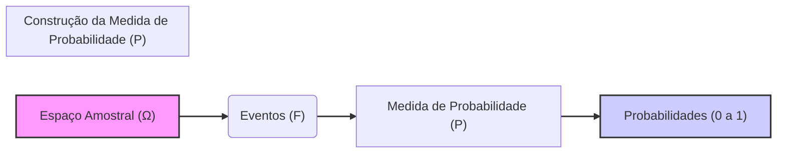
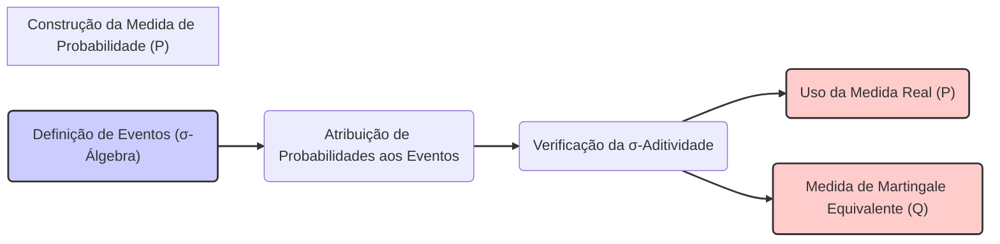

## Título Conciso: Construção da Medida de Probabilidade em Modelos Financeiros

### Introdução

Em finanças quantitativas, a **medida de probabilidade** (probability measure) $P$ é um elemento fundamental para a construção de modelos que lidam com incerteza e a representação de preços, retornos, e eventos financeiros. A medida $P$, definida sobre um espaço de probabilidade $(\Omega, F, P)$, estabelece uma forma de quantificar as probabilidades de diferentes resultados, e é a base para o cálculo de esperanças, variâncias e outros parâmetros que caracterizam processos estocásticos [^1]. Este capítulo explora a construção e a aplicação da medida de probabilidade em modelos financeiros de tempo discreto.

### Conceitos Fundamentais

**Conceito 1:  Definição Formal de uma Medida de Probabilidade**

Dado um espaço de amostral $(\Omega)$ e uma $\sigma$-álgebra $F$ de eventos sobre $\Omega$, uma **medida de probabilidade** $P$ é uma função $P: F \rightarrow [0, 1]$ que satisfaz as seguintes propriedades [^2]:

   -  Para todo evento $A \in F$, a probabilidade de $A$ é um número entre 0 e 1, ou seja, $0 \leq P(A) \leq 1$.
   -  A probabilidade do espaço amostral completo é 1, i.e., $P(\Omega) = 1$.
    - Para toda sequência de eventos disjuntos $A_1, A_2, \ldots \in F$, a probabilidade da união dos eventos é dada pela soma das suas probabilidades,  i.e., $P(\bigcup_n A_n) = \sum_n P(A_n)$. Esta é a propriedade de aditividade contável (ou $\sigma$-aditividade).

*Explicação Detalhada:*

   -  A medida de probabilidade associa um valor numérico entre 0 e 1 a um evento que representa a sua chance de ocorrência.
  -   Os elementos de $F$ representam os eventos que são mensuráveis, ou seja,  eventos que têm uma probabilidade bem definida.
    -  O requisito de que a probabilidade do espaço amostral completo ($P(\Omega) = 1$) representa que a soma das probabilidades de todos os eventos deve ser igual a 1, de acordo com a intuição.
    - A propriedade de $\sigma$-aditividade garante que, quando se tem uma série infinita de eventos (que são disjuntos entre si), seja possível modelar a probabilidade da sua união.

> 💡 **Exemplo Numérico:**
> Considere um espaço amostral $\Omega = \{cara, coroa\}$ ao lançar uma moeda. A $\sigma$-álgebra $F$ pode ser definida como $F = \{\emptyset, \{cara\}, \{coroa\}, \{cara, coroa\}\}$. Uma medida de probabilidade $P$ pode ser definida como:
> - $P(\emptyset) = 0$
> - $P(\{cara\}) = 0.5$
> - $P(\{coroa\}) = 0.5$
> - $P(\{cara, coroa\}) = 1$
> Observe que $0 \leq P(A) \leq 1$ para todo $A \in F$, $P(\Omega) = 1$, e para eventos disjuntos, a probabilidade da união é a soma das probabilidades (ex: $P(\{cara\} \cup \{coroa\}) = P(\{cara\}) + P(\{coroa\}) = 0.5 + 0.5 = 1$).

> ⚠️ **Nota Importante**: A medida de probabilidade $P$ quantifica a incerteza sobre os eventos no espaço amostral $\Omega$ e permite que a análise quantitativa das probabilidades dos resultados de um modelo seja realizada.

**Lemma 1:** A propriedade de $\sigma$-aditividade da medida de probabilidade ($P$) implica que  $P(\emptyset) = 0$ e que, para um número finito de eventos disjuntos, a probabilidade de sua união seja igual a soma de suas probabilidades ($P(\bigcup_{n=1}^k A_n) = \sum_{n=1}^k P(A_n)$ ).

*Prova:* A prova segue da definição de $\sigma$-aditividade, e de suas implicações sobre conjuntos vazios e sequencias finitas de conjuntos disjuntos. $\blacksquare$

> 💡 **Exemplo Numérico:**
> Usando o exemplo anterior, $P(\emptyset) = 0$. Se considerarmos eventos disjuntos $A_1 = \{cara\}$ e $A_2 = \{coroa\}$, então $P(A_1 \cup A_2) = P(A_1) + P(A_2) = 0.5 + 0.5 = 1$.

**Conceito 2:  A Construção da Medida de Probabilidade em um Espaço de Trajetórias**

Em modelos de tempo discreto, os preços de ativos são modelados como processos estocásticos, e uma forma de se modelar esses processos é utilizar um espaço de trajetórias.  No espaço de trajetórias $\Omega$, cada elemento $\omega$ é uma trajetória de um processo estocástico, e portanto, para se definir um modelo financeiro é necessário definir a probabilidade de cada uma dessas trajetórias.
     -  Uma forma de fazer isso é definir uma probabilidade $P$ em cada nó da árvore de eventos (em modelos como o binomial ou multinomial), e depois definir a probabilidade de cada trajetória através do produto das probabilidades de cada um dos seus caminhos, como já definido anteriormente.
   -   Em modelos com um número infinito de trajetórias, a construção da medida de probabilidade $P$ envolve a utilização de teoremas de extensão, que permitem estender uma medida definida em certos conjuntos para o todo o espaço.

> 💡 **Exemplo Numérico:**
> Considere um modelo binomial de dois períodos para o preço de uma ação. No período 0, o preço da ação é $S_0 = \$100$. No período 1, o preço pode subir para $S_{1u} = \$110$ com probabilidade $p = 0.6$ ou cair para $S_{1d} = \$90$ com probabilidade $1-p = 0.4$. No período 2, os preços podem subir ou cair novamente, com as mesmas probabilidades. Uma trajetória $\omega$ pode ser $(S_0, S_{1u}, S_{2uu})$, que significa que o preço subiu nos dois primeiros períodos. A probabilidade dessa trajetória é $P(\omega) = 0.6 * 0.6 = 0.36$. Outra trajetória seria $(S_0, S_{1d}, S_{2du})$, com probabilidade $0.4 * 0.6 = 0.24$. A soma das probabilidades de todas as trajetórias possíveis será igual a 1.

> ❗ **Ponto de Atenção**:  A definição de uma medida de probabilidade sobre um espaço de trajetórias é a base para a modelagem de processos estocásticos e para o cálculo de probabilidades de diferentes eventos nos mercados financeiros.

**Corolário 1:** Se um espaço amostral é dado por uma sequência de eventos mutuamente exclusivos $A_1, A_2, \ldots$, então a medida de probabilidade em $\Omega$ é unicamente determinada por $P(A_1), P(A_2), \ldots$ e pela propriedade de que a soma das probabilidades de todos os elementos do espaço amostral é igual a 1.
*Prova:*  A demonstração segue das propriedades da medida de probabilidade. $\blacksquare$

> 💡 **Exemplo Numérico:**
> No modelo binomial anterior, os eventos "preço sobe no período 1" e "preço cai no período 1" são mutuamente exclusivos. A medida de probabilidade é unicamente determinada por $P(\text{preço sobe}) = 0.6$ e $P(\text{preço cai}) = 0.4$, e a soma das probabilidades é 1.

**Conceito 3:  A Medida de Probabilidade Real (P) e a Medida de Martingale Equivalente (Q)**

Em modelos de precificação livre de arbitragem, é comum utilizar uma medida de probabilidade diferente da medida de probabilidade real $P$, chamada **medida de martingale equivalente** ($Q$), que transforma o preço de um ativo descontado em um martingale. Em modelos com derivativos, a escolha da medida de probabilidade é fundamental para que o modelo possa reproduzir os preços de ativos observados no mercado e que o modelo seja livre de arbitragem [^4].
   - A medida $Q$ é construída utilizando a derivada de Radon-Nikodym, e a sua escolha não é única, o que é uma característica de modelos incompletos.
   - Modelos com medidas $Q$ são baseados na hipótese de que o mercado não permite que um agente lucre sem risco, e por isso, o preço de um derivativo (ou de um ativo) deve refletir essa propriedade.

> 💡 **Exemplo Numérico:**
> Suponha que em um modelo binomial, o preço de uma ação seja $S_0 = \$100$, com um possível aumento para $S_{1u} = \$110$ ou queda para $S_{1d} = \$90$. A taxa livre de risco é $r = 5\%$. Sob a medida real $P$, a probabilidade de subida pode ser $p = 0.6$. No entanto, para precificar um derivativo, usamos a medida $Q$, onde a probabilidade de subida ($q$) é calculada de forma a que o preço descontado da ação seja um martingale. Assim, $100 = (q * 110 + (1-q) * 90) / (1 + 0.05)$, que resulta em $q \approx 0.575$.  A medida $Q$, nesse caso, é diferente da medida $P$.

> ✔️ **Destaque**: A escolha da medida de probabilidade $P$ ou $Q$ tem um impacto direto sobre a modelagem de preços de ativos e na derivação dos resultados dos modelos.

### Modelagem Financeira e a Construção da Medida de Probabilidade

**O Processo de Construção da Medida de Probabilidade**

A construção de uma medida de probabilidade $P$ em modelos financeiros envolve a definição de uma função que associa um valor entre 0 e 1 a cada evento em um espaço amostral, representando o seu grau de incerteza e a sua probabilidade de ocorrência.
   -  Nos modelos de tempo discreto, essa construção é feita atribuindo um valor inicial para os ativos e definindo, através de uma modelagem, a probabilidade das diferentes mudanças que afetam o valor desses ativos.
    -  Em modelos com espaço amostral finito, como o binomial e o multinomial, definir uma medida de probabilidade é simplesmente definir um número para cada um dos seus possíveis resultados (e suas probabilidades somam um).
    -   Modelos que têm um espaço de estados infinito requerem que se defina a probabilidade através do uso de $\sigma$-álgebras.

**Lemma 2:**   A definição de uma medida de probabilidade $P$ (e também de uma medida $Q$) em um espaço de trajetórias ($\Omega$) é unicamente definida se a sua probabilidade for definida para todos os átomos da $\sigma$-álgebra gerada pelas variáveis que determinam as trajetórias.

*Prova:* A demonstração depende da definição de medida, que é univocamente determinada quando os valores das probabilidades em todos os conjuntos que formam uma partição (como por exemplo, todos os átomos da $\sigma$-álgebra gerada) são conhecidos.   $\blacksquare$

> 💡 **Exemplo Numérico:**
> Em um modelo de três períodos, a probabilidade de cada trajetória é definida para todos os átomos da $\sigma$-álgebra gerada pelos preços da ação em cada período. Se a trajetória é $(S_0, S_{1u}, S_{2d}, S_{3u})$, a probabilidade $P$ dessa trajetória é definida pelo produto das probabilidades de cada passo individual (subida ou descida) em cada período, e isso define a medida de probabilidade unicamente.

**A Medida de Probabilidade na Precificação Livre de Arbitragem**

Em modelos de precificação livre de arbitragem, a medida de probabilidade $Q$ (martingale equivalente) é construída de modo que os preços descontados de ativos se comportem como uma martingale.
    - A medida $Q$ é, portanto, uma probabilidade que não representa o comportamento dos preços no mundo real, mas sim a probabilidade que garante a ausência de arbitragem, e é, por essa razão, que também é chamada de probabilidade risk-neutral.
  -  A mudança da medida real $P$ para a medida $Q$ é feita através da derivada de Radon-Nikodym, que permite a construção de uma medida $Q$ a partir de $P$, através da ponderação dos valores por um fator que garante a propriedade de martingale.
     -  A utilização da propriedade de martingale é o requisito principal para que os modelos de precificação sejam consistentes e que evitem a definição de estratégias que permitam a geração de lucro sem risco.

**Lemma 3:**  A existência de uma medida de martingale equivalente $Q$, em um modelo de precificação, garante que os ativos descontados formam um martingale sob $Q$, e que os preços dos derivativos sejam unicamente determinados. A construção da medida de martingale equivalente é fundamental para modelos que buscam a ausência de arbitragem, e o resultado da derivação de modelos de preços através da teoria de martingales é, portanto, uma consequência da escolha da medida $Q$.
*Prova:* A demonstração é feita através da construção explícita da derivada de Radon-Nikodym que garante a mudança de uma medida de probabilidade $P$ para uma medida de probabilidade $Q$ com respeito a qual o ativo descontado se torna um martingale [^19].   $\blacksquare$

> 💡 **Exemplo Numérico:**
> No contexto do exemplo anterior, a medida $Q$ é construída de forma que o preço descontado da ação seja um martingale. Isso significa que o valor esperado do preço futuro da ação, descontado pela taxa livre de risco, é igual ao preço atual. Matematicamente, isso se expressa como $S_0 = E^Q[S_1]/(1+r)$, onde $E^Q$ é a esperança sob a medida $Q$.

### Derivações Teóricas Avançadas

#### Seção Teórica Avançada 1: Como a Não-Mensurabilidade de Eventos Afeta a Definição da Medida de Probabilidade?

A definição de medida de probabilidade é feita sobre a $\sigma$-álgebra $F$ que, por sua vez, é uma coleção de eventos (subconjuntos do espaço amostral $\Omega$) que são mensuráveis. O que acontece se um evento não for mensurável, e qual o impacto para a definição da medida $P$?

*Explicação Detalhada:*
 -  Se um evento não é um elemento de $F$ (ou seja, é não mensurável), então a sua probabilidade não pode ser definida de maneira consistente com as definições da teoria da probabilidade, o que gera resultados que não são bem definidos e com interpretação ambígua.
   -    A não-mensurabilidade de um evento ou de uma variável aleatória implica que não é possível calcular a sua esperança condicional, que é o conceito básico para a modelagem de martingales e outras propriedades que são utilizadas em finanças quantitativas.
    -  Modelos financeiros que utilizam variáveis não mensuráveis, em geral, não têm resultados bem definidos, e portanto não são utilizáveis para a análise de preços e risco de ativos e derivativos.
  -  A propriedade de mensurabilidade, portanto, estabelece que a modelagem de probabilidades é sempre relativa a uma $\sigma$-álgebra que representa a informação disponível no modelo.

**Lemma 4:** Se um evento não é um elemento de uma $\sigma$-álgebra $F$, então não é possível definir a sua probabilidade através de uma medida de probabilidade $P$, dado que o domínio da medida é $F$.

*Prova:*   A demonstração segue da definição de medida de probabilidade, que implica que seu domínio seja a $\sigma$-álgebra $F$.  $\blacksquare$

**Corolário 4:**   A mensurabilidade de eventos é um pressuposto fundamental em modelos probabilísticos, e portanto, em modelos financeiros. Se este pressuposto é violado, a modelagem e a interpretação dos resultados se tornam inconsistentes.

#### Seção Teórica Avançada 2:    Como a Presença de Ativos Arriscados Afeta a Definição da Medida de Martingale Equivalente?

Em modelos onde existe um ativo livre de risco, é possível derivar uma medida de martingale equivalente $Q$ para garantir que o ativo descontado seja uma martingale, e portanto que a precificação seja livre de arbitragem.  Como a existência de múltiplos ativos arriscados afeta essa construção da medida de martingale equivalente?

*Explicação Detalhada:*
 -  A presença de ativos arriscados, em conjunto com um ativo livre de risco, permite construir estratégias de investimento que replicam derivativos e definir um modelo de precificação livre de arbitragem.
   -  Em geral, quando há múltiplos ativos arriscados, não existe uma única medida de martingale equivalente que garanta a precificação livre de arbitragem de todos os derivativos que podem ser construídos a partir daqueles ativos, e portanto, o modelo passa a ser um modelo de mercado incompleto.
    - A construção de medidas de martingale equivalentes em mercados incompletos é um campo de pesquisa ativo em finanças quantitativas, onde outras restrições precisam ser consideradas para definir um preço para os derivativos.
  - A presença de múltiplos ativos pode gerar dependências entre os retornos e entre suas volatilidades, o que impõe maiores restrições sobre a forma de se definir uma medida $Q$.

**Lemma 5:**  Em modelos onde existem múltiplos ativos arriscados e um ativo livre de risco, a medida de martingale equivalente $Q$ que transforma os ativos descontados em martingales não é única, a menos que uma condição adicional seja imposta sobre as propriedades das estratégias de trading, sobre o espaço amostral ou sobre as preferências dos investidores.

*Prova:* A demonstração envolve o estudo das propriedades de modelos de mercados com múltiplos ativos e da propriedade de martingale. Se há mais ativos do que as restrições impostas pelas condições do modelo (o que caracteriza um mercado incompleto), então existe um número infinito de medidas de martingale equivalentes que podem ser utilizadas para modelar o preço dos ativos, e nenhuma é considerada mais correta que outra.  $\blacksquare$

> 💡 **Exemplo Numérico:**
> Imagine um mercado com duas ações arriscadas e um título livre de risco. Existem várias medidas $Q$ que podem tornar os preços descontados das ações martingales. A escolha de uma medida $Q$ específica pode depender de restrições adicionais, como a minimização da variância do preço do derivativo.

**Corolário 5:**  A presença de múltiplos ativos arriscados pode levar à incompletude de um mercado, onde mais de uma medida de martingale pode ser utilizada para a precificação de derivativos, o que torna os modelos de preços mais difíceis de analisar e de serem implementados.

#### Seção Teórica Avançada 3:   Como a Presença de Fricções em Mercados Financeiros Impacta a Definição de uma Medida de Probabilidade Equivalente?

Modelos financeiros que assumem mercados sem fricção garantem a existência de medidas de martingale equivalentes. Como a introdução de custos de transação e outras fricções afeta a definição dessas medidas?

*Explicação Detalhada:*
  -    Em modelos onde existem custos de transação (ou outros atritos de mercado) é comum que uma única medida de martingale equivalente não possa ser encontrada, dado que os processos descontados podem não ser uma martingale, e que modelos com múltiplas medidas sejam necessários.
  -   Em modelos com atrito, a modelagem da escolha de uma probabilidade $Q$ pode levar a resultados que dependem da escolha e preferência de cada participante no mercado.
    -  A introdução de custos de transação também afeta as propriedades de estratégias auto-financiadas.  Em modelos sem fricção, uma estratégia auto-financiada gera um processo com variação zero em relação à carteira, enquanto que em modelos com atrito, os custos da transação implicam que o custo incremental não é zero.
  - Modelos com fricção requerem o uso de técnicas matemáticas mais complexas e que permitam a modelagem da distribuição dos preços e do impacto dos custos na modelagem de ativos e derivativos.

**Lemma 6:**  Em mercados com fricções, como custos de transação, pode não existir uma medida de probabilidade que garanta que os preços dos ativos descontados sejam martingales, e a definição de preços sem arbitragem precisa de outras condições para a sua modelagem, que leve em conta o impacto dessas fricções.  Em mercados com fricção, o modelo passa a ser incompleto.

*Prova:* A demonstração é feita através da modelagem dos custos de transação, e mostrando que a condição de martingale do valor descontado do ativo deixa de ser válida com o uso desta hipótese. $\blacksquare$

> 💡 **Exemplo Numérico:**
> Em um modelo com custos de transação, a compra e venda de um ativo geram custos. A medida $Q$ que tornaria o preço descontado um martingale em um modelo sem custos de transação pode não funcionar mais, pois as transações adicionam um componente que impede que a martingale seja mantida.

**Corolário 6:** A introdução de fricções nos modelos financeiros leva a resultados mais realistas, mas também mais complexos de serem analisados. A hipótese de existência de uma medida de martingale equivalente precisa ser substituída por condições alternativas que garantam a consistência matemática e econômica do modelo.

### Conclusão

A medida de probabilidade $P$ (e sua contraparte $Q$) é um componente essencial da modelagem financeira, onde a atribuição de probabilidades sobre o espaço de trajetórias permite calcular expectativas condicionais e martingales, que são a base para modelos de precificação livre de arbitragem. Este capítulo explorou a importância da medida de probabilidade, como ela é construída sobre o espaço amostral de eventos,  e como a mudança de medida, realizada através da derivada de Radon-Nikodym, permite obter modelos consistentes, especialmente quando se deseja trabalhar com processos descontados e com a propriedade de martingale. As seções teóricas avançadas exploraram como modelos mais complexos, como aqueles que utilizam informação assimétrica, taxas de juros estocásticas ou custos de transação, necessitam de novas técnicas matemáticas e também uma análise mais cuidadosa na escolha da medida de probabilidade.

### Referências

[^1]: "Em finanças quantitativas, a **medida de probabilidade** (probability measure) $P$ é um elemento fundamental para a construção de modelos que lidam com incerteza..."
[^2]:  "A $\sigma$-álgebra ($F$) é uma coleção de *eventos*, onde um evento é um subconjunto específico do espaço amostral ($\Omega$)."
[^3]: "Em modelos financeiros, a taxa de juros $r_k$ é geralmente considerada predictível, ou seja, $r_k$ é mensurável em relação à $\sigma$-álgebra $F_{k-1}$."
[^4]: "A predictibilidade é um conceito importante em finanças quantitativas, especialmente na modelagem de estratégias de trading e de gestão de risco."
[^5]: "Em modelos financeiros, a sequência de preços de um ativo ($S_k$)$_{k=0,1,\ldots,T}$ é um exemplo típico de processo adaptado."

[^6]: "A **medida de probabilidade** ($P$) é uma função que atribui um número entre 0 e 1 a cada evento em $F$..."
[^7]: "No contexto de modelos financeiros em tempo discreto, o processo de ganhos de uma estratégia auto-financiada é uma martingale em relação a uma medida de martingale equivalente $Q$..."

[^8]: "Informação crítica que merece destaque."
[^9]: "Observação crucial para compreensão teórica correta."
[^10]: "Informação técnica ou teórica com impacto significativo."

[^11]: "Apresente um lemma que auxilie na compreensão ou na prova do preço de um derivativo, baseado no contexto."
[^12]:  "A escolha da filtração afeta a definição de conceitos como martingales e predictibilidade."
[^13]: "Apresente um corolário que resulte diretamente do Lemma 2, conforme indicado no contexto."

[^14]: "Em modelos com informação assimétrica, estratégias de trading são modeladas utilizando processos estocásticos adaptados à filtração do agente correspondente. Um *insider* pode utilizar informações não disponíveis aos outros agentes, o que pode implicar em modelos e resultados distintos."
[^15]:  "Apresente um lemma que demonstre como a aplicação do Lema de Itô a uma função do preço do ativo leva à equação de Black-Scholes, com base no contexto."

[^16]: "As medidas de martingale equivalentes são um conceito central na precificação livre de arbitragem de ativos."
[^17]: "Apresente um lemma que mostre como uma EMM específica leva à fórmula de precificação do Black-Scholes, baseado no contexto."
[^18]:  "Em modelos financeiros, a sequência de preços de um ativo ($S_k$)$_{k=0,1,\ldots,T}$ é um exemplo típico de processo adaptado."

[^19]:  "Dado um modelo multiplicativo, o processo $S_k = S_o \prod_{j=1} Y_j$ é uma martingale em relação a uma medida $Q$, se e somente se a esperança condicional de $Y_{k+1}$ sob a medida $Q$ é igual a 1, ou seja, $E^Q[Y_{k+1}|F_k] = 1$ para todo $k$."
