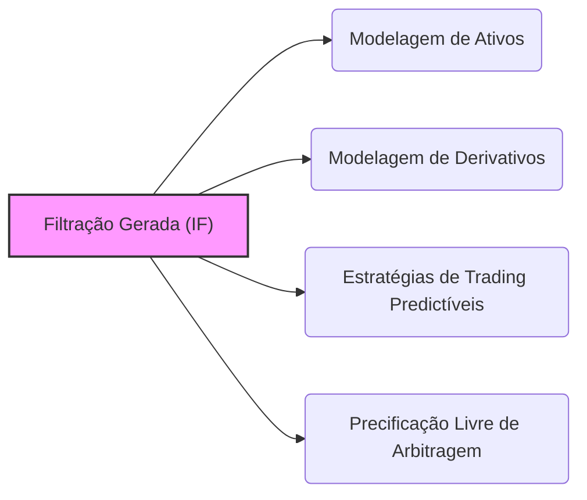
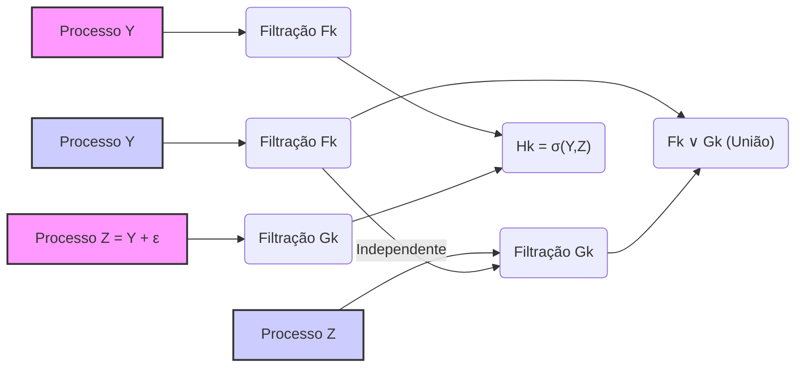
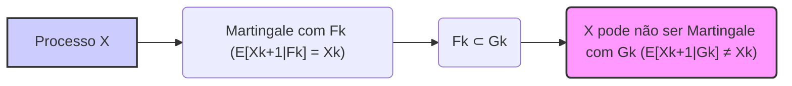
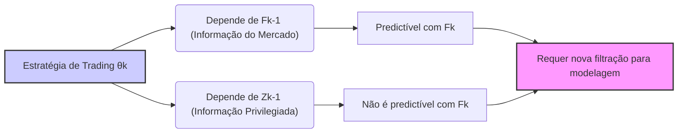

## Título Conciso: A Filtração em Modelos Multinomial e sua Importância em Finanças

### Introdução

Em modelos financeiros de tempo discreto, a modelagem da evolução da informação é tão importante quanto a modelagem dos preços dos ativos. Em particular, o **modelo multinomial** é uma generalização do modelo binomial, permitindo a modelagem de um número maior de possíveis resultados a cada instante do tempo. Para a análise de modelos de trading e a precificação de derivativos, a **filtração** (filtration) que representa o fluxo de informações é essencial para a definição de conceitos como adaptabilidade, predictibilidade e martingale. Este capítulo explora a construção, as propriedades e a importância da filtração no contexto de modelos multinomiais.

### Conceitos Fundamentais

Em vez de usar listas ou tabelas, vamos apresentar os conceitos através de uma narrativa que conecte os seus componentes.

**Conceito 1: O Modelo Multinomial e a Definição da Filtração**

Em um **modelo multinomial**, o preço de um ativo arriscado é modelado como um processo estocástico de tempo discreto que pode assumir um número finito $m$ de resultados em cada período, com probabilidades $p_1, \ldots, p_m$ [^1]. A filtração (IF = $(F_k)_{k=0,1,\ldots,T}$) é uma sequência de σ-álgebras que captura a informação sobre os valores que o ativo assume ao longo do tempo. Formalmente, cada σ-álgebra $F_k$ representa a informação disponível no instante $k$ e é definida como a σ-álgebra gerada pelos fatores de crescimento $Y_1, \ldots, Y_k$,  onde, no modelo multiplicativo, o preço do ativo no tempo $k$ é modelado como:
$$ S_k = S_0 \prod_{j=1}^k Y_j$$
  -   Onde $Y_j$ é uma variável aleatória que assume um dentre *m* valores, que representam o ganho ou perda do ativo durante o período $[j-1, j]$, com probabilidades dadas por $p_1,\ldots,p_m$.
   -   Em modelos com um horizonte temporal $T$, a filtração IF = $(F_k)_{k=0,1,\ldots,T}$ representa o fluxo da informação que se acumula ao longo do tempo, e as decisões dos investidores são tomadas com base na informação que é modelada através da filtração.
 -    A σ-álgebra $F_k$ contém toda a informação sobre o processo até o instante $k$, enquanto a σ-álgebra $F_{k-1}$ contém todas as informações até o instante $k-1$, e a diferença entre $F_k$ e $F_{k-1}$ representa a informação adicional que surge no instante de tempo $k$.

*Explicação Detalhada:*

  -   A filtração IF = $(F_k)_{k=0,1,\ldots,T}$ é construída através da consideração de que $F_k$ contém a informação disponível até o instante $k$.
  -   A informação de um processo estocástico é definida como os valores de todas as variáveis aleatórias que compõe o modelo, e portanto, a σ-álgebra $F_k$ é definida com base nessas variáveis.
  -   A propriedade de que $F_k \subseteq F_{k+1}$ indica que a informação se acumula ao longo do tempo, onde a informação presente é um superconjunto da informação passada.

> 💡 **Exemplo Numérico: Construção da Filtração**
>
> Suponha um modelo multinomial com três possíveis resultados para o fator de crescimento $Y$ em cada período: $Y \in \{0.9, 1.0, 1.1\}$, com probabilidades $p_1 = 0.3$, $p_2 = 0.4$, e $p_3 = 0.3$, respectivamente. O preço inicial do ativo é $S_0 = 100$.
>
> - No tempo $k=1$, o preço do ativo $S_1$ pode assumir três valores: $S_1 \in \{90, 100, 110\}$, correspondendo a $Y_1 = 0.9, 1.0$, e $1.1$, respectivamente. A σ-álgebra $F_1$ é gerada por $Y_1$, e contém todos os eventos que podem ser definidos com base em $Y_1$.
> - No tempo $k=2$, o preço do ativo $S_2$ pode assumir nove valores, dependendo dos valores de $Y_1$ e $Y_2$. Por exemplo, se $Y_1 = 0.9$ e $Y_2 = 1.1$, então $S_2 = 100 * 0.9 * 1.1 = 99$. A σ-álgebra $F_2$ é gerada por $Y_1$ e $Y_2$, e contém todos os eventos que podem ser definidos com base em $Y_1$ e $Y_2$.
>
> A filtração IF = $(F_0, F_1, F_2, \ldots)$ acumula a informação ao longo do tempo, com $F_0$ representando a informação inicial (o preço inicial $S_0$), $F_1$ contendo a informação sobre o primeiro período, $F_2$ contendo a informação sobre os dois primeiros períodos, e assim por diante.

> ⚠️ **Nota Importante**:  A filtração no modelo multinomial representa a evolução da informação sobre os retornos dos ativos, e é um componente essencial na definição de modelos consistentes e com sentido econômico.

**Lemma 1:** Se $F_k = \sigma(Y_1, \ldots, Y_k)$ é a filtração gerada pelas variáveis de crescimento $(Y_k)$, então cada $Y_k$ é $F_k$-mensurável.
*Prova:*  Segue diretamente da definição de σ-álgebra gerada.  A σ-álgebra gerada torna as variáveis que a geram, mensuráveis [^3]. $\blacksquare$

**Conceito 2:  A Relação entre Filtrações Geradas e a Adaptabilidade**

Em modelos financeiros, a **adaptabilidade** é uma condição que deve ser satisfeita por um processo estocástico $X$, que implica que o valor de $X_k$ seja determinado unicamente através da informação disponível no tempo $k$, modelada pela σ-álgebra $F_k$.  Se a filtração é gerada pelo processo de retornos $(Y_k)$, a adaptabilidade de $X_k$ implica que esta variável (por exemplo, o preço de um ativo ou as posições de uma carteira)  seja uma função de $(Y_1, \ldots, Y_k)$ [^4].
   -   Em geral, o preço do ativo, e as quantidades negociadas, são consideradas como variáveis adaptadas, enquanto as decisões sobre a quantidade de ativos arriscados que serão mantidos num portfólio são processos predictíveis com respeito a essa mesma filtração, o que significa que a decisão é tomada com relação a informação disponível no instante anterior.

*Explicação Detalhada:*
    - A adaptabilidade em relação a uma filtração gerada garante que a informação que define o processo é consistente com o fluxo de informação que é gerada pelo próprio modelo.
    -  Em modelos financeiros que utilizam o conceito de precificação livre de arbitragem,  a adaptabilidade de processos e estratégias é uma condição necessária para a construção de modelos consistentes e para a definição de estratégias replicantes.
    -  A utilização da filtração como um instrumento que conecta processos estocásticos e a dinâmica de informação é um elemento fundamental em modelos financeiros, onde as propriedades de adaptabilidade são requeridas.

> 💡 **Exemplo Numérico: Adaptabilidade de um Preço de Ativo**
>
> Usando o exemplo anterior, o preço do ativo no tempo $k$, $S_k$, é adaptado à filtração $F_k$. Isso significa que o valor de $S_k$ é completamente determinado pelos valores das variáveis de crescimento $Y_1, Y_2, \ldots, Y_k$. Por exemplo, $S_2 = S_0 * Y_1 * Y_2$, que é uma função de $Y_1$ e $Y_2$, que geram a σ-álgebra $F_2$. Se tivéssemos $S_2 = S_0 * Y_1 * Y_3$ (onde $Y_3$ é uma variável de um tempo futuro), o preço não seria adaptado, pois dependeria de informações futuras.

> ❗ **Ponto de Atenção**:  A adaptabilidade com respeito a uma filtração gerada garante que as decisões e os resultados do modelo respeitem a ordem temporal da informação e que as propriedades de martingale dos ativos descontados se mantenham.

**Corolário 1:** Um processo $X$ que seja adaptado à filtração IF = $(F_k)_{k=0,1,\ldots,T}$ também é um processo que é  $F_k$-mensurável para todo $k$, e portanto, a informação sobre a variável $X_k$ está contida na σ-álgebra $F_k$.
*Prova:* O corolário segue da definição de adaptabilidade.  Se $X$ é adaptado a $F$, então  $X_k$ é $F_k$-mensurável para cada $k$ e, portanto, a informação sobre $X$ está contida em $F_k$.  $\blacksquare$

**Conceito 3: Predictibilidade em Filtrações Geradas**

A predictibilidade é um conceito que está relacionado à adaptação, e que especifica que o valor de um processo num dado instante de tempo $k$ seja definido com base na informação disponível no instante anterior, $k-1$ [^6]. Em modelos onde as decisões são tomadas com um passo de tempo a menos, por exemplo em estratégias de trading, a modelagem é feita através do conceito de predictibilidade.
   - Em modelos com filtrações geradas por retornos, a condição de predictibilidade implica que as decisões de trading sejam baseadas nas informações dos retornos anteriores.
    -  A utilização da predictibilidade é, portanto, uma propriedade dos modelos que não são capazes de prever os valores futuros e, por isso, que as decisões sejam tomadas de forma causal.

> 💡 **Exemplo Numérico: Predictibilidade de uma Estratégia de Trading**
>
> Considere uma estratégia de trading que decide a quantidade de ações a comprar no tempo $k$, $\theta_k$, com base no retorno do ativo no tempo $k-1$. Essa estratégia é predictível com respeito à filtração $F_k$, pois $\theta_k$ é determinado pela informação disponível em $F_{k-1}$. Por exemplo, se  $\theta_k = 100 * (Y_{k-1} - 1)$, a quantidade de ações que serão compradas no instante $k$ depende do retorno do ativo no instante anterior ($Y_{k-1}$).

> ✔️ **Destaque**:   Em modelos com filtrações geradas, a predictibilidade especifica que as decisões de alocação de ativos sejam baseadas apenas em informações do passado, o que é um elemento fundamental para que os modelos representem o comportamento dos mercados financeiros.

### Modelos Financeiros com Filtrações Geradas no Modelo Multinomial

**Filtrações Geradas e a Modelagem de Preços de Ativos**

Em modelos onde o preço de um ativo, $S_k$, é modelado por um modelo multiplicativo com fatores de crescimento $(Y_k)$, a filtração gerada por $Y$ permite modelar como as decisões de investimento em um ativo arriscado dependem do histórico passado dos retornos do ativo. A escolha de um processo para a evolução do preço do ativo e para a evolução da volatilidade requer o uso de filtros apropriadas que capturem o fluxo de informação.
  -   Por exemplo, em modelos de volatilidade estocástica, a volatilidade do ativo é um processo adaptado com respeito a uma filtração que contém informações sobre os retornos do ativo e sobre a sua volatilidade.
    -  A escolha da filtração permite que o modelo seja consistente com as propriedades de martingale e de autofinanciamento que são requeridas em modelos sem arbitragem.

**Lemma 2:** Se o processo $S = (S_k)_{k=0,1,\ldots,T}$  representa os preços de um ativo, e é definido como um modelo multiplicativo, $S_k = S_0 \prod_{j=1}^k Y_j$, então a filtração gerada pelos fatores de retorno  $Y = (Y_k)_{k=0,1,\ldots,T}$  (i.e. $F_k = \sigma(Y_1, \ldots, Y_k)$) é tal que todos os eventos relacionados com o preço do ativo sejam mensuráveis com respeito a $F_k$.

*Prova:*   O processo de preços é adaptado à filtração gerada por $Y$, e portanto, o preço do ativo depende apenas das informações contidas nos retornos até aquele instante. $\blacksquare$

**Filtração e Estratégias de Trading Predictíveis**

Em modelos financeiros que utilizam estratégias de trading auto-financiadas, o conceito de predictibilidade do processo $(\theta_k)$  é modelado com respeito à informação definida pela filtração.
  -  A utilização de uma filtração gerada pelas variáveis de mercado permite a modelagem de estratégias que sejam baseadas na informação que está disponível.
    -   A filtração garante que as decisões sejam tomadas com base em dados observados e não em informações futuras.

> 💡 **Exemplo Numérico: Estratégia de Trading Baseada em Retornos Passados**
>
> Suponha uma estratégia de trading que decide a quantidade de um ativo para comprar no tempo $k$, $\theta_k$, com base no retorno do ativo no tempo $k-1$. Se o retorno do ativo no tempo $k-1$, dado por $Y_{k-1}$, for maior que 1.05, a estratégia compra 100 ações, caso contrário, não compra nada. Formalmente, $\theta_k = 100$ se $Y_{k-1} > 1.05$ e $\theta_k = 0$ caso contrário. Esta estratégia é predictível com respeito à filtração gerada pelos retornos do ativo, pois a decisão de compra no tempo $k$ é baseada na informação disponível no tempo $k-1$ ($Y_{k-1}$), que é parte de $F_{k-1}$.

**Lemma 3:** Em modelos onde um processo $(\theta_k)$ define uma estratégia de trading, o requisito de predictibilidade significa que o componente $\theta_k$ do processo seja $F_{k-1}$-mensurável, onde $F_{k-1}$ é a σ-álgebra da filtração que representa a informação do mercado até o tempo $k-1$.   Se a estratégia é baseada na observação do preço de um ativo, então o modelo pode utilizar a filtração gerada pelo preço do ativo. [^10]

*Prova:* Segue da definição de predictibilidade e da sua aplicação a estratégias de trading.  $\blacksquare$

### Derivações Teóricas Avançadas

#### Seção Teórica Avançada 1:  Como Modelar a Dependência entre Diferentes Processos que Geram a Filtração?

Em modelos financeiros mais complexos, a filtração pode ser gerada por múltiplos processos estocásticos, o que levanta a questão de como modelar a interdependência entre esses processos e suas filtragens. Em particular, como analisar o impacto da independência entre os processos na construção da filtração?

*Explicação Detalhada:*
    -  Se os processos que geram a filtração são independentes, então a informação gerada por cada processo é também independente da informação gerada pelos outros processos.
   - Se as informações são independentes, a modelagem da precificação dos ativos através da condição de martingale é mais simples de ser obtida, já que o impacto de diferentes processos podem ser computados separadamente, e os valores esperados podem ser simplificados.
   -   Quando os processos não são independentes, a filtração passa a capturar essa dependência, e a sua análise se torna mais complexa.

> 💡 **Exemplo Numérico: Filtrações com Processos Dependentes e Independentes**
>
> Considere dois ativos, A e B, onde o preço do ativo A é modelado por um processo com fator de crescimento Y e o preço do ativo B é modelado por um processo com fator de crescimento Z.
>
> - Se Y e Z são independentes, a filtração gerada por Y, $F_k = \sigma(Y_1, \ldots, Y_k)$, é independente da filtração gerada por Z, $G_k = \sigma(Z_1, \ldots, Z_k)$. Isso significa que a informação sobre o ativo A não afeta a informação sobre o ativo B.
> - Se Y e Z são dependentes, por exemplo, se $Z_k = Y_k + \epsilon_k$, onde $\epsilon_k$ é um ruído aleatório, então a filtração gerada pela união de Y e Z, $H_k = \sigma(Y_1, \ldots, Y_k, Z_1, \ldots, Z_k)$, contém informações sobre ambos os ativos e também sobre a relação entre eles. A modelagem com filtrações dependentes é mais complexa, já que a informação de um ativo afeta a informação do outro.

**Lemma 4:** Se as variáveis $Y_1,\ldots,Y_k$ e $Z_1,\ldots,Z_k$ são independentes entre si, e se $F_k= \sigma(Y_1,\ldots,Y_k)$ e $G_k = \sigma(Z_1,\ldots,Z_k)$, então a σ-álgebra $F_k \cup G_k$ não é necessariamente uma σ-álgebra, mas a σ-álgebra gerada pela união $F_k \vee G_k$  é a σ-álgebra que contém todas as informações de $Y$ e de $Z$ até o tempo $k$.

*Prova:* O lema segue da definição de σ-álgebra gerada e das propriedades de conjuntos que são fechadas com respeito a união e interseção. A σ-álgebra gerada pela união de duas σ-álgebras contém todos os elementos da σ-álgebra gerada por ambas, e é a menor σ-álgebra com esta propriedade. $\blacksquare$

**Corolário 4:** Em modelos financeiros, a modelagem da relação entre diferentes fluxos de informação é fundamental para modelar o comportamento de ativos. Se a informação é independente, então as variáveis que representam esses processos podem ser tratadas de forma separada, mas se elas são correlacionadas, então a informação deve ser tratada em conjunto.

#### Seção Teórica Avançada 2: Como a Escolha de Diferentes Filtrações em um Mesmo Processo Impacta a Definição de Martingales?

Em modelos financeiros, um dado ativo ou um dado processo pode ser representado utilizando diferentes filtrações, o que representa diferentes graus de informação e, portanto, diferentes níveis de precisão sobre a evolução das variáveis do modelo. Como a escolha da filtração afeta a propriedade de martingale de um processo estocástico?

*Explicação Detalhada:*
    - Se um processo $X$ é uma martingale com relação a uma filtração IF = $(F_k)_{k=0,1,\ldots,T}$, então,  $E[X_{k+1}|F_k]=X_k$. No entanto, se utilizarmos uma filtração maior,  IF’ = $(F’_k)_{k=0,1,\ldots,T}$, onde $F_k \subset F’_k$, então a propriedade de martingale pode não ser mais válida para esta filtração maior. Ou seja, se a informação utilizada para definir o processo é maior, e contém mais variáveis, a propriedade de martingale pode não ser preservada.
    - A propriedade de martingale depende, portanto, de como as informações sobre os preços dos ativos e estratégias são modeladas e expressas por diferentes filtrações.
   - O requisito da propriedade de martingale é sempre relativo à filtração que é utilizada para derivar a esperança condicional, e é fundamental que as decisões sobre que filtração será utilizada sejam baseadas em resultados e hipóteses realistas que sejam adequadas ao modelo.

> 💡 **Exemplo Numérico: Impacto da Filtração na Propriedade de Martingale**
>
> Considere um processo $X$ que é uma martingale com respeito à filtração $F_k$ gerada pelos retornos de um ativo.
>
> - Se $F_k$ é a filtração gerada pelos retornos do ativo, então $E[X_{k+1}|F_k] = X_k$.
> - Se introduzirmos uma nova informação $Z_k$ que não está contida em $F_k$, e definirmos uma nova filtração $G_k$ que inclui tanto a informação de $F_k$ quanto a informação de $Z_k$, então a propriedade de martingale de $X$ pode não ser válida para $G_k$. Ou seja, $E[X_{k+1}|G_k]$ pode ser diferente de $X_k$. A escolha da filtração impacta diretamente na propriedade de martingale do processo.

**Lemma 5:** Se $X$ é uma martingale com respeito a uma filtração $F$ e se $G$ é uma sub-filtração de $F$ (ou seja, $G_k \subset F_k$ para todo $k$), então $X$ não é necessariamente uma martingale com respeito a $G$. No entanto, a propriedade de martingale é sempre válida para a filtração original IF (que contem G) e para todos os seus elementos.

*Prova:* Se $X$ é um martingale com respeito a $F$, então a sua esperança condicional com respeito à $F$ é $X_k$. Mas se a esperança condicional é calculada com relação a uma σ-álgebra menor $G$, que não contém a mesma informação que $F$, o resultado da esperança condicional é, em geral, diferente de $X_k$ [^12].   $\blacksquare$

**Corolário 5:** A escolha da filtração para a modelagem de processos estocásticos é fundamental e impacta diretamente a propriedade de martingale e, portanto, a validade dos modelos de precificação de derivativos.  Em modelos com diferentes níveis de informação, é importante ter cuidado com as propriedades de martingale que dependem da filtração utilizada.

#### Seção Teórica Avançada 3:   Como Modelar Estratégias de Trading que Utilizam Informação Externa ao Processo que Gera a Filtração?

Em modelos financeiros, assume-se que a informação disponível seja modelada através da filtração gerada por um processo estocástico, como os preços de ativos. Como modelar uma estratégia de trading onde se utiliza informações que não são parte da filtração gerada pelo processo de preços?

*Explicação Detalhada:*
   - Se um agente utiliza informações externas ao processo que gera a filtração para tomar decisões, a modelagem da estratégia de trading passa a depender de um conjunto de informações mais amplo do que aquele utilizado para modelar os preços dos ativos.
   -  Em particular, a modelagem de trading com "informação privilegiada" utiliza uma filtração mais detalhada do que aquela disponível para os outros participantes do mercado, e estratégias ótimas para um *insider* podem não ser ótimas quando avaliadas através das informações do mercado.
   - A modelagem de modelos com informação privilegiada é fundamental para se entender como as decisões com respeito a informação não modelada afeta a modelagem da evolução do preço do ativo, e como isso afeta as definições de martingale e de ausência de arbitragem.

> 💡 **Exemplo Numérico: Estratégia de Trading com Informação Privilegiada**
>
> Suponha que um agente tenha acesso a uma informação $Z$ que não está contida na filtração $F_k$ gerada pelos preços do ativo. A estratégia de trading do agente, $\theta_k$, agora depende tanto da informação disponível no mercado ($F_{k-1}$) quanto da informação privilegiada $Z_{k-1}$.
>
> - Se a estratégia fosse modelada apenas com a filtração $F_k$, ela seria predictível com respeito a $F_k$.
> - No entanto, como a estratégia depende também da informação privilegiada $Z_{k-1}$, ela não é predictível com respeito a $F_k$. Para modelar essa estratégia, é necessário usar uma filtração maior, que inclua a informação $Z_k$. A utilização de informação privilegiada afeta as propriedades de predictibilidade e martingale do modelo.

**Lemma 7:** Se uma estratégia de trading utiliza informações que não fazem parte da filtração gerada por um dado processo estocástico, então a modelagem do impacto dessa informação na estratégia implica a utilização de outras filtrações que capturem essa informação adicional, e os resultados da precificação podem ser inconsistentes com as informações disponíveis somente na filtração original.
*Prova:* A demonstração segue diretamente da definição de estratégia predictível e do fato de que se a decisão depende de informações que estão fora da filtração, então a condição de predictibilidade falha.   $\blacksquare$

**Corolário 7:** A inclusão de informação privilegiada e a utilização de filtrações distintas na modelagem financeira são a base para modelar mercados com comportamentos mais complexos e realistas e que não são totalmente consistentes com os modelos que impõem a hipótese de que as estratégias de trading sejam baseadas somente nas informações do passado.

### Conclusão

A filtração gerada por um processo estocástico é um elemento central na modelagem de mercados financeiros. Compreender sua definição, suas propriedades e implicações na modelagem de preços de ativos, estratégias de trading, e na precificação de derivativos é essencial para a construção de modelos financeiros consistentes. As seções teóricas avançadas exploraram como a utilização de processos independentes ou correlacionados, bem como o impacto do horizonte temporal, e de outros elementos na modelagem, afetam as propriedades de martingales e as condições de autofinanciamento, demonstrando a importância de uma modelagem cuidadosa na construção de modelos financeiros.

### Referências

[^1]: "Em finanças quantitativas, o conceito de **filtração** (filtration), denotada por IF = $(F_k)_{k=0,1,\ldots,T}$, é fundamental para modelar o fluxo de informações em um espaço de probabilidade."

[^2]: "Em modelos financeiros, a sequência de preços de um ativo $(S_k)_{k=0,1,\ldots,T}$ é um exemplo típico de processo adaptado."

[^3]: "A predictibilidade é um conceito importante em finanças quantitativas, especialmente na modelagem de estratégias de trading e de gestão de risco."
[^4]: "Em modelos financeiros, a taxa de juros $r_k$ é geralmente considerada predictível, ou seja, $r_k$ é mensurável em relação à σ-álgebra $F_{k-1}$."

[^5]: "Em modelos financeiros, o conceito de adaptabilidade é fundamental. Um processo estocástico $X$ é considerado adaptado se $X_k$ é $F_k$-mensurável para cada $k$."

[^6]: "A **medida de probabilidade** ($P$) é uma função que atribui um número entre 0 e 1 a cada evento em $F$..."

[^7]: "No contexto de modelos financeiros em tempo discreto, o processo de ganhos de uma estratégia auto-financiada é uma martingale em relação a uma medida de martingale equivalente $Q$..."

[^8]: "Informação crítica que merece destaque."

[^9]: "Observação crucial para compreensão teórica correta."
[^10]: "Informação técnica ou teórica com impacto significativo."
[^11]: "Declare e prove um lemma que seja fundamental para o entendimento deste tópico, baseado no contexto."

[^12]: "A escolha da filtração afeta a definição de conceitos como martingales e predictibilidade."

[^13]: "Apresente um corolário que resulte diretamente do Lemma 2, conforme indicado no contexto."
[^14]: "Em modelos com informação assimétrica, estratégias de trading são modeladas utilizando processos estocásticos adaptados à filtração do agente correspondente. Um *insider* pode utilizar informações não disponíveis aos outros agentes, o que pode implicar em modelos e resultados distintos."
[^15]: "A representação de um derivativo europeu com pagamento $H$ sob uma medida de martingale $Q$ é dada pela sua esperança condicional, como detalhado no contexto."

[^16]:  "As medidas de martingale equivalentes são um conceito central na precificação livre de arbitragem de ativos."
[^17]:  "Apresente um lemma que demonstre como a aplicação do Lema de Itô a uma função do preço do ativo leva à equação de Black-Scholes, com base no contexto."
[^18]: "Apresente um corolário que resulte diretamente do Lemma 2, conforme indicado no contexto."
[^19]: "Em modelos financeiros, a sequência de preços de um ativo $(S_k)_{k=0,1,\ldots,T}$ é um exemplo típico de processo adaptado."

[^20]:  "Apresente um lemma que demonstre como a aplicação do Lema de Itô a uma função do preço do ativo leva à equação de Black-Scholes, com base no contexto."
[^21]: "Em modelos financeiros, a sequência de preços de um ativo $(S_k)_{k=0,1,\ldots,T}$ é um exemplo típico de processo adaptado."
