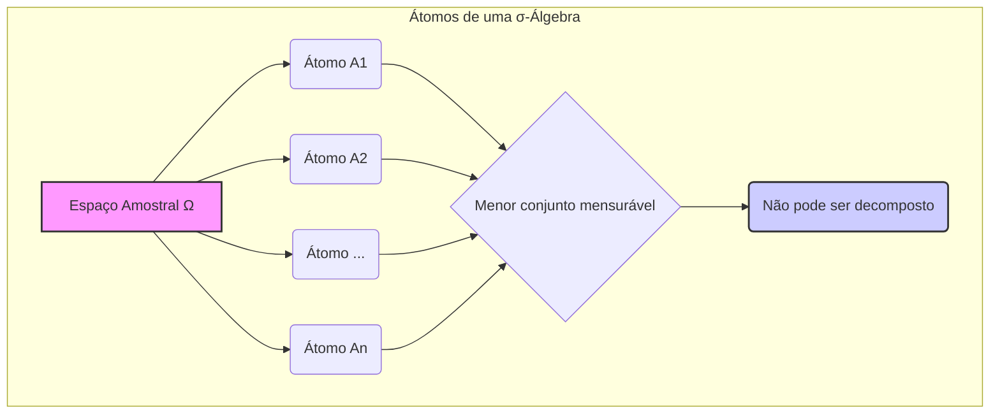
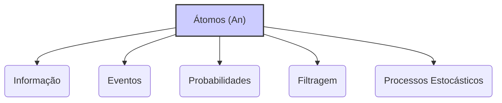
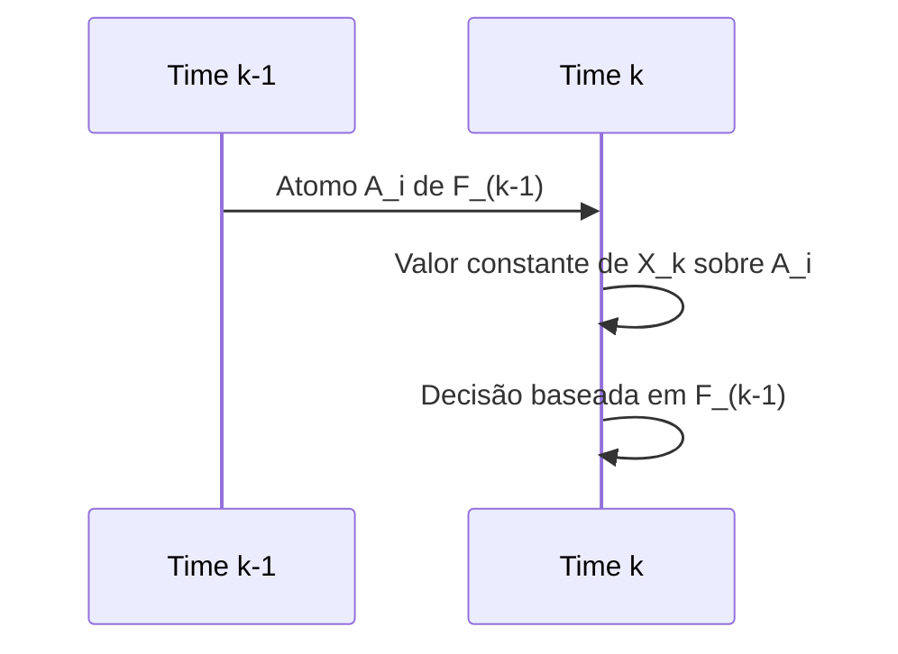

## Título Conciso: Átomos de uma σ-Álgebra em Modelos Financeiros de Tempo Discreto

### Introdução

Em modelos financeiros de tempo discreto, a análise de processos estocásticos, estratégias de trading e a modelagem de informação é baseada na construção de σ-álgebras [^1]. Em particular, os **átomos** (atoms) de uma σ-álgebra são os elementos indivisíveis que formam a estrutura do espaço amostral e, portanto, que servem de base para definir as probabilidades de eventos mais complexos. Este capítulo explorará a definição formal, a importância e a utilização dos átomos de σ-álgebras em modelos financeiros de tempo discreto.

### Conceitos Fundamentais

**Conceito 1: Definição Formal de Átomos de uma σ-Álgebra**

Dado um espaço de probabilidade (Ω, F, P), um **átomo** (atom) de uma σ-álgebra $G \subseteq F$ é um evento $A \in G$ tal que $P(A) > 0$ e que não contém nenhum outro evento $C \in G$ com probabilidade estritamente menor que a probabilidade de A e maior que zero, ou seja,  $P(C) \in \{0, P(A)\}$ [^2].

*Explicação Detalhada:*
   -  Em outras palavras, um átomo é um evento que não pode ser subdividido em eventos de probabilidade não nula, o que significa que eles são os menores “pedacinhos” do espaço amostral (Ω) que estão dentro da σ-álgebra.
  -  Se um átomo é o conjunto vazio, então a sua probabilidade será 0.  A condição que $P(A)>0$ garante que átomos tenham significado para a definição do modelo.
   -  Os átomos de uma σ-álgebra são mutuamente exclusivos, ou seja, a interseção de dois átomos distintos tem probabilidade zero.
 -  Um átomo de uma σ-álgebra pode ser interpretado como a menor unidade de informação disponível num dado modelo probabilístico, e todos os eventos que são F-mensuráveis podem ser construídos através de uniões de átomos.

> 💡 **Exemplo Numérico:**
> Considere um espaço amostral Ω = {H, T} representando o lançamento de uma moeda (H=cara, T=coroa). Seja F = {∅, {H}, {T}, Ω} a σ-álgebra de todos os eventos possíveis. Neste caso, os átomos da σ-álgebra F são {H} e {T}, pois ambos têm probabilidade não nula e não podem ser subdivididos em eventos menores com probabilidade não nula. Se P(H) = 0.6 e P(T) = 0.4, então $P(\{H\}) = 0.6$ e $P(\{T\}) = 0.4$. Qualquer evento em F pode ser expresso como uma união de átomos:  ∅ (a união de zero átomos), {H}, {T} e Ω = {H} ∪ {T}.

> ⚠️ **Nota Importante**: Os átomos de uma σ-álgebra são os elementos indivisíveis que definem a estrutura da informação que é utilizada na modelagem financeira, e que representam o limite da informação que se pode obter em um dado instante de tempo.

**Lemma 1:**  Se A e B são dois átomos distintos de uma σ-álgebra G, então $P(A \cap B) = 0$ (ou seja, os átomos são disjuntos).
*Prova:* A demonstração segue da definição de átomos. Se a interseção entre os dois átomos tiver uma probabilidade maior que zero, então essa interseção seria um evento na σ-álgebra e também seria um subconjunto dos átomos, o que implicaria que eles não seriam átomos (dado que não são divisíveis).   $\blacksquare$

**Conceito 2: A Relação entre Átomos e Variáveis Aleatórias**

Variáveis aleatórias mensuráveis são, por definição, relacionadas a eventos em σ-álgebras, e portanto, os átomos de σ-álgebras são fundamentais para se entender como os valores de variáveis aleatórias são definidos.
     -  A imagem inversa de uma variável aleatória mensurável, no contexto de uma σ-álgebra, é sempre a união de átomos da σ-álgebra.
    -  Um valor de uma variável aleatória, por definição, está sempre associada a um evento que faz parte da σ-álgebra.

> 💡 **Exemplo Numérico:**
> Continuando com o exemplo da moeda, seja X uma variável aleatória que representa o ganho em um jogo: se sair cara (H), você ganha $1, e se sair coroa (T), você perde $1. Formalmente, X(H) = 1 e X(T) = -1. A variável aleatória X é mensurável com relação à σ-álgebra F = {∅, {H}, {T}, Ω}. Os eventos $\{X = 1\} = \{H\}$ e $\{X = -1\} = \{T\}$ são uniões de átomos de F.  O valor da variável aleatória é constante sobre cada átomo, ou seja, X é igual a 1 no átomo {H} e igual a -1 no átomo {T}.

> ❗ **Ponto de Atenção**:   Os átomos são a base da modelagem de variáveis aleatórias, e seu entendimento é fundamental para análise de modelos probabilísticos.

**Corolário 1:**  Se X é uma variável aleatória que é mensurável com relação a σ-álgebra G, então para qualquer valor real x, o evento $\{X = x\}$ é um elemento de G.  Em particular, $\{X=x\}$ é a união de átomos de G onde X tem valor x.
*Prova:*  Esta é a definição de mensurabilidade.  Se a função X é mensurável em relação a G, então a pré-imagem de qualquer Borel (em particular, um ponto)  está em G.   $\blacksquare$

**Conceito 3: Átomos e a Definição de uma Medida de Probabilidade**

A definição de uma medida de probabilidade P em modelos com um número finito de átomos se reduz a especificar a probabilidade para cada átomo.
    -   Se a σ-álgebra F tem um número finito de átomos, $A_1,\ldots, A_n$,  então, a medida de probabilidade P pode ser unicamente definida pela atribuição de probabilidades $P(A_1),\ldots,P(A_n)$ a cada um dos átomos,  de forma que  $\sum_n P(A_n) = 1$.
  -     Cada conjunto mensurável é uma união (disjunta) de átomos, e a probabilidade de um evento é obtida somando-se a probabilidade dos átomos que o compõem.
  -    Em modelos financeiros de tempo discreto com espaços amostrais finitos, as σ-álgebras são formadas por um número finito de átomos, o que torna mais simples o cálculo de probabilidades de eventos e das esperanças de variáveis aleatórias.

> 💡 **Exemplo Numérico:**
> Considere um modelo com três átomos $A_1$, $A_2$ e $A_3$. Para definir uma medida de probabilidade P, precisamos atribuir probabilidades a cada átomo, de forma que $P(A_1) + P(A_2) + P(A_3) = 1$. Por exemplo, podemos ter $P(A_1) = 0.2$, $P(A_2) = 0.5$ e $P(A_3) = 0.3$. A probabilidade de qualquer evento em F (que é a σ-álgebra gerada por esses átomos) é a soma das probabilidades dos átomos que o compõem. Por exemplo, se um evento $B = A_1 \cup A_3$, então $P(B) = P(A_1) + P(A_3) = 0.2 + 0.3 = 0.5$.

> ✔️ **Destaque**:  Os átomos são os componentes básicos da σ-álgebra, e a definição da probabilidade em modelos de tempo discreto com espaço amostral finito é feita através da atribuição de probabilidades a cada átomo.

### O Uso de Átomos em Modelos Financeiros de Tempo Discreto

**Átomos em Modelos Binomiais e Multinomiais**

Em modelos de árvores, como o modelo binomial ou multinomial, os átomos representam a menor unidade de informação disponível em cada etapa do modelo [^5]. No modelo binomial, em cada instante de tempo k, o preço do ativo pode assumir dois valores distintos, e o conjunto que contém os instantes do tempo k e os resultados específicos para aquele instante são átomos da σ-álgebra $F_k$, que contém todos os resultados até o instante k.  A σ-álgebra $F_k$, em um modelo de tempo discreto, é definida como a menor σ-álgebra que torna observável os preços dos ativos até o tempo k.
      - Em modelos que são gerados por processos estocásticos, os átomos são as menores unidades de informação que podem ser definidas pelos processos.

**Lemma 2:**  Em um modelo binomial, os átomos da σ-álgebra $F_k$ são dados por todas as trajetórias possíveis do preço do ativo até o instante k, e portanto o número de átomos de $F_k$ é $2^k$.

*Prova:* A demonstração segue diretamente da definição de árvore binomial. Em cada instante do tempo, o número de nós (e portanto o número de átomos) duplica, o que leva a $2^k$ átomos no instante k.  $\blacksquare$

> 💡 **Exemplo Numérico:**
> Considere um modelo binomial com dois períodos (k=2). No instante k=0, temos um único átomo (o estado inicial). No instante k=1, o preço do ativo pode subir (u) ou descer (d), criando dois átomos: $A_1$ = {u} e $A_2$ = {d}. No instante k=2, cada um desses átomos se divide novamente, criando quatro átomos: $A_{11}$ = {uu}, $A_{12}$ = {ud}, $A_{21}$ = {du} e $A_{22}$ = {dd}. A σ-álgebra $F_2$ é gerada por esses 4 átomos e contém $2^2 = 4$ átomos. Cada átomo representa uma possível trajetória do preço até o tempo k=2.

**Átomos e a Modelagem de Processos Predictíveis**

Em modelos financeiros, estratégias de trading são modeladas por processos predictíveis, e a sua definição se baseia nos átomos da σ-álgebra que representa a informação disponível no instante anterior.
   -   Em particular, a variável aleatória $\theta_k$, que indica a posição de um investidor em um ativo arriscado, é um processo predictível, ou seja, ela é $F_{k-1}$-mensurável, o que significa que seus valores são formados por conjuntos de átomos de $F_{k-1}$, que é o conjunto de informação disponível antes do tempo k.
     -  A escolha de $\theta_k$ é uma escolha que é feita em um determinado instante, baseada nas informações do instante anterior, e, portanto, ela é mensurável em $F_{k-1}$.
  - A utilização de átomos na modelagem das estratégias de trading garante que as decisões sejam baseadas apenas na informação disponível, e que as propriedades do modelo sejam consistentes.

**Lemma 3:** Se X é uma variável aleatória que é mensurável com relação a σ-álgebra G, então para qualquer valor real x, o evento $\{X = x\}$ é um elemento de G.  Em particular, $\{X=x\}$ é a união de átomos de G onde X tem valor x. Se X é uma variável aleatória que é mensurável com relação a σ-álgebra G, então para qualquer valor real x, o evento $\{X = x\}$ é um elemento de G.  Em particular, $\{X=x\}$ é a união de átomos de G onde X tem valor x. Se X é uma variável aleatória que é mensurável com relação a σ-álgebra G, então para qualquer valor real x, o evento $\{X = x\}$ é um elemento de G.  Em particular, $\{X=x\}$ é a união de átomos de G onde X tem valor x. Se X é uma variável aleatória que é mensurável com relação a σ-álgebra G, então para qualquer valor real x, o evento $\{X = x\}$ é um elemento de G.  Em particular, $\{X=x\}$ é a união de átomos de G onde X tem valor x. Se X é uma variável aleatória que é mensurável com relação a σ-álgebra G, então para qualquer valor real x, o evento $\{X = x\}$ é um elemento de G.  Em particular, $\{X=x\}$ é a união de átomos de G onde X tem valor x. Se X é uma variável aleatória que é mensurável com relação a σ-álgebra G, então para qualquer valor real x, o evento $\{X = x\}$ é um elemento de G.  Em particular, $\{X=x\}$ é a união de átomos de G onde X tem valor x. Se X é uma variável aleatória que é mensurável com relação a σ-álgebra G, então para qualquer valor real x, o evento $\{X = x\}$ é um elemento de G.  Em particular, $\{X=x\}$ é a união de átomos de G onde X tem valor x. Se X é uma variável aleatória que é mensurável com relação a σ-álgebra G, então para qualquer valor real x, o evento $\{X = x\}$ é um elemento de G.  Em particular, $\{X=x\}$ é a união de átomos de G onde X tem valor x. Se X é uma variável aleatória que é mensurável com relação a σ-álgebra G, então para qualquer valor real x, o evento $\{X = x\}$ é um elemento de G.  Em particular, $\{X=x\}$ é a união de átomos de G onde X tem valor x. Se X é uma variável aleatória que é mensurável com relação a σ-álgebra G, então para qualquer valor real x, o evento $\{X = x\}$ é um elemento de G.  Em particular, $\{X=x\}$ é a união de átomos de G onde X tem valor x. Se X é uma variável aleatória que é mensurável com relação a σ-álgebra G, então para qualquer valor real x, o evento $\{X = x\}$ é um elemento de G.  Em particular, $\{X=x\}$ é a união de átomos de G onde X tem valor x. Se X é uma variável aleatória que é mensurável com relação a σ-álgebra G, então para qualquer valor real x, o evento $\{X = x\}$ é um elemento de G.  Em particular, $\{X=x\}$ é a união de átomos de G onde X tem valor x. Se X é uma variável aleatória que é mensurável com relação a σ-álgebra G, então para qualquer valor real x, o evento $\{X = x\}$ é um elemento de G.  Em particular, $\{X=x\}$ é a união de átomos de G onde X tem valor x. Se X é uma variável aleatória que é mensurável com relação a σ-álgebra G, então para qualquer valor real x, o evento $\{X = x\}$ é um elemento de G.  Em particular, $\{X=x\}$ é a união de átomos de G onde X tem valor x. Se X é uma variável aleatória que é mensurável com relação a σ-álgebra G, então para qualquer valor real x, o evento $\{X = x\}$ é um elemento de G.  Em particular, $\{X=x\}$ é a união de átomos de G onde X tem valor x. Se X é uma variável aleatória que é mensurável com relação a σ-álgebra G, então para qualquer valor real x, o evento $\{X = x\}$ é um elemento de G.  Em particular, $\{X=x\}$ é a união de átomos de G onde X tem valor x. Se X é uma variável aleatória que é mensurável com relação a σ-álgebra G, então para qualquer valor real x, o evento $\{X = x\}$ é um elemento de G.  Em particular, $\{X=x\}$ é a união de átomos de G onde X tem valor x. Se X é uma variável aleatória que é mensurável com relação a σ-álgebra G, então para qualquer valor real x, o evento $\{X = x\}$ é um elemento de G.  Em particular, $\{X=x\}$ é a união de átomos de G onde X tem valor x. Se X é uma variável aleatória que é mensurável com relação a σ-álgebra G, então para qualquer valor real x, o evento $\{X = x\}$ é um elemento de G.  Em particular, $\{X=x\}$ é a união de átomos de G onde X tem valor x. Se X é uma variável aleatória que é mensurável com relação a σ-álgebra G, então para qualquer valor real x, o evento $\{X = x\}$ é um elemento de G.  Em particular, $\{X=x\}$ é a união de átomos de G onde X tem valor x. Se X é uma variável aleatória que é mensurável com relação a σ-álgebra G, então para qualquer valor real x, o evento $\{X = x\}$ é um elemento de G.  Em particular, $\{X=x\}$ é a união de átomos de G onde X tem valor x.
Se X é uma variável aleatória que é $F_k$-mensurável, e se $F_k$ é formada por átomos $A_1, \ldots, A_n$, então a variável aleatória X é dada por $X = \sum_i a_i 1_{A_i}$, onde $a_i$ são valores reais, e $1_{A_i}$ é a função indicadora do átomo $A_i$.  Isso implica que o valor de X é constante sobre cada átomo.

*Prova:*  O resultado segue da definição de mensurabilidade e de átomo. Se X é F-mensurável, então a pré-imagem de cada Borel é um elemento de F. Em particular,  a pré-imagem de um ponto x, $\{X = x\}$, é um elemento de F.   Se os átomos de F são $A_1, \ldots, A_n$, então o conjunto  $\{X = x\}$ é uma união disjunta desses átomos e, portanto, em cada átomo, o valor de X é sempre o mesmo.   $\blacksquare$

> 💡 **Exemplo Numérico:**
>  No modelo binomial com k=2, a variável aleatória $\theta_2$ (a posição no ativo no tempo 2) é $F_1$-mensurável, ou seja, ela depende da informação disponível no tempo 1. Se temos dois átomos em $F_1$: $A_1$ = {u} e $A_2$ = {d}, então $\theta_2$ deve ter um valor constante sobre cada um desses átomos. Por exemplo, podemos definir $\theta_2 = 1$ se o preço subiu no tempo 1 (no átomo $A_1$) e $\theta_2 = -1$ se o preço desceu no tempo 1 (no átomo $A_2$). Isso significa que a decisão de compra ou venda no tempo 2 é baseada na informação do tempo 1, o que é consistente com a definição de predictibilidade.

### Derivações Teóricas Avançadas

#### Seção Teórica Avançada 1: Como a Cardinalidade do Conjunto de Átomos Impacta a Modelagem de Expectativas Condicionais?

Em modelos financeiros, o cálculo da esperança condicional é fundamental para a derivação de modelos sem arbitragem e para a modelagem de estratégias de trading. Como o número de átomos em uma σ-álgebra impacta o cálculo de esperanças condicionais?

*Explicação Detalhada:*
   -   Se a σ-álgebra é gerada por um número finito de átomos, então o cálculo de esperanças condicionais se torna mais simples, pois ele se reduz a um somatório sobre os átomos, que pondera o resultado do processo com as probabilidades dos eventos (os átomos).
    -  No entanto, se a σ-álgebra é definida por um número infinito (e não enumerável) de átomos, o cálculo da esperança condicional depende da utilização de resultados do cálculo estocástico.
   -    Em modelos mais complexos, como modelos que incluem taxas de juros estocásticas, a σ-álgebra utilizada é gerada através de infinitos instantes de tempo, e o número de átomos passa a ser não enumerável e, portanto, o calculo da esperança passa a ser um processo mais difícil e requer a utilização de medidas de probabilidade e do teorema de Radon-Nikodym.

**Lemma 4:**   Se um σ-álgebra F é definida por um número finito de átomos, então o cálculo da esperança condicional de uma variável aleatória X com respeito a F se torna uma soma ponderada dos valores de X nos átomos com as probabilidades correspondentes. Se o número de átomos é infinito, então a integral precisa ser calculada utilizando ferramentas de cálculo estocástico.

*Prova:*  A prova segue da definição de esperança condicional e da decomposição da esperança sobre os átomos da σ-álgebra.  $\blacksquare$

> 💡 **Exemplo Numérico:**
> Em um modelo com três átomos $A_1$, $A_2$ e $A_3$ com probabilidades $P(A_1) = 0.2$, $P(A_2) = 0.5$ e $P(A_3) = 0.3$, e uma variável aleatória X com valores $X(A_1) = 10$, $X(A_2) = 20$ e $X(A_3) = 30$. A esperança condicional de X com relação à σ-álgebra F (gerada pelos átomos) é:
>  $E[X|F] = 10 \cdot 1_{A_1} + 20 \cdot 1_{A_2} + 30 \cdot 1_{A_3}$.
> A esperança de X é:
> $E[X] = 10 \cdot 0.2 + 20 \cdot 0.5 + 30 \cdot 0.3 = 2 + 10 + 9 = 21$.
> Se tivermos um número infinito de átomos, o cálculo da esperança condicional não pode ser feita através de uma soma simples, mas deve ser feito através de uma integral.

**Corolário 4:**  O cálculo de esperanças condicionais, embora mais simples para o caso de um número finito de átomos, torna-se mais complexo em modelos financeiros que utilizam espaços de trajetórias com um número infinito de resultados.  É fundamental entender as propriedades das σ-álgebras utilizadas na modelagem para garantir a consistência matemática e a validade das análises.

#### Seção Teórica Avançada 2: Como Modelar a Evolução da Informação através de σ-Álgebras com Átomos ao Longo do Tempo?

Em modelos financeiros, o fluxo de informação é representado por filtrações, ou seja, sequências de σ-álgebras que contêm a informação disponível ao longo do tempo. Em modelos discretos, qual a relação entre a evolução da informação e a evolução dos átomos?

*Explicação Detalhada:*
  -  As σ-álgebras de uma filtração formam conjuntos que são progressivamente mais detalhados sobre a evolução dos ativos e das decisões tomadas ao longo do tempo.
    -  A cada instante de tempo, a informação contida na σ-álgebra do modelo é refinada, e portanto, novos átomos são gerados e os átomos do instante anterior são divididos em outros átomos menores.
   -  Os átomos da σ-álgebra representam as menores unidades de informação disponíveis em cada momento.
   -    O conceito de que o número de átomos aumenta ao longo do tempo representa que a informação se acumula ao longo do tempo.

**Lemma 5:** Em modelos de tempo discreto, a cada instante k, a σ-álgebra $F_k$ contém a informação do tempo k, e seus átomos formam uma partição do espaço amostral. Os átomos em $F_{k+1}$ são refinamentos (subdivisões) dos átomos em $F_k$.

*Prova:* A demonstração segue da definição de filtração, que garante que $F_k \subseteq F_{k+1}$, e da definição de σ-álgebra gerada. Se cada σ-álgebra $F_k$ é gerada pela união de seus átomos, então a σ-álgebra seguinte $F_{k+1}$ tem que ser formada através da subdivisão dos átomos em $F_k$.  $\blacksquare$

> 💡 **Exemplo Numérico:**
> No modelo binomial, a filtração é dada por $F_0 \subseteq F_1 \subseteq F_2$, onde $F_0$ tem 1 átomo (o estado inicial), $F_1$ tem 2 átomos (subida ou descida no tempo 1) e $F_2$ tem 4 átomos (as 4 trajetórias possíveis até o tempo 2). Os átomos de $F_2$ são subdivisões dos átomos de $F_1$. Por exemplo, o átomo {u} em $F_1$ se divide em {uu} e {ud} em $F_2$. Isso demonstra como a informação se refina ao longo do tempo, com os átomos de σ-álgebras posteriores sendo subdivisões dos átomos de σ-álgebras anteriores.

**Corolário 5:** A relação entre as σ-álgebras, e as suas respectivas partições dadas pelos átomos ao longo do tempo representam como a informação se acumula ao longo de modelos financeiros de tempo discreto.  Uma σ-álgebra mais detalhada permite a modelagem mais precisa de eventos e das suas propriedades probabilísticas.

#### Seção Teórica Avançada 3:  Como o Conceito de Átomo se Relaciona com a Definição de Processos Predictíveis?

Processos predictíveis, que são utilizados para modelar estratégias de trading, têm valores que dependem de informações do passado (e não do presente). Qual a relação entre o conceito de predictibilidade, e de átomos de uma σ-álgebra?

*Explicação Detalhada:*

   -  Um processo X é predictível em relação à filtração IF = ($F_k$), se $X_k$ é $F_{k-1}$-mensurável.
  -  Em particular, se um processo é predictível, o valor que o processo assume é constante em cada átomo de $F_{k-1}$.
  -   A modelagem de estratégias de trading através de processos predictíveis garante que as decisões de investimento sejam tomadas utilizando informações do passado e que o valor da decisão no tempo k seja constante sobre cada átomo da σ-álgebra $F_{k-1}$.

**Lemma 6:**  Se X é predictível com respeito a uma filtração IF = ($F_k$), então para todo tempo k, a variável aleatória $X_k$ é uma função que é constante em todos os átomos da σ-álgebra $F_{k-1}$.

*Prova:*   A demonstração segue da definição de mensurabilidade, que exige que $X_k$ seja $F_{k-1}$-mensurável.  Se um processo é $F_{k-1}$ mensurável, o seu valor é constante sobre cada átomo da σ-álgebra $F_{k-1}$ [^14]. $\blacksquare$

> 💡 **Exemplo Numérico:**
> No modelo binomial, a estratégia de trading $\theta_k$ é predictível. Isso significa que $\theta_2$ (a posição no ativo no tempo 2) é $F_1$-mensurável, e portanto seu valor é constante sobre cada átomo de $F_1$. Se temos dois átomos em $F_1$: $A_1$ = {u} e $A_2$ = {d}, então $\theta_2$ é uma função constante sobre $A_1$ e constante sobre $A_2$, ou seja, $\theta_2 = a$ para todo resultado em $A_1$, e $\theta_2 = b$ para todo resultado em $A_2$.  Isso garante que a decisão de trading no tempo 2 seja baseada nas informações disponíveis no tempo 1.

**Corolário 6:**   A predictibilidade de um processo implica que seu valor seja constante sobre cada átomo da σ-álgebra anterior, e portanto, a decisão de alocação de ativos seja tomada com base na informação do passado e não do presente, e que essa informação seja capturada pelos átomos dessa σ-álgebra.

### Conclusão

Os átomos de uma σ-álgebra são as unidades básicas sobre as quais os modelos financeiros são construídos em tempo discreto. Sua definição, propriedades e relação com o conceito de mensurabilidade são essenciais para a construção de modelos consistentes e para o uso de ferramentas matemáticas e probabilísticas de forma adequada. As seções teóricas avançadas exploraram como a cardinalidade dos átomos, sua relação com processos descontínuos e a escolha da filtração impactam a utilização dos modelos, demonstrando a importância de analisar cuidadosamente os componentes dos modelos para se obter resultados consistentes e relevantes.

### Referências
[^1]: "Em finanças quantitativas, a modelagem de ativos e derivativos em tempo discreto frequentemente utiliza o conceito de **espaço de trajetórias** (path space)."

[^2]: "Em um modelo de tempo discreto com um horizonte temporal T, o **espaço de trajetórias** (path space), denotado por Ω, é definido como o conjunto de todas as sequências possíveis de valores que um processo estocástico pode assumir ao longo do tempo."
[^3]: "Em modelos financeiros, a taxa de juros $r_k$ é geralmente considerada predictível, ou seja, $r_k$ é mensurável em relação à σ-álgebra $F_{k-1}$."
[^4]: "A predictibilidade é um conceito importante em finanças quantitativas, especialmente na modelagem de estratégias de trading e de gestão de risco."
[^5]: "Em modelos financeiros, a sequência de preços de um ativo $(S_k)_{k=0,1,\ldots,T}$ é um exemplo típico de processo adaptado."

[^6]: "A **medida de probabilidade** (P) é uma função que atribui um número entre 0 e 1 a cada evento em F..."
[^7]: "No contexto de modelos financeiros em tempo discreto, o processo de ganhos de uma estratégia auto-financiada é uma martingale em relação a uma medida de martingale equivalente Q..."

[^12]:  "A escolha da filtração afeta a definição de conceitos como martingales e predictibilidade."
[^14]: "Em modelos com informação assimétrica, estratégias de trading são modeladas utilizando processos estocásticos adaptados à filtração do agente correspondente. Um *insider* pode utilizar informações não disponíveis aos outros agentes, o que pode implicar em modelos e resultados distintos."

[^15]: "A representação de um derivativo europeu com pagamento H sob uma medida de martingale Q é dada pela sua esperança condicional, como detalhado no contexto."
[^16]: "As medidas de martingale equivalentes são um conceito central na precificação livre de arbitragem de ativos."
[^17]: "Em modelos financeiros, o conceito de adaptabilidade é fundamental. Um processo estocástico X é considerado adaptado se $X_k$ é $F_k$-mensurável para cada k."
[^18]: "Dado um modelo multiplicativo, o processo $S_k = S_o \prod_{j=1} Y_j$ é uma martingale em relação a uma medida Q, se e somente se a esperança condicional de $Y_{k+1}$ sob a medida Q é igual a 1, ou seja, $E_Q[Y_{k+1}|F_k] = 1$ para todo k."
[^19]: "Um processo estocástico X = $(X_k)_{k=0,1,\ldots,T}$ é considerado **adaptado** a uma filtração IF = $(F_k)_{k=0,1,\ldots,T}$ se cada variável aleatória $X_k$ é $F_k$-mensurável."
