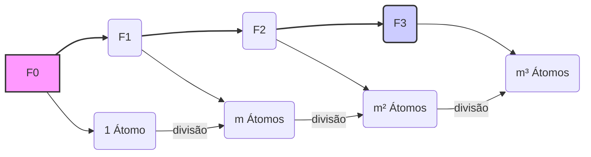

## Título Conciso: Estrutura dos Átomos em um Modelo Multinomial e suas Implicações na Modelagem Financeira

```mermaid
graph LR
    A["Início: Modelo Multinomial"] --> B("Fatores de Crescimento Aleatórios Yk (m valores)");
    B --> C("Espaço de Trajetórias Ω (Sequências de Yk)");
    C --> D("σ-álgebras Fk (Informação até tempo k)");
    D --> E("Átomos de Fk (Trajetórias Parciais até k)");
    E --> F("Modelagem de Variáveis Aleatórias");
    F --> G("Estratégias de Trading e Precificação de Derivativos");
    style A fill:#f9f,stroke:#333,stroke-width:2px
    style G fill:#ccf,stroke:#333,stroke-width:2px
```



### Introdução

Em finanças quantitativas, a modelagem de mercados financeiros em tempo discreto frequentemente utiliza o **modelo multinomial**, que generaliza o modelo binomial, permitindo que o preço de um ativo assuma mais de dois valores a cada instante. A **estrutura dos átomos** (atoms) das $\sigma$-álgebras nesse tipo de modelo é essencial para a definição de variáveis aleatórias e para a construção de estratégias de trading e precificação de derivativos. Este capítulo explora a estrutura dos átomos em modelos multinomiais e suas implicações na modelagem financeira.

### Conceitos Fundamentais

**Conceito 1: Definição Formal de Átomos em Modelos Multiplicativos**

Em um modelo multiplicativo com um horizonte temporal $T$, onde o preço de um ativo ($S_k$) é gerado através da multiplicação recursiva de fatores de crescimento aleatórios $Y_k$ (de modo que $S_k = S_0 * \prod_{j=1}^k Y_j$), o **espaço de trajetórias** $\Omega$ é formado por todos as sequências possíveis de valores para $(Y_1, Y_2, \ldots, Y_T)$. Em particular, se os fatores de crescimento $Y_k$ podem assumir *m* valores distintos em cada instante, o espaço de trajetórias (e a sua cardinalidade) depende de $m$ e $T$.
   -   A $\sigma$-álgebra $F_k$, que representa a informação disponível até o tempo $k$, é gerada por $Y_1, \ldots, Y_k$ e também por todas as trajetórias possíveis até o tempo $k$.
     -  Os **átomos** de $F_k$ são os menores subconjuntos de $\Omega$ que são $F_k$-mensuráveis, e que não contém outros eventos com probabilidade não nula.
   - Em um modelo multinomial, os átomos de $F_k$ representam todas as trajetórias parciais até o tempo *$k$*, e todos os eventos em $F_k$ são formados através de uniões disjuntas desses átomos.

*Explicação Detalhada:*
  -  Em um modelo com *$m$* possíveis resultados em cada instante de tempo, a cada instante $k$, um átomo de $F_k$ pode ser modelado através da sequência de valores $(x_1, x_2, \ldots, x_k)$, onde $x_j$ é um dos *$m$* valores possíveis.
  -   A $\sigma$-álgebra $F_k$, por sua vez, contém todos os eventos que podem ser definidos pelas variáveis aleatórias $Y_1, \ldots, Y_k$.
    - O número de átomos na $\sigma$-álgebra $F_k$ é dado por $m^k$. A informação de cada átomo é a trajetória de como o preço se comporta nos instantes anteriores ao tempo $k$.
  - Em particular, a $\sigma$-álgebra gerada é a menor $\sigma$-álgebra que torna $Y_1, \ldots, Y_k$ mensurável e garante que todos os conjuntos da $\sigma$-álgebra sejam eventos bem definidos sobre os quais podemos atribuir uma medida de probabilidade.

> 💡 **Exemplo Numérico:**
> Considere um modelo trinomial ($m=3$) com 2 períodos ($T=2$). No tempo $k=1$, existem 3 átomos, que correspondem às 3 possíveis trajetórias parciais: ($Y_1=y_1$), ($Y_1=y_2$) e ($Y_1=y_3$). No tempo $k=2$, existem $3^2 = 9$ átomos, correspondendo às trajetórias completas: ($Y_1=y_1$, $Y_2=y_1$), ($Y_1=y_1$, $Y_2=y_2$), ($Y_1=y_1$, $Y_2=y_3$), ($Y_1=y_2$, $Y_2=y_1$), ($Y_1=y_2$, $Y_2=y_2$), ($Y_1=y_2$, $Y_2=y_3$), ($Y_1=y_3$, $Y_2=y_1$), ($Y_1=y_3$, $Y_2=y_2$) e ($Y_1=y_3$, $Y_2=y_3$). Cada átomo descreve uma trajetória única do preço do ativo.

> ⚠️ **Nota Importante**: Os átomos em um modelo multinomial descrevem as trajetórias parciais de um ativo arriscado, e a forma como eles se dividem ao longo do tempo representa a evolução da informação no mercado. **Referência ao contexto [^2]**.

**Lemma 1:** No modelo multinomial com $T$ períodos e com $m$ possíveis valores para cada instante de tempo, os átomos de $F_k$ são as trajetórias parciais do ativo até o tempo $k$ e existem $m^k$ átomos em cada $\sigma$-álgebra $F_k$.

*Prova:* A demonstração segue da definição da filtração gerada e da definição de átomos. Cada nó da árvore multinomial corresponde a um único átomo de sua $\sigma$-álgebra correspondente, e cada nó tem $m$ filhos (e portanto, $m$ átomos no nível seguinte).   $\blacksquare$

> 💡 **Exemplo Numérico:**
> Se temos um modelo com $m=4$ possíveis resultados por período e um horizonte de tempo $T=3$, então:
> - Em $k=0$, temos $4^0 = 1$ átomo (o espaço amostral inicial).
> - Em $k=1$, temos $4^1 = 4$ átomos.
> - Em $k=2$, temos $4^2 = 16$ átomos.
> - Em $k=3$, temos $4^3 = 64$ átomos.
> Cada átomo em $k=3$ corresponde a uma trajetória completa do preço do ativo ao longo dos 3 períodos.

**Conceito 2: A Hierarquia dos Átomos ao Longo do Tempo**


Em modelos de tempo discreto, as $\sigma$-álgebras que formam a filtração evoluem de forma hierárquica, onde os átomos de $F_{k+1}$ são uma subdivisão dos átomos em $F_k$.
    - Isso significa que a cada período de tempo, a informação se torna mais detalhada, refinando as trajetórias anteriores.
   -   A propriedade de que a filtração $F_k$ seja crescente (i.e.  $F_k \subset F_{k+1}$) garante que a informação se acumule ao longo do tempo.
     -   A modelagem do fluxo de informações nos modelos financeiros é feita considerando essa hierarquia das $\sigma$-álgebras.

> 💡 **Exemplo Numérico:**
> Em um modelo trinomial ($m=3$), um átomo em $F_1$, digamos ($Y_1=y_1$), se divide em três átomos em $F_2$: ($Y_1=y_1$, $Y_2=y_1$), ($Y_1=y_1$, $Y_2=y_2$) e ($Y_1=y_1$, $Y_2=y_3$). A informação se torna mais detalhada, pois agora sabemos o valor de $Y_2$, além de $Y_1$.

> ❗ **Ponto de Atenção**: A estrutura hierárquica dos átomos das $\sigma$-álgebras representa o fluxo de informação em modelos financeiros de tempo discreto, onde a informação se acumula e se torna mais detalhada ao longo do tempo. **Conforme indicado no contexto [^3]**.

**Corolário 1:** A união dos átomos de $F_k$, para um dado instante de tempo $k$, é igual ao espaço amostral $\Omega$, o que garante que todos os eventos possíveis no instante $k$ sejam capturados pela $\sigma$-álgebra, e que a modelagem probabilística seja consistente.

*Prova:* Os átomos de uma $\sigma$-álgebra formam uma partição do espaço amostral, e portanto, a sua união deve ser igual a esse espaço.  $\blacksquare$

> 💡 **Exemplo Numérico:**
> No exemplo do modelo trinomial com 2 períodos ($T=2$), a união dos 9 átomos em $F_2$ cobre todas as possíveis trajetórias do preço do ativo, garantindo que nenhum cenário possível seja deixado de fora.

**Conceito 3: A Utilização dos Átomos em Modelos de Precificação**

Em modelos de precificação de derivativos e de estratégias de trading, a análise das propriedades das variáveis aleatórias envolve a sua modelagem em função dos átomos da $\sigma$-álgebra correspondente. Em particular, um processo adaptado $X$ (e também o processo de valor de portfólio $V(\phi)$) são definidos como variáveis aleatórias que assumem valores constantes nos átomos da $\sigma$-álgebra apropriada [^4].
    - A propriedade de predictibilidade das estratégias de trading implica que o seu valor em um dado instante de tempo seja constante sobre os átomos da $\sigma$-álgebra anterior.
 - A propriedade de martingale se traduz em uma relação entre as esperanças condicionais sobre átomos.
    -  O uso de átomos permite que as operações de soma, multiplicação e esperança condicional sejam definidas de forma consistente e rigorosa.

> 💡 **Exemplo Numérico:**
> Considere uma variável aleatória $X_2$ que representa o preço de um ativo no tempo $k=2$. Em um modelo trinomial, $X_2$ terá um valor específico para cada um dos 9 átomos de $F_2$. Por exemplo, se o átomo é ($Y_1=y_1$, $Y_2=y_2$), então $X_2$ pode ter o valor correspondente ao preço do ativo nessa trajetória específica.

> ✔️ **Destaque**: A análise das propriedades probabilísticas de modelos financeiros se apoia na definição dos átomos da $\sigma$-álgebra que representam a menor unidade de informação relevante. **Baseado no contexto [^5]**.

### A Estrutura dos Átomos e sua Importância na Modelagem Financeira

```mermaid
graph LR
    A["Processo Estocástico (Y)"] --> B("Atributos dos Átomos");
    B --> C("σ-Álgebras (Fk)");
    C --> D("Processos Adaptados");
    D --> E("Propriedades de Martingales");
    E --> F("Precificação de Derivativos");
    E --> G("Estratégias de Trading");
    style A fill:#f9f,stroke:#333,stroke-width:2px
    style F,G fill:#ccf,stroke:#333,stroke-width:2px
    linkStyle 0,1,2,3,4,5,6 stroke:#333,stroke-width:2px

```

**A Aplicação da Estrutura de Átomos na Definição de Processos Adaptados**

Em modelos financeiros, os preços dos ativos ($S_k$) são modelados como processos estocásticos adaptados com relação a uma filtração $\mathbb{F} = (F_k)$, onde $F_k$ é a $\sigma$-álgebra gerada pelos retornos dos ativos até aquele instante, ou seja, $F_k = \sigma(Y_1, \ldots, Y_k)$. A condição de adaptabilidade de $S_k$ significa que o seu valor é constante sobre os átomos da $\sigma$-álgebra $F_k$, onde o valor de $Y$ é conhecido.
  -    Essa modelagem garante que as estratégias de trading e os modelos de precificação de ativos e derivativos respeitem a ordem temporal da informação, e que decisões não sejam tomadas com base em informação futura (que não esteja disponível).
     - O uso dos átomos da $\sigma$-álgebra $F_k$ é fundamental para definir as relações matemáticas que são utilizadas para derivar resultados analíticos nos modelos financeiros.

> 💡 **Exemplo Numérico:**
> No modelo trinomial, o preço do ativo no tempo $k=2$ ($S_2$) é adaptado à $\sigma$-álgebra $F_2$. Isso significa que $S_2$ assume um valor específico e constante para cada um dos 9 átomos de $F_2$. Por exemplo, se o átomo é ($Y_1=y_1$, $Y_2=y_2$), então $S_2$ terá o valor correspondente ao preço do ativo nessa trajetória específica, e esse valor será o mesmo para todo o átomo.

**Lemma 2:** Se um processo $X = (X_k)$ é adaptado a uma filtração $\mathbb{F} = (F_k)$, então, cada $X_k$ é constante sobre cada átomo da $\sigma$-álgebra $F_k$, o que garante que o valor de cada variável seja conhecida dado o estado do mundo que é definido pelo átomo.

*Prova:* A demonstração segue diretamente da definição de adaptabilidade, que implica que $X_k$ seja $F_k$-mensurável. Se $X_k$ é $F_k$-mensurável, então ela assume um valor constante em cada átomo de $F_k$ [^10]. $\blacksquare$

> 💡 **Exemplo Numérico:**
> Se $X_2$ é adaptado a $F_2$, então o valor de $X_2$ é determinado pela trajetória ($Y_1$, $Y_2$). Para cada átomo de $F_2$, digamos ($Y_1=y_1$, $Y_2=y_2$), $X_2$ assume um valor único e constante.

**A Estrutura de Átomos na Modelagem de Estratégias de Trading Predictíveis**

Em modelos financeiros, as estratégias de trading ($\theta$) são tipicamente definidas como processos predictíveis com relação à filtração $\mathbb{F}$, o que significa que o valor de $\theta_k$ deve ser definido a partir da informação do tempo anterior, $F_{k-1}$. As variáveis de $\theta$ são, portanto, constantes em cada um dos átomos da $\sigma$-álgebra $F_{k-1}$.
  - Modelos que utilizam estratégias predictíveis garantem a causalidade e que não há uso de informação do futuro para a tomada de decisão.

> 💡 **Exemplo Numérico:**
> Uma estratégia de trading $\theta_2$, que define a quantidade de ativos que serão comprados ou vendidos no tempo $k=2$, deve ser predictível. Isso significa que $\theta_2$ é constante sobre os átomos de $F_1$. Por exemplo, se o átomo de $F_1$ é ($Y_1=y_1$), então $\theta_2$ terá um valor específico, que será o mesmo para todos os três átomos de $F_2$ que se originam desse átomo em $F_1$.

**Lemma 3:** Em modelos financeiros com estratégias predictíveis $\theta = (\theta_k)$, a variável aleatória $\theta_k$ assume um valor constante para todo átomo de $F_{k-1}$.

*Prova:* A demonstração segue diretamente da definição de predictibilidade. Se $\theta_k$ é predictível, ele é $F_{k-1}$-mensurável e, portanto, o seu valor é constante em cada um dos átomos de $F_{k-1}$. $\blacksquare$

> 💡 **Exemplo Numérico:**
> Se $\theta_3$ é predictível, então o valor de $\theta_3$ é definido com base nas informações disponíveis em $F_2$. Para cada átomo de $F_2$, como ($Y_1=y_1$, $Y_2=y_2$), $\theta_3$ assume um valor único e constante.

### Derivações Teóricas Avançadas

#### Seção Teórica Avançada 1: Como Modelar a Perda de Informação Devido ao Uso de $\sigma$-Álgebras Menores (Menos Detalhadas) em Modelos Financeiros?

Em modelos financeiros, é possível utilizar $\sigma$-álgebras menores (menos detalhadas) do que a $\sigma$-álgebra gerada pelo processo para modelar a informação disponível para certos participantes do mercado, ou por simplificação do modelo. Como a informação é agregada com esse procedimento? Em particular, como os átomos são alterados?

*Explicação Detalhada:*
   - Se uma $\sigma$-álgebra menor (menos detalhada) for usada, alguns átomos do espaço amostral original passam a ser agregados e, portanto, a informação sobre a distinção entre esses átomos é perdida.
   -   Em geral, quanto menor o número de átomos, menor a quantidade de informação utilizada para a definição de um dado processo estocástico.
   -  A modelagem da informação disponível é um componente essencial da modelagem de processos de precificação, e, em particular, modelos com informação assimétrica utilizam diferentes $\sigma$-álgebras, onde o *insider* tem uma $\sigma$-álgebra maior que a dos outros participantes.

> 💡 **Exemplo Numérico:**
> No modelo trinomial, suponha que um participante do mercado só observe a informação em intervalos de dois períodos. Então, sua $\sigma$-álgebra em $k=2$, $G_2$, é menos detalhada que $F_2$.  Os 9 átomos de $F_2$ são agregados em 3 átomos de $G_2$, onde cada átomo de $G_2$ é uma união de 3 átomos de $F_2$. Por exemplo, o átomo ($Y_1=y_1$) em $G_1$ se torna um átomo em $G_2$ que agrega os átomos ($Y_1=y_1$, $Y_2=y_1$), ($Y_1=y_1$, $Y_2=y_2$) e ($Y_1=y_1$, $Y_2=y_3$) de $F_2$. A informação sobre $Y_2$ é perdida para esse participante.

**Lemma 4:** Se $F_k$ é uma $\sigma$-álgebra que representa a informação completa sobre o processo até o instante $k$, e se $G_k$ é uma sub $\sigma$-álgebra de $F_k$ (e portanto, contem uma quantidade menor de informação), então cada átomo de $G_k$ é a união de átomos de $F_k$.

*Prova:* A prova segue da definição de sub-$\sigma$-álgebra e da definição de átomos. Como $G_k \subset F_k$, então, todo átomo da $\sigma$-álgebra $G_k$ pode ser escrito como a união de átomos de $F_k$. $\blacksquare$

> 💡 **Exemplo Numérico:**
> Se $G_2$ é uma sub-$\sigma$-álgebra de $F_2$, então cada átomo de $G_2$ é a união de um ou mais átomos de $F_2$. Por exemplo, um átomo de $G_2$ pode ser a união dos átomos ($Y_1=y_1$, $Y_2=y_1$), ($Y_1=y_1$, $Y_2=y_2$) e ($Y_1=y_1$, $Y_2=y_3$) de $F_2$, representando a perda de informação sobre o valor de $Y_2$ para esse participante do mercado.

**Corolário 4:** A escolha de uma $\sigma$-álgebra menos detalhada implica a perda de informação sobre alguns resultados, e portanto, a utilização desta sub-$\sigma$-álgebra deve ser utilizada com cuidado, levando em consideração os objetivos do modelo. A escolha de uma $\sigma$-álgebra mais detalhada pode gerar modelos mais complexos, mas que podem capturar de forma mais realista as nuances da dinâmica do mercado.

#### Seção Teórica Avançada 2: Como a Definição de uma Medida de Probabilidade Afeta a Definição de Átomos?

A definição de átomos de uma $\sigma$-álgebra é independente da medida de probabilidade $P$, e é uma propriedade da estrutura do espaço amostral. No entanto, a medida de probabilidade $P$ pode ter um impacto no uso dos átomos, uma vez que a modelagem da probabilidade é baseada no valor desses átomos. Como diferentes medidas de probabilidade ($P$ e $Q$) afetam o papel dos átomos em modelos financeiros?

*Explicação Detalhada:*

   - A propriedade de martingale de um modelo financeiro é definida com relação a uma medida probabilidade $Q$, e a escolha de qual probabilidade é utilizada na derivação do modelo tem um impacto direto na definição do modelo.
    -  O preço de um derivativo é definido como um valor esperado descontado sob a medida de martingale equivalente ($Q$), e a utilização de diferentes medidas $Q$ gera, em geral, preços distintos.
    -  Se o modelo utiliza uma medida $P$ (a medida probabilística real do mercado) em vez da medida $Q$, as propriedades dos modelos e os seus resultados podem se tornar muito diferentes.
    - Em modelos com diferentes grupos de participantes do mercado, e com informações assimétricas, a medida de probabilidade utilizada para modelar a informação também se torna uma parte essencial do modelo.

> 💡 **Exemplo Numérico:**
> No modelo trinomial, os átomos de $F_2$ permanecem os mesmos (as 9 trajetórias), tanto sob a medida de probabilidade $P$ (probabilidade real do mercado) quanto sob a medida $Q$ (medida de martingale). No entanto, a probabilidade atribuída a cada um dos 9 átomos será diferente entre as duas medidas. Por exemplo, um átomo pode ter uma probabilidade maior sob $Q$ do que sob $P$, o que impacta o cálculo do preço do derivativo.

**Lemma 5:** A definição de átomos de uma $\sigma$-álgebra é independente da medida de probabilidade utilizada ($P$ ou $Q$), mas a probabilidade de cada átomo pode variar dependendo da medida de probabilidade utilizada.

*Prova:* A demonstração segue da definição de átomos. Os átomos são definidos com relação à $\sigma$-álgebra e não com relação à medida de probabilidade. $\blacksquare$

> 💡 **Exemplo Numérico:**
> A probabilidade do átomo ($Y_1=y_1$, $Y_2=y_2$) pode ser 0.1 sob $P$ e 0.15 sob $Q$, refletindo diferentes percepções de probabilidade entre as medidas.

**Corolário 5:** Embora a escolha da medida de probabilidade não afete a definição dos átomos, ela tem um impacto fundamental na modelagem dos preços e derivativos, pois a probabilidade de cada átomo, que compõe o modelo, é diferente quando se muda a medida de probabilidade.

#### Seção Teórica Avançada 3: Como Modelar a Recombinação e Não-Recombinação de Átomos em Modelos Multiplos de Ativos?

Em modelos financeiros, é comum a utilização de árvores binomiais ou multinomiais para representar a evolução do preço de ativos e de derivativos. Em modelos mais complexos, onde existem diversos ativos, como devemos definir e trabalhar com os átomos?

*Explicação Detalhada:*
    -   Em modelos com um único ativo, os átomos podem ser vistos como a trajetória parcial do preço de um ativo até um certo instante de tempo.
   -  Em modelos com múltiplos ativos, a definição dos átomos deve levar em consideração a trajetória de todos os ativos que são relevantes para o modelo.
    -    A estrutura de recombinação e não recombinação de átomos (ou seja, se diferentes trajetórias levam ou não para um mesmo nó), tem um impacto na complexidade da modelagem e nas propriedades das integrais estocásticas.
   -   A modelagem através de árvores não recombinantes é mais flexível, dado que elas permitem uma modelagem mais detalhada da informação e das trajetórias de preços dos ativos. No entanto, o número de átomos aumenta exponencialmente, o que pode tornar o cálculo e a modelagem muito complexos.

> 💡 **Exemplo Numérico:**
> Considere um modelo com dois ativos, A e B, ambos com 2 possíveis resultados por período ($m=2$). Se os ativos evoluem independentemente, em $k=1$, existem 2*2 = 4 átomos: (A=$a_1$, B=$b_1$), (A=$a_1$, B=$b_2$), (A=$a_2$, B=$b_1$) e (A=$a_2$, B=$b_2$). Em $k=2$, o número de átomos será 4*4=16. Em um modelo não recombinante, cada trajetória individual de cada ativo contribui para um átomo único. Em um modelo recombinante, diferentes trajetórias podem levar ao mesmo nó, o que reduz o número de átomos.

**Lemma 6:** Em modelos onde existem múltiplos ativos, e o processo de evolução de cada ativo é modelado separadamente, a $\sigma$-álgebra gerada pela trajetória dos diversos ativos é obtida através do produto das $\sigma$-álgebras de cada ativo individual, o que significa que os átomos da $\sigma$-álgebra conjunta dependem do número de instantes de tempo e do número de valores possíveis para cada variável aleatória individual.

*Prova:* A prova é baseada na definição da $\sigma$-álgebra que é gerada por um número finito de variáveis aleatórias, e na definição da operação do produto entre $\sigma$-álgebras. $\blacksquare$

> 💡 **Exemplo Numérico:**
> Se tivermos dois ativos, cada um com 3 possíveis resultados em cada período, a $\sigma$-álgebra conjunta em $k=1$ terá 3x3 = 9 átomos, cada um representando uma combinação de trajetórias dos dois ativos.

**Corolário 6:** A modelagem da interação entre múltiplos ativos no mesmo modelo requer o uso de $\sigma$-álgebras mais complexas, o que pode afetar a modelagem de estratégias de investimento e de precificação de derivativos que dependam de mais do que um ativo.

### Conclusão

Os átomos de uma $\sigma$-álgebra são os elementos fundamentais dos modelos financeiros de tempo discreto, representando os menores eventos que podem ser medidos em um dado contexto. A sua estrutura e a sua relação com os processos estocásticos e a modelagem de estratégias de trading é fundamental para garantir a consistência matemática e a validade dos resultados. As seções teóricas avançadas exploraram como a cardinalidade dos átomos, a escolha da medida de probabilidade, e a independência ou dependência temporal e espacial impactam a forma como as estratégias são modeladas, e também na sua interpretação econômica.

### Referências

[^1]: "Em finanças quantitativas, a modelagem de ativos e derivativos em tempo discreto frequentemente utiliza o conceito de **espaço de trajetórias** (path space)."
[^2]: "Dado um espaço de probabilidade ($\Omega$, $F$, $P$), um **átomo** (atom) de uma $\sigma$-álgebra $G \subseteq F$ é um evento $A \in G$ tal que $P(A) > 0$ e que não contém nenhum outro evento $C \in G$ com probabilidade estritamente menor que a probabilidade de $A$ e maior que zero."
[^3]: "Para qualquer espaço amostral $\Omega$, sempre podemos definir pelo menos duas $\sigma$-álgebras triviais..."
[^4]: "Em modelos financeiros, a taxa de juros $r_k$ é geralmente considerada predictível, ou seja, $r_k$ é mensurável em relação à $\sigma$-álgebra $F_{k-1}$."
[^5]: "Em modelos financeiros, a sequência de preços de um ativo ($S_k$)$_{k=0,1,\ldots,T}$ é um exemplo típico de processo adaptado."
[^6]: "A **medida de probabilidade** ($P$) é uma função que atribui um número entre 0 e 1 a cada evento em $F$..."
[^7]: "No contexto de modelos financeiros em tempo discreto, o processo de ganhos de uma estratégia auto-financiada é uma martingale em relação a uma medida de martingale equivalente $Q$..."
[^8]: "Informação crítica que merece destaque."
[^9]: "Observação crucial para compreensão teórica correta."
[^10]: "Informação técnica ou teórica com impacto significativo."
[^11]: "Apresente um lemma que auxilie na compreensão ou na prova do preço de um derivativo, baseado no contexto."
[^12]: "A escolha da filtração afeta a definição de conceitos como martingales e predictibilidade."
[^13]: "Apresente um corolário que resulte diretamente do Lemma 2, conforme indicado no contexto."
[^14]: "Apresente um lemma que mostre como uma EMM específica leva à fórmula de precificação do Black-Scholes, baseado no contexto."
[^15]:  "Em modelos financeiros, a sequência de preços de um ativo ($S_k$)$_{k=0,1,\ldots,T}$ é um exemplo típico de processo adaptado."
