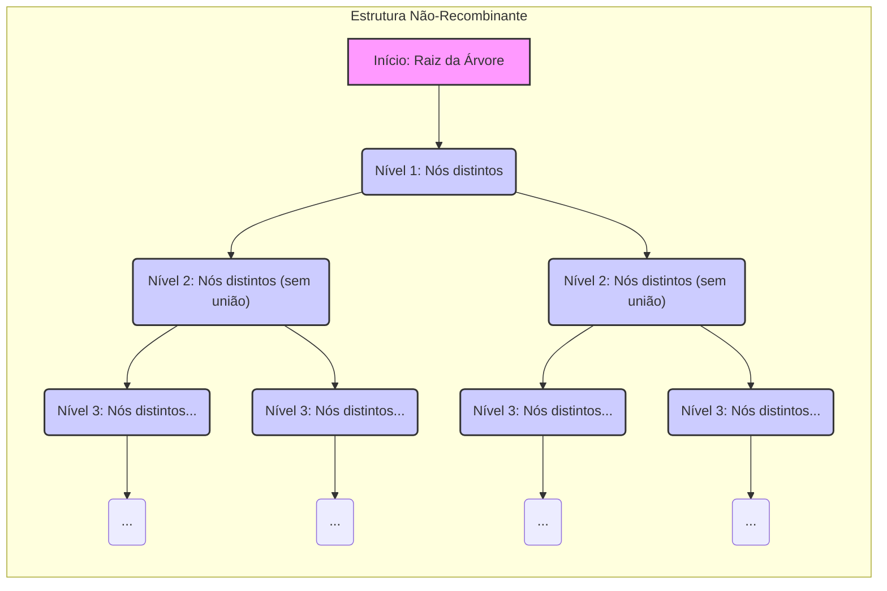
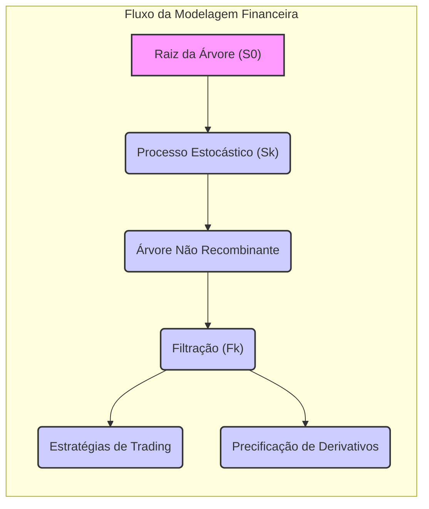

## Título Conciso: Estrutura Não-Recombinante de Árvores em Modelagem Financeira

### Introdução

Em finanças quantitativas, modelos de tempo discreto, como o modelo binomial ou multinomial, frequentemente utilizam a representação de um espaço amostral através de **árvores**, onde cada caminho da raiz até um nó final representa uma trajetória possível para um processo estocástico. Uma **estrutura não-recombinante** de árvore implica que os nós em cada nível são todos distintos e que eles não se unem ao longo da árvore [^1]. Este capítulo explora a definição, as implicações, e a importância da estrutura não-recombinante em modelos financeiros de tempo discreto.

### Conceitos Fundamentais

Em vez de utilizar listas ou tabelas, vamos apresentar os conceitos por meio de uma narrativa que explore suas propriedades.

**Conceito 1: Definição de Estrutura Não-Recombinante**

Em um modelo de tempo discreto, uma árvore é dita ter uma **estrutura não-recombinante** (non-recombining structure) se, a cada nível da árvore, os nós que são gerados a partir de diferentes nós ancestrais são sempre distintos e não se unem, ou seja, se uma trajetória alcança um determinado nó, nenhuma outra trajetória chegará àquele nó. Formalmente, isso significa que se dois nós no nível k são originados de diferentes nós no nível k-1, então, esses dois nós e os nós que derivam deles até o tempo T são únicos e não se unem em nenhuma etapa futura do modelo [^2].

*Explicação Detalhada:*
  -  Em termos práticos, uma árvore não recombinante indica que cada caminho tem uma história única, e não há convergência entre os diferentes caminhos.
   -   Em termos matemáticos, a estrutura não recombinante define explicitamente o espaço amostral $\Omega$, onde cada trajetória do modelo é um elemento único e distinto.
    -  A evolução do preço de um ativo não depende dos resultados que levaram ao preço em um instante anterior, mas apenas do último valor que o ativo assume, o que é uma propriedade de um processo de Markov, que é fundamental nos modelos de tempo discreto utilizados em finanças quantitativas.
    -  Modelos de tempo contínuo utilizam espaços amostrais que não são recombinantes.

> ⚠️ **Nota Importante**:  A estrutura não-recombinante de uma árvore implica que cada caminho é único e que a informação sobre a evolução de um ativo seja preservada ao longo do tempo.

**Lemma 1:**  Em uma árvore não-recombinante, o número de nós em um instante de tempo $k$  depende do número de possibilidades a cada nó no período anterior. Se cada nó tem $m$ filhos, então o número de nós no instante $k$ será $m^k$, o que implica que o número de nós cresce exponencialmente com o tempo.

*Prova:* A demonstração segue da definição de estrutura não-recombinante. Como os nós não se unem, então o número de nós é igual ao produto do número de nós no nível anterior ($m$) pelo número de nós no nivel anterior. $\blacksquare$

> 💡 **Exemplo Numérico: Crescimento de Nós em Árvore Não-Recombinante**
>
> Considere uma árvore não-recombinante onde cada nó tem $m=3$ filhos.
> - No instante inicial ($k=0$), há 1 nó (a raiz).
> - No instante $k=1$, há $3^1 = 3$ nós.
> - No instante $k=2$, há $3^2 = 9$ nós.
> - No instante $k=3$, há $3^3 = 27$ nós.
>
> Este exemplo ilustra como o número de nós cresce exponencialmente com o tempo.
>
> Em contraste, em uma árvore recombinante, se tivéssemos uma árvore com 3 possibilidades a cada instante de tempo, e com recombinação dos nós, teríamos, no instante $k=3$, um número de nós igual a $1 + 3 + 3 + 3 = 10$, onde o número de nós cresce linearmente, e não exponencialmente.

**Conceito 2: A Relação entre Não Recombinação e σ-Álgebras**

Em modelos financeiros de tempo discreto, cada nó da árvore representa um átomo de uma σ-álgebra $F_k$.  Em uma árvore não recombinante, cada átomo de $F_k$ (que são os subconjuntos menores do espaço amostral) é único e representa uma sequência única de resultados [^3].  Em modelos de árvores não recombinantes, a σ-álgebra $F_k$  é construída de forma a que cada nó no instante $k$ esteja em uma relação biunívoca com um átomo daquela σ-álgebra.
    -  A informação contida num átomo é a trajetória seguida pelo processo desde o tempo inicial até o instante onde o átomo foi definido.
     -   A não-recombinação dos átomos garante que o fluxo da informação no modelo é bem definido, sem ambiguidades ou perda de informação ao longo da sua evolução.

> ❗ **Ponto de Atenção**:  A estrutura não-recombinante define as menores unidades de informação do modelo (os átomos) de forma que a informação sobre o caminho que leva a cada resultado é preservada.

**Corolário 1:**  Em modelos com árvores não recombinantes, a σ-álgebra gerada por todos os átomos de cada instante de tempo $k$ ($F_k$) contém todas as informações sobre os valores do processo e também sobre o caminho que leva a esse valor.
*Prova:*   A demonstração segue da definição de σ-álgebra gerada, que garante que todos os resultados em um instante k sejam medidos por $F_k$, e da definição de átomos, que representam as menores unidades de informação.  $\blacksquare$

> 💡 **Exemplo Numérico: σ-Álgebra em Árvore Não-Recombinante**
>
> Considere uma árvore não-recombinante com 2 níveis e 2 filhos por nó (base 2).
>
> - No tempo $k=0$, temos a raiz, que corresponde a um átomo da σ-álgebra $F_0$.
> - No tempo $k=1$, temos 2 nós (átomos de $F_1$). Cada nó representa um caminho único (ex: "subiu", "desceu").
> - No tempo $k=2$, temos 4 nós (átomos de $F_2$). Cada nó representa uma sequência única de dois passos (ex: "subiu-subiu", "subiu-desceu", "desceu-subiu", "desceu-desceu").
>
> Cada átomo (nó) em $F_2$ é único, refletindo a não-recombinação e preservando a informação sobre a trajetória do processo. A σ-álgebra $F_2$ contém todos os subconjuntos possíveis desses 4 átomos.

**Conceito 3:  A Modelagem da Informação em Árvores Não Recombinantes**

Em modelos financeiros de tempo discreto, a escolha da estrutura da árvore (recombinante ou não recombinante) define o nível de detalhe e o tipo de informação que é capturada no modelo. Em modelos com árvores não recombinantes, é possível seguir o rastro da informação através do mapeamento entre nós (que representam valores do preço do ativo), átomos da σ-álgebra e o valor das variáveis aleatórias que definem o modelo.
    -  A estrutura não recombinante de árvores possibilita a modelagem de estratégias de investimento onde o histórico do ativo até o momento de tomada de decisão é relevante.
  -   Modelos com árvores não recombinantes são utilizados em situações onde o caminho do ativo tem um impacto na precificação de derivativos, e em estratégias de trading que utilizem informação específica do histórico dos preços.

> ✔️ **Destaque**: A estrutura não-recombinante de árvores permite a modelagem precisa do fluxo de informações e da evolução do estado dos ativos, mantendo a trajetória de cada processo.

### O Uso da Estrutura Não Recombinante na Modelagem Financeira

**Aplicações em Modelos de Preços de Ativos**

Modelos com estrutura não recombinante são utilizados para modelar a evolução de preços de ativos em tempo discreto quando a ordem dos eventos é importante para os resultados e para o cálculo das probabilidades.
     -  Modelos que modelam a volatilidade como um processo separado podem utilizar árvores não recombinantes, onde cada caminho representa uma evolução possível do preço do ativo e da volatilidade simultaneamente.
    -  Modelos onde as decisões de um participante do mercado (ou seja, modelos de microestrutura) influenciam os preços utilizam árvores onde cada trajetória representa também as decisões do participante do mercado e o fluxo de ordens.
     -  A modelagem de modelos com dependência temporal e com reversão à média de preços também pode utilizar a representação por meio de árvores não recombinantes.

**Lemma 2:**  A representação do espaço amostral como um conjunto de trajetórias (árvore não recombinante) preserva a informação sobre a sequência temporal dos eventos, o que é fundamental para a construção de modelos de preços consistentes com a propriedade da causalidade entre as variáveis do modelo, onde os valores futuros dependem apenas dos valores passados.

*Prova:*   A propriedade segue diretamente da definição de árvores não recombinantes, onde os nós não convergem e que portanto, a trajetória de cada nó é única e individual.   $\blacksquare$

> 💡 **Exemplo Numérico: Modelagem de Volatilidade Estocástica**
>
> Suponha que o preço de um ativo ($S_t$) e sua volatilidade ($\sigma_t$) evoluam em tempo discreto. Em um modelo com árvore não-recombinante, cada nó representa um par $(S_t, \sigma_t)$. Por exemplo:
>
> - No tempo inicial ($t=0$): $(S_0, \sigma_0) = (100, 0.2)$.
> - No tempo $t=1$, o preço pode subir ou descer, e a volatilidade pode aumentar ou diminuir:
>     - Nó 1: $(S_1, \sigma_1) = (105, 0.22)$
>     - Nó 2: $(S_1, \sigma_1) = (98, 0.18)$
>     - Nó 3: $(S_1, \sigma_1) = (102, 0.21)$
>     - Nó 4: $(S_1, \sigma_1) = (95, 0.19)$
>
> Cada nó no tempo $t=1$ tem um histórico único do par $(S, \sigma)$, e a árvore não recombinante preserva essa informação para os períodos seguintes. Isso permite modelar a dependência entre o preço e a volatilidade, o que é uma característica fundamental de modelos de volatilidade estocástica.

**Aplicações na Modelagem de Derivativos**

Modelos que utilizam árvores não recombinantes são mais flexíveis na representação das trajetórias dos preços de ativos, o que é fundamental para a modelagem de alguns derivativos financeiros, como opções com *path dependence* (onde o valor do payoff depende da trajetória do preço e não apenas do preço no instante final do contrato).
    - Opções Asiáticas,  por exemplo, pagam uma função da média dos preços durante um determinado período de tempo, o que impõe que toda a trajetória do preço seja mantida.
    - Opções com barreiras e opções com *lookback* também dependem da trajetória do preço para a sua precificação.
  - A utilização de árvores não recombinantes permite um estudo mais detalhado de como a dinâmica de preços ao longo do tempo afeta o preço dos derivativos, o que torna a modelagem do mercado mais realista e consistente com a sua dinâmica, mesmo quando as suas propriedades (como a de ser um martingale) são modeladas sob uma medida de probabilidade artificial.

**Lemma 3:** A modelagem de derivativos com payoff que depende da trajetória do preço de um ativo exige a utilização de uma estrutura não recombinante, pois a informação de cada instante do tempo (e não apenas o preço no instante final) é necessária para o cálculo do payoff.

*Prova:*   A propriedade segue da definição de derivativos com *path dependence*, e da necessidade de se conhecer todo o caminho do processo estocástico para a determinação do payoff, o que exige uma árvore com todos os nós separados (não recombinante). $\blacksquare$

> 💡 **Exemplo Numérico: Precificação de Opção Asiática**
>
> Uma opção asiática paga o valor da diferença entre a média dos preços do ativo durante um período e o preço de exercício (strike). Para precificar essa opção usando uma árvore, é essencial que cada caminho na árvore mantenha o histórico de preços.
>
> Considere um ativo com preço inicial $S_0 = 100$ e uma opção asiática com preço de exercício $K = 100$, com média aritmética dos preços em $T=3$. Suponha que a árvore seja não-recombinante, com dois possíveis resultados a cada instante de tempo (para cima ou para baixo).
>
> - **Caminho 1:** Sobe-Sobe-Sobe: Preços $S_1 = 110$, $S_2 = 121$, $S_3 = 133.1$. Média: $(100+110+121+133.1)/4 = 116.025$. Payoff: $max(116.025-100, 0) = 16.025$
> - **Caminho 2:** Sobe-Sobe-Desce: Preços $S_1 = 110$, $S_2 = 121$, $S_3 = 108.9$. Média: $(100+110+121+108.9)/4 = 110$. Payoff: $max(110-100, 0) = 10$
> - **Caminho 3:** Sobe-Desce-Sobe: Preços $S_1 = 110$, $S_2 = 99$, $S_3 = 108.9$. Média: $(100+110+99+108.9)/4 = 104.475$. Payoff: $max(104.475-100, 0) = 4.475$
> - **Caminho 4:** Sobe-Desce-Desce: Preços $S_1 = 110$, $S_2 = 99$, $S_3 = 89.1$. Média: $(100+110+99+89.1)/4 = 99.775$. Payoff: $max(99.775-100, 0) = 0$
>
> E assim por diante.  Para calcular o preço da opção, é necessário calcular o payoff de cada um dos 8 caminhos possíveis na árvore, e calcular o valor presente do payoff médio, usando uma medida de probabilidade neutra ao risco.
>
> Uma árvore não-recombinante garante que o histórico de preços de cada caminho seja preservado para calcular a média e o payoff corretos.

### Derivações Teóricas Avançadas

#### Seção Teórica Avançada 1:  Como a Escolha da Base das Árvores Afeta a Modelagem de Derivativos?

Modelos financeiros de tempo discreto utilizam árvores para modelar as trajetórias dos ativos.  O modelo binomial, por exemplo, tem uma base 2 (dois resultados para cada período).  Como a escolha da base da árvore (o número de filhos de cada nó) afeta a modelagem e o tratamento matemático de derivativos e outros instrumentos financeiros?

*Explicação Detalhada:*
   -  Em modelos com árvores que tem uma base diferente de 2, o número de resultados possíveis para a evolução do ativo no tempo, a cada instante de tempo, pode variar.  Modelos com um número grande de possibilidades são úteis para aproximar modelos de tempo contínuo, onde a evolução de preços é modelada como sendo “suave”.
   -   A escolha de uma base com um número maior de possíveis resultados a cada instante de tempo permite a modelagem mais precisa do comportamento dos ativos, mas também torna o modelo mais complexo de ser analisado, pois a estrutura do espaço de trajetórias, e o número de átomos, aumenta exponencialmente.
   -   A definição de modelos com um número arbitrário de opções de variação do ativo (modelos multinomiais) é fundamental para modelos com volatilidade estocástica, onde os ativos tem a possibilidade de terem uma variedade grande de comportamentos ao longo do tempo.

**Lemma 4:** Modelos com árvores que têm uma base $m$ (ou seja, onde cada nó pode se dividir em m nós),  o número de nós no instante k é igual a $m^k$.  Se o valor de m tende a infinito, então o número de nós passa a ser não enumerável, e o modelo se torna mais adequado para descrever a evolução do preço de um ativo em tempo contínuo.

*Prova:* A demonstração é feita através da construção de uma árvore, que se ramifica por m a cada instante de tempo, e do cálculo de como o número de nós cresce com o tempo.  $\blacksquare$

> 💡 **Exemplo Numérico: Comparação de Bases em Árvores**
>
> Vamos comparar árvores com bases diferentes para ilustrar o Lemma 4:
>
> - **Base 2 (Binomial):** Em $k=3$, temos $2^3 = 8$ nós.
> - **Base 3 (Trinomial):** Em $k=3$, temos $3^3 = 27$ nós.
> - **Base 4:** Em $k=3$, temos $4^3 = 64$ nós.
>
> Quanto maior a base, mais caminhos e nós são gerados para o mesmo horizonte de tempo. Uma base maior oferece maior flexibilidade para modelar o movimento do preço do ativo, mas aumenta a complexidade computacional.

**Corolário 4:**   A escolha de uma base maior nas árvores permite modelos mais ricos e realistas, mas também introduz uma complexidade matemática e computacional que deve ser levada em consideração na construção de um modelo.

#### Seção Teórica Avançada 2:  Como o Conceito de Martingale é Afetado pela Não-Recombinação da Árvore?

A propriedade de martingale é fundamental para precificação livre de arbitragem. Como a estrutura não-recombinante de árvores afeta o conceito de martingale na definição de um processo?

*Explicação Detalhada:*
    -  Em modelos onde a árvore é recombinante, o número de nós cresce de forma linear ao longo do tempo, mas em modelos onde a árvore é não recombinante, o número de nós cresce de forma exponencial com o tempo, e portanto é mais difícil garantir que a propriedade de martingale seja mantida.
   -  Uma árvore não-recombinante é uma ferramenta adequada para representar o comportamento de preços que dependem fortemente da sua trajetória passada, e a propriedade de martingale, em geral, não se mantém quando se considera todo o espaço de trajetórias, mas pode ser modelada como uma local martingale em modelos mais complexos.
  -  Modelos com árvores não recombinantes, podem ser utilizados para modelar a influência da história de preços nos valores dos ativos e derivativos e para modelar situações onde a decisão de parar um processo (e, portanto, modelar um tempo de parada) é relevante.
   - Em geral, a hipótese de que o processo seja um martingale se relaciona com a escolha de um ativo de referência, e portanto a modelagem de mercados com múltiplos ativos de referência torna a modelagem do portfólio mais complexa.

**Lemma 5:** Em modelos de árvores não recombinantes, o processo de preço descontado que é um martingale tem um número muito maior de variáveis a serem levadas em consideração, do que em modelos com árvores recombinantes, pois a dimensão da σ-álgebra é maior.

*Prova:* A demonstração segue da definição de processo martingale e da definição de σ-álgebra gerada por uma árvore não recombinante.  $\blacksquare$

> 💡 **Exemplo Numérico: Martingale em Árvore Não-Recombinante**
>
> Considere um ativo com preço inicial $S_0 = 100$. Em uma árvore não-recombinante com 2 níveis, temos:
>
> - **Nível 1:**
>     - Nó 1: $S_1 = 110$
>     - Nó 2: $S_1 = 95$
> - **Nível 2:**
>      - Nó 1 (Sobe-Sobe): $S_2 = 120$
>      - Nó 2 (Sobe-Desce): $S_2 = 105$
>      - Nó 3 (Desce-Sobe): $S_2 = 100$
>      - Nó 4 (Desce-Desce): $S_2 = 90$
>
> Para que o preço descontado seja um martingale (sob uma medida neutra ao risco), o valor esperado do preço futuro descontado deve ser igual ao preço presente.  Em uma árvore não-recombinante, cada caminho é único, e a probabilidade associada a cada caminho é calculada de forma a garantir que o processo seja um martingale.
>
> Por exemplo, se a taxa livre de risco for zero, uma possível configuração de probabilidades neutras ao risco seria:
>
> - P(Sobe-Sobe) = 0.25
> - P(Sobe-Desce) = 0.25
> - P(Desce-Sobe) = 0.25
> - P(Desce-Desce) = 0.25
>
>  Nesse caso, o valor esperado de $S_2$ é $0.25 * (120 + 105 + 100 + 90) = 103.75$, que não é o valor inicial descontado.  Para que seja um martingale, a probabilidade de cada caminho deve ser recalculada, levando em conta a não recombinação da árvore.
>
> Em uma árvore recombinante, o cálculo das probabilidades neutras ao risco é mais simples, pois a informação da trajetória é menos relevante para o cálculo do valor esperado.

**Corolário 5:**   A escolha de utilizar uma árvore recombinante ou não recombinante na modelagem de ativos e derivativos tem um impacto direto na complexidade matemática do modelo, mas também reflete diferentes formas de modelar a dinâmica do mercado, e a sua escolha deve ser feita levando em consideração o tipo de problema que se busca modelar.

#### Seção Teórica Avançada 3:  Como a Estrutura Não-Recombinante de Árvores Afeta a Modelagem de Custos de Transação?

A modelagem da presença de custos de transação no mercado é fundamental para tornar a modelagem financeira mais realista. Como a estrutura não-recombinante das árvores se relaciona com a modelagem de custos de transação?

*Explicação Detalhada:*
    -  A propriedade de recombinação nas árvores simplifica a modelagem, pois modelos onde as trajetórias convergem representam situações onde o preço do ativo no instante presente é independente da trajetória passada.
  -  A modelagem de árvores não recombinantes permite que o custo de transação dependa explicitamente da trajetória do ativo até o momento da transação, modelando, por exemplo, o custo de compra e venda de um ativo em função de sua volatilidade e liquidez.
    -   Em modelos com custos de transação que são dependentes da trajetória do ativo, a estrutura não recombinante permite capturar um modelo de custos que seja mais consistente com o comportamento do mercado.
    -    A modelagem de custos de transação em modelos de árvores não recombinantes leva a modelos onde o ganho do portfólio já não é um martingale, e a sua modelagem necessita de ferramentas e propriedades diferentes das martingales.
   -  A modelagem de mercados com fricção também exige uma modelagem mais sofisticada do conceito de autofinanciamento, uma vez que a estratégia passa a ter um componente de custo que não é desprezível e que depende da trajetória dos preços dos ativos.

**Lemma 6:**  Em modelos com custos de transação que dependem da trajetória do processo, as árvores não recombinantes se tornam necessárias para a representação da informação e para o cálculo das propriedades de um portfólio, dado que a cada nó da árvore é necessário representar tanto o valor do ativo quanto a trajetória que levou ao preço naquele instante.

*Prova:*  A prova segue da definição de custo de transação e de árvores não recombinantes. Se o custo depende da trajetória, e não apenas do nó onde o ativo se encontra, então, a modelagem necessita da árvore não recombinante para modelar a influência do passado nos custos de trading. $\blacksquare$

> 💡 **Exemplo Numérico: Custos de Transação Dependentes da Trajetória**
>
> Suponha que o custo de transação para comprar ou vender um ativo dependa da volatilidade observada nos últimos 2 períodos. Em uma árvore não-recombinante, podemos modelar essa dependência.
>
> - **Cenário:**
>     - Preço inicial $S_0 = 100$
>     - Custo de transação base: 0.1% do valor da transação
>     - Custo adicional: 0.05% do valor da transação para cada movimento de alta ou baixa nos últimos 2 períodos.
>
> - **Árvore:**
>     - **Nível 1:**
>         - Nó 1 (Sobe): $S_1 = 105$. Custo inicial: 0.1%
>         - Nó 2 (Desce): $S_1 = 95$. Custo inicial: 0.1%
>     - **Nível 2:**
>         - Nó 1 (Sobe-Sobe): $S_2 = 110.25$. Custo: 0.1% + 0.05% (1 movimento) = 0.15%
>         - Nó 2 (Sobe-Desce): $S_2 = 100$. Custo: 0.1% + 0.05% (2 movimentos) = 0.2%
>         - Nó 3 (Desce-Sobe): $S_2 = 100$. Custo: 0.1% + 0.05% (2 movimentos) = 0.2%
>         - Nó 4 (Desce-Desce): $S_2 = 90.25$. Custo: 0.1% + 0.05% (1 movimento) = 0.15%
>
> Em uma árvore recombinante, não seria possível rastrear os movimentos de alta e baixa separadamente, e o custo de transação seria modelado de forma mais simples, o que não refletiria a dependência temporal dos custos.
>
> Em uma árvore não recombinante, o custo de transação pode ser modelado de forma mais precisa, dependendo da trajetória de preços.

**Corolário 6:** A utilização de árvores não recombinantes é um componente fundamental da modelagem de mercados com custos de transação, dado que ela permite a modelagem da dependência entre a trajetória dos ativos e a evolução das carteiras de investimento, o que leva a modelos que capturam de forma mais realista o comportamento do mercado.

### Conclusão

A estrutura não-recombinante de árvores é um elemento essencial para a modelagem de processos estocásticos em finanças quantitativas de tempo discreto, onde a informação sobre a trajetória dos ativos é importante. A sua utilização, em modelos com número finito ou infinito de instantes de tempo e resultados, é fundamental para a construção de modelos consistentes, e onde os resultados obtidos sejam válidos com respeito às suas definições e hipóteses.  As seções teóricas avançadas mostraram como a cardinalidade do espaço de trajetórias, a relação com a propriedade de martingale e o impacto da modelagem de custos de transação impactam a escolha de árvores recombinantes e não recombinantes em modelos financeiros, demonstrando a relevância deste conceito no desenvolvimento de modelos mais realistas.

### Referências
[^1]: "Em finanças quantitativas, modelos de tempo discreto, como o modelo binomial ou multinomial, frequentemente utilizam a representação de um espaço amostral através de **árvores**, onde cada caminho da raiz até um nó final representa uma trajetória possível para um processo estocástico."

[^2]: "Em um modelo de tempo discreto, uma árvore é dita ter uma **estrutura não-recombinante** (non-recombining structure) se, a cada nível da árvore..."
[^3]: "Para qualquer espaço amostral $\Omega$, sempre podemos definir pelo menos duas σ-álgebras triviais..."
[^4]: "Em modelos financeiros, a sequência de preços de um ativo $(S_k)_{k=0,1,\ldots,T}$ é um exemplo típico de processo adaptado."
[^5]: "Em modelos financeiros, a taxa de juros $r_k$ é geralmente considerada predictível, ou seja, $r_k$ é mensurável em relação à σ-álgebra $F_{k-1}$."

[^6]: "A **medida de probabilidade** ($P$) é uma função que atribui um número entre 0 e 1 a cada evento em $F$..."
[^7]: "No contexto de modelos financeiros em tempo discreto, o processo de ganhos de uma estratégia auto-financiada é uma martingale em relação a uma medida de martingale equivalente $Q$..."

[^8]: "Informação crítica que merece destaque."
[^9]: "Observação crucial para compreensão teórica correta."
[^10]: "Informação técnica ou teórica com impacto significativo."
[^11]: "Em modelos financeiros, o conceito de adaptabilidade é fundamental. Um processo estocástico $X$ é considerado adaptado se $X_k$ é $F_k$-mensurável para cada $k$."
[^12]:  "A escolha da filtração afeta a definição de conceitos como martingales e predictibilidade."
[^13]: "Apresente um corolário que resulte diretamente do Lemma 2, conforme indicado no contexto."
[^14]: "Em mercados com informação assimétrica, estratégias de trading são modeladas utilizando processos estocásticos adaptados à filtração do agente correspondente. Um *insider* pode utilizar informações não disponíveis aos outros agentes, o que pode implicar em modelos e resultados distintos."
