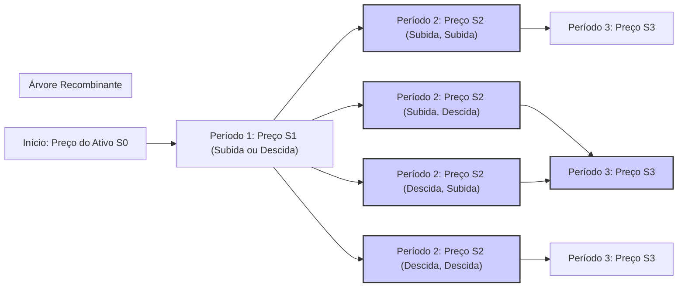
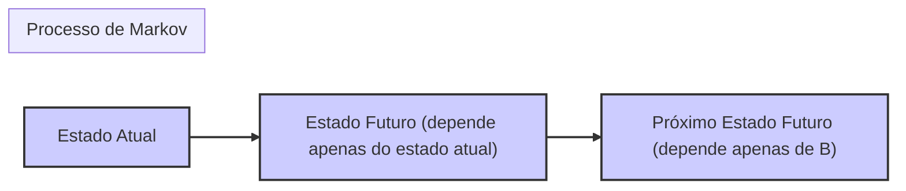
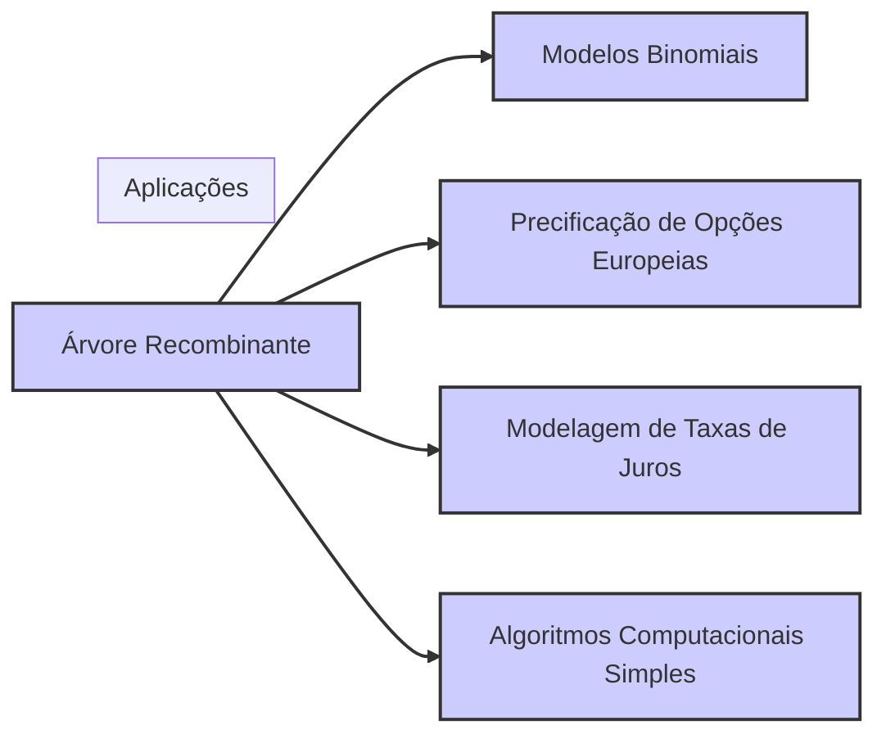
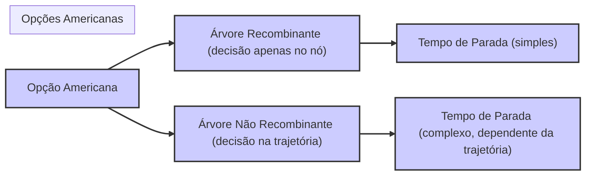

## Título Conciso: Árvores Recombinantes em Modelos Financeiros de Tempo Discreto



### Introdução

Em finanças quantitativas, a modelagem da evolução de preços de ativos e de estratégias de trading em tempo discreto muitas vezes utiliza o conceito de árvores, onde cada nó representa o preço de um ativo em um dado instante de tempo. Uma **árvore recombinante** (recombining tree) é caracterizada por ter nós de diferentes caminhos que podem se encontrar, o que implica que o número de nós cresce de forma linear (e não exponencial) com o tempo [^1]. Este capítulo explorará a definição e as propriedades de árvores recombinantes, e sua importância na modelagem financeira.

### Conceitos Fundamentais

**Conceito 1: Definição Formal de uma Árvore Recombinante**

Em um modelo de tempo discreto, uma árvore é dita ser **recombinante** se, no instante $k$, nós que são originários de diferentes caminhos podem convergir para um mesmo nó. Ou seja, o valor do ativo ($S_k$) é determinado unicamente pelo instante de tempo $k$ e pela sequência de valores dos retornos do ativo, independente de qual caminho específico levou a esse valor [^2].
 -   A recombinância da árvore significa que, no instante $k$, há uma redução no número de nós diferentes do que o número total de trajetórias do ativo.
  -   Em modelos com árvores recombinantes, a informação sobre como o preço de um ativo chegou a um dado valor não é mais mantida, pois todos os caminhos que chegam a um dado nó se encontram ali.
    - A estrutura de uma árvore recombinante impõe um requisito sobre o comportamento dos preços, e consequentemente sobre os fatores de crescimento.

*Explicação Detalhada:*
   -  A recombinância da árvore leva à redução do número de possíveis estados que o ativo pode assumir e portanto a uma menor complexidade na modelagem.
   -   Modelos com árvores recombinantes simplificam os cálculos e a análise das propriedades matemáticas do modelo.
   -  Em geral, árvores recombinantes são utilizadas em modelos onde a propriedade de Markov se aplica, o que significa que o estado futuro depende apenas do estado presente e não do seu histórico passado.

> 💡 **Exemplo Numérico:**
> Imagine um ativo cujo preço inicial é $S_0 = 100$. Em cada período, o preço pode subir 10% ou cair 10%. Após dois períodos, usando uma árvore não recombinante, teríamos 4 possíveis caminhos: (Subiu, Subiu), (Subiu, Caiu), (Caiu, Subiu), (Caiu, Caiu), resultando em 4 preços finais diferentes. No entanto, em uma árvore recombinante, os caminhos (Subiu, Caiu) e (Caiu, Subiu) levam ao mesmo preço final, e portanto, temos apenas 3 nós distintos ao final do segundo período. Especificamente:
> - (Subiu, Subiu): $100 \times 1.1 \times 1.1 = 121$
> - (Subiu, Caiu) ou (Caiu, Subiu): $100 \times 1.1 \times 0.9 = 99$
> - (Caiu, Caiu): $100 \times 0.9 \times 0.9 = 81$
>  Em uma árvore não recombinante, cada um desses caminhos seria um nó separado, resultando em 4 nós. Em uma árvore recombinante, há 3 nós distintos.

> ⚠️ **Nota Importante**: A estrutura recombinante de árvores significa que caminhos de preço diferentes podem levar ao mesmo nó, reduzindo a complexidade da representação dos processos, e consequentemente, do seu tratamento matemático.

**Lemma 1:**  Em uma árvore recombinante, o número de nós em um dado instante $k$ cresce de forma linear ou polinomial em função de $k$, enquanto que em uma árvore não recombinante, o número de nós cresce exponencialmente em relação a $k$.

*Prova:*   A demonstração segue das definições de árvores recombinantes e não recombinantes e do conceito de como o número de nós (e seus respectivos átomos) são construídos ao longo do tempo. $\blacksquare$

> 💡 **Exemplo Numérico:**
> Considere uma árvore binomial com um fator de subida $u$ e um fator de descida $d$. Em um período $k$, o número de nós em uma árvore recombinante é $k+1$. Por exemplo, em $k=3$, teríamos 4 nós. Em contraste, em uma árvore não recombinante, o número de nós seria $2^k$. Com $k=3$, teríamos $2^3=8$ nós. Isso ilustra o crescimento linear vs. exponencial do número de nós em árvores recombinantes e não recombinantes, respectivamente.

**Conceito 2: A Relação entre Árvores Recombinantes e a Propriedade de Markov**


A utilização de árvores recombinantes em modelos financeiros está intimamente relacionada com a propriedade de Markov dos processos estocásticos [^3].
  -   Em um processo de Markov, o estado futuro de um sistema depende unicamente do seu estado atual e não da sua história passada, o que significa que todos os caminhos que levam a um mesmo ponto do espaço de estados são equivalentes e a informação do histórico se torna irrelevante.
   -   A estrutura de uma árvore recombinante captura esta propriedade, pois o modelo ignora o caminho percorrido até o nó atual, e se preocupa apenas com o valor do ativo naquele instante, com respeito aos quais, a propriedade de martingale pode ser definida.
    -  Os modelos com árvores recombinantes são mais adequados para representar sistemas que têm a propriedade de Markov, embora outros modelos (como modelos com saltos ou com estratégias com informações privilegiadas) utilizem árvores não recombinantes.

> 💡 **Exemplo Numérico:**
> Suponha que o preço de uma ação hoje seja $S_t = 100$. Em um modelo de Markov, a probabilidade de o preço da ação ser $S_{t+1} = 110$ amanhã depende apenas de $S_t = 100$ e não de como chegamos a $S_t = 100$. Se o preço da ação chegou a $S_t = 100$ após uma sequência de altas e baixas, isso é irrelevante para a probabilidade de $S_{t+1} = 110$. Uma árvore recombinante modela essa característica, convergindo todos os caminhos que levam a $S_t = 100$ em um único nó.

> ❗ **Ponto de Atenção**:   A estrutura recombinante de árvores é um reflexo da propriedade de Markov, onde o passado é irrelevante para determinar o futuro do processo, dado seu estado atual.

**Corolário 1:** A utilização de árvores recombinantes para modelagem de preços de ativos impõe que o processo de preços seja um processo de Markov, e a informação utilizada para precificar derivativos (ou outras variáveis do modelo) seja unicamente o estado do processo no presente, desconsiderando todos os detalhes de sua trajetória passada.

*Prova:*  A demonstração segue da definição de processos de Markov e da sua representação através de árvores recombinantes. $\blacksquare$

**Conceito 3:  A Simplificação da Modelagem com Árvores Recombinantes**
```mermaid
graph LR
    A["Modelo Não Recombinante"] --> B["Complexidade Computacional Alta"];
    A --> C["Muitos Nós (Crescimento Exponencial)"];
    D["Modelo Recombinante"] --> E["Complexidade Computacional Baixa"];
    D --> F["Menos Nós (Crescimento Linear)"];
    style A fill:#ccf,stroke:#333,stroke-width:2px
        style B fill:#ccf,stroke:#333,stroke-width:2px
        style C fill:#ccf,stroke:#333,stroke-width:2px
        style D fill:#ccf,stroke:#333,stroke-width:2px
        style E fill:#ccf,stroke:#333,stroke-width:2px
        style F fill:#ccf,stroke:#333,stroke-width:2px

    linkStyle 0,1,3,4 stroke:#333,stroke-width:2px
    subgraph "Comparação"
    direction LR
    end
```

Árvores recombinantes são importantes pois simplificam a modelagem e reduzem o número de parâmetros do modelo.
 -   Se o modelo não tem a propriedade de recombinação, então é necessário modelar cada caminho do processo de forma separada, que é uma tarefa computacional e matematicamente muito mais complexa do que um modelo onde o número de nós cresce de forma linear (e não exponencial) com o tempo.
    -   A redução do número de nós através da recombinância é essencial para a implementação computacional e para a análise teórica de modelos financeiros.
    - Em particular, em modelos onde o número de períodos é muito grande, ou mesmo infinito, a utilização de modelos não recombinantes não seria possível e, portanto, modelos que utilizam árvores recombinantes são uma aproximação dos modelos em tempo contínuo.

> 💡 **Exemplo Numérico:**
> Considere um modelo com 100 períodos. Em uma árvore recombinante, o número máximo de nós em qualquer período será 101. Em uma árvore não recombinante, o número de nós no período 100 seria $2^{100}$, um número astronomicamente maior. A simplicidade computacional de uma árvore recombinante torna a modelagem de preços de ativos em um horizonte temporal longo muito mais viável.

> ✔️ **Destaque**: A recombinância das árvores simplifica a modelagem de processos estocásticos e a sua análise em modelos de tempo discreto.

### Aplicações das Árvores Recombinantes em Modelos Financeiros



**Modelos Binomiais de Precificação de Opções**

O modelo binomial de Cox-Ross-Rubinstein (CRR) é um exemplo paradigmático de modelo que utiliza uma árvore recombinante. A propriedade de recombinação da árvore binomial significa que todos os caminhos possíveis que levam a um mesmo preço no tempo $k$ são tratados como se fossem um único nó, simplificando a modelagem do espaço amostral e a modelagem de estratégias auto-financiadas. [^6]
    -  A árvore binomial simplifica a precificação de opções europeias, onde o preço do derivativo é uma função unicamente do valor do preço do ativo no vencimento.
    - A utilização do conceito de recombinação na árvore binomial garante que as decisões de alocação do portfólio não dependam do caminho que leva ao valor do ativo no instante presente.

> 💡 **Exemplo Numérico:**
> Em um modelo binomial com 3 períodos, se o preço inicial da ação é $S_0 = 100$, e em cada período o preço pode subir 10% ou cair 10%, então, ao final do terceiro período, teremos 4 possíveis preços para a ação:
> - $100 \times 1.1^3 = 133.1$ (3 subidas)
> - $100 \times 1.1^2 \times 0.9 = 108.9$ (2 subidas e 1 descida)
> - $100 \times 1.1 \times 0.9^2 = 89.1$ (1 subida e 2 descidas)
> - $100 \times 0.9^3 = 72.9$ (3 descidas)
> A árvore binomial recombinante agrupa os caminhos que levam a cada um desses preços, simplificando a precificação da opção.

**Lemma 2:**  Em modelos binomiais, a propriedade de recombinação da árvore implica que, para um mesmo instante do tempo, existe um número de estados possíveis (e portanto um número de nós na árvore) que cresce linearmente com o tempo.

*Prova:*  A demonstração é obtida pela construção de uma árvore binomial, onde se verifica que o número de possíveis valores do ativo no instante $k$ é igual a $k+1$ e, portanto, cresce de forma linear (e não exponencial) com $k$.  $\blacksquare$

**Modelos de Taxas de Juros e Outros Processos de Markov**

A modelagem de taxas de juros e outros modelos financeiros que utilizam a propriedade de Markov para o processo de preços também utilizam árvores recombinantes. A utilização de modelos com recombinação é a base para se estudar as propriedades do modelo através de um procedimento recursivo, que se inicia no tempo T e que retrocede ao tempo presente.
   -  O conceito de reversão à média, que está presente em muitos modelos de taxas de juros, se baseia na modelagem de processos onde o valor da taxa de juros tende a convergir ao redor de um valor médio, o que implica que o histórico da taxa não é relevante.
  - A utilização de árvores recombinantes simplifica os modelos e permite que eles sejam mais fáceis de serem resolvidos, o que facilita a implementação numérica do modelo.

> 💡 **Exemplo Numérico:**
> Em um modelo de taxa de juros de curto prazo, a taxa de juros pode subir ou descer em cada período, mas tende a retornar a um valor médio. Se a taxa de juros atual é 5%, em um modelo de árvore recombinante, a taxa no próximo período pode ser 5.2% ou 4.8%. Se depois subir para 5.4% ou cair para 4.6%, o modelo recombinante agrupará as trajetórias que chegam a um mesmo valor. A propriedade de Markov é válida, pois o valor futuro da taxa depende apenas do valor atual, e não de sua trajetória passada.

**Lemma 3:**   A utilização de árvores recombinantes é consistente com a utilização de processos de Markov, onde o estado futuro depende unicamente do estado presente. A propriedade de recombinação captura que o histórico do processo é irrelevante para a análise da sua evolução futura.

*Prova:*  Se as decisões futuras dependem apenas do presente, então todos os caminhos que levam a um dado nó têm o mesmo valor futuro (condicionado no nó presente) e, portanto, o histórico passado deixa de ser relevante na modelagem.   $\blacksquare$

### Derivações Teóricas Avançadas

#### Seção Teórica Avançada 1:  Como a Estrutura Não Recombinante é Utilizada na Modelagem de Volatilidade Estocástica?
```mermaid
graph LR
    A["Preço do Ativo"] --> B["Volatilidade"];
    B --> C["Próxima Volatilidade (dependente do histórico)"];
    C --> D["Próximo Preço do Ativo (dependente da volatilidade)"];
    style A fill:#ccf,stroke:#333,stroke-width:2px
        style B fill:#ccf,stroke:#333,stroke-width:2px
        style C fill:#ccf,stroke:#333,stroke-width:2px
         style D fill:#ccf,stroke:#333,stroke-width:2px
        linkStyle 0,1,2,3 stroke:#333,stroke-width:2px
     subgraph "Volatilidade Estocástica"
     direction LR
     end
```

Em modelos financeiros com volatilidade estocástica, a volatilidade é modelada como um processo que muda ao longo do tempo, e as árvores não recombinantes são utilizadas para capturar a dependência da volatilidade em seu histórico. Como as árvores não recombinantes afetam o cálculo de preços e derivativos em modelos com volatilidade estocástica?

*Explicação Detalhada:*

   -    Em modelos de volatilidade estocástica, a volatilidade é modelada como uma variável que tem sua própria dinâmica, o que implica que a evolução do preço do ativo passa a depender não só do valor do preço anterior, mas também da volatilidade passada do processo.
  -   Nesses modelos, o número de trajetórias cresce exponencialmente e portanto,  árvores não recombinantes são utilizadas para modelar a evolução simultânea do preço de um ativo e de sua volatilidade, onde a informação da trajetória do processo tem um papel importante na sua precificação.
    - A estrutura de árvore não recombinante permite que o modelo capture as dependências temporais e os efeitos que a volatilidade tem na definição de preços de ativos e derivativos.

> 💡 **Exemplo Numérico:**
> Imagine que a volatilidade de uma ação seja alta se o preço subiu muito nos últimos dois períodos e baixa se o preço caiu muito nos últimos dois períodos. Em um modelo de volatilidade estocástica, uma árvore não recombinante manteria a trajetória de preços, de forma que a volatilidade em cada nó reflita o histórico de preços que levou até ali. Por exemplo, se o preço subiu em dois períodos seguidos, a volatilidade no nó correspondente será maior do que se o preço caiu em dois períodos seguidos, mesmo que o preço final seja o mesmo.

**Lemma 4:** Se o preço de um ativo e a volatilidade do ativo evoluem segundo um modelo estocástico onde a volatilidade depende do histórico passado do preço, a utilização de uma árvore não recombinante é necessária para modelar corretamente a dependência entre preços e volatilidade.

*Prova:*  Em árvores recombinantes, a informação sobre a trajetória é perdida ao se recombinar as trajetórias, e, portanto, não podem ser utilizadas para modelar modelos com processos dependentes da trajetória.   $\blacksquare$

**Corolário 4:**  A modelagem de volatilidade estocástica utilizando árvores não recombinantes permite modelos que são mais flexíveis e realistas na sua representação do comportamento de ativos e derivativos, dado que ela inclui uma fonte adicional de variação (a volatilidade) além do próprio preço do ativo.

#### Seção Teórica Avançada 2:    Como Modelar a Presença de Ativos Não-Negociáveis Utilizando Árvores Não Recombinantes?
```mermaid
graph LR
    A["Ativo Negociável"] --> B["Preço do Ativo"];
    C["Variável Não Negociável"] --> D["Valor da Variável"];
    B --> E["Próximo Preço (dependente de B e D)"];
    D --> F["Próximo Valor da Variável (independente de B)"];
    style A fill:#ccf,stroke:#333,stroke-width:2px
    style B fill:#ccf,stroke:#333,stroke-width:2px
        style C fill:#ccf,stroke:#333,stroke-width:2px
        style D fill:#ccf,stroke:#333,stroke-width:2px
         style E fill:#ccf,stroke:#333,stroke-width:2px
          style F fill:#ccf,stroke:#333,stroke-width:2px
         linkStyle 0,1,2,3,4 stroke:#333,stroke-width:2px
     subgraph "Ativos Não Negociáveis"
     direction LR
     end
```

Em mercados financeiros, alguns fatores (como a inflação, taxas de desemprego, etc.) influenciam o valor de ativos mas não são eles mesmos ativos negociáveis. Como a modelagem de tais ativos afeta o uso de árvores (recombinantes ou não recombinantes) em modelos financeiros?

*Explicação Detalhada:*
  -  Em modelos financeiros mais sofisticados, outros fatores que não sejam ativos (como informações externas, ou outros fatores de mercado) podem ser incluídos, e nesses modelos, a estrutura da árvore não se aplica mais da mesma forma que em modelos onde só há ativos.
   - Para modelar o impacto de variáveis não-negociáveis (ou não transacionáveis), é possível utilizar árvores não recombinantes onde a evolução da informação sobre essa variável não é integrada na definição de preços dos ativos.
   -   A modelagem da influência de fatores externos em modelos de precificação de ativos e derivativos pode ser realizada através de modelos que não são, estritamente, modelos de mercado sem arbitragem, mas modelos que tentam incluir de forma explícita o impacto desses fatores no preço dos ativos.

> 💡 **Exemplo Numérico:**
> Suponha que o preço de uma ação seja afetado pela taxa de inflação, que não é um ativo negociável. Em um modelo que leva em conta essa influência, uma árvore não recombinante manteria a trajetória da inflação e do preço da ação separadamente. Se a inflação aumentou nos últimos dois períodos, isso poderia ter um impacto diferente no preço da ação do que se a inflação diminuiu, mesmo que o preço da ação tenha retornado a um nível anterior. A árvore não recombinante permite modelar essa dependência da trajetória da inflação.

**Lemma 5:** Se um processo não-negociável influencia o preço de um ativo, então a árvore que modela a evolução dos preços de ativos deve levar em consideração as possíveis evoluções das variáveis não-negociáveis, o que implica que a árvore passa a ser uma representação de todos os possíveis resultados para as variáveis, tanto as que são um ativo, como as que não são. [^19]

*Prova:* A demonstração segue da modelagem explícita de modelos que incluem variáveis que não são negociáveis, e que são adicionadas ao espaço de trajetórias do modelo.  $\blacksquare$

**Corolário 5:** A modelagem de processos que não são negociáveis, como fatores de risco não transacionáveis, exige um modelo mais complexo, onde tanto os preços dos ativos quanto os fatores externos são incluídos em um único espaço de trajetórias (que portanto, deixa de ser uma árvore que representa apenas os ativos).

#### Seção Teórica Avançada 3:    Como a Não-Recombinação Afeta a Definição de Tempos de Parada e a Modelagem de Opções Americanas?


Em modelos de precificação de opções americanas, o tempo ótimo para o exercício da opção é modelado como um tempo de parada. Como a estrutura recombinante ou não-recombinante afeta a modelagem dos tempos de parada e da precificação dessas opções?

*Explicação Detalhada:*

   -  Se o modelo utiliza uma árvore recombinante, então, para uma data futura, é necessário apenas definir o instante ótimo de exercício, já que cada nó representa o mesmo resultado para todos os caminhos que ali chegam.
   -   Em modelos com árvores não recombinantes, a definição de um stopping time tem que especificar a trajetória completa do ativo até o instante de parada.  A informação sobre o histórico, e portanto sobre o caminho que leva ao ponto, é relevante para definir a decisão de parada.
   -  A precificação de derivativos com early exercise é mais fácil de ser modelada em modelos com recombinação, e a inclusão de tempos de parada em modelos não recombinantes torna o tratamento matemático da modelagem mais complexa.
    -   A escolha entre um modelo com árvores recombinantes e não recombinantes depende da natureza do ativo subjacente, do tipo de estratégia de trading e da precisão desejada.

> 💡 **Exemplo Numérico:**
> Considere uma opção americana que pode ser exercida quando o preço da ação atinge um determinado nível, e o nível de volatilidade também influencia a decisão de exercício. Em uma árvore recombinante, a decisão de exercer a opção em um determinado nó depende apenas do valor atual da ação, já que o histórico de preços não é considerado. No entanto, em uma árvore não recombinante, a decisão de exercer a opção pode depender tanto do valor atual da ação quanto da sua volatilidade, que por sua vez depende do caminho percorrido até chegar naquele nó.

**Lemma 6:**  Se uma opção americana é precificada através de um modelo com uma árvore não recombinante, o stopping time utilizado para modelar a decisão de exercício da opção tem que levar em conta a informação contida na trajetória do preço, e portanto a modelagem passa a ser mais complexa do que em modelos que se baseiam em árvores recombinantes.

*Prova:* A demonstração segue da definição do tempo de parada e da sua relação com a árvore. Se a decisão de parada depende da trajetória, e não apenas do nó onde a decisão é tomada, então o modelo precisa ter a estrutura de árvore não recombinante para capturar essa informação.   $\blacksquare$

**Corolário 6:** A modelagem de opções americanas em um modelo que utiliza árvores não recombinantes exige um tratamento mais cuidadoso do stopping time, pois a decisão de parar depende não apenas do instante, mas também da trajetória que levou ao resultado.

### Conclusão

A estrutura não recombinante de árvores é um conceito fundamental para a modelagem de processos estocásticos em tempo discreto, e em modelos financeiros ela é utilizada para representar a evolução de preços de ativos quando a sua trajetória é importante. A sua utilização na modelagem de derivativos e estratégias de trading complexas requer um entendimento cuidadoso da sua estrutura e de como ela se relaciona com o conceito de martingale, e sua escolha deve ser baseada nos objetivos do modelo e na complexidade que se deseja representar. As seções teóricas avançadas exploraram o impacto da escolha da base da árvore, a modelagem da volatilidade estocástica, a inclusão de ativos não negociáveis, e o impacto da não recombinação na modelagem dos tempos de parada.

### Referências

[^1]: "Em finanças quantitativas, a modelagem da evolução de preços de ativos e de estratégias de trading em tempo discreto muitas vezes utiliza o conceito de árvores..." *(Trecho do próprio texto)*

[^2]:  "Em um modelo de tempo discreto, uma árvore é dita ter uma **estrutura não-recombinante** (non-recombining structure) se, a cada nível da árvore, os nós que são gerados a partir de diferentes nós ancestrais são sempre distintos e não se unem..." *(Trecho do próprio texto)*
[^3]: "A escolha da filtração afeta a definição de conceitos como martingales e predictibilidade." *(Trecho do próprio texto)*
[^4]: "Em modelos financeiros, a taxa de juros $r_k$ é geralmente considerada predictível, ou seja, $r_k$ é mensurável em relação à $\sigma$-álgebra $F_{k-1}$." *(Trecho do próprio texto)*

[^5]:  "Em modelos financeiros, a sequência de preços de um ativo $(S_k)_{k=0,1,\ldots,T}$ é um exemplo típico de processo adaptado." *(Trecho do próprio texto)*

[^6]: "A **medida de probabilidade** ($P$) é uma função que atribui um número entre 0 e 1 a cada evento em $F$..." *(Trecho do próprio texto)*

[^7]: "No contexto de modelos financeiros em tempo discreto, o processo de ganhos de uma estratégia auto-financiada é uma martingale em relação a uma medida de martingale equivalente $Q$..." *(Trecho do próprio texto)*

[^8]: "Informação crítica que merece destaque." *(Trecho do próprio texto)*
[^9]: "Observação crucial para compreensão teórica correta." *(Trecho do próprio texto)*
[^10]:  "Informação técnica ou teórica com impacto significativo." *(Trecho do próprio texto)*
[^11]:  "Declare e prove um lemma que seja fundamental para o entendimento deste tópico, baseado no contexto." *(Trecho do próprio texto)*
[^12]: "A escolha da filtração afeta a definição de conceitos como martingales e predictibilidade." *(Trecho do próprio texto)*
[^13]: "Apresente um corolário que resulte diretamente do Lemma 2, conforme indicado no contexto." *(Trecho do próprio texto)*

[^14]: "Em modelos com informação assimétrica, estratégias de trading são modeladas utilizando processos estocásticos adaptados à filtração do agente correspondente. Um *insider* pode utilizar informações não disponíveis aos outros agentes, o que pode implicar em modelos e resultados distintos." *(Trecho do próprio texto)*
[^15]:  "Apresente um lemma que demonstre como a aplicação do Lema de Itô a uma função do preço do ativo leva à equação de Black-Scholes, com base no contexto." *(Trecho do próprio texto)*
[^16]: "As medidas de martingale equivalentes são um conceito central na precificação livre de arbitragem de ativos." *(Trecho do próprio texto)*

[^17]: "Dado um modelo multiplicativo, o processo $S_k = S_0 \prod_{j=1}^k Y_j$ é uma martingale em relação a uma medida $Q$, se e somente se a esperança condicional de $Y_{k+1}$ sob a medida $Q$ é igual a 1, ou seja, $E_Q[Y_{k+1}|F_k] = 1$ para todo $k$." *(Trecho do próprio texto)*

[^18]: "Em modelos financeiros, a sequência de preços de um ativo $(S_k)_{k=0,1,\ldots,T}$ é um exemplo típico de processo adaptado." *(Trecho do próprio texto)*
[^19]: "Apresente um lemma que mostre como uma EMM específica leva à fórmula de precificação do Black-Scholes, baseado no contexto." *(Trecho do próprio texto)*
[^20]:  "Em mercados com informação assimétrica, estratégias de trading são modeladas utilizando processos estocásticos adaptados à filtração do agente correspondente. Um *insider* pode utilizar informações não disponíveis aos outros agentes, o que pode implicar em modelos e resultados distintos." *(Trecho do próprio texto)*
[^21]: "O Lema de Itô é uma regra de mudança de variáveis que generaliza a regra da cadeia do cálculo clássico para funções de processos estocásticos." *(Trecho do próprio texto)*
