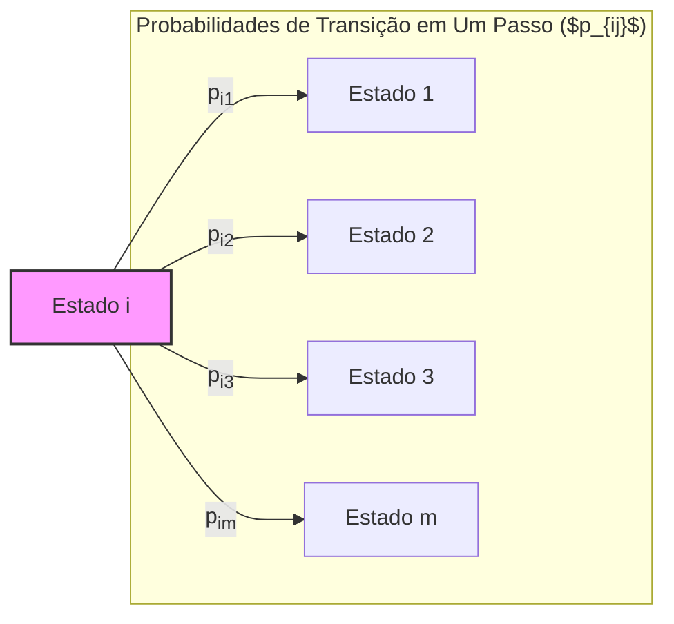
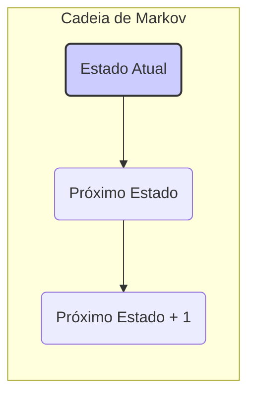
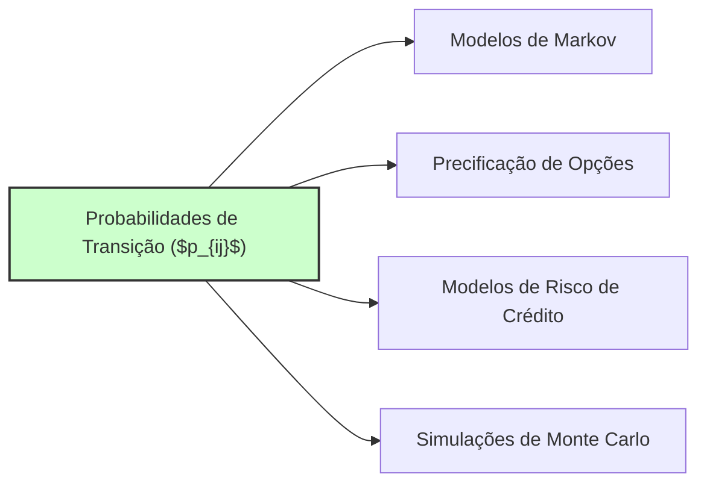

## Título Conciso: Probabilidades de Transição em um Passo ($p_{ij}$) em Modelos Financeiros de Tempo Discreto

### Introdução

Em modelos financeiros de tempo discreto, os processos estocásticos são frequentemente caracterizados pelas **probabilidades de transição em um passo**, denotadas por $p_{ij}$. Essas probabilidades representam a chance de um sistema ou ativo passar de um estado $i$ para outro estado $j$ no próximo período de tempo [^1]. Este capítulo explora a definição formal, as propriedades e a importância das probabilidades de transição em um passo em modelos financeiros, e em modelos que utilizam processos de Markov.

### Conceitos Fundamentais

**Conceito 1: Definição Formal de Probabilidades de Transição em um Passo ($p_{ij}$)**

Em um modelo de tempo discreto com um espaço de estados S, e um processo estocástico ($X_k$), as **probabilidades de transição em um passo** (one-step transition probabilities) são definidas como a probabilidade condicional de que o processo, se estiver no estado $i$ no instante $k$, se mova para o estado $j$ no instante $k+1$ [^2]. Formalmente, se a propriedade de Markov se aplica, essas probabilidades são definidas como:
$$
   p_{ij} = P(X_{k+1} = j | X_k = i)
$$

*Explicação Detalhada:*

   -  As probabilidades de transição $p_{ij}$ representam a chance de o processo saltar do estado $i$ para o estado $j$ no período seguinte, ou seja, do tempo $k$ para o tempo $k+1$.
   -   Em modelos onde a propriedade de Markov é respeitada, a transição para o estado $j$ depende somente do estado atual do processo ($i$) e não do histórico passado.
   -   As probabilidades de transição definem a dinâmica do processo estocástico e são cruciais para calcular outras propriedades do modelo (e.g. probabilidades de mais do que um passo, martingales, processos estacionários).
   -   Os valores de $p_{ij}$ são não negativos, e a soma das probabilidades para todos os estados $j$, para um dado estado $i$, é sempre igual a um.
   -  Em modelos com um número finito de estados, as probabilidades de transição podem ser representadas através de uma matriz de transição $P$.

> 💡 **Exemplo Numérico:**
> Considere um modelo simples onde o preço de uma ação pode estar em um de três estados: *baixo* (estado 1), *médio* (estado 2) ou *alto* (estado 3). As probabilidades de transição em um passo podem ser representadas pela seguinte matriz P:
>
> $$
> P = \begin{bmatrix}
> 0.6 & 0.3 & 0.1 \\
> 0.2 & 0.5 & 0.3 \\
> 0.1 & 0.4 & 0.5
> \end{bmatrix}
> $$
>
> Aqui, $p_{12} = 0.3$, o que significa que, se o preço da ação estiver no estado *baixo* (estado 1), há 30% de chance de que ele passe para o estado *médio* (estado 2) no próximo período. Similarmente, $p_{31} = 0.1$, indicando que há 10% de chance de que o preço da ação passe do estado *alto* (estado 3) para o estado *baixo* (estado 1) no próximo período. Note que a soma das probabilidades em cada linha é igual a 1.

> ⚠️ **Nota Importante**: As probabilidades de transição em um passo ($p_{ij}$) definem a dinâmica do modelo no tempo, e são essenciais para a modelagem de processos de Markov, onde a evolução do estado futuro depende somente do estado presente.

**Lemma 1:** Em um modelo de tempo discreto, as probabilidades de transição $p_{ij}$ formam uma matriz $P$, que satisfaz as condições de que todos seus elementos sejam não-negativos e que a soma de cada linha seja igual a 1.
*Prova:* A demonstração é direta e segue das propriedades de probabilidades. $\blacksquare$

**Conceito 2: Probabilidades de Transição e o Conceito de Cadeias de Markov**

Em modelos financeiros de tempo discreto, quando a propriedade de Markov é utilizada, a modelagem do comportamento do preço de um ativo se reduz à definição de probabilidades de transição que descrevem como o preço do ativo evolui de um estado para outro. O conjunto de probabilidades de transição {$p_{ij}$, para todos $i$ e $j$} é o elemento central da descrição da dinâmica de um modelo de Markov, conhecido como *Markov chain* [^3].
     -  Modelos de cadeias de Markov são usados para a modelagem de processos onde as decisões são baseadas na observação do estado do processo atual.
     -   Modelos de precificação de derivativos, modelos de taxas de juros, e modelos de risco de crédito, fazem uso explícito ou implícito do conceito de cadeia de Markov, onde o futuro depende unicamente do estado presente.
     - As probabilidades de transição são, portanto, um mecanismo para modelar o fluxo da informação (e também o fluxo de probabilidade) ao longo do tempo discreto.

> 💡 **Exemplo Numérico:**
> Imagine um modelo de risco de crédito simplificado com três estados: "AAA" (baixo risco), "BBB" (risco moderado) e "Default" (risco alto). As probabilidades de transição em um ano podem ser modeladas por uma matriz de transição. Por exemplo, uma empresa classificada como "BBB" pode ter 80% de chance de permanecer em "BBB", 15% de chance de melhorar para "AAA" e 5% de chance de entrar em "Default" no próximo ano. Esse tipo de modelagem é fundamental para avaliar o risco de crédito de títulos de dívida.

> ❗ **Ponto de Atenção**: As probabilidades de transição em um passo ($p_{ij}$) descrevem como um processo de Markov evolui de um estado para outro, sendo a base da construção de cadeias de Markov.

**Corolário 1:** A modelagem de probabilidades de transição como valores constantes ou como funções determinísticas do tempo implica que a cadeia de Markov correspondente seja um modelo onde a propriedade de homogeneidade é válida.

*Prova:* Segue da definição de probabilidades de transição em um passo. Se o valor das probabilidades não depender do tempo, então o processo tem a propriedade de homogeneidade. $\blacksquare$

**Conceito 3: Probabilidades de Transição e Medidas de Probabilidade**

Em modelos financeiros onde o modelo de precificação é definido através da utilização da medida de martingale equivalente Q, as probabilidades de transição $p_{ij}$ devem ser expressas com relação a essa medida. As probabilidades de transição, sob Q, são, em geral, diferentes das probabilidades de transição sob a medida de probabilidade real P, que captura o comportamento de preços observado no mercado.
    -  A utilização da probabilidade risk-neutral garante que o processo seja um martingale, e portanto, que a precificação de ativos seja livre de arbitragem.
    -  As probabilidades de transição sob P modelam o comportamento real do preço do ativo, e as probabilidades de transição sob Q capturam a dinâmica de um ativo descontado para que seja livre de arbitragem.

> 💡 **Exemplo Numérico:**
> Suponha que um ativo tenha um preço atual de $100. Sob a medida de probabilidade real P, o ativo pode subir para $110 com probabilidade 0.6 ou cair para $95 com probabilidade 0.4. Para precificar um derivativo, sob a medida risk-neutral Q, as probabilidades podem ser diferentes. Por exemplo, o ativo pode subir para $110 com probabilidade 0.55 e cair para $95 com probabilidade 0.45. Essas probabilidades Q são ajustadas para garantir que o valor esperado do ativo descontado seja um martingale, o que é essencial para precificação livre de arbitragem.

> ✔️ **Destaque**: As probabilidades de transição expressam as chances de um sistema saltar de um estado para outro, sendo um componente essencial na modelagem de processos de Markov e modelos de precificação sem arbitragem.

### Aplicações das Probabilidades de Transição em Modelos Financeiros

**Aplicações em Modelos Binomiais e Multinomiais**

Em modelos binomiais e multinomiais, as probabilidades de transição $p_{ij}$ são utilizadas para modelar a evolução do preço de ativos ao longo do tempo.
   -  No modelo binomial, para cada instante de tempo $k$, o preço de um ativo pode subir com probabilidade $q$ ou descer com probabilidade $(1-q)$, onde $q$ representa a probabilidade risk neutral.
   -  No modelo multinomial, o preço de um ativo pode saltar para $m$ valores distintos, com probabilidades  $p_1, \ldots, p_m$, que são as probabilidades de transição de cada instante.
    - O processo de precificação em modelos com árvores (binomial ou multinomial) utilizam um procedimento recursivo que se inicia no tempo final $T$ (onde o valor da opção é dada pelo payoff), e que se estende para os instantes anteriores. Em particular, a modelagem das propriedades de martingale para o modelo descontado depende da escolha correta das probabilidades de transição.

**Lemma 2:** No modelo binomial, as probabilidades de transição $p_{ij}$ são dadas por
 $$
 P(X_{k+1} = i+1| X_k=i) = q
$$
$$
P(X_{k+1} = i-1 | X_k = i) = 1 - q
$$
e que as probabilidades de transição são constantes ao longo do tempo, e independentes do valor de $i$. A probabilidade $q$ é a probabilidade *risk-neutral* que garante que a propriedade de martingale se mantenha para o ativo descontado.

*Prova:* O modelo binomial assume dois possíveis valores para o ativo no instante seguinte, dados pelo fator de crescimento ou decréscimo do preço do ativo. A probabilidade $q$ é a probabilidade que garante que o preço descontado seja um martingale. $\blacksquare$

> 💡 **Exemplo Numérico:**
> Considere um modelo binomial para precificar uma opção de compra. Se o preço atual da ação é $100, e em um período ela pode subir para $110 com probabilidade $q$ ou cair para $90 com probabilidade $(1-q)$, então as probabilidades de transição são $p_{12} = q$ (transição para o estado de alta) e $p_{11} = 1-q$ (transição para o estado de baixa). O valor de $q$ é determinado de forma a garantir que o preço da ação descontado seja um martingale sob a medida *risk-neutral*. Por exemplo, se a taxa livre de risco é de 5%, então o valor de q é aproximadamente 0.525 para que a condição de martingale seja satisfeita.

**Modelagem do Risco de Crédito**

Em modelos de risco de crédito, as probabilidades de transição representam as chances de que um devedor passe por diferentes estados de risco (de bom pagador a default), e estas probabilidades estão baseadas no histórico do comportamento de outros devedores e nas informações financeiras da empresa.
   - A modelagem do risco de crédito é feita através do uso de cadeias de Markov com transições entre estados de risco, onde as probabilidades de transição representam a probabilidade de mudança de estado no tempo.
    -    As probabilidades de transição em modelos de risco de crédito são muitas vezes construídas com base em estimativas estatísticas de bancos e agências de crédito, e o risco de um instrumento de crédito é avaliado em função dessas probabilidades.
     -  Em modelos de crédito de tempo contínuo, a probabilidade de transição para estados de default é modelada através da utilização de intensidades de risco e funções de probabilidade.

**Lemma 3:** Em modelos de crédito com múltiplas categorias de risco (de bom pagador a default), as probabilidades de transição $p_{ij}$ representam a probabilidade de um devedor passar do estado $i$ para o estado $j$ no próximo período de tempo, e portanto, a análise do risco está baseada no estudo da matriz de transição de probabilidades.

*Prova:* A demonstração segue da definição de cadeia de Markov, onde as probabilidades de transição definem a sua dinâmica. $\blacksquare$

> 💡 **Exemplo Numérico:**
> Uma agência de classificação de risco pode atribuir a uma empresa as seguintes probabilidades de transição anuais:
>
> | Estado Atual | AAA  | AA   | A    | BBB  | Default |
> |--------------|------|------|------|------|---------|
> | AAA          | 0.90 | 0.08 | 0.01 | 0.005| 0.005   |
> | AA           | 0.05 | 0.85 | 0.07 | 0.02 | 0.01    |
> | A            | 0.01 | 0.05 | 0.80 | 0.10 | 0.04    |
> | BBB          | 0.00 | 0.02 | 0.08 | 0.75 | 0.15    |
>
> Por exemplo, uma empresa com rating "A" tem 10% de chance de ser rebaixada para "BBB" no próximo ano e 4% de chance de entrar em default. Essas probabilidades de transição são cruciais para avaliar o risco de crédito de títulos de dívida.

### Derivações Teóricas Avançadas

#### Seção Teórica Avançada 1: Como Modelar a Dependência Temporal das Probabilidades de Transição?

Em muitos modelos, as probabilidades de transição $p_{ij}$ são consideradas constantes ao longo do tempo. No entanto, em modelos mais realistas, a probabilidade de um ativo pular de um estado para outro pode depender das condições do mercado e da informação disponível em cada instante. Como modelar essa dependência temporal das probabilidades de transição?

*Explicação Detalhada:*
    -  Em modelos com probabilidades de transição que dependem do tempo, a modelagem da evolução do sistema se torna mais complexa, pois as probabilidades não são mais constantes, e sim, elas mesmas, variáveis aleatórias.
    -  Em modelos de mercados financeiros, as probabilidades de transição podem ser modeladas como funções do tempo (por exemplo, probabilidades dependentes da volatilidade de um ativo), ou de outras variáveis do modelo (por exemplo, com um modelo de markov com mudança de regime, ou modelos que utilizam informação assimétrica).
   -   Modelos que utilizam probabilidades de transição dependentes do tempo são uma ferramenta para modelar mercados onde o risco ou a percepção de risco mudam ao longo do tempo.
   -   A modelagem de probabilidades que são dependentes do tempo gera modelos onde a propriedade de martingale pode ser mais difícil de obter, dado que a probabilidade Q usada na condição de martingale pode variar ao longo do tempo.

**Lemma 4:** Se as probabilidades de transição $p_{ij}$ dependem do tempo, ou seja, $p_{ij}(k) = P(X_{k+1} = j | X_k = i, F_k)$, então as cadeias de Markov resultantes não são mais homogêneas, e sua análise necessita de novos métodos e ferramentas matemáticas.
*Prova:* A demonstração segue da definição de cadeias de Markov homogêneas e da propriedade de transição. Se a transição entre os nós depende do tempo, o processo deixa de ter transições que são independentes do instante em que ocorrem. $\blacksquare$

> 💡 **Exemplo Numérico:**
> Em um modelo de mudança de regime, a probabilidade de um ativo subir ou descer pode depender do regime de mercado atual (por exemplo, um mercado em alta ou em baixa). Assim, $p_{ij}(k)$ poderia ser alta em um mercado de alta e baixa em um mercado de baixa. Formalmente, poderíamos ter uma matriz de transição $P_1$ para regime de alta e outra matriz $P_2$ para regime de baixa, e a probabilidade de transição entre estados do ativo dependeria do regime corrente.

**Corolário 4:** A modelagem de probabilidades de transição que variam no tempo permite a construção de modelos mais flexíveis, mas também mais difíceis de analisar e computar.

#### Seção Teórica Avançada 2: Como a Escolha da Filtração Afeta as Probabilidades de Transição de um Processo Estocástico?

Em modelos onde um processo estocástico $X$ é uma cadeia de Markov, as probabilidades de transição $p_{ij}$ são definidas com relação à informação presente, que é modelada por uma filtração. Como a escolha da filtração utilizada impacta a definição dessas probabilidades?

*Explicação Detalhada:*
   -   A escolha da filtração utilizada determina qual a informação relevante para modelar a evolução de um processo, e portanto, qual a relação entre o estado futuro e o estado presente.
   - Se a filtração utilizada contém apenas a informação do processo $X$, então a probabilidade de transição depende apenas do estado atual do processo (e portanto respeita a propriedade de Markov).
   -   No entanto, se a filtração for gerada por outros processos estocásticos, as probabilidades de transição poderão depender da informação contida nestes outros processos.
    -  Modelos de mercados onde há participantes com informação assimétrica utilizam filtrações diferentes, o que implica que as propriedades de martingale sejam modeladas com respeito a uma dada filtração, e que as probabilidades de transição sejam modeladas de acordo com aquela filtração.

**Lemma 5:** Se um processo $Y$ é uma função de outro processo $X$, então a filtração gerada por $X$ é diferente da filtração gerada por $Y$ e portanto, a probabilidade de transição de um processo $Z$ que depende de $X$ e $Y$ é diferente para cada filtração.

*Prova:* A demonstração segue da definição de filtração e das propriedades de que a filtração é a menor $\sigma$-álgebra que torna a variável mensurável. Se dois processos geram filtrações diferentes, então as propriedades das medidas sobre eles são distintas, e portanto as probabilidades de transição para um outro processo que seja uma função deles também devem ser distintas. $\blacksquare$

> 💡 **Exemplo Numérico:**
> Considere um modelo onde o preço de uma ação (processo $X$) e a volatilidade do mercado (processo $V$) são dois processos estocásticos. Se a filtração considera apenas a informação do preço da ação, as probabilidades de transição do preço dependerão unicamente do seu estado atual. No entanto, se a filtração incluir a informação da volatilidade, as probabilidades de transição do preço podem variar de acordo com o nível de volatilidade do mercado, tornando o modelo mais realista e complexo.

**Corolário 5:** A escolha da filtração apropriada é essencial para a modelagem da probabilidade de transição, e, consequentemente, para a precificação livre de arbitragem de modelos onde os preços dos ativos seguem processos de Markov.

#### Seção Teórica Avançada 3: A Condição de Transição em um Passo e a Definição de Martingales Locais

Em modelos financeiros, a propriedade de martingale é fundamental para a modelagem de processos estocásticos e para precificação de derivativos. Como a condição de transição em um passo se relaciona com o conceito de local martingale?

*Explicação Detalhada:*
   -  A definição de um local martingale (um processo que é uma martingale em um dado instante, ou que é uma martingale quando parado em um instante específico) depende, por construção, que o processo respeite a propriedade de martingale (ou local martingale) em cada transição, ou seja, para cada instante do tempo.
  -  A relação da propriedade de martingale local com a propriedade da transição em um passo é, portanto, uma condição necessária para a modelagem da propriedade de martingale em modelos financeiros de tempo discreto e para a precificação de derivativos que se baseiam nessa propriedade.
   - Em modelos onde a hipótese de propriedade de martingale não é satisfeita em todo o espaço de tempo (e portanto, local martingales são necessárias), as probabilidades de transição são modeladas de forma a que a esperança futura, condicionada no presente (ou no passo anterior) seja consistente com a evolução do processo.

**Lemma 6:** A condição de que um processo $X$ seja uma local martingale com respeito a uma filtração IF implica que, para todo instante $k$, e todo tempo de parada $\tau$ que seja limitado, e que defina a local martingale, o seguinte seja satisfeito:

$$E[X_{\tau \land k +1}|F_k] =  X_{\tau \land k},$$
onde o stopping time $\tau$ pode ser modelado através de condições sobre probabilidades de transição.

*Prova:* A demonstração depende da definição de local martingale, e da utilização da propriedade de que uma local martingale é um martingale até um dado stopping time. $\blacksquare$

> 💡 **Exemplo Numérico:**
> Em um modelo de precificação de opções, o preço descontado do ativo deve ser um martingale (ou local martingale). Isso significa que, dado o estado atual, o valor esperado do preço descontado no próximo período deve ser igual ao valor atual. Se o preço do ativo pode subir ou cair, as probabilidades de transição devem ser definidas de tal forma que essa propriedade de martingale seja mantida. Por exemplo, em um modelo binomial, as probabilidades de transição *risk-neutral* são escolhidas para satisfazer essa condição.

**Corolário 6:** A modelagem das probabilidades de transição em processos que são local martingales deve ser feita de forma a garantir que a propriedade de martingale seja mantida até o instante em que o processo é interrompido por um stopping time e para garantir que o modelo seja consistente com a hipótese de ausência de arbitragem.

### Conclusão

As probabilidades de transição em um passo ($p_{ij}$) são um elemento fundamental na modelagem de processos estocásticos de tempo discreto. Elas capturam a dinâmica de um sistema, representando as probabilidades de transição entre diferentes estados. A sua relação com a estrutura de martingales, e a modelagem de precificação livre de arbitragem mostram como este conceito é central em modelos financeiros. As seções teóricas avançadas exploraram como a dependência temporal, a escolha da filtração, e o uso do conceito em modelos com diferentes tipos de informação impactam a construção de modelos mais precisos e com capacidade de analisar fenômenos financeiros diversos.

### Referências

[^1]: "Em modelos financeiros de tempo discreto, os processos estocásticos são frequentemente caracterizados pelas **probabilidades de transição em um passo**, denotadas por *$p_{ij}$*."

[^2]: "Formalmente, se a propriedade de Markov se aplica, essas probabilidades são definidas como
$ p_{ij} = P(X_{k+1} = j | X_k = i) $ "

[^3]: "Em modelos financeiros, a taxa de juros rk é geralmente considerada predictível, ou seja, $r_k$ é mensurável em relação à $\sigma$-álgebra $F_{k-1}$."

[^4]: "A predictibilidade é um conceito importante em finanças quantitativas, especialmente na modelagem de estratégias de trading e de gestão de risco."

[^5]: "Em modelos financeiros, a sequência de preços de um ativo ($S_k$)$_{k=0,1,\ldots,T}$ é um exemplo típico de processo adaptado."
[^6]: "A **medida de probabilidade** ($P$) é uma função que atribui um número entre 0 e 1 a cada evento em F..."
[^7]: "No contexto de modelos financeiros em tempo discreto, o processo de ganhos de uma estratégia auto-financiada é uma martingale em relação a uma medida de martingale equivalente Q..."
[^8]: "Informação crítica que merece destaque."
[^9]: "Observação crucial para compreensão teórica correta."
[^10]: "Informação técnica ou teórica com impacto significativo."
[^11]:  "Apresente um lemma que demonstre como a aplicação do Lema de Itô a uma função do preço do ativo leva à equação de Black-Scholes, com base no contexto."

[^12]: "A escolha da filtração afeta a definição de conceitos como martingales e predictibilidade."
[^13]: "Apresente um corolário que resulte diretamente do Lemma 2, conforme indicado no contexto."
[^14]: "Em mercados com informação assimétrica, estratégias de trading são modeladas utilizando processos estocásticos adaptados à filtração do agente correspondente. Um *insider* pode utilizar informações não disponíveis aos outros agentes, o que pode implicar em modelos e resultados distintos."

[^15]: "O Lema de Itô é uma regra de mudança de variáveis que generaliza a regra da cadeia do cálculo clássico para funções de processos estocásticos."
[^16]: "As medidas de martingale equivalentes são um conceito central na precificação livre de arbitragem de ativos."
[^17]:  "Apresente um lemma que demonstre como a aplicação do Lema de Itô a uma função do preço do ativo leva à equação de Black-Scholes, com base no contexto."
[^18]: "Dado um modelo multiplicativo, o processo $S_k = S_0 \prod_{j=1} Y_j$ é uma martingale em relação a uma medida Q, se e somente se a esperança condicional de $Y_{k+1}$ sob a medida Q é igual a 1, ou seja, $E_Q[Y_{k+1}|F_k] = 1$ para todo $k$."
