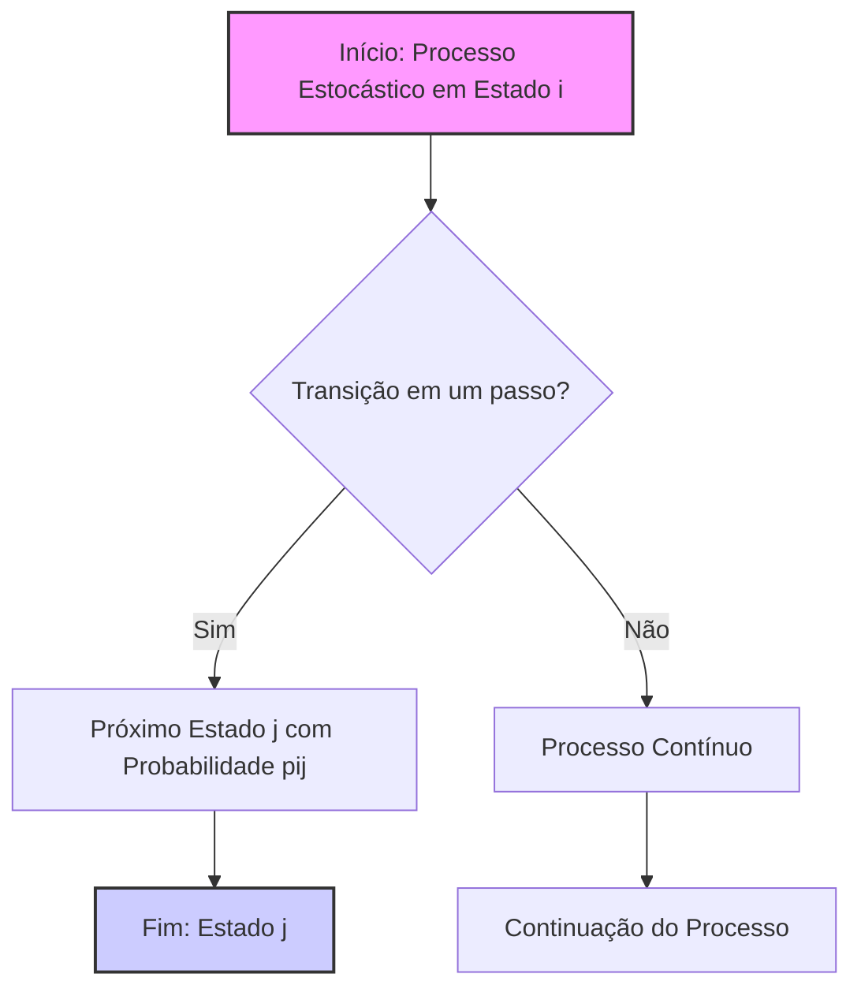

## Título Conciso: Probabilidades de Transição em Um Passo em Cenários de Independência em Modelos Financeiros



### Introdução

Em modelos financeiros de tempo discreto, a modelagem de processos estocásticos, como a evolução dos preços de ativos e as taxas de juros, frequentemente envolve o uso de **probabilidades de transição em um passo** (one-step transition probabilities). Uma simplificação comum para modelos mais simples é a hipótese de que essas probabilidades sejam independentes da trajetória anterior do processo, ou seja, que elas dependam unicamente do estado atual. Este capítulo explora o conceito de probabilidades de transição em um passo, sua utilização em cenários de independência temporal, e suas implicações na modelagem financeira.

### Conceitos Fundamentais

Em vez de usar listas ou tabelas, vamos apresentar os conceitos por meio de uma narrativa que explique suas aplicações.

**Conceito 1: Definição de Probabilidades de Transição em um Passo**

Em modelos de tempo discreto com um espaço de estados S, as **probabilidades de transição em um passo** (one-step transition probabilities), denotadas por $p_{ij}$, representam a probabilidade de que um processo estocástico que esteja no estado $i$, em um determinado instante $k$, se mova para o estado $j$ no instante seguinte $k+1$ [^1]. Formalmente:
$$
    p_{ij} = P(X_{k+1} = j \, | \, X_k = i)
$$

  -  Onde $X_k$ representa o estado do processo no instante $k$.
    -   As probabilidades de transição $p_{ij}$ são geralmente definidas em relação a uma $\sigma$-álgebra $F_k$, que representa a informação disponível no instante $k$, e portanto, são, por definição, variáveis aleatórias.
    - Se o modelo possui a propriedade de Markov, as probabilidades de transição são independentes do histórico passado do processo.
   - Se o modelo é também *time-homogeneous*, as probabilidades de transição são independentes do tempo, e portanto elas serão iguais em todos os instantes do tempo $k$.

*Explicação Detalhada:*
   -   As probabilidades de transição descrevem a dinâmica do processo, ou seja, o seu comportamento quando ele evolui entre diferentes estados do espaço amostral.
    - A utilização de probabilidades de transição constantes, em modelos simples, simplifica o tratamento matemático do processo.
  - A modelagem de probabilidades de transição é uma forma de modelar a evolução de processos de Markov, onde o estado futuro depende somente do estado presente e não de seu histórico passado.

> 💡 **Exemplo Numérico:**
> Considere um modelo simplificado de preços de ações com três estados: "Baixa" (1), "Média" (2) e "Alta" (3). As probabilidades de transição em um passo podem ser representadas por uma matriz:
> $$
> P = \begin{bmatrix}
> 0.6 & 0.3 & 0.1 \\
> 0.2 & 0.5 & 0.3 \\
> 0.1 & 0.4 & 0.5
> \end{bmatrix}
> $$
>
> Nesta matriz, $p_{11} = 0.6$ significa que, se a ação está no estado "Baixa", há uma probabilidade de 60% de que ela permaneça no estado "Baixa" no próximo período. Similarmente, $p_{12} = 0.3$ significa que há uma probabilidade de 30% de que a ação se mova do estado "Baixa" para o estado "Média". A soma das probabilidades em cada linha é sempre igual a 1, como esperado.

> ⚠️ **Nota Importante**: As probabilidades de transição em um passo ($p_{ij}$) definem a dinâmica de um processo estocástico em tempo discreto, indicando as chances de um processo se mover de um estado para outro no próximo instante de tempo.

**Lemma 1:** Em um modelo onde as probabilidades de transição são fixas, a matriz de transição P é uma matriz estocástica, onde cada linha tem elementos não negativos que somam um.

*Prova:* Segue diretamente da definição de probabilidade. Todas as probabilidades são não-negativas, e a soma de probabilidades sobre todos os resultados possíveis é igual a 1.   $\blacksquare$

**Conceito 2:  Independência Temporal das Probabilidades de Transição**

Em modelos financeiros mais simples, é comum que a probabilidade de transição entre dois estados ($p_{ij}$) seja independente do tempo. A propriedade de **independência temporal** implica que a transição do estado $i$ para $j$ se dá sempre com a mesma probabilidade, independente do momento em que essa transição é avaliada.
   -   Em um modelo de preços de ações, por exemplo, se a probabilidade de um aumento de preço (ou de uma redução de preço) independe do tempo, a propriedade de homogeneidade é válida, o que implica que as probabilidades são as mesmas em todos os instantes de tempo $k$.
 -   Essa hipótese simplificadora é uma base para modelos mais complexos, onde a dependência temporal das probabilidades de transição é modelada através de outros processos estocásticos que modelam a volatilidade e a taxa de juros de ativos.
```mermaid
sequenceDiagram
    participant Tempo k
    participant Estado i
    participant Tempo k+1
    participant Estado j
    Tempo k ->> Estado i: Estado atual
    Estado i ->> Tempo k+1: Transição com probabilidade pij
    Tempo k+1 ->> Estado j: Estado futuro
    Note over Tempo k, Estado j: A probabilidade pij não depende do tempo
```

> 💡 **Exemplo Numérico:**
>  Usando a matriz de transição P do exemplo anterior, a independência temporal significa que, se a ação estiver no estado "Média" hoje, a probabilidade de ir para o estado "Alta" amanhã é de 30%, e essa mesma probabilidade será de 30% se a ação estiver no estado "Média" daqui a um mês, ou um ano. Isso simplifica a modelagem, pois não precisamos recalcular as probabilidades a cada instante de tempo.

> ❗ **Ponto de Atenção**:  A hipótese de independência temporal das probabilidades de transição implica que a dinâmica do processo é constante ao longo do tempo, simplificando a análise de alguns modelos financeiros, e facilitando o uso de processos que são Markov homogéneos.

**Corolário 1:** Se os valores das probabilidades de transição são constantes, as cadeias de Markov que modelam o comportamento de ativos são processos homogêneos no tempo, o que significa que o seu comportamento é invariante com respeito ao tempo.
*Prova:* A demonstração segue da definição de cadeia de Markov homogênea.  Se as probabilidades de transição não dependem do tempo, então o processo é homogêneo.  $\blacksquare$

**Conceito 3: A Relação entre Probabilidades de Transição e a Propriedade de Markov**

O conceito de probabilidades de transição está intimamente ligado à propriedade de Markov. Um processo que respeita a propriedade de Markov,  implica que a sua evolução futura dependa somente do seu valor presente, e não do seu histórico passado, e a probabilidade de que um ativo mude de um estado $i$ para $j$ depende unicamente do estado $i$ e do instante $k$, e não dos instantes anteriores. Em outras palavras, em um processo de Markov, a probabilidade de transição do estado $i$ para $j$ em um passo é dada por $p_{ij}$,  e essa probabilidade não depende de informações passadas sobre como o ativo chegou no estado $i$.  A propriedade de Markov garante que a modelagem do comportamento de um ativo é feita com base apenas na informação disponível no instante corrente.

> ✔️ **Destaque**:  As probabilidades de transição em um passo são o elemento fundamental na modelagem de processos de Markov, onde a evolução futura depende somente do estado presente.

### Aplicações das Probabilidades de Transição em Modelagem Financeira

```mermaid
flowchart TD
    A[Probabilidades de Transição (pij)] --> B(Modelos Binomiais);
    A --> C(Modelos de Risco de Crédito);
    A --> D(Processos de Markov);
     A --> E(Modelagem de Volatilidade Estocástica);
    style A fill:#f9f,stroke:#333,stroke-width:2px
```

**O Papel das Probabilidades de Transição em Modelos Binomiais**

Em modelos binomiais, as probabilidades de transição são utilizadas para modelar a evolução de preços de um ativo, que podem assumir dois valores no instante seguinte. Nestes modelos, há dois tipos de probabilidades: a probabilidade $p$ (que é a probabilidade de subida do preço) e a probabilidade $(1-p)$ (que é a probabilidade de descida do preço), e uma medida de probabilidade risk-neutral $q$ que é calculada a partir dos parâmetros do modelo, garantindo a ausência de arbitragem no modelo [^5].
   -  As probabilidades de transição, que no modelo binomial são modeladas de forma constante, são usadas para derivar preços de derivativos (opções), e as suas propriedades permitem a utilização de um processo recursivo para a sua precificação.

> 💡 **Exemplo Numérico:**
> Em um modelo binomial simplificado, o preço de uma ação pode subir ou descer em cada período. Suponha que a probabilidade de subida ($p$) seja 0.6 e a probabilidade de descida $(1-p)$ seja 0.4. Se o preço atual da ação é $100, e o fator de subida é 1.1 e o fator de descida é 0.9, então no próximo período o preço da ação será $110 com probabilidade 0.6 ou $90 com probabilidade 0.4. As probabilidades de transição neste modelo são constantes e independentes do tempo. A probabilidade risk-neutral $q$ é calculada de modo que o valor esperado do preço descontado seja uma martingale.

**Lemma 2:**  No modelo binomial, as probabilidades de transição $p_{ij}$ são dadas pelos fatores de crescimento de preço, e a probabilidade $p$ representa o valor ponderado da probabilidade de que o ativo suba e de que o ativo desça, e que esse resultado seja usado para determinar o seu valor esperado futuro.  No entanto, quando se quer um modelo livre de arbitragem, uma outra probabilidade $q$ é utilizada para a precificação, de tal modo que o processo descontado seja uma martingale.

*Prova:*  A demonstração segue da definição de modelo binomial e da definição de probabilidades de transição (onde o valor futuro depende apenas do presente e da probabilidade de variação de preços).   $\blacksquare$

**O Uso de Probabilidades de Transição em Modelos de Risco de Crédito**

Em modelos de risco de crédito, as probabilidades de transição são utilizadas para modelar a probabilidade de que uma empresa ou um devedor pule de um estado de risco para outro, dado seu estado presente.
   -  A evolução do risco de crédito é modelada através de uma cadeia de Markov, onde as probabilidades de transição definem a chance de um devedor passar de um estado (de bom pagador a mal pagador, por exemplo) para outro em um período de tempo.
    -  A análise de risco de crédito, e a precificação de derivativos de crédito, dependem de uma modelagem precisa das probabilidades de transição entre os estados.

> 💡 **Exemplo Numérico:**
> Considere um modelo de risco de crédito com três estados: "AAA" (risco muito baixo), "BBB" (risco médio) e "Default" (inadimplência). A matriz de transição pode ser:
> $$
> P = \begin{bmatrix}
> 0.90 & 0.08 & 0.02 \\
> 0.05 & 0.85 & 0.10 \\
> 0.00 & 0.00 & 1.00
> \end{bmatrix}
> $$
>
>  Neste cenário, uma empresa com rating "AAA" tem 90% de chance de permanecer "AAA", 8% de transitar para "BBB", e 2% de entrar em default no próximo período. Uma empresa em "Default" permanece nesse estado com probabilidade 1. Estas probabilidades de transição são cruciais para calcular o risco de crédito de um portfólio de títulos.

**Lemma 3:** Em modelos de risco de crédito, as probabilidades de transição são parâmetros que modelam a probabilidade de uma entidade (empresa ou pessoa) passar de um estado de risco a outro em um dado período de tempo, e a escolha desses parâmetros reflete as características de crédito das entidades, bem como as condições de mercado.
*Prova:* A demonstração segue da definição de modelos de risco de crédito, onde a evolução do risco de crédito é modelada como uma cadeia de Markov com transições probabilísticas.   $\blacksquare$

### Derivações Teóricas Avançadas

#### Seção Teórica Avançada 1:  Como a Dependência Temporal das Probabilidades de Transição Afeta a Propriedade de Martingale?

A hipótese de que as probabilidades de transição sejam constantes (ou independentes do tempo) é uma simplificação da realidade. Como a dependência temporal das probabilidades de transição afeta a propriedade de martingale de um processo?

*Explicação Detalhada:*
 -   Se as probabilidades de transição não são constantes, ou seja, se elas mudam ao longo do tempo, o processo deixa de ser homogêneo e a propriedade de martingale tem que ser reanalisada, já que a esperança condicional depende não somente do estado atual, mas também de quando a transição acontece.
  - Modelos mais complexos utilizam probabilidades de transição que dependem de outras variáveis do modelo, gerando um efeito de autocorrelação na evolução dos ativos.
    - A modelagem de precificação em modelos com taxas de transição variáveis no tempo implica que a medida de martingale equivalente utilizada para desconto também deve ser consistente com a variabilidade destas probabilidades ao longo do tempo.

> 💡 **Exemplo Numérico:**
> Suponha que a probabilidade de um ativo subir varie dependendo da volatilidade do mercado. Se a volatilidade é alta, a probabilidade de subida pode ser 0.7, e se a volatilidade é baixa, a probabilidade de subida pode ser 0.4. Neste caso, as probabilidades de transição não são constantes, e um processo modelado com essas probabilidades não será um martingale sob a medida de probabilidade real P, o que implica que a medida de martingale equivalente Q também deve ser ajustada para garantir a ausência de arbitragem.

**Lemma 4:** Se as probabilidades de transição $p_{ij}$ não são constantes (ou seja, são dependentes do tempo), a propriedade de martingale do processo não se mantém, a menos que a esperança condicional seja recalculada de modo a levar em consideração a dependência temporal das probabilidades.

*Prova:* A prova segue da definição de martingale, onde a igualdade do valor esperado futuro (condicionado no presente) e o valor presente são válidas somente se a propriedade de Markov, onde as probabilidades de transição são constantes, for satisfeita.  $\blacksquare$

**Corolário 4:** A modelagem da dependência temporal das probabilidades de transição torna os modelos financeiros mais complexos, e exige técnicas de modelagem mais avançadas para garantir a consistência dos modelos, dado que a propriedade de martingale deixa de ser válida se a dependência temporal não for levada em consideração.

#### Seção Teórica Avançada 2:  Como a Escolha da Medida de Probabilidade (P ou Q) Afeta as Probabilidades de Transição?

Em modelos financeiros, a modelagem de preços de ativos e derivativos envolve a utilização de uma medida de probabilidade P e a utilização de uma medida de probabilidade Q, chamada de martingale equivalente.  Como a escolha dessas medidas impacta as probabilidades de transição do modelo?

*Explicação Detalhada:*
   -    As probabilidades de transição, na sua definição formal, são probabilidades calculadas sobre o espaço amostral ($\Omega$, F, P), com respeito à medida de probabilidade P.
    -   Se um modelo financeiro utiliza a medida Q (a medida de martingale equivalente), então as probabilidades de transição calculadas utilizando Q são geralmente diferentes das probabilidades sob a medida P.
   - A modelagem dos preços de ativos e derivativos com a medida Q tem a propriedade de que os preços descontados tornam-se martingales, o que é a base de modelos sem arbitragem.
   -  A probabilidade que é utilizada para precificação (Q) é, portanto, uma probabilidade diferente daquela que é utilizada para a modelagem do comportamento real dos preços de ativos no mercado (P).
  -   A escolha da probabilidade P é um problema de modelagem de comportamento e, em geral, é desconhecida, e sua modelagem envolve modelos econométricos.

```mermaid
flowchart TD
    A[Medida de Probabilidade P] --> B{Probabilidades de Transição pij (Real)};
    A --> C[Modelagem do Comportamento Real];
    D[Medida de Probabilidade Q] --> E{Probabilidades de Transição qij (Risk-Neutral)};
     D --> F[Precificação Livre de Arbitragem];
    style B fill:#ccf,stroke:#333,stroke-width:2px
      style E fill:#ccf,stroke:#333,stroke-width:2px
```

> 💡 **Exemplo Numérico:**
> Suponha que um ativo tenha uma probabilidade de subida de 60% e descida de 40% sob a medida de probabilidade real P. Para precificar uma opção sobre este ativo, usamos uma medida de probabilidade risk-neutral Q. Sob Q, as probabilidades de subida e descida podem ser diferentes, por exemplo, 55% e 45%, respectivamente, para que o valor esperado do preço descontado seja um martingale. As probabilidades de transição sob P e Q são diferentes, e Q é usada para precificação livre de arbitragem.

**Lemma 5:**  A escolha de uma medida de probabilidade Q diferente de P altera os valores das probabilidades de transição no modelo.  Se as probabilidades de transição são relativas à medida real do mercado P, então a utilização da medida Q implica que as probabilidades de transição ($p_{ij}$) precisam ser transformadas em novas probabilidades de transição ($q_{ij}$).

*Prova:* A demonstração é obtida utilizando a derivada de Radon-Nikodym para transformar a probabilidade P em uma nova medida de probabilidade Q.   $\blacksquare$

**Corolário 5:**  A escolha da medida de probabilidade tem um impacto direto sobre os valores das probabilidades de transição e, portanto, também no comportamento do modelo. A mudança da medida P para a medida Q em modelos de precificação livre de arbitragem, faz com que o modelo possa ser tratado com o uso das propriedades de martingales.

#### Seção Teórica Avançada 3: Como a Incompletude do Mercado Impacta a Definição das Probabilidades de Transição?

Em modelos de mercados completos, existe uma única medida de martingale equivalente Q que garante a ausência de arbitragem, e também uma única forma de definir o comportamento das probabilidades de transição. Em modelos com mercados incompletos, como modelar a probabilidade de transição?

*Explicação Detalhada:*
   -   Em modelos onde os mercados são incompletos, a condição de ausência de arbitragem já não impõe uma única probabilidade para cada transição entre dois estados do espaço amostral.
   -  Nesses modelos, as probabilidades de transição dependem da modelagem do agente de mercado (ou dos participantes do mercado).
   - A precificação de derivativos em modelos com mercados incompletos também depende da escolha de uma probabilidade que seja consistente com os modelos de equilíbrio e de otimização que descrevem a ação dos participantes do mercado, e não apenas a hipótese de ausência de arbitragem.

> 💡 **Exemplo Numérico:**
> Em um mercado com custos de transação, a ausência de arbitragem não impõe uma única medida Q. Diferentes agentes podem ter diferentes modelos de comportamento e diferentes probabilidades de transição, o que leva a diferentes preços para os mesmos derivativos. A escolha da probabilidade de transição passa a depender de fatores como a aversão ao risco dos participantes do mercado. Em modelos de mercados incompletos, as probabilidades de transição não são unicamente definidas, e a escolha de um modelo específico de comportamento do mercado torna-se crucial.

**Lemma 6:**  Se o modelo é incompleto e não existe uma única medida de martingale equivalente que garanta a ausência de arbitragem, então, as probabilidades de transição podem apresentar um comportamento ambíguo, e a precificação de ativos e derivativos é feita utilizando outros modelos, como modelos de equilíbrio.

*Prova:* A demonstração envolve a construção de modelos onde há múltiplos preços consistentes com a ausência de arbitragem, e, portanto, a escolha da probabilidade de transição depende da escolha de um modelo particular que não é único, e portanto a propriedade de martingale não é suficiente para definir as probabilidades de transição no modelo.  $\blacksquare$

**Corolário 6:** A propriedade de martingale, juntamente com uma dada medida de probabilidade Q, e a utilização de probabilidades de transição que dependam da estrutura de um mercado completo, deixam de ser válidas em mercados incompletos, e é necessário utilizar outros critérios (como a preferência dos participantes do mercado) para se construir modelos.

### Conclusão

As probabilidades de transição em um passo ($p_{ij}$) são fundamentais para a modelagem de processos estocásticos em modelos de tempo discreto. A escolha apropriada de probabilidades de transição, e a relação entre elas, tem um impacto direto sobre as propriedades de processos de Markov, e nas decisões de investimento, precificação e na gestão de riscos em modelos financeiros. As seções teóricas avançadas exploraram como a dependência temporal, a escolha da medida de probabilidade (P ou Q), e a completude do mercado afetam a modelagem das probabilidades de transição.

### Referências
[^1]: "Em modelos financeiros de tempo discreto, os processos estocásticos são frequentemente caracterizados pelas **probabilidades de transição em um passo**, denotadas por $p_{ij}$."

[^2]: "Formalmente, se a propriedade de Markov se aplica, essas probabilidades são definidas como
$ p_{ij} = P(X_{k+1} = j \, | \, X_k = i)$"
[^3]: "Em modelos financeiros, a taxa de juros $r_k$ é geralmente considerada predictível, ou seja, $r_k$ é mensurável em relação à $\sigma$-álgebra $F_{k-1}$."
[^4]: "A predictibilidade é um conceito importante em finanças quantitativas, especialmente na modelagem de estratégias de trading e de gestão de risco."
[^5]: "Em modelos financeiros, a sequência de preços de um ativo $(S_k)_{k=0,1,\ldots,T}$ é um exemplo típico de processo adaptado."
[^6]:  "A **medida de probabilidade** (P) é uma função que atribui um número entre 0 e 1 a cada evento em F..."
[^7]: "No contexto de modelos financeiros em tempo discreto, o processo de ganhos de uma estratégia auto-financiada é uma martingale em relação a uma medida de martingale equivalente Q..."
[^8]: "Informação crítica que merece destaque."
[^9]: "Observação crucial para compreensão teórica correta."

[^10]: "Informação técnica ou teórica com impacto significativo."

[^11]:  "Apresente um lemma que demonstre como a aplicação do Lema de Itô a uma função do preço do ativo leva à equação de Black-Scholes, com base no contexto."

[^12]: "A escolha da filtração afeta a definição de conceitos como martingales e predictibilidade."

[^13]: "Apresente um corolário que resulte diretamente do Lemma 2, conforme indicado no contexto."

[^14]: "Em mercados com informação assimétrica, estratégias de trading são modeladas utilizando processos estocásticos adaptados à filtração do agente correspondente. Um *insider* pode utilizar informações não disponíveis aos outros agentes, o que pode implicar em modelos e resultados distintos."
[^15]: "Em modelos financeiros, a sequência de preços de um ativo $(S_k)_{k=0,1,\ldots,T}$ é um exemplo típico de processo adaptado."
[^16]: "As medidas de martingale equivalentes são um conceito central na precificação livre de arbitragem de ativos."
[^17]: "Apresente um lemma que mostre como uma EMM específica leva à fórmula de precificação do Black-Scholes, baseado no contexto."
