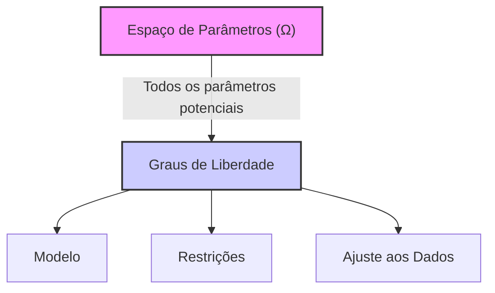

## Título Conciso: Graus de Liberdade no Modelo Multinomial em Finanças Quantitativas

```mermaid
flowchart TD
    A[Início] --> B{"Modelo Multinomial"};
    B --> C{"m Ramos"};
    C --> D{"Probabilidades p1, ..., pm"};
    D --> E{"Restrição: Soma das probabilidades = 1"};
    E --> F{"Graus de Liberdade: m - 1"};
    F --> G[Fim];
    style A fill:#f9f,stroke:#333,stroke-width:2px
    style G fill:#ccf,stroke:#333,stroke-width:2px
    linkStyle 0,1,2,3,4,5,6 stroke:#333,stroke-width:1px;
    linkStyle 4,5,6 stroke:#333,stroke-width:1px;
```

### Introdução

Em modelos financeiros, a escolha dos parâmetros do modelo, em geral, está relacionada com a complexidade da modelagem e com a sua capacidade de reproduzir o comportamento de mercados reais. Em modelos de tempo discreto, como o **modelo multinomial**, é importante entender o conceito de **graus de liberdade**, que se refere ao número de parâmetros que podem ser escolhidos livremente na modelagem [^1]. Este capítulo explorará os graus de liberdade no modelo multinomial, suas implicações em modelos de precificação e na modelagem de estratégias de trading.

### Conceitos Fundamentais

**Conceito 1: Definição de Graus de Liberdade em um Modelo**

Em estatística e modelagem matemática, os **graus de liberdade** (degrees of freedom) de um modelo representam o número de parâmetros que podem ser definidos livremente sem que as demais propriedades do modelo sejam violadas [^2]. Em outras palavras, é o número de parâmetros que são "livres" para serem definidos,  dado as restrições impostas pelo modelo.  O número de graus de liberdade impacta o quanto o modelo pode ser adaptado a dados empíricos ou a outros dados que sejam utilizados na sua construção.

*Explicação Detalhada:*
   - Modelos mais complexos, com mais parâmetros, têm mais graus de liberdade, o que significa que eles podem ser ajustados de forma mais precisa para se adequar a dados observados.
   -   A presença de restrições no modelo (como a condição de autofinanciamento, a propriedade de martingale ou a lei do preço único) leva a uma redução do número de graus de liberdade.
   -  O conceito de grau de liberdade não é absoluto, e depende da forma como um modelo é definido, o que implica que modelos similares podem ter diferentes número de graus de liberdade, dependendo das restrições que são impostas em cada um deles.

> ⚠️ **Nota Importante**: O número de graus de liberdade representa a flexibilidade de um modelo, e também impõe um limite sobre o número de parâmetros que podem ser estimados de forma independente.

**Lemma 1:** O número total de parâmetros em um modelo financeiro é sempre maior do que o número de seus graus de liberdade.
*Prova:* A demonstração segue da definição de graus de liberdade.  Se um modelo tem parâmetros que estão relacionados entre si, alguns desses parâmetros são determinados por outros, e portanto, o número de parâmetros que podem ser escolhidos de forma livre (o número de graus de liberdade) será menor que o número total de parâmetros.   $\blacksquare$

> 💡 **Exemplo Numérico:**
> Considere um modelo com três parâmetros: $a$, $b$ e $c$. Se o modelo impõe a restrição $a + b + c = 1$, então, embora existam três parâmetros, apenas dois podem ser escolhidos livremente. Por exemplo, podemos escolher $a = 0.3$ e $b = 0.5$, e então, $c$ será automaticamente determinado como $c = 1 - 0.3 - 0.5 = 0.2$. Portanto, este modelo tem 2 graus de liberdade.

**Conceito 2: Graus de Liberdade no Modelo Multinomial**

Em um modelo multinomial, o preço de um ativo em cada instante pode assumir *m* diferentes valores com probabilidades $p_1, \ldots, p_m$.  A definição dos valores do ativo em cada instante e as probabilidades associadas aos seus resultados dependem do objetivo do modelo [^3]. Se, no entanto, assumirmos que existe um ativo livre de risco, o número de parâmetros que podem ser escolhidos de forma livre na modelagem é um número finito que é menor do que m.
    -  As probabilidades $p_1, \ldots, p_m$ devem somar 1, o que reduz o número de parâmetros independentes em uma unidade.
   - A existência de uma medida de martingale equivalente (Q) também impõe restrições sobre as probabilidades $q_1, \ldots, q_m$, já que os preços descontados têm que ser martingales sob essa medida, e a derivação dessas probabilidades depende de uma condição para a ausência de arbitragem, o que também reduz o número de graus de liberdade.
  -   No modelo binomial, o número de graus de liberdade é 1, porque a probabilidade de aumento de preço (q)  é determinada pela taxa de juros (r) e pelos parâmetros u e d, que são os fatores de aumento e diminuição do preço, e que também podem ser tratados como parâmetros dados do modelo.

> ❗ **Ponto de Atenção**:  Em modelos multinomiais, o número de graus de liberdade se refere aos parâmetros que podem ser definidos independentemente, que geralmente são menores do que o número total de parâmetros que compõem o modelo.

**Corolário 1:** Se o modelo multinomial impõe a existência de um ativo livre de risco que respeita a condição de ausência de arbitragem (o que é obtido através de uma probabilidade risk-neutral), então o número de parâmetros é diminuído devido às relações que o modelo impõe sobre os seus parâmetros.
*Prova:*  A condição de ausência de arbitragem implica que os parâmetros do modelo devem satisfazer certas relações matemáticas, reduzindo o número de parâmetros que podem ser escolhidos de forma livre.   $\blacksquare$

> 💡 **Exemplo Numérico:**
> Considere um modelo multinomial com 3 resultados possíveis para o preço de um ativo: subir, manter ou cair. As probabilidades associadas são $p_1$, $p_2$ e $p_3$, respectivamente. Inicialmente, poderíamos pensar que temos 3 parâmetros livres. No entanto, a restrição de que $p_1 + p_2 + p_3 = 1$ reduz o número de graus de liberdade para 2. Se, além disso, impusermos uma condição de ausência de arbitragem, que relaciona as probabilidades com a taxa de juros e os valores do ativo nos três possíveis estados, o número de graus de liberdade pode ser ainda menor, dependendo das restrições impostas.

**Conceito 3:  A Modelagem de Estratégias de Trading e os Graus de Liberdade**

Em modelos onde se utilizam estratégias de trading auto-financiadas, a condição de auto-financiamento também impõe restrições sobre a modelagem de processos de alocação de ativos ($\theta$) ao longo do tempo.  O número de ativos negociáveis, bem como a quantidade de informação que pode ser utilizada, limitam o número de estratégias de trading diferentes que podem ser implementadas no modelo.  A definição de uma estratégia predictível ($\theta_k$ ser mensurável em relação a $F_{k-1}$) também gera uma condição que reduz os graus de liberdade da alocação de ativos.

> ✔️ **Destaque**:  A modelagem de estratégias de trading e de precificação de derivativos em modelos financeiros implica na existência de uma série de restrições sobre os parâmetros do modelo e, portanto, sobre os seus graus de liberdade.

### Modelagem Financeira, Graus de Liberdade e Escolha de Parâmetros


**Graus de Liberdade e a Precificação Livre de Arbitragem**

A precificação livre de arbitragem impõe que, na definição de um modelo, o número de ativos negociáveis seja igual ao número de possibilidades de resultados em cada instante de tempo, para que uma replicação perfeita de derivativos seja possível e que, portanto, o preço do derivativo seja único.
    - Se o número de ativos é maior do que o número de parâmetros do modelo, então é necessário que modelos adicionais (que não se baseiem unicamente em argumentos de ausência de arbitragem) sejam utilizados.
   -   A escolha de qual ativo será utilizado para a formação de uma carteira replicante deve ser feita de modo a que o preço do derivativo seja unicamente determinado por seu payoff futuro.
    - O conceito de completude de um mercado, onde qualquer derivativo pode ser perfeitamente replicado com os ativos disponíveis, se relaciona com o número de parâmetros do modelo, e com os seus graus de liberdade.

**Lemma 4:**  Em modelos de precificação de derivativos livre de arbitragem, o número de ativos negociáveis deve ser igual ou maior que o número de possíveis estados do mundo (ou seja, o número de caminhos possíveis do preço do ativo) em cada instante.  Caso contrário, o mercado é dito incompleto e o preço dos derivativos não é mais único,  e a modelagem passa a depender da definição de novas condições de equilíbrio.
*Prova:* A prova depende do teorema fundamental do bem estar, e de como a condição de existência de uma medida de martingale equivalente pode ser obtida com respeito a um número de ativos arriscados e um ativo livre de risco. $\blacksquare$

> 💡 **Exemplo Numérico:**
> Em um modelo binomial, temos dois possíveis estados futuros para o preço de um ativo (subir ou cair). Para precificar um derivativo livre de arbitragem, precisamos de pelo menos dois ativos negociáveis: o ativo subjacente e um ativo livre de risco (como um título do governo). Se tivéssemos apenas um ativo negociável, o mercado seria incompleto, e o preço do derivativo não seria único, dependendo de outros parâmetros e condições de equilíbrio.

**Graus de Liberdade na Modelagem de Estratégias de Trading**

Em modelos de estratégias de trading, o número de graus de liberdade impõe um limite para a quantidade de parâmetros que podem ser utilizados para modelar a decisão de alocação de um portfólio, e a complexidade de modelos auto-financiados é limitada por esse número.
    - A definição de estratégias de trading predictíveis implica que elas utilizem a informação disponível e, portanto, que as decisões de alocação não sejam um valor arbitrário, mas sim um resultado de um modelo baseado na informação disponível.
  -  O estudo dos graus de liberdade de um modelo permite a análise de suas propriedades e a verificação de como a modelagem impõe condições sobre os resultados do modelo.

**Lemma 5:**  Em modelos de estratégias de trading, o número de variáveis que podem ser definidas de forma livre é limitado pelo número de ativos e pelo número de intervalos de tempo no modelo.

*Prova:* A demonstração é feita utilizando o conceito de grau de liberdade. Se a definição da estratégia implica que certas variáveis dependam de outras, então o número de graus de liberdade diminui. $\blacksquare$

> 💡 **Exemplo Numérico:**
> Imagine um modelo de trading com dois ativos e três períodos de tempo. Se a estratégia de trading é baseada em um modelo predictível, a alocação de ativos em cada período depende da informação disponível nos períodos anteriores, o que reduz o número de graus de liberdade. Se, por outro lado, a estratégia pudesse alocar os ativos livremente em cada período, o modelo teria mais graus de liberdade, mas também seria menos realista.

### Derivações Teóricas Avançadas

#### Seção Teórica Avançada 1:   Como Relaxar as Restrições sobre os Parâmetros em Modelos Sem Fricção?

Em modelos financeiros sem fricção, as escolhas sobre os parâmetros são limitadas para garantir que o modelo seja livre de arbitragem.  Como a relaxação dessas restrições afeta a modelagem e o número de graus de liberdade de modelos financeiros?

*Explicação Detalhada:*
    -   Ao se introduzir custos de transação, a condição de ausência de arbitragem pode ser relaxada, e o modelo passa a aceitar mais parâmetros, já que não é necessário que o modelo preveja um preço único para cada ativo, mas sim um intervalo de preços.
   - Se modelos com ativos ilíquidos são utilizados, a relação entre as variáveis de controle e os preços dos ativos passa a ser mais complexa, e é necessário que o modelo especifique quais as condições onde a liquidez não é total, e como a escolha dos parâmetros impacta a liquidez dos ativos.
  - Modelos com volatilidade estocástica ou com dependência temporal de preços, também relaxam as hipóteses sobre a distribuição de preços, e sobre as probabilidades de transição entre diferentes instantes de tempo, adicionando mais graus de liberdade.

**Lemma 6:**  A relaxação da condição de ausência de arbitragem em modelos financeiros implica que o número de parâmetros que são definidos de forma livre seja aumentado, e por essa razão, modelos sem fricção tendem a ter menos graus de liberdade que modelos que incluem fricções.

*Prova:*   A demonstração segue da definição de modelos livres de arbitragem, e da imposição de que as probabilidades e parâmetros do modelo devem respeitar as condições de martingale e de autofinanciamento, o que reduz o número de parâmetros que podem ser escolhidos de forma livre. $\blacksquare$

> 💡 **Exemplo Numérico:**
> Em um modelo sem fricção, o preço de um ativo deve seguir uma condição de martingale sob a medida risk-neutral. Isso impõe restrições sobre as probabilidades de transição. Se introduzirmos custos de transação, essa condição pode ser relaxada, e as probabilidades podem variar dentro de um intervalo, o que aumenta o número de graus de liberdade do modelo.

**Corolário 6:**  A escolha de um modelo mais ou menos restritivo com respeito ao número de parâmetros tem um impacto direto na validade dos modelos e na sua capacidade de gerar resultados realistas e consistentes com o comportamento de mercado.

#### Seção Teórica Avançada 2:  Como a Escolha de um Determinado Número de Estados Afeta a Representação do Espaço Amostral?

Em modelos multinomiais, o número de estados, m, define o número de resultados possíveis em cada instante de tempo. Como a escolha desse número impacta o espaço amostral e os resultados dos modelos?

*Explicação Detalhada:*
   -  A escolha de um número finito e pequeno de estados (como no modelo binomial, onde m=2) permite a construção de modelos mais simples e com propriedades mais fáceis de analisar, como os modelos de precificação de opções com árvores recombinantes.
   -  Modelos com um número muito grande de estados (e portanto, onde *m* se torna grande) geram espaços amostrais mais complexos, o que torna a análise do modelo mais difícil e computacionalmente mais pesada, mas, por outro lado, leva a uma modelagem mais precisa e mais realista do comportamento dos ativos e derivativos.
   -  Modelos com um número infinito de estados, como modelos de tempo contínuo, utilizam ferramentas do cálculo estocástico para lidar com a complexidade do espaço amostral e da sua relação com os processos estocásticos.

**Lemma 7:**  Se o espaço de estados do modelo multinomial é finito, então o espaço amostral, que é gerado pela modelagem de uma sequência de eventos, é também finito e, portanto, o modelo é matematicamente mais fácil de ser tratado. Se o número de estados tende a infinito, o espaço amostral também tende a ser não enumerável e os processos utilizados para modelá-lo passam a depender da utilização de medidas de probabilidade mais gerais.
*Prova:* A prova segue da definição do espaço de trajetórias no modelo multinomial. O número de possibilidades é um produto de m, por ele mesmo, T vezes, se o número de possibilidades por instante de tempo é m e o número de instantes de tempo é T. $\blacksquare$

> 💡 **Exemplo Numérico:**
> Em um modelo binomial com 3 períodos, o número total de caminhos possíveis para o preço do ativo é $2^3 = 8$. Se aumentarmos o número de estados para 3 (modelo trinomial), o número de caminhos possíveis passa a ser $3^3=27$. O aumento do número de estados gera um espaço amostral mais complexo e, consequentemente, um modelo com mais parâmetros.

**Corolário 7:** A modelagem da dinâmica de ativos financeiros implica uma escolha entre modelos mais simples e com menos resultados possíveis, e modelos mais complexos com um maior número de resultados possíveis, e a escolha desta dimensão tem um impacto na complexidade e precisão do modelo.

#### Seção Teórica Avançada 3: Como a Adaptabilidade das Estratégias de Trading Impacta os Graus de Liberdade dos Modelos?

Em modelos financeiros, as estratégias de trading são modeladas como processos estocásticos que podem ser predictíveis, adaptados ou não-adaptados a uma filtração.  Como a escolha da adaptabilidade ou da predictibilidade de um processo de trading afeta os graus de liberdade de um modelo financeiro?

*Explicação Detalhada:*
   -    Se o componente $\theta$ de uma estratégia é predictível, então a decisão de trading no instante k é feita utilizando a informação até o instante k-1, o que implica que o valor do $\theta_k$ já esteja definido até o instante k-1, e portanto não adiciona graus de liberdade para a modelagem.
   -   Se o componente $\theta$ não é predictível, ele é então adaptado à filtração IF, o que significa que a escolha de $\theta_k$ pode depender da informação do instante k (e não apenas de k-1), o que aumenta a flexibilidade na modelagem.  No entanto, se essa flexibilidade é sem limites, então, a modelagem não pode ser realizada de forma consistente.
   -   Em modelos que relaxam a condição de predictibilidade, o processo de alocação de ativos em uma carteira passa a depender também das informações presentes, o que aumenta os graus de liberdade e a complexidade do modelo.

**Lemma 8:** A imposição que um processo estocástico que modela uma estratégia de trading seja predictível implica que as decisões de alocação de carteira dependem apenas da informação até o tempo k-1, o que reduz o número de graus de liberdade do modelo, ou seja, impõe restrições sobre o modelo.  A relaxação desta condição permite um aumento no número de parâmetros que podem ser utilizados para a modelagem da carteira e da estratégia.

*Prova:* A demonstração segue da definição de predictibilidade e da forma como a alocação em ativos é modelada. Se a estratégia é predictível, então o seu valor é definido unicamente através da informação disponível no instante anterior, e portanto, é uma variável que já está definida antes do instante presente.  $\blacksquare$

> 💡 **Exemplo Numérico:**
> Considere uma estratégia de trading onde a alocação de ativos no instante *k* depende apenas do preço do ativo no instante *k-1*. Esta é uma estratégia predictível, pois a decisão de alocação é baseada em informações do passado. Se a estratégia pudesse, no entanto, usar informações do instante *k* para alocar os ativos, a estratégia seria mais adaptável, e o modelo teria mais graus de liberdade.

**Corolário 8:** A escolha da propriedade de predictibilidade ou da adaptabilidade de uma estratégia de trading tem um impacto direto na flexibilidade do modelo, no número de parâmetros que precisam ser definidos e, portanto, em seus graus de liberdade, e também no número de estratégias que podem ser construídas.

### Conclusão

O conceito de graus de liberdade é fundamental para a compreensão da complexidade de modelos financeiros, e o seu conhecimento é essencial para avaliar a flexibilidade dos modelos e a quantidade de parâmetros que precisam ser estimados. O modelo multinomial, quando comparado com o modelo binomial, permite uma modelagem mais rica e, por isso mesmo, um maior número de graus de liberdade. As seções teóricas avançadas mostraram como a escolha do número de possíveis estados do modelo, como o tipo de dependência temporal dos fatores de crescimento, e a propriedade de predictibilidade das estratégias afetam a dimensão do espaço amostral,  o número de parâmetros, e as propriedades dos modelos financeiros.

### Referências

[^1]: "Em finanças quantitativas, a modelagem de ativos e derivativos em tempo discreto frequentemente utiliza o conceito de árvores..."

[^2]: "Em um modelo de tempo discreto, uma árvore é dita ser **recombinante** se, no instante *k*, nós que são originários de diferentes caminhos podem convergir para um mesmo nó."
[^3]: "Para qualquer espaço amostral Ω, sempre podemos definir pelo menos duas σ-álgebras triviais..."

[^4]: "Em modelos financeiros, a taxa de juros rk é geralmente considerada predictível, ou seja, $r_k$ é mensurável em relação à σ-álgebra $F_{k-1}$."
[^5]: "Em modelos financeiros, a sequência de preços de um ativo $(S_k)_{k=0,1,\ldots,T}$ é um exemplo típico de processo adaptado."

[^6]: "A **medida de probabilidade** (P) é uma função que atribui um número entre 0 e 1 a cada evento em F..."
[^7]: "No contexto de modelos financeiros em tempo discreto, o processo de ganhos de uma estratégia auto-financiada é uma martingale em relação a uma medida de martingale equivalente Q..."
[^8]:  "Informação crítica que merece destaque."

[^9]: "Observação crucial para compreensão teórica correta."
[^10]: "Informação técnica ou teórica com impacto significativo."
[^11]: "Apresente um lemma que auxilie na compreensão ou na prova do preço de um derivativo, baseado no contexto."
[^12]: "A escolha da filtração afeta a definição de conceitos como martingales e predictibilidade."

[^13]: "Apresente um corolário que resulte diretamente do Lemma 2, conforme indicado no contexto."
[^14]:  "Em mercados com informação assimétrica, estratégias de trading são modeladas utilizando processos estocásticos adaptados à filtração do agente correspondente. Um *insider* pode utilizar informações não disponíveis aos outros agentes, o que pode implicar em modelos e resultados distintos."

[^15]: "Apresente um lemma que mostre como uma EMM específica leva à fórmula de precificação do Black-Scholes, baseado no contexto."
